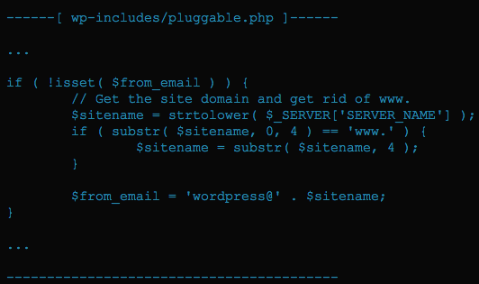

لا يخلو أي مشروع برمجي، تقريبا، من ثغرات وأخطاء يتم اكتشافها من حين لآخر، سواء من المستخدمين أو من طرف القائمين على المشروع نفسه. برنامج إدارة المحتوى **ووردبريس** ليس استثناء لهذه القاعدة، فلقد أعلن خبير أمني يدعى [Dawid Golunski](https://twitter.com/dawid_golunski) عن وجود ثغرة أمنية خطيرة في نظام **إعادة تعيين كلمة المرور** الخاصة بلوحة تحكم ووردبريس. **Dawid Golunski** قال بأنه اكتشف هذه الثغرة في شهر يوليوز 2016 وقام بمراسلة فريق ووردبريس لسدها ولكن نداءه لم يجد أذانًا صاغية لحد الساعة. وهذا ما جعله [**يعلن عن هذه الثغرة أمام الملأ**](https://exploitbox.io/vuln/WordPress-Exploit-4-7-Unauth-Password-Reset-0day-CVE-2017-8295.html) وهي الموجودة في جميع إصدارات ووردبريس بما فيها آخر إصدار 4.7.4.

## ثغرة قد تسمح لأي متطفل بإعادة تعيين كلمة السر الخاصة بالمدير

مصدر هذه الثغرة هو ملف **_pluggable.php_** حيث يتم إرسال رابط إعادة تعيين كلمة المرور للمستخدم (المدير مثلا)، وخطورة هذه الثغرة هي في إمكانية حصول المتطفل، صاحب محاولة الإختراق، على رابط إعادة تعيين كلمة المرور عوضا عن صاحب الحساب الحقيقي حيث أن ووردبريس لا يقوم بالتحقق من معلومات المستخدم.

 فإذا قام المتطفل بتغيير قيمة المتغير SERVER_NAME فإن قيمة \$from_email  ستساوي مثلا wordpress@attacker.com على اعتبار أن attacker.com هو الدومين الخاص به. استغلال هذه الهجمة يعتمد على شيئين اثنين : إعدادات الخادم وحالة علبة البريد الإلكتروني للمستخدم.

قبل إرسال رابط إعادة تعيين كلمة السر فإن ووردبريس يقوم على كل حال بإرساله للمستخدم الحقيقي وقبل ذلك يقوم المخترق بشن هجمة DoS على بريد المستخدم حيث يقوم بإرسال ملفات أحجامها كبيرة بغرض ملء علبة بريده الإلكتروني فلا يتمكن المستخدم من استلام رسالة ووردبريس فيعاد إرسالها بعد ذلك لبريد المتطفل أو المخترق الموجود في الهيدر **From**. هناك إمكانية أخرى قد يلجأ فيها المتطفل لإرسال طلب إعادة تعيين كلمة المرور عدة مرات للمستخدم فينتظر أن يقوم الأخير بالضغط على الزر "**جواب**" أو **Respond**، بغرض الإستفسار مثلا، فيظهر بذلك الرابط عند المتطفل.

## ما هو الحل إذن ؟

لا يوجد حاليا أي **تحديث أمني** من ووردبريس لإيجاد حل نهائي لهذه الثغرة. تجذر الإشارة أنه لا يمكن استغلال هذه الثغرة في جميع الخوادم، فكما ذكرنا سابقا قابلية الاختراق بواسطتها تعتمد على إعدادات الخادم عندك. أغلب الخوادم معدة جيدا لمنع المتطفلين من تغيير SERVER_NAME عن طريق الهيدر **Host،** ولكن هذا يبقى عيب برمجي خطير على **ووردبريس** أن تقوم بإيجاد حل سريع له فعشرات الملايين من المواقع المدعومة بووردبريس ليست كلها مستضافة على خوادم آمنة 100% ومعدة بشكل جيد.
