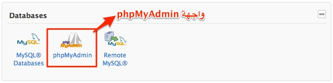
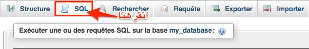

إذا كنت تدير مدونة أو موقعا مودعوما من ووردبريس فإن الدخول للوحة التحكم بطبيعة الحال سيكون روتينا يوميا بالنسبة لك كمدير للموقع. وقد يأتي يوم لا تستطيع فيه تسجيل دخولك للوحة التحكم لسبب، قد تكون حذفت حسابك عن طريق الخطأ أو قد يتعرض حسابك للإختراق. أو ربما، كما حدث معي عدة مرات، عندما يقوم شخص ما(عميل مثلا) بطلب خدمة برمجية منك تخص موقعه، حيث يقوم بإرسال ملفات مشروع ووردبريس لك ولكنه لم يرفق معها معلومات تسجيل الدخول للوحة التحكم، قد تقوم بالإتصال به وتطلب المعلومات منه وتنتظر أن يقوم بإرسالها لك، ولكني شخصيا عوضا عن ذلك أقوم بإنشاء حساب جديد مباشرة من **قاعدة البيانات Mysql**. إليكم الطريقة:

## الخطوة 1

قم بتسجيل الدخول لواجهة cPanel الخاصة باستضافتك. ثم بعد ذلك قم بالبحث عن رابط **phpMyAdmin** واضغط عليه لتحويلك بعد ذلك لواجهة قاعدة البيانات الخاصة بموقعك.

## الخطوة 2

بعد الدخول لواجهة **phpMyAdmin**، قم باختيار قاعدة البيانات الخاصة بموقعك على يسار الشاشة.

## الخطوة 3

ابحث عن التبويب **SQL** وانقر عليه.

## الخطوة 4

بعد الدخول للتبويب SQL، سيظهر لك حقل كبير لكتابة أكواد Sql التي ستمكننا من إضافة **حساب مدير** جديد **Admin Account** لقاعدة البيانات. المعلومات التي يجب عليك تغييرها هي :

- **اسمك (firstname lastname).**
- **بريد الإلكتروني (email@example.com).**
- **كلمة المرور (pass123)**.
- **اسم المستخدم (newadmin).**

INSERT INTO \`wp_users\` (\`user_login\`, \`user_pass\`, \`user_nicename\`, \`user_email\`, \`user_status\`)
VALUES ('newadmin', MD5('pass123'), 'firstname lastname', 'email@example.com', '0');

INSERT INTO \`wp_usermeta\` (\`umeta_id\`, \`user_id\`, \`meta_key\`, \`meta_value\`)
VALUES (NULL, (Select max(id) FROM wp_users), 'wp_capabilities', 'a:1:{s:13:"administrator";s:1:"1";}');

INSERT INTO \`wp_usermeta\` (\`umeta_id\`, \`user_id\`, \`meta_key\`, \`meta_value\`)
VALUES (NULL, (Select max(id) FROM wp_users), 'wp_user_level', '10');

## الخطوة 5

في الأخير قم بالضغط على الزر **Execut** لتنفيذ شيفرة SQL وبعدها مباشرة ستظهر لك رسالة تأكيد لنجاح العملية.

الآن أصبح لديك حساب جديد باسم المستخدم **newadmin** وكلمة المرور **pass123** وتستطيع استخدامه للولوج للوحة تحكم موقعك المدعوم من ووردبريس.

---

**مراجع:**

[http://www.inmotionhosting.com/support/edu/wordpress/333-add-admin-via-mysql](http://www.inmotionhosting.com/support/edu/wordpress/333-add-admin-via-mysql)
