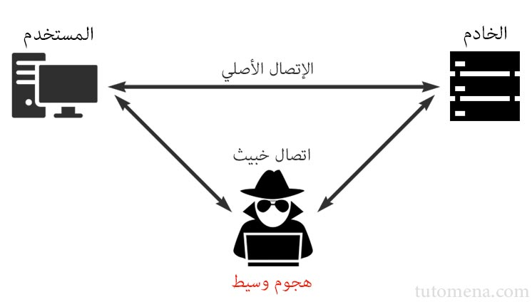

برنامج إدارة المحتوى ووردبريس هو الأكثر استخداما حيث يدعم ما يربو على 25% من مجموع المواقع على شبكة الإنترنت. وبما أن للنجاح دائما ضريبته، فووردبريس يعتبر واحدا من أكثر برمجيات الويب التي يستهدفها القراصنة والمتطفلون، ولولا صلابته الأمنية لما تمكن من الإستمرار والبقاء في القمة خلال هذه السنوات كلها والمطورون يعملون ليل نهار للحفاظ على هذا المكتسب.

وسيكون رائعا لو قمنا، نحن المستخدمين، بتخصيص قليل من الوقت والجهد لبناء طبقة حماية ثانية فوق طبقة الحماية الأصلية التي يوفرها ووردبريس وذلك عبر عدد من الممارسات والنصائح التي قد تبدو بسيطة ولكنها في غاية الأهمية للحفاظ على أمن مواقعكم وجعل المهمة أكثر صعوبة على القراصنة والمتطفلين.

## استخدام بروتوكول HTTPS

**https** مزيج من بروتوكول الـ **http** وبروتوكول الـ SSL/TLS الذي يقوم بإنشاء قناة مشفرة وأمنة ما بين المستخدم والخادم لحرمان أي طرف ثالث من الإطلاع على البيانات المرسلة أو ما يطلق عليه [بهجوم الوسيط](https://ar.wikipedia.org/wiki/%D9%87%D8%AC%D9%88%D9%85_%D8%A7%D9%84%D9%88%D8%B3%D9%8A%D8%B7) أو **man-in-the-middle attack**.

[](../images/man-in-the-middle-attack-1.jpg)

تلعب HTTPS كذلك دورا في تحسين ظهور موقعك (SEO) على محرك البحث غوغل لأن الأخير يعتقد بأن تشفير البيانات عبر بروتوكول HTTP دليل على احترافية موقعك وحرصك على سلامة وأمن معلومات الزوار.

## بيانات الدخول لقاعدة البيانات يجب أن تكون قوية

ينصح باستخدام بيانات مولدة عشوائيا للدخول لقاعدة بيانات موقعك، ولا يجب عليك بأي حال من الأحوال اختيار اسم مستخدم أو كلمة مرور قصيرة أو ذات دلالة، كما ننبه إلى ضرورة تغيير البادئة الإفتراضية `wp_` لأسماء الجداول في قاعدة البيانات عند تنصيب ووردبريس واختيار بادئة خاصة بك. يمكنك تغيير بيانات الدخول لقاعدة البيانات حتى بعد تنصيب ووردبريس شريطة أن تقوم بتعديل هذه الإعدادات في ملف **wp-config.php** كذلك.

## قوة بيانات الدخول للوحة التحكم

نفس ما قلناه عن الدخول لقاعدة البيانات يقال عن حساب الدخول للوحة تحكم ووردبريس وخاصة إذا كانت لديك صلاحية واسعة (مدير مثلا)، **يجدر بك أن تستعين باسم مستخدم وكلمة مرور قويين** ولا تجعل نفسك لقمة سائغة للمتطفلين.

## تأمين الملف wp-config.php

ملف wp-config.php كما أشرنا إليه سابقا، يحوي بيانات مهمة وسرية بحيث لا يطلع عليها سوى مدير الموقع. هذا الملف يتواجد افتراضيا في المجلد الرئيسي لووردبريس ولكن يمكن نقله خارجا بحيث لا يمكن الوصول إليه عن طريق طلبات HTTP. كما يمكن منع الوصول إليه عن طريق حمايته بملف .htaccess  على النحو الثالي مثلا :

```bash
<files wp-config.php>
order allow,deny
deny from all
</files>
```

## منح المستخدمين أدوارا بأقل صلاحيات ممكنة

هناك نصيحة لا يجب نسيانها أبدا : لا تقم بإعطاء صلاحيات المدير لأحد إلا للضرورات القصوى. إذا كان موقعك يسمح بستجيل أعضاء جدد، فتأكد من إعطائهم أقل عدد ممكن من الصلاحيات، وبصفة عامة معظم المواقع تمنح المستخدمين المسجلين واحدة من هذه الأدوار :

- محرر : يستطيع نشر وإدارة منشوراته ومنشورات الآخرين.
- كاتب : يستطيع نشر وإدارة منشوراته فقط.
- مشارك : يستطيع كتابة وإدارة منشوراته ولكن لا يمكنه نشرها.

لا تمنحك أي من هذه الأدوار صلاحية إلدخول لإعدادات ووردبريس مثل إضافة وتعطيل الإضافات مثلا.

تأكد من أنك تمنح المستخدم الصلاحيات التي يحتاجها فقط ولا تزد على ذلك، فحتى لو كان المستخدم طيبا ولا ينوي شيئا خبيثا فمن يضمن لك أنه سيختار كلمة مرور قوية وأنه لن يقوم بإعطائها لأحد أصدقائه الذين يثق فيهم؟!

## تغيير الرابط الإفتراضي لصفحة تسجيل الدخول

يمكن تغيير رابط صفحة تسجيل الدخول إلى لوحة التحكم الخاصة بووردبريس، وقد قمنا بشرح [كيفية فعل ذلك في موضوع سابق عن طريق الإضافة WPS Hide Login](http://www.tutomena.com/web-development/wordpress-wps-hide-login-plugin/). الغرض من هذه الخطوة هو منع المتطفلين من الوصول لصفحة تسجيل الدخول على الرابط الإفتراضي `/wp-login.php`.

## إخفاء رقم إصدار ووردبريس

عدد من إصدارات وودبريس عرفت ثغرات وبعض المشاكل الأمنية، ووردبريس يقوم بإظهار رقم الإصدار افتراضيا داخل الوسم `<head>` الشيء الذي يمكن المتطفلين من معرفة الإصدار الذي تستخدمه ويبحثون بعد ذلك عن الثغرات الأمنية الموجودة فيه.

لا تسهل عليهم المأمورية بهذه الطريقة، وقم بإخفاء رقم الإصدار بإضافة الشفرة التالية لملف `functions.php`  داخل القالب الذي تستعمله :

```php
remove_action('wp_head', 'wp_generator');
```

## قم باختيار قوالب وإضافات احترافية

نظام ووردبريس قابل للإمتداد والتخصيص عن طريق القوالب والإضافات، هذه نقطة إيجابية لصالحه ولكنها قد تنطوي على مخاطر، فليست كل الإضافات والقوالب مطورة بشكل احترافي وتم فيها مراعاة الأساليب الموصى بها، لهذا يُخشى من أن تكون بعض الإضافات أو القوالب ثغرة في حد ذاتها قد يتم استغلالها من أحدهما لضرب موقعك.

مستودع ووردبريس يحتوي على آلاف الإضافات ومئات القوالب المجانية، وقبل الإختيار يُنصح بالإطلاع أولا على تقييمات المستخدمين وآرائهم فيها وكذا عدد التحميلات، فهذه كلها مؤشرات على جودتها واحترافيتها، ولا يجب أبدا تحميل الإضافات والقوالب المجانية من خارج [المستودع الرسمي لووردبريس](https://wordpress.org/plugins/).

وبصفة عامة، [يفضل الإستعانة بقوالب ووردبريس مدفوعة](http://www.tutomena.com/blog/wordpress-premium-themes/) فدائما ما تكون ذات جودة عالية ومعايير الأمان فيها على أعلى مستوى.

## قم بالتحديث بشكل منتظم

يعلن فريق ووردبريس بشكل دوري عن إصدارات جديدة يتم فيها معالجة المشاكل والثغرات التي ظهرت في الإصدارات السابقة، ولهذا يجب دائما التحديث والعمل بآخر إصدار من ووردبريس لأنه الأكثر أماناً. نفس الكلام يقال على **الإضافات Plugins** التي قمت بتفعيلها في موقعك، ووردبريس يقوم بإعلامك من خلال لوحة التحكم فور نزول أي تحديث لها.

## لا تقم بتحميل القوالب المدفوعة بشكل مجاني

بعض المواقع تقوم بشراء القوالب المدفوعة من [متجر ثيم فوريست](http://www.tutomena.com/web-development/%d8%a7%d9%84%d9%86%d8%ac%d8%a7%d8%ad-%d9%85%d8%aa%d8%ac%d8%b1-%d8%ab%d9%8a%d9%85-%d9%81%d9%88%d8%b1%d9%8a%d8%b3%d8%aa/) مثلا وتقوم بعرضها بالمجان لجذب الزوار والربح من الإعلانات والعروض الأخرى، والأمر الخطير أن بعض من أصحاب هذه المواقع يقومون بتلغيم هذه القوالب بأكواد خبيثة بنية إلحاق الضرر بالمستخدمين والعواقب قد تكون وخيمة. هذا دون الحديث عن الجانب الأخلاق للموضوع، فالأمر سرقة لمجهود المطورين الأصليين للقالب الذين عملوا لأشهر من أجل إخراجه لحيز الوجود وفي النهاية تتم سرقته وتوزيعه بالمجان.
