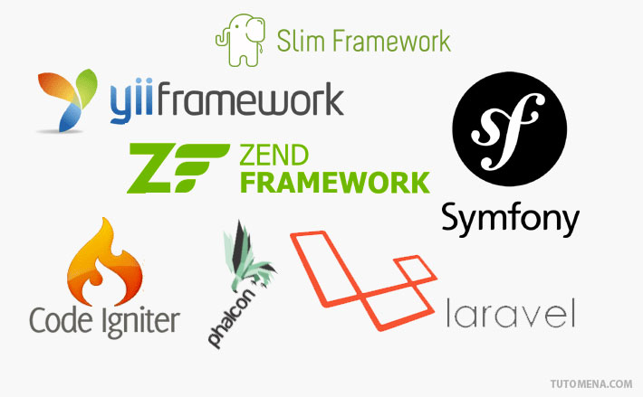
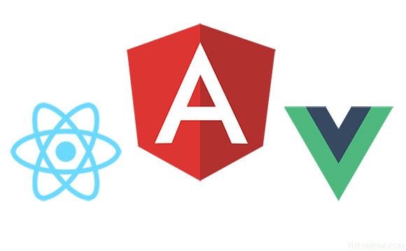

بدأت العمل [كمطور ويب محترف](https://www.tutomena.com/web-development/%d8%aa%d8%ac%d8%b1%d8%a8%d8%aa%d9%8a-%d9%83%d9%85%d8%a8%d8%b1%d9%85%d8%ac-%d9%85%d9%88%d8%a7%d9%82%d8%b9/) منذ ما يزيد على 6 سنوات، أثناء هذه المدة مررت بتجارب عديدة مع عدة شركات متخصصة في برمجيات الويب وعملنا خلالها على مختلف أنواع المشاريع والتطبيقات. هذه التجارب مكنتني من معرفة مجموع التقنيات ولغات البرمجة الأكثر طلبا في سوق الشغل بالمغرب ودول شمال إفريقيا بشكل عام. وارتأيت كتابة هذا المقال ليكون موجها لجميع الطلاب والمبرمجين المبتدئين الذين يحتارون في اختيار اللغات والتقنيات التي يستحسنن البدء في تعلمها لإيجاد موطئ قدم لهم في سوق العمل.

## 1\. لغة البرمجة PHP هي الأكثر طلبا مقارنة بمنافسيها

لا يخفى على أحد منكم المكانة المتميزة التي تحظى بها لغة البرمجة PHP في عالم تطوير تطبيقات الويب، هي اللغة الأكثر استخداما في هذا الصدد وتتفوق بشكل كبير على منافسيها Rails، جافا وبايثون. أنا لا أقول بأن هؤلاء المنافسين ليسوا مطلوبين في سوق الشغل، ولكن شعبيتهم في السوق لا تقارن بشعبية PHP الطاغية. ولقد شرحنا في مقال سابق [بعض الأسباب التي جعلت لغة PHP تلقى هذا القبول الواسع](https://www.tutomena.com/web-development/php/why-php-is-so-popular/).

ولكن تجدر الإشارة إلى أن الشركات لا تعمل في العادة بلغة PHP الخام، أي البدء في التكويد من الصفر، بل إنها تعتمد على إطارات العمل وبرامج إدارة المحتوى Content Management Systems لتلبية طلبات العملاء.

### إطارات العمل

#### سيمفوني

إطار العمل سيمفوني مطلوب بقوة في سوق الشغل بالدول الفرنكوفونية بصفة عامة، أولا لأنه فرنسي الجنسية :) وثانيا لأنه بكل صراحة إطار عمل قوي للغاية ويصلح لجميع أنواع التطبيقات مهما بلغت أحجامها.

#### لارافيل

لارافيل بدوره حقق مكاسب كبيرة في السنوات الأخيرة، ليس في المنطقة المغاربية فقط، بل في العالم بأسره. هذا الفريموورك يتسم ببساطته وسهولة تعلمه، مقارنة بسيمفوني مثلا، كما أن له مجتمع نشيط ومتفاعل بشكل ممتاز وهو من إطارات العمل التي ستجعلك [تستمتع بكتابة الكود وتعشق لغة البرمجة PHP](https://www.tutomena.com/web-development/php/%d8%a5%d8%b7%d8%a7%d8%b1-%d8%a7%d9%84%d8%b9%d9%85%d9%84-%d9%84%d8%a7%d8%b1%d8%a7%d9%81%d9%8a%d9%84/).

#### زند فريموورك

Zend Framework إطار عمل قوي وعتيد، من أقدم إطارات العمل الخاصة بلغة البرمجة PHP. كان في وقت من الأوقات إطار العمل الأول في السوق المغربية ولكنه تراجع قليلا لصالح **سيمفوني** و**لارافيل** إلا أنه يبقى إطار عمل مطلوب وله مكانة محترمة في السوق.

### أنظمة إدارة المحتوى

#### ووردبريس

بالنسبة لبرامج إدارة المحتوى، فلا جدال على أن ووردبريس هو الأكثر استخداما وطلبا، نقاط قوته عديدة ولا يسع المقام لتفصيلها. الشيء الذي يجب معرفته هو أن ووردبريس تجارة رائجة حقق من ورائها العديد من المطورين أموالا طائلة وذلك بتطوير [قوالب احترافية وبيعها في المتاجر الإلكترونية](https://www.tutomena.com/web-development/%d8%a7%d9%84%d9%86%d8%ac%d8%a7%d8%ad-%d9%85%d8%aa%d8%ac%d8%b1-%d8%ab%d9%8a%d9%85-%d9%81%d9%88%d8%b1%d9%8a%d8%b3%d8%aa/) المخصصة لذلك.

#### دروبال

دروبال نظام قوي ومتكامل، تستطيع بواسطته إنجاز مختلف أنواع تطبيقات الويب تقريبا، يصلح كذلك للتطبيقات الكبيرة الحجم والمعقدة وهو يتفوق على ووردبريس في هذه النقطة. كما أن الميزانية المخصصة لمشاريع دروبال تكون في العادة أكبر بكثير من تلك المخصصة لمشاريع ووردبريس، لأنه كما قلنا مشاريع دروبال تكون في العادة كبيرة الحجم وهذا ما يفسر كذلك كون المطور المتخصص في دروبال يتقاضى أجرا أعلى من أجر مطور ووردبريس.

## 2\. الجافاسكريبت ملك الواجهات الأمامية

إذا كنت تود احتراف تطوير الواجهات الأمامية Frontend Web Development فلا غنى لك عن تعلم لغة البرمجة جافاسكريبت JavaScript، والتشابه في الإسم لا يعني أن لها أية علاقة بلغة جافا. وكما هو الحال بالنسبة لتطوير الواجهات الخلفية بواسطة لغة البرمجة PHP، فإن المطورون المحترفون لا يقومون بكتابة أكواد الجافاسكريبت من الصفر إلا في المهام البسيطة. عوضا عن ذلك يتم الإعتماد على عدد من المكتبات وإطارات العمل.

### مكتبة جيكويري jQuery

في وقت من الأوقات كان مدير العمل يسألك في مقابلة التوظيف إن كنت تتقن العمل بمكتبة جيكويري، أمام الآن فلم يعد هذا السؤال يطرح تقريبا، لأن إتقان jQuery هو أضعف الإيمان لمن يريد العمل كمطور واجهات أمامية محترف، فلقد تطور عالم الجافاسكريبت بشكل كبير في السنين الأخيرة وأصبح 80% من العمل على تطبيقات الويب يتم على مستوى الواجهات الأمامية، وطفى على السطح ما يسمى بإطارات عمل الجافاسكربت وبات تعلمها وإتقان واحد منها أمرا لا مناص منه بالنسبة لمطور Frontend.

### إطار العمل Angular

طورت شركة غوغل إطار العمل **أنغولار Angular** في عام 2009 ومنذ ذلك الحين أصبح المطلوب رقم 1 في سوق الشغل على مستوى العالم، ولم يعاني من أي منافسة تذكر حتى ظهور React.js أواخر عام 2013.

[caption id="attachment_1991" align="aligncenter" width="580"]](../images/javascript-frameworks.jpg) إطارات عمل الجافاسكريبت الأكثر استخداما\

### React.js

جاء إطار العمل **React.js** من فيسبوك بفلسفة مغايرة عما كان يقدمه Angular، فمعه ظهر مفهوم ال Virtual DOM وكتابة أكواد HTML داخل الجافاسكريبت أو ما يصطلح عليه ب JSX، وتخلى عن مفهوم ال MVC في تنظيم وهيكلة المشروع.

استطاع React.js أن يحقق مكاسب سريعة لنفسه وأصبح المنافس الأول لأنغولار Angular وبات على أعتاب تجاوزه لاسيما مع ظهور منصة React Native لبرمجة تطبيقات الموبايل بواسطة الجافاسكريبت واعتمادها بشكل كلي على فلسفة React.js.

### Vuejs

**Vuejs** إطار عمل لا يستهان به في أوساط الجافاسكريبت، ففي وقت وجيز استطاع أن يحوز شعبية كبيرة جدا لدى المطورين. هذا الفريموورك أخذ من نقاط قوة React وأنغولار وقام بدمجهما في إطار عمل واحد مع لمسته الخاصة المتسمة بالبساطة والسهولة في الإستيعاب. وهذا ما جعل فريق لارافيل يعتمدونه بصفة رسمية كإطار عمل لتطوير الواجهات الأمامية مع Laravel.

## 3\. الواجهات الأمامية لا تكتمل إلا مع HTML وCSS

### HTML

طبعا لغة ال HTML هي أول ما يتعلمه المرء في رحلته بهذا المجال، وليس هناك أصلا موقع أو تطبيق ويب من دون HTML.

### CSS

تطورت لغة تنسيق الصفحات CSS بشكل رهيب منذ ظهور الإصدار CSS3. أصبح بالإمكان إضافة مؤثرات Animations ورسم الأشكال فقط بواسطتها دون الحاجة للجافاسكريبت. كلما تفننت في استخدامها وزاد إتقانك لها إلا وزادت قيمة ما تقدمه كمطور ويب وبالتالي زيادة الأجر الذي تتقاضاه :) . العديد يبخسون CSS حقها ولكن صدقني، هذه اللغة في غاية الأهمية إذا كنت تريد الذهاب بعيدا في مشوارك الإحترافي.

نفس الكلام الذي قلناه عن جافاسكريبت وPHP، سنقوله على CSS : المحترفون لا يكتبون أكواد ال CSS الخام ولكنهم يستعينون عوضا عن ذلك بالمعالجات أو ما يسمى بالإنجليزية **CSS Preprocessors **وأشهرها SASS و LESS.

أدعوك للإطلاع على مقال "[5 أمور تجعلك تفكر في استعمال معالجات CSS في مشاريعك القادمة](https://www.tutomena.com/web-development/html-css/why-you-should-use-css-preprocessors-in-your-projects/)" الذي نشرناه سابقا لفهم آلية عملها وفائدتها.

### إطارات عمل الواجهات الأمامية (Bootstrap, Foundation ...etc)

هذا مع العلم أنه يتم اللجوء عادة للعمل بما يسمى إطارات العمل الخاصة بالواجهات الأمامية ( لا علاقة لها بإطارات عمل الجافاسكريبت التي تحدثنا عنها ) وأشهرها على الإطلاق [بوتستراب Bootstrap](http://getbootstrap.com/) و [Zurb Foundation](http://foundation.zurb.com/). هذه الإطارات عبارة عن مجموعة من أكواد HTML، CSS وجافاسكريبت وتضع بين يدي المطور عدد من المكونات Componentss التي نحتاجها في معظم المشاريع مثل نظام Grid، أيقونات، قوائم إضافة لمجموعة كبيرة من الستايلات Styles الجاهزة لتوفير الوقت والجهد.

يكفيك تعلم واحد منها، إما **بوتستراب** أو **Zurb Foundation**، والعمل على إتقانه للإستعانة به في حال اقتضى الأمر.

## 4\. الجافا وسويفت لبرمجة تطبيقات الموبايل

مازال الجافا يعتبر لغة البرمجة الأكثر استخداما لبرمجة تطبيقات الموبايل الخاصة بنظام أندرويد، أما لغة البرمجة سويفت فهي الآن الأكثر استعمالا في تطوير تطبيقات iOS الخاصة بآيفون وآيباد.

ظهرت في الآونة الأخيرة [تقنيات جديدة لعمل هذه التطبيقات](https://www.tutomena.com/web-development/%d8%a8%d8%b1%d9%85%d8%ac%d8%a9-%d8%aa%d8%b7%d8%a8%d9%8a%d9%82%d8%a7%d8%aa-%d8%a7%d9%84%d9%85%d9%88%d8%a8%d8%a7%d9%8a%d9%84/) بواسطة تقنيات الويب جافاسكريبت، HTML وCSS وكذلك منصة زامارن Xamarin من مايكوسوفت ولكن غالبية المشاريع الإحترافية لا يزال الإعتماد فيها على الجافا وسويفت.

مطورو تطبيقات الموبايل يتقاضون أجورا عالية نسبيا، وكلما زاد عدد سنوات تجربتك إلا وزادت قيمة ما تتقاضاه. ومادمنا نتحدث عن الأجور فلا أخفيك سرا بأن أجور مطوري تطبيقات iOS تكون أعلى من أجور المتخصصين في أندرويد، والسبب بسيط هو أن المحترفين في تطبيقات iOS عملة ناذرة ولا يمكن إيجادهم إلا بمشقة الأنفس.

---

هذه تقريبا أهم اللغات وتقنيات البرمجة المطلوبة في السوق، حاولت تبسيط الموضوع قدر الإمكان لأن المقال موجه بالأساس للمبتدئين. نصيحتي في النهاية هي أن السبيل الوحيد لإتقان أي تقنية هو التطبيق والتطبيق ثم التطبيق، لن تصبح محترفا في PHP مثلا حتى ولو قرأت 10 كتب عنها إلا إذا كنت تطبق ما تعلمته بالموازاة مع ذلك. حاول إيجاد مشاريع للعمل عليها حتى ولو كان ذلك بالمجان لكي تضيفها لقائمة إنجازاتك في سيرتك الذاتية CV.

لا تتردد في طرح استفساراتك في صندوق التعليقات أسفله، سأكون سعيدا للغاية بالإجابة عليها :)
