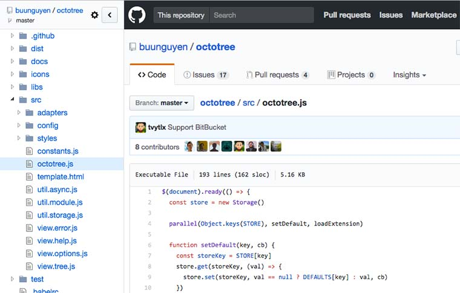

تعتبر منصة [**github **](https://github.com)أكثر المواقع شعبية وتفضيلا بين المطورين في كل أنحاء العالم ، نظرا لاحتوائه على مزايا عديدة. ففي الأساس وكما قلت هذا المشروع هو عبارة عن موقع ويب أو "مستودع" لاستضافة المشاريع أي الشيفرات أو الأكواد البرمجية Source Codes مفتوحة المصدر وإدارة هذه الأكواد بفاعلية ومراجعتها وتنقيحها ومراقبتها .

اليوم نقدم لكم إضافة للمتصفحات  اسمها  **[Octotree](https://github.com/buunguyen/octotree)**، تساعدك على تصفح أسرع للموقع ، الاظافة تضيف للصفحة على الجانب الأيسر جزء يتيح لك تصفح المستودع بسلاسة دون الحاجة لإعادة تحميل الصفحة عند الدخول لأي مجلد و الأكثر من ذلك سهولة الوصول للمجلدات الفرعية البعيدة داخل المستودع دون الحاجة للمرور عبر المجلدات الوسيطة تماما كما هو الحال في محررات الأكواد. وتستطيع كذلك تحميل أي ملف على إنفراد دون نسخ الملف أو إستنساخ المستودع.

و إليكم الآن رابط الإضافة الخاصة بكل متصفح :

- [**google chrome**](https://chrome.google.com/webstore/detail/octotree/bkhaagjahfmjljalopjnoealnfndnagc)
- [**Mozilla ****Firefox**](https://addons.mozilla.org/en-US/firefox/addon/octotree/)
- [**Opera**](https://addons.opera.com/en/extensions/details/octotree/)
