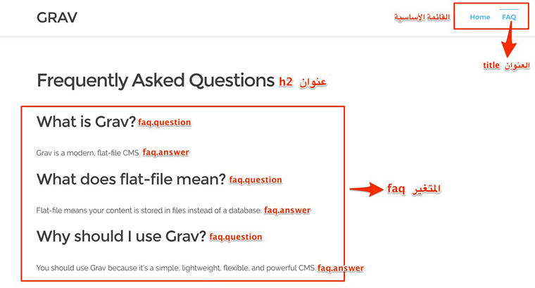
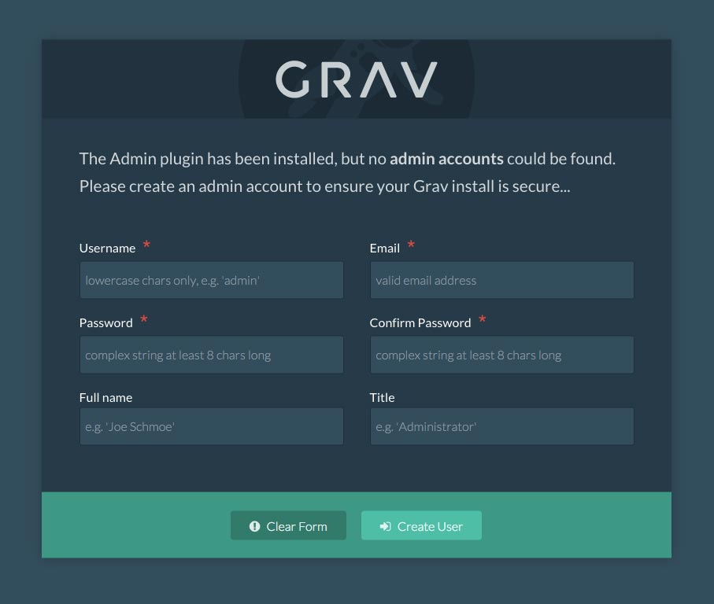
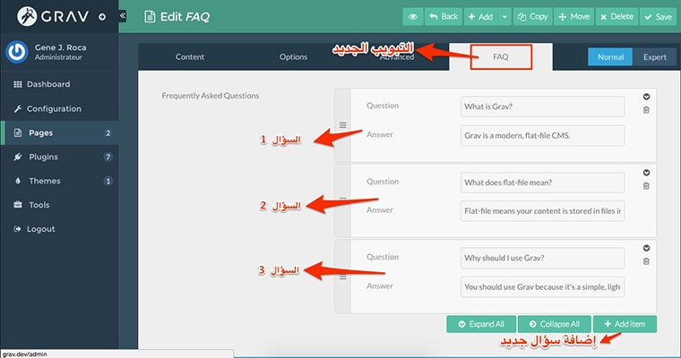

تساعدنا **برامج إدارة المحتوى**، من قبيل ووردبريس، دروبال وجوملا، في بناء مواقع إلكترونية بسرعة وبجهد أقل مع ضمان فعالية عالية للمنتوج النهائي. **GRAV CMS** هو الآخر ضمن هذه الكوكبة من أنظمة إدارة المحتوى، ولقد اكتسب منذ ظهور قبل حوالي عامين عددا لا بأس به من المستخدمين، فما هي خصوصيات CMS Grav وهل عليك استخدامه في مشاريعك المقبلة ؟

## برامج إدارة المحتوى التقليدية (ووردبريس، دروبال وجوملا)

تشترك مجموعة برامج إدارة المحتوى الإعتيادية، مثل **ووردبريس** و**دروبال**، في كونها تعتمد كليا على قواعد البيانات **Mysql** في تخزين محتويات الموقع (صفحات، تصنيفات، مقالات .. إلخ). هذا ما يجعل تثبيت وتنصيب هذه الأنظمة مهمة صعبة على المبتدئين بصفة خاصة.

إدارة المحتوى على هذه المنصات يتم من خلال لوحات التحكم التي تختلف من نظام لآخر.

## برنامج Grav لإدارة المحتوى

من جهته، يعتمد Grav في تخزين البيانات على فلسفة جديدة وقديمة في نفس الوقت، وهي الإستعانة بالملفات، ولكن ليس ملفات html، لن تجد داخل السكريبت أي ملف html، فعدم اعتماد هذا البرنامج على قاعدة للبيانات لا يعني أنه سكريبت تقليدي أو مولد لمواقع ساكنة Static Site Generator، كل ما هنالك أن القائمين عليه فضلوا حفظ الإعدادات والمحتويات في ملفات نصية اعتيادية (غالبا json، yaml وmarkdown) عوض اللجوء لخادم قاعدة بيانات لإنجاز هذه المهمة على غرار ووردبريس وإخوانه.

### Grav صديق للجميع، مطورين، مصممين ومستخدمين عاديين

1. **صديق للمطورين** : يوفر برنامج Grav عدة أدوات للمطورين للعمل بكل راحة وفعالية، فهو يضع بين أيديهم واجهة لسطر الأوامر CLI Console، كما يتوفر على مستودع Grav Package Manager فيه عدد مهم من الإضافات Plugins والقوالب Templates.
2. **صديق للمصممين** : لا يكون المصمم في العادة خبيرا في البرمجة وكتابة الشفرات المعقدة، لهذا وضع Grav نظاما مرنا وسهل الإستيعاب يعتمد على محرك Twig في بناء وإنشاء القوالب والتصاميم المخصصة.
3. **صديق للمستخدم العادي** : لا يتوفر Grav **افتراضيا** على أي لوحة تحكم لإدارة الموقع، ولكن بما أنه يفكر فيك أيها المستخدم فإنه يضع بين يديك إضافة رائعة لتجاوز هذا "النقص"، الإضافة اسمها [Grav Admin Panel](https://learn.getgrav.org/admin-panel/introduction) وتمنحنا لوحة تحكم جميلة ومتكاملة لإضافة محتويات جديدة للموقع دون الإضطرار لفعل ذلك يدويا عن طريق إضافة وتحرير الملفات.

## مثال تطبيقي باستخدام Grav CMS

حتى ندخل في صلب الموضوع ونفهم جيدا طريقة عمل سكريبت Grav، سنقوم بعمل مثال تطبيقي عبارة عن صفحة للأسئلة الشائعة أو ما يعرف اختصارا بصفحة FAQ، ستكون بسيطة وكل ما تعرضه هو السؤال وتحته الجواب.

قبل البدء، علينا تنصيب السكريبت في خادم محلي. كل ما عليك فعله هو [تحميل السكريبت](https://getgrav.org/downloads) ثم تفك الضغط عنه وتقوم بنسخه ثم لصقه في السرفر الخاص بك.

أول ما يجب معرفته هو أن جميع الملفات الخاصة بموقعك من قوالب، إضافات وإعدادات تكون داخل المجلد user . في داخل هذا المجلد سنجد عدة مجلدات فرعية من بينها مجلد اسمه pages  الذي يتم فيه تخزين محتويات جميع صفحات الموقع، ونجد فيه افتراضيا مجلد اسمه 01.home  خاص بالصفحة الرئيسية.

لإضافة صفحة الأسئلة الأكثر شيوعا، سننشئ مجلدا جديدا اسمه 02.faq . يقوم برنامج **Grav** بقراءة الرقم في بداية اسم المجلد لتحديد ترتيب الصفحة في القائمة الرئيسية للموقع، بينما يقوم باستخدام الجزء الثاني من الإسم لتحديد رابط الصفحة وهو في هذه الحالة /faq.

داخل المجلد، سنقوم بإنشاء ملف جديد اسمه faq.md ، هذا الإسم مهم بحيث يتم استخدامه في تحديد القالب الخاص بالصفحة وفي هذه الحالة يفهم Grav بأن عليه البحث عن قالب اسمه faq.html.twig من أجل إظهار الصفحة.

باختصار، يتم إضافة كل صفحة جديدة عن طريق مجلد بداخله ملف **Markdown**. يتم استخدام اسم المجلد لتحديد اسم الصفحة، بينما يستخدم اسم الملف لتحديد القالب الخاص بها.

\---
title: FAQ
faq: - question: What is Grav?
answer: Grav is a modern, flat-file CMS. - question: What does flat-file mean?
answer: Flat-file means your content is stored in files instead of a database. - question: Why should I use Grav?
answer: You should use Grav because it's a simple, lightweight, flexible, and powerful CMS.

---

## Frequently Asked Questions

### شرح بنية الصفحة

كل ملف Markdown في **برنامج Grav** يتكون من قسمين أساسيين:

1. الترويسة أو Header، وتكون هذه المنطقة محدودة بواسطة علامتي --- وتعرف كذلك باسم **YAML Frontmatter**، وفيها يتم وضع [الإعدادات](https://learn.getgrav.org/content/headers) والمتغيرات الخاصة بالصفحة. تلاحظون أنه في مثالنا قمنا بتعيين عنوان title  للصفحة، هذا الإعداد مدمج افتراضيا في Grav بحيث يستخدم من طرف البرنامج لمعرفة عنوان الصفحة، كما قمنا بإنشاء متغير جديد اسمه faq وبداخله عنصرين question وanswer وسنتمكن من قرائته من داخل ملف قالب Twig الخاص بالصفحة.
2. منطقة المحتوى، وتتواجد أسفل المنطقة السابقة وفيها نضع محتوى الصفحة بصيغة Markdown.

إذا حاولت فتح الصفحة الآن على المتصفح فسيواجهك Grav بصفحة خطأ جميلة :) هذا أمر طبيعي لأننا لم نعين بعد قالبا لإظهار محتويات الصفحة. ماذا ننتظر إذن ؟ فلنقم بإنشاء ملف القالب faq.html.twig  الخاص بصفحتنا.

سنقوم بإنشاء هذا الملف في المجلد user/themes/antimatter/templates  الذي يضم جميع ملفات القوالب الخاصة بصفحات موقعنا. محتوى القالب سيكون على هذا النحو :





{{ content }}

    

        <h3>{{ faq.question }}</h3>
        
{{ faq.answer }}

    



القالب بسيط وخاصة إذا جربت العمل سابقا **بنظام القوالب Twig**، مع سيمفوني مثلا، حينها سيبدو لك بسيطا للغاية. وتلاحظون كيف استطعنا الوصول للمتغير faq الذي صرحنا به داخل ملف faq.md  الخاص بمحتوى صفحتنا. بقية الأسطر أظنها واضحة، السطر الأول من أجل الوصول لملف base.html.twig  الذي يضم الهيكل الأساسي للصفحة (استدعاء ملفات الجافاسكريبت، css إلخ...)، والتعبير {{content}}  يقوم بإظهار محتوى الصفحة الذي أضفناه لمنطقة المحتوى أسفل **YAML Frontmatter** في ملف faq.md .

والآن عند فتح الرابط http://site.com/faq سيظهر لك محتوى الصفحة بنجاح :

[caption id="attachment_2044" align="aligncenter" width="760"] مثال لصفحة في برنامج إدارة المحتوى Grav\

### تهانينا ولكن؟!

ممتاز! هذا جميل، لقد قمنا بإنشاء صفحة جديدة بقالب مخصص. ولكن ماذا لو أردنا إضافة أسئلة جديدة للصفحة، طبعا سيكون علينا فتح ملف faq.md  وإضافتها من هناك، هذا مقبول ولكن ليس للمستخدمين العاديين الذين يفضلون دائما التعامل مع الواجهات الرسومية **User Interfaces** عوض التعديل المباشر على الملفات. الحل هو إضافة لوحة التحكم للموقع والتي تكلمنا عنها سابقا، الأمر بسيط فهي مجرد إضافة كسائر الإضافات يتم تثبيتها بسهولة.

## إضافة لوحة التحكم

لتنصيب لوحة التحكم، يكفي تنفيذ السطر التالي في نافذة الأوامر السطرية:

$ bin/gpm install admin

بعد عملية التنصيب، قم بإعادة تحميل الصفحة وسيقوم GRAV بتوجيهك مباشرة لصفحة التسجيل من أجل تسجيلك كمدير لتتمكن من الولوج للوحة التحكم.

حاليا يوجد في واجهة التحكم حقلين فقط : عنوان الصفحة والمحتوى. ما نريد القيام به هو إضافة استمارة Form تضم حقول جديدة مخصصة **Custom Fields** لكي نتمكن من استخدامها كلما أردنا إضافة أسئلة وأجوبة جديدة للصفحة. لفعل ذلك، سنقوم بإنشاء ملف اسمه faq.yaml  داخل المجلد user/themes/antimatter/blueprints  ونضع داخله المحتوى التالي:

title: FAQ
@extends:
type: default
context: blueprints://pages

form:
fields:
tabs:
fields:
faq:
type: tab
title: FAQ
fields:
header.faq:
name: faq
type: list
label: Frequently Asked Questions

              fields:
                .question:
                  type: text
                  label: Question
                .answer:
                  type: text
                  label: Answer

نعود للوحة التحكم ونقوم بإعادة تحميل صفحة FAQ. رائع! ستلاحظون أنه تمت إضافة تبويب جديد باسم FAQ الذي قمنا بتعيينه داخل الملف faq.yaml. التبويب الجديد يضم استمارة جديدة ورائعة تضمن لنا إضافة الأسئلة الجديدة بكل سهولة مع إمكانية السحب والإفلات للتحكم في ترتيبها.

## هل يصلح GRAV CMS لجميع أنواع المواقع الإلكترونية ؟

نظام إدارة المحتوى قوي بما فيه الكفاية لإنجاز مختلف المواقع والمشاريع الصغيرة والمتوسطة الحجم، ليس من الضروري اللجوء لووردبريس أو دروبال من أجل إنجاز Portfolio أو موقع لعرض خدمات شركة معينة، هنا يصبح **GRAV CMS** هو الخيار الأفضل والأكثر بساطة. بينما في الوقت الحالي، لا أعتقد بأن GRAV يصلح لإنجاز المواقع المعقدة ذات الحجم الكبير، رغم أن هناك عدد لا بأس به من الإضافات للتخصيص ولكنها تظل غير كافية مقارنة بما يقدمه مجتمع **ووردبريس** مثلا.

## إيجابيات وسلبيات برنامج إدارة المحتوى GRAV

### إيجابيات GRAV CMS

- **سريع جدا**، بفضل الإعتماد على الملفات لتحزين البيانات وكذا الإعتماد على نظام قوي وفعال للكاش Cache.
- **أكثر أمانا**، ليس هناك خطر اختراق قاعدة البيانات لأنها غير موجودة أصلا.
- **التثبيت بدون أي إعدادات**، فقط قم بفك الضغط عن حزمة السكريبت ثم انسخه في الإستضافة لتتم عملية التسطيب بنجاح.
- **الإعتماد على الملفات عوض قاعدة البيانات**، قراءة الملفات تكون أسرع من القراءة من قاعدة البيانات وبالتالي الموقع أسرع.
- **سهولة أخذ نسخة الإحتياط Backup**، ليس هناك أسهل من أخذ نسخة احتياطية لموقعك، فقط قم بتحميل كافة ملفات الموقع ثم احتفظ بها في مكان آمن على جهازك.
- **100% متوافق مع مدير النسخ**، تستطيع إدارة موقعك كله بواسطة مدير نسخ مثل Git، هذا يعني وجود نسخ للملفات وضمان الرجوع إليها إذا اقتضى الأمر. إدارة نسخ قاعدة البيانات ليس بالضرورة سهلا لهذه الدرجة.
- **سهولة التخصيص**، تستطيع الإختيار من بين عدد من الإضافات المتوفرة كما يمكنك تطوير إضافات خاصة بك بفضل النظام المرن الذي يتبعه GRAV في هذا الناحية.
- **توثيق جيد وسهولة التعلم**، الموقع الرسمي لبرنامج GRAV مصمم بشكل ممتاز وفيه شرح وافي لجميع الجزئيات المتعلقة بالسكريبت. لن تجد أي صعوبة في التعلم والفهم. على العموم ليس عليك تعلم العديد من الأشياء الجديدة للدخول في GRAV، فاستخدام لغة PHP تم اختزاله لأدنى حد ممكن، بينما التقنيات الأخر من قبيل Twig، Markdown و Yaml يمكن تعلمها في مدة يسيرة ولن تأخذ من وقتك الثمين إلا القليل.
- **عدد جيد من الإضافات والقوالب الجاهزة**، يضم **مدير الحزم GPM**، كما ذكرنا، عددا لا بأس به من الإضافات والقوالب للتحكم بشكل أفضل في شكل موقعك. حاليا، تظل هذه الإضافات والقوالب غير كافية ولكن المستقبل واعد وكلما كبر مجتمع GRAV CMS إلا وسيزداد هذا العدد.

### سلبيات GRAV CMS

- **غير مناسب للمشاريع التجارية الضخمة**، في هذا النوع من المشاريع تصبح الحاجة إلى قاعدة البيانات أمرا ملحا لإدارة الكم الهائل من الصفحات والعلاقات المعقدة بينها.
- **مجتمع GRAV لا يزال في طور النشأة**، إذا كنت مطورا متخصصا في GRAV فربما ستجد نفسك في عزلة مقارنة بما كنت تشعر به عندما كنت تطور لووردبريس. الفرق كبير بين الإثنين في هذه الناحية مما يتطلب اعتمادا أكثر على النفس وحسن إدارة وإيجاد حلول لمشاكلك بنفسك.

## خاتمة

من الواضح أن نظام إدارة المحتوى GRAV، قوي بما فيه الكفاية ليكون خيارك القادم لإنجاز مشاريعك الخاصة. هذا لا يعني بأنه بديل لووردبريس أو دروبال، فهو أبعد ما يكون عن ذلك في الوقت الحالي، هو فقط مولود جديد جاء بأفكار وفلسفة جديدة لإغناء المنافسة في المجال. لا يجب التسرع في الحكم عليه بالنجاح أو الفشل، البرنامج في بداية الطريق وقد نراه في السنوات القادمة منافسا جادا على كعكة برامج إدارة المحتوى.
