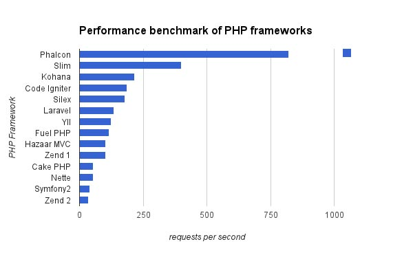

**إطارات العمل** نجدها في كل مكان، وبصفة خاصة لا يمكن تخيل العمل في تطوير تطبيقات الويب من دون الإستعانة بإطار للعمل. الإتصال بقاعدة البيانات، إدارة المسارات Routing، إرسال الإيميلات ...إلخ كل هذه أمور بسيطة لا يكاد يخلو منها أي تطبيق ويب ونجدها في متناول أيدينا مع إطارات العمل.

**لارافيل**، **سيمفوني**، **دجانغو Django** كلها إطارات عمل تتنافس فيما بينها للإستحواذ على أكبر قدر من الكعكة، بالرغم من أنها في المجمل تمنحنا نفس الإمكانات إلا أن لكل منها طريقته وفلسفته الخاصة في تقديمها لنا.

ولكن، هل استخدام **إطارات العمل** كله خير أم أن هناك بعض الحالات ينطوي فيها على سلبيات يصبح معها الإستغناء عنها خيارا محمودا وأكثر فعالية ؟

للإجابة على هذا السؤال، سنقوم بتقسيم هذا المقال إلى شطرين، الشطر الأول لتبيان إيجابيات ومحاسن إطارات العمل وشطر ثانٍ لإبراز بعض عيوب هذه الإطارات وإن كانت ستبدو للبعض عيوبا صغيرة ولن تمنعنا في الغالب من رؤية إيجابياتها الكثيرة.

## إيجابيات الإستعانة بإطارات العمل

### 1. السرعة في التطوير

هناك حكمة إنجليزية تقول **Time is money** أي **الوقت يساوي المال**، وندرك جيدا معنى هذه المقولة في ميدان البرمجة حيث أن لكل ساعة قيمتها الكبيرة.

قبل الحصول على أي مشروع احترافي، يتفاوض معك العميل على المقابل المادي لخدماتك وكذلك يطلب منك تحديد الجدول الزمني لإنهاء المشروع. والمطور المحترف والناجح هو الذي يحترم جداوله الزمنية والعملاء يحبون هذا النوع من المطورين أيما احترام.

 الوقت يساوي المال

أطر العمل تساعد المطور كثيرا في هذه الناحية حيث أنها تضع بين يديه مجموعة من الحلول للمشاكل العامة التي قد يقع فيها، كما تضعه فوق أساس صلب ومتين للبدء في العمل دون إضاعة وقته الثمين في إعادة رسم وتصميم هيكلة وأساس المشروع. غالبية هذه الإطارات تعتمد على نمط **Model-View-Controller** القوي والفعال في تنظيم الشيفرة البرمجية وتحسين جودتها.

يضاف إلى هذا أن جل إطارات العمل تأتي مع واجهة لسطر الأوامر (مثال **php artisan** في لارافيل) تساعد المطورين على توليد عدد من الأكواد في رمشة عين عوض إنشاء الملفات والمجلدات من الصفر.

### 2. إطار العمل يجعل مشروعك أكثر أمانا

بجانب السرعة في التطوير وتوفير الوقت، يجعل استخدام أحد إطارات العمل تطبيقك أكثر أمانا وصلابة. فالمكونات والمكتبات التي تُكَوِّن إطار العمل تم **تطويرها واختبارها** من طرف مجموعة من المبرمجين والمطورين المهرة، وبالتالي فدرجة الأمان تكون أعلى من أي شفرة برمجية أخرى تمت كتابتها من طرف مطور بمفرده.

هذا لا يعني أبدا أنه عليك فقط البدء في الإستعانة بأطر العمل ونسيان كل ما له علاقة بالنواحي الأمنية، بل يجب عليك أن تتعلم جيدا إطار العمل الذي قمت باختياره وأن تكون على دراية تامة بأفضل الممارسات **Best Practices** التي ينصح بها مطوروه للإستفادة القصوى من إمكانياته.

### 3\. الصيانة تكون أسهل

بعد وضعك على أساس متين وإتاحة بنية هيكلية واضحة لكتابة أكوادك البرمجية، يصبح التعديل على المشروع وصيانته أمرا أكثر سهولة ومرونة، سواء على من قام بكتابة الكود بنفسه أو على من يأتي بعده لاستكمال العمل على نفس المشروع وهذا شائع جدا في الشركات المتخصصة في البرمجة والتطوير.

إطارات العمل كذلك تستفيد من كونها مكونة من مجموعة من المكتبات المطورة بشكل مستقل، فمثلا **إطار العمل سيمفوني** يعتمد على:

- **مكتبة Doctrine** في التعامل مع قاعدة البيانات وتجريدها** Database Abstraction.**
- يستخدم أيضا **محرك القوالب Twig** لإنشاء وتخصيص بنية وهيكلة ال Views.
- مكون **Symfony Console** لتطوير واجهة للأوامر السطرية بطريقة سهلة **قابلة للإختبار Testable**، وهو بالمناسبة نفس المكون الذي يستخدمه **إطار العمل لارافيل** في تطوير واجهته المعروفة **php artisan**.
- نظام **FOSUserBundle** لإدارة وتعريف المستخدمين.
- إلخ ...

وكل هذه الأدوات والحلول يتم تطويرها وترقيتها بشكل مستقل، وبالتالي يستفيد المستخدم من هذا الكم الهائل من المطورين الذين يعملون خلف الكواليس لتطوير المكتبات المكونة لإطار العمل الذي يستخدمه دون أن يبذل هو أي جهد في ذلك.

### 4\. العمل الجماعي على المشروع

عندما تكتب شيفرة برمجية بنفسك من الصفر فلا تعتقد بأن الجميع سيفهمون ما قمت بكتابته من الوهلة الأولى؛ سيتوجب عليك شرح الكود المصدري لزملائك في العمل بتوثيقه وإقناعهم بطريقتك في تصميمه. هذا يعني **مزيدا من الوقت والجهد** أنت والفريق العامل معك في حاجة ماسة لهما لأمور أخرى.

تلك المعضلة لا وجود لها مع إطارات العمل، هذه الأخيرة تشترك في كونها **موثقة بشكل ممتاز** وتكون بذلك مهمة تعلمها واستيعاب فلسفتها وبنيتها أكثر سهولة وفي متناول أي مطور مهما كانت النقطة الزمنية التي انضم فيها للعمل على المشروع.

### 5\. المجتمع هنا لمساعدتك

عندما تجد نفسك أمام مشكل في مرحلة من مراحل التطوير وليست لديك أي فكرة عن كيفية إيجاد الحل فحينذاك ستعرف جيدا معنى وقيمة **المجتمع الداعم Support Community** للبرنامج أو إطار العمل الذي تشتغل عليه. هذه من أبرز نقاط قوة المشاريع البرمجية وخاصة مفتوحة المصدر منها.

**إطار العمل لارافيل** على سبيل المثال يتوفر على واحد من أنشط المجتمعات من بين جميع المنافسين، ولن تجد في الغالب أي صعوبة في مواجهة المشاكل التي قد تعترضك، يكفي إجراء عملية بحث بسيطة على محرك البحث لتجد عشرات النتائج والحلول لمشكلتك. هذا بجانب عدد هائل من المقالات والمصادر التعليمية التي تعج بها الشبكة العنكبوتية والتي تشرح كل صغيرة وكبيرة في هذا الإطار.

## سلبيات استخدام أطر العمل في البرمجة

والآن بعدما عرفنا كيف أن إطارات العمل تساعد بشكل واضح وفعال في البرمجة والتطوير، سنمر لاستعراض بعض عيوبها والتي قد تقنعك في حالات معينة بالإستغناء عنها.

### 1\. بطء التنفيذ

تعتمد أطر العمل على عدد كبير جدا من الكلاسات والمكتبات في عملها، وتحميل هذه المكتبات واستدعاؤها من طرف السكريبت يكون أبطأ مما هو عليه عند استخدام PHP الخام. هذا الفارق في الوقت والسرعة قد يكون ذو أهمية كبيرة في بعض التطبيقات الصغيرة والتي تتطلب **سرعة قصوى** في التنفيذ والإستجابة **كالواجهات البرمجية APIs** على سبيل المثال.

 ترتيب أشهر إطارات عمل PHP حسب سرعة التنفيذ

يعاب كذلك على هذه الأطر اعتمادها على مجموعة ضخمة من الكلاسات والوظائف التي لن يحتاجها المطور بالضرورة في مشروعه. هذا بالرغم من أن عدد كبير من إطارات العمل المعروفة تعتمد على ما يسمى **Lazy Loading** لتحميل الكلاسات التي يحتاجها التطبيق فقط، هذه خطوة ممتازة نحو الأمام ولكنها غير كافية لأنك تظل أمام مجموعة أخرى من الكلاسات التي صممت بشكل معين وتقيدك للعمل بها كما هي، حتى ولو كنت غير محتاج لكل التعقيدات والتجريدات **Abstractions** التي أضافتها للفريموورك.

### 2\. يجب تخصيص بعض الوقت للتعلم

إتقانك وعملك بلغة البرمجة PHP لايعني بالضرورة أنك تستطيع الإنتقال مباشرة لإطار العمل **سيمفوني** واستخدامه من اليوم الأول في مشروعك الإحترافي، الأمر ليس بهذه البساطة. لكل فريموورك، كما ذكرنا، فسلسفته وطريقته الخاصة في تنظيم الأمور، والمبرمج الذي يحترم عمله وتخصصه هو الذي يخصص وقتا كافيا للتعلم وإتقان الأدوات والحلول التي يشتغل بها من أجل الرفع من مستواه وتحسين جودة الخدمات التي يقدمها.

إذا كان **مشروعك صغيرا** أو أن وقتك **لا يسمح** بتعلم إطار عمل جديد، فيستحسن لك الإستعانة بإطار عمل صغير **Micro-framework** أقل تعقيدا، هذا إذا لم تستطع كتابة الكود من الصفر إن كنت متمكنا من لغة البرمجة التي تستخدمها. وحين يسمح جدولك الزمني بذلك، قم بتعلم إطار عمل جديد وأعطه حقه كاملا في استكشافه.

### 3\. الخلط بين مزايا الفريموورك ومزايا لغة البرمجة

ترتبط هذه النقطة بما سبق ذكره في الفقرة السابقة، فعدد لا يستهان به من المطورين يرتمون على أطر العمل حتى قبل أن يتعلموا لغة البرمجة نفسها. كم منا بدأ بتعلم لغة الجافاسكريبت قبل الإنتقال لمكتبة جيكويري ؟ عدد قليل منا بالطبع فعل ذلك.

النتيجة هي أن البعض مازال لديه لبس وصعوبة في رؤية [الخط الفاصل بين جيكويري وجافاسكريبت](https://www.tutomena.com/web-development/javascript/%d8%ac%d8%a7%d9%81%d8%a7%d8%b3%d9%83%d8%b1%d9%8a%d8%a8%d8%aa-%d9%88%d8%ac%d9%8a%d9%83%d9%88%d9%8a%d8%b1%d9%8a-%d8%9f-%d8%a3%d9%8a%d8%a9-%d8%b9%d9%84%d8%a7%d9%82%d8%a9-%d8%9f/)، بل إن هناك من يقوم باستدعاء مكتبة جيكويري كاملة للقيام بمهمة بسيطة للغاية، مثل إضافة حدث أو وظيفة لزر معين، رغم أننا نستطيع القيام بذلك بسهولة بكتابة أسطر معدودة من الجافاسكريبت الخام **Vanilla JavaScript**.

### 4\. مشكل التبعية

عندما تقوم باستخدام فريمووك معين فأنت بطريقة أو بأخرى تابع له ورهين بالتقلبات الذي قد يتعرض لها مستقبلا. فماذا لو توقف مطوروه عن دعمه أو اتجهوا به لمنحى غير ملائم بالنسبة لك ؟ هذا المشكل ليس بالخطورة الكبيرة لكون جل إطارات العمل مدعومة بشكل جيد وتقف خلفها مجتمعات قوية للغاية، ولكنه سؤال يجب أن يطرح على كل حال قبل وقوعك على أي اختيار.

لحماية نفسك ومشروعك من أي مخاطر من هذا النوع، يجب اختيار إطار العمل بعناية كبيرة والإستناد على **معيار الشعبية** الذي يعتبر واحدا من أهم المعايير عند اختيار أي فريموورك.

## نهاية المقال

**إطارات العمل** العصرية لها منافع كثيرة في عملية التطوير والبرمجة، ستوفر عليك مجهودا كبيرة ووقتا ثمينا وتضعك على أساس قوي للبدء في عملية التطوير. فقط لا يجب نسيان أن تعلم لغة البرمجة يأتي أولا قبل تعلم أي فريموورك!

مربط الفرس كذلك في هذا الموضوع هو أنك، أيها المطور، مطالب باختيار الحل والأداة المناسبين لكل مشروع على حدة، هنا يبرز ذكاء وبعد نظر المطور لاتخاذ القرار الصائب.

لا ننسى كذلك **إطارات العمل الصغيرة** Micro-Frameworks ودورها الفعال في القيام بالمهام والمشاريع الصغيرة والمحدودة، ينصح على الأقل تعلم إطار عمل كبير واحد ومعه إطار عمل صغير.

- إذا كنت تستخدم **لارافيل** فأنصحك بتعلم[ Lumen](https://www.tutomena.com/web-development/php/lumen-micro-framwork-by-laravel/) لأنه من تطوير داعمي لارافيل نفسه.
- أما إذا كنت من عشاق **سيمفوني** فإن الخيار الأمثل هو [Silex](https://silex.symfony.com/) لأنه أيضا من تطوير مؤسسة **SensioLabs** الداعمة لإطار العمل سيمفوني، هذا يعني اشتراكهما في نقاط عديدة وسهولة في الإنتقال بينهما.
- إلخ...

هذه مجرد أمثلة لأن سمفوني ولارافيل هم تقريبا الأكثر استخداما في تطوير المواقع. المهم من هذا الكلام كله **أن لا نقوم بتعقيد الأمور مادمنا نستطيع إيجاد حلول أكثر بساطة**.

---

ترجمة بتصرف للمقال: [Should You Use a PHP Framework? Five Pros and Cons](https://code.tutsplus.com/tutorials/should-you-use-a-php-framework-five-pros-and-cons--cms-28905)
