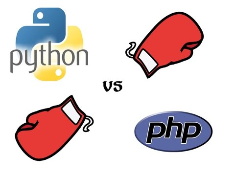

كمطور، من الطبيعي أن تبحث عن أفضل الأدوات التي تحتاجها، فتمكنك من إنجاز أعمالك بجودة أحسن وسرعة أكبر، طبعا إيجادها أمر ليس بالسهل، لكنه يذلل الطريق أمامك فيسقط كل شيء بين يديك، وبخصوص تطوير الويب فهناك عدد لا بأس به من لغات البرمجة التي تفتح لك الباب لدخوله، أما أطر عمل الويب فقد أضحت أدواتا من الصعب أن يستغني عليها المطور لما توفره من ميزات.

## ماهو جانغو ؟

Django هو إطار عمل ويب، حر ومفتوح المصدر، مكتوب بلغة البرمجة بايثون، أنشئ سنة 2005، وأهم أهدافه تسهيل عملية تطوير مواقع الويب المعقدة، بالإضافة إلى أنه يعتمد نظام بنية MVT لبناء المشاريع (النماذج التي تتعامل مع البيانات، العروض وتحدد البيانات التي ستعرض، أما القوالب فتحدد كيف يظهر العرض على المتصفح).

**مواقع معروفة تستخدم جانغو :** Disqus ،Instagram ،Mozilla ،The Washington Times ، كما أنه استخدم من قبل من طرف Pinterest.

## لماذا جانغو ؟

باستخدام جانغو يمكنك تحويل ما يدور في عقلك إلى واقع ببساطة وفي مدة قصيرة، بالإضافة إلى ميزاته المتعددة والتي سنذكرها في هذا المقال.

## جانغو يخطف الأضواء

بعد إنشائه عام 2005 لم يلبث طويلا ليصبح أهم أطر الويب، وبفضله تمكن المطورون من فعل الكثير في بضع دقائق وحسب، حقا، قد جعل جانغو من الأمور المعقدة في عملية تطوير الويب أمورا بسيطة جدا.

## بايثون وراء جانغو

معروف للجميع أن بايثون واحدة من أفضل لغات البرمجة وأكثرها رواجا حاليا، نظرا لسهولة تعلمها، بساطة تصميمها ومرونتها، ما يجعلها مدهشة فعلا، ولأسباب عدة أهمها:

- سهولة التعلم.
- نظافة الكود الذي يكتب بها وسهولة قرائته.
- متعددة الأغراض.
- سرعة البرمجة بها.
- لا توجد مشاكل جلية في تصميمها.

إضافة إلى كل هذا، بايثون لديها فلسفة خاصة، تعرف يـ "Zen of Python"، هذه الفلسفة تميزها عن نظيراتها من اللغات الأخرى، وبواسطة هذه المبادئ، يمكن للمطورين كتابة كود أعلى جودة وأكثر وضوحا.

## محاسن جانغو

بعد التحدث عن محاسن بايثون، سنركز الآن على إيجابيات جانغو، والتي لا تجعله حلا سريعا لعملية التطوير فحسب، بل تمكن مستخدميه من كتابة كود عال الجودة وسهل القراءة، ما يوفر خيار ممتازا للشركات، وبالطبع للمطورين كذلك.

**1\. السرعة :** لن يتطلب تحويل أفكارك إلى كود وقتا طويلا، فجانغو حل مثالي للمطورين الذين يركزون على الإنتاجية، وإنهاء أعمالهم في الموعد المحدد دون مشاكل.

**2\. ممتاز من ناحية الإضافات :** إذ يشمل إضافات كثير للمساعدة في تحديد صلاحيات المستخدم، خرائط الموقع، وإدارة المحتوى، والكثير غير ذلك، وكل هذا يساهم في تسهيل عملية التطوير.

**3\. الأمان :** جانغو قوي من هذه الناحية أيضا، إذ ابتكر حلولا ممتاز للعديد من المشاكل المحتمل وقوعها، مثل حقن SQL، وثغرات التزوير وغيرها

**4\. قابلية التوسيع :** جانغو يوفر حلولا مبتكرة لمشاكل الإزدحام.

**5\. متعدد الإستخدامات:** إدارة المحتوى، الإستخدامات العلمية...، كل هذه الجوانب تدار بكفاءة عالية من خلال استخدام جانغو.

## بايثون و PHP

من أكثر ما يميز جانغو هي لغة البرمجة التي تقف وراءه؛ **بايثون**، وباتحادهما يشكلان منافسا شرسا للغة البرمجة PHP. المقارنة بينهما قد تساعدك في تحديد الأفضل بالنسبة لك.

**1.تعدد أغراض بايثون:** في حين صممت PHP خصيصا لتطوير الويب، جانغو مبني بلغة أكثر قوة تستهدف مجالات مختلفة وأكثر عمقا.

**2\. بايثون وطول الأجل:** PHP جيدة على المدى القصير، عكس بايثون إذ تتفاءل التوقعات بخصوص مستقبلها.

**3\. قابلية القراءة :** القواعد والفلسفة التي تعتمدها بايثون يجعل الكود المكتوب بواسطتها أسهل للقراءة.

**4\. كود أبسط :** الكود المكتوب ببايثون أبسط من نظيره بـPHP.

**5\. تتبع الأخطاء :** الأدوات التي تأتي مع بايثون كافية جدا للتعامل مع المشاكل والأخطاء.

**6\. إدارة الحزم : **التعامل مع الحزم، وتبادلها وقراءتها وكتابتها من أكثر ما يميز جانغو، كما يسمح للمطورين بإعادة إستخدامها للتطبيقات الأخرى.

## السلبيات:

كما لجانغو إيجابيات، له عيوب أيضا، فأهم ما يمكن ألا تستحسنه فيه :

- يستخدم نمط تنظيم عناوين الـURL.
- الترابط المفرط في جانغو، فكل جزء يرتبط بغيره بشدة.
- يعتمد كل شيء على جانغو ORM (النظام المتعلق بالتعامل مع قاعدة البيانات وتجريدها).
- للعمل به، الإحاطة بجميع جوانبه أمر ضروري.

## في النهاية

هناك عدة أطر عمل ويب أخرى تنافس جانغو حاليا، منها المكتوبة ببايثون كإطار العمل المصغر Flask، وأخرى بلغات غيرها أهمها: Laravel المكتوب بـPHP، وإطار العمل Ruby on Rails للغة البرمجة Ruby.

كل له مميزاته، ويتفوق جانغو في عدة جوانب، حيث ذكرنا أهمها في هذا المقال لنساعدك على الإحاطة بها بشكل أفضل.

المصدر: [https://hackernoon.com/advantages-and-disadvantages-of-django-499b1e20a2c5](https://hackernoon.com/advantages-and-disadvantages-of-django-499b1e20a2c5)
