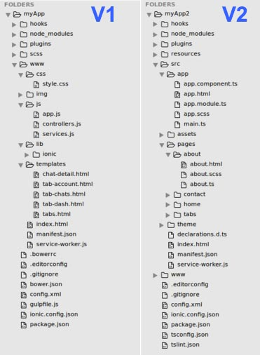
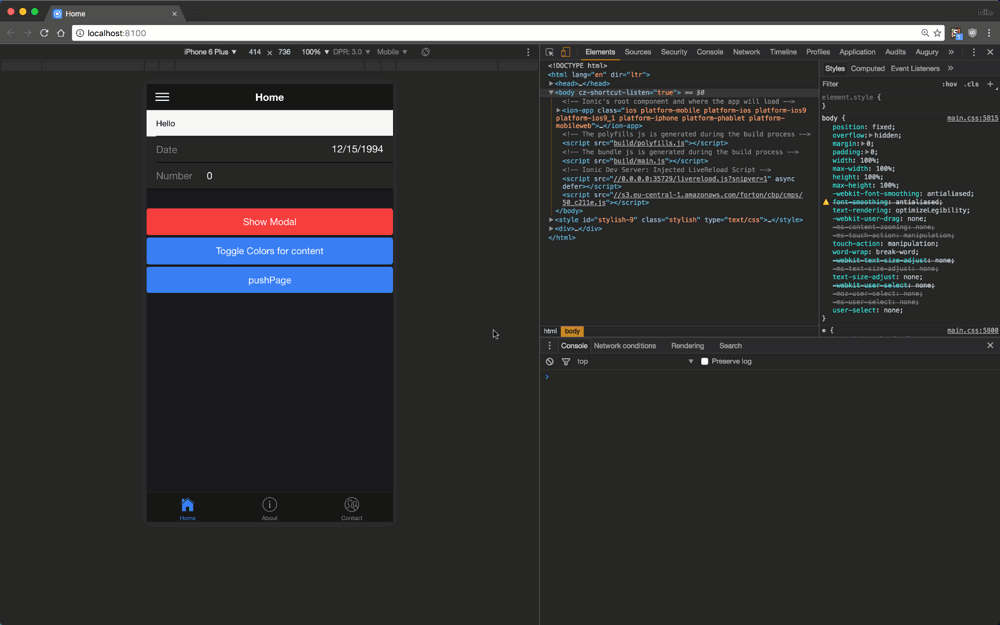
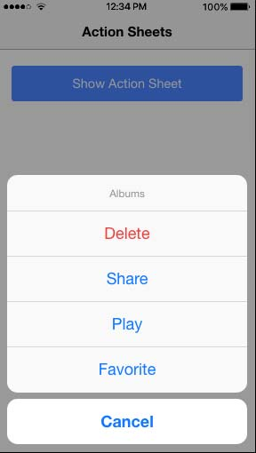
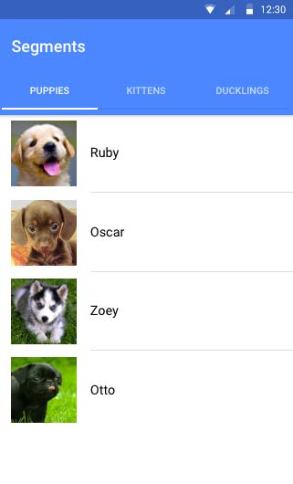
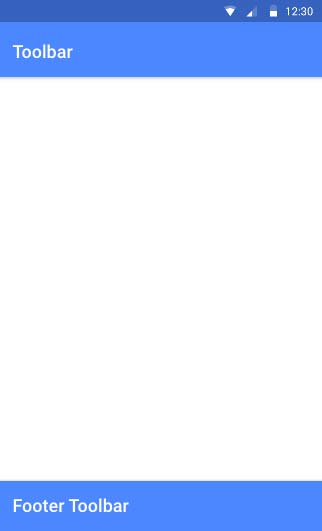
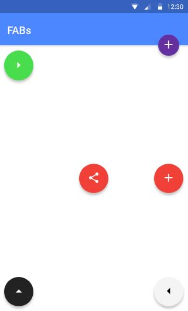

**Ionic 2** هو اسم الإصدار الجديد من إطار العمل Ionic **لبرمجة تطبيقات الموبايل** الهجينة Hybrid والعابرة للمنصات Cross-Platform. في هذا المقال سنتحدث عن أبرز مستجدات هذا الإصدار مع ذكر أبرز النقاط التي يختلف فيها عن الإصدار القديم **Ionic 1**.

هذا وسأحاول مساعدتك، عزيزي المطور، على اتخاذ قرارك بشأن ما إذا كان يجب عليك استخدامه في مشروعك التالي أم لا.

## ما هو Ionic ؟

Ionic هو إطار عمل **لبناء تطبيقات الأجهزة المحمولة** باستخدام تقنيات الويب HTML، CSS و JavaScript، حيث يضع في متناول المطور مجموعة من المكونات الرسومية UI Components والدوال Functions اللازمة لعمل تطبيقات موبايل جميلة واحترافية.

إطار العمل Ionic مبني على منصة كوردوفا Cordova، فلا يمكن تطوير تطبيقات الموبايل بواسطة Ionic فقط لأن الأخير يهتم فقط بالواجهات الرسومية للتطبيق مع الإعتماد على إطار العمل المعروف Angular في كتابة أكواد الجافاسكربت وتنظيمها.

التطبيقات المطورة باستخدام Ionic وCordova تعتبر **هجينة Hybrid** أي أنها تعمل على ال Webview داخل الجهاز، بعبارة أخرى ليست تطبيقات أصلية Native.

## ما الجديد في Ionic 2  ؟

في هذا الجزء سنتناول أبرز المتغيرات والمميزات الجديدة التي جاء بها  إطار العمل Ionic 2.

### Ionic 2 لم يعد يستخدم لتطبيقات الموبايل فقط

في وقت سابق، كان Ionic 1 يتخصص في المساعدة على تطوير **تطبيقات الموبايل فقط**، لكن مع قدوم الإصدار 2 فإن هذه الحقيقة قد تغيرت.

Ionic 2 أصبح يدعم تطوير تطبيقات الويب المتقدمة **Progressive Web Apps** وكذلك **تطبيقات سطح المكتب** بالإعتماد على **إطار العمل Electron**.

### الإعتماد على Angular 2 و Typescript

Ionic 2 بات يعتمد على الإصدار الجديد من إطار العمل Angular الخاص بلغة الجافاسكربت، هذا يعني أنك مطالب بتعلم **Angular 2** (وليس Angular 1 كما كان عليه الحال في إصدار Ionic 1) للتمكن من تطوير التطبيقات باستخدام Ionic 2.

بجانب Angular 2، يعتمد Ionic 2 كذلك على لغة **تايب سكريبت**، هذه الأخيرة تم تطويرها من طرف شركة **مايكروسوفت** حول لغة البرمجة جافاسكربت من أجل مساعدة المطورين على كتابة أكواد جافاسكربت ذات جودة عالية. أي أننا في الأخير نحصل على كود جافاسكربت اعتيادي ما يعني أنه مازال يمكنك بناء تطبيقات Ionic باستخدام الجافاسكربت الخام Vanilla JavaScript، ولكن ينصح دائما باستخدام **TypeScript** مع أنغولار لأنه مدعوم بشكل رسمي من طرف هذا الإطار، كما أنه يقوم بتسهيل عدد من المهام على المطور ويقوم بتحسين جودة الشيفرة المصدرية.

### Syntax

ذكرنا أعلاه أن Ionic 2 يعتمد على إطار العمل Angular 2، والأخير جاء بتغييرات جذرية في طريقة كتابة الجافاسكريبت وكذلك بنية القوالب Templates.

هذه أمثلة لعدد من الإختلافات بين قوالب Ionic 1 و Ionic 2 :

#### الإستماع للأحداث Listening to events

```html
<!--ionic 1-->

<button on-tap="onTap()" class="button">Test</button>
```

```html
<!--ionic 2-->

<button (tap)="onTap($event)">Test</button>
```

#### طريقة استخدام نماذج البيانات أو Models

```html
<!--ionic 1-->

<input ng-model="email" />
```

```html
<!--ionic 2-->

<input [(ng-model)]="email" />
```

#### الحلقات التكرارية 

```html
<!--ionic 1-->
<li ng-repeat="item in list">
  {{ item.name }}
</li>
```

```html
<!--ionic 2-->
<li *ngFor="let item of list">
  {{ item.name }}
</li>
```

### بنية المجلدات

ليس هناك اختلافات جذرية في البنية الشجرية للمجلدات بين Ionic 1 و Ionic 2، هذا لأن Ionic يبقى معتمدا على منصة اسمها Cordova.

الإختلاف الوحيد هو في الجانب المتعلق بالشفرة المصدرية للمشروع، وهذا راجع كما قلنا للإنتقال من Angular 1 ل Angular 2.

[](../images/ionic1-vs-ionic2-folder-structure.jpg)

في السابق كنا نمضي معظم الوقت داخل المجلد www، بينما في **Ionic 2** تم استحداث مجلد جديد اسمه src  وفيه يمضي المطور جل وقته. في هذا المجلد تتواجد كافة الملفات الخاصة بالمشروع وفي كل مرة يتم إحداث تغيير على مستوى هذه الملفات، يقوم Ionic بإجراء عملية Compiling عليها ونقلها للمجلد `www/build`  حتى تتم قراءتها من قبل المتصفح أو المحاكي.

الجميل كذلك مع هذه البنية الجديدة، أن الصفحات يتم تضمينها داخل المجلد src/pages  وكل صفحة بالمجلد الخاص بها ونجد بداخله ملفات الجافاسكربت، HTML وCSS الخاصة بهذه الصفحة.

هذا التنظيم لم يكن في الإصدار السابق، حيث كان المطور يجمع كافة ملفاته داخل المجلد www  ويتولى بنفسه تنظيمها بطريقته الخاصة.

### أدوات جديدة

**Ionic 2** جاء كذلك مع عدد من الأدوات الجديدة التي تجعل المطور يستمتع أثناء عمله.

#### المولدات أو Generators

عديدة هي **المولدات** التي يضعها Ionic 2 بين يدي المطور، من أهمها المولد الذي يمكن من إنشاء صفحة جديدة في المشروع :

ionic generate page about

تنفيذ هذا الأمر سيؤدي لإنشاء الملفات الخاصة بصفحة about  داخل المجلد src/pages/about، هذه الملفات هي :

- about.html
- about.ts ( حيث **.ts**  هو الإمتداد الخاص بملفات Typescript).
- about.css

#### الإبلاغ عن الأخطاء

جاء Ionic 2 بنظام جديد للإبلاغ عن الأخطاء Error Reporting. هذا النظام يقوم بإظهار الأخطاء، التي تطرأ أثناء عملية التطوير، في واجهة التطبيق نفسه وليس في نافذة الأوامر فقط كما تعودنا في السابق.

هذا يساعد المطورين كثيرا في التعرف بسرعة على الأخطاء التي تواجههم وتصحيحها في الحين.

[](../images/run-time-error-ionic2.gif)

#### القولبة Theming

في السابق، كانت تطبيقات Ionic 1 تظهر بنفس المظهر على جميع المنصات (أندرويد، iOS أو ويندوز فون).

لحسن الحظ، جاء **Ionic 2** بنظام جديد وذكي حيث يضع بين أيدينا 3 نماذج للقالب الإفتراضي : نموذج **Material Design** خاص بتطبيقات أندرويد، نموذج **iOS** خاص بتطبيقات آيفون وآيباد ونموذج **ويندوز فون** خاص بتطبيقات Windows Phone.

هذا يضمن ظهور التطبيق على المنصة المستهدفة بشكل أقرب ما يكون إلى الأصالة التي تتميز بها تطبيقات الموبايل الأصلية Native Mobile Applications.

### مكونات جديدة

المكونات هي أجزاء من الواجهات الرسومية في Ionic مثل الأزرار، اللوائح، الحقول النصية إلخ...

عدد كبير من **المكونات Components** الجديدة تمت إضافتها في الإصدار الجديد Ionic 2، وفي هذا الجزء من المقال سنذكر أهمها.

#### Action Sheet

مكون [Action Sheet](https://ionicframework.com/docs/components/#action-sheets) هو عبارة عن قائمة من الإختيارات تظهر أسفل الشاشة مع خلفية سوداء وشفافة تملأ الشاشة. يمكن استخدام هذا العنصر كبديل للقوائم في حالات معينة، ولكن لا ينصح باستخدامه للتنقل (Navigation) بين صفحات التطبيق.

[](../images/action-sheet-ionic2.jpg)

#### Segments

Segments عبارة عن تبويبات لفتلرة وتنظيم عرض بيانات بحسب تصنيفاتها.

[](../images/segments-ionic2.jpg)

#### Toast

[Toast](https://ionicframework.com/docs/components/#toast) عبارة عن رسالة تظهر للمستخدم في أسفل أو أعلى الشاشة ثم تختفي تلقائيا بعد ثواني معدودة.

#### Toolbar

شريط الأدوات هو مكون يكون في أعلى الشاشة أو أسفلها، ويمكن أن يحتوي على عدد من المعلومات مثل عنوان الصفحة، وقد يتضمن مكونات أخرى مثل حقل البحث وزر إظهار القائمة الرئيسية إلخ...

[](../images/toolbar-ionic2.jpg)

#### DateTime

يستخدم مكون [DateTime](https://ionicframework.com/docs/components/#datetime) لمنح المستخدم واجهة سهلة لاختيار التاريخ والتوقيت.

#### Floating Action Buttons

[**FABs**](https://ionicframework.com/docs/components/#fabs) كما يدل اسمها عبارة عن زر أو مجموعة أزرار تظهر عائمة في إحدى جنبات الشاشة، وقد ارتبط هذا النوع من الأزرار ب Material Design الخاص بنظام التشغيل أندرويد. ولكن مطوري Ionic 2 يضعون هذا المكون في متناولك لاستخدامه في أي منصة تريد.

[](../images/floating-actions-button-ionic2.jpg)

## تحسينات ومميزات أخرى

هذا ليس كل ما جاء به Ionic 2، فهناك تحسينات ومميزات أخرى يزخر بها هذا الإصدار الثاني بفضل القرار الذي تم اتخاذه بالإعتماد على Angular 2.

### الإعتماد على Web Animations API

المؤثرات أو Animations من الأشياء المهمة التي تزيد من رونق وجمالية أي تطبيق.

**إطار العمل Angular 2** وضع نظاما جديدا للمؤثرات يعتمد فيه على واجهة حديثة للمؤثرات اسمها Web Animations API، وكونها حديثة يعني أنها لا تزال غير مدعومة من جميع المتصفحات وبالتالي ال **Webviews** حيث تشتغل تطبيقات Ionic.

لإيجاد مخرج لهذا المشكل، يمكن استخدام الإضافة **Crosswalk** التي تقوم بتثبيت Webview حديث يدعم كافة المميزات الجديدة في Ionic 2.

العيب الوحيد في هذه الإضافة أنها تزيد من حجم التطبيق، وقد سبق أن قمنا بكتابة درس حول [كيفية استخدام الإضافة Crosswalk](https://www.tutomena.com/web-development/tools/crosswalk-cordova-plugin/) إذا كان الموضوع يهمك.

### Native Scrolling

كان إطار العمل Ionic في الإصدار القديم يقوم **بمحاكاة** نظام Scrolling الأصلي بواسطة الجافاسكربت، ومهما كان أداء هذا النظام جيدا إلا أنه لن يكون بقوة وفعالية النظام الأصلي في ال Webview.

في Ionic 1 لم تعد هذه الإشكالية مطروحة، حيث أصبح الإعتماد كليا على نظام ال Scrolling الأصلي وفي جميع أنظمة التشغيل (أندرويد، iOS و Windows Phone).

### Ionic Native

Ionic Native هو مرادف ل **ngCordova** في Ionic 1، كلاهما يسهلان على المطور مهمة التعامل مع إضافات كوردوفا للوصول إلى الواجهات الأصلية في الجهاز (مثل الكاميرا، نظام تحديد المواقع ...إلخ).

الاختلاف الأساسي بين ngCordova و **Ionic Native** أن الأخير يمكنك من كتابة أكواد الجافاسكربت بصيغة ES6 و باستخدام Typescript.

هذا مثال لكيفية التعامل مع إضافة الكاميرا Camera Plugin مع ngCordova :

```js
$cordovaCamera.getPicture({ quality: 50 }).then(
  function(imageData) {
    var image = 'data:image/jpeg;base64,' + imageData;
  },
  function(err) {}
);
```

نفس المثال باستخدام Ionic Native :

```js
import { Camera } from 'ionic-native';
Camera.getPicture(options).then(
  imageData => {
    let base64Image = 'data:image/jpeg;base64,' + imageData;
  },
  err => {}
);
```

### التوثيق Documentation

أول ما سوف يلاحظه أي مطور بعد دخوله للموقع الرسمي ل Ionic هو روعة التوثيق والشرح الذي يتم تقديمه.

كل مكون يتم التطرق له وشرح خباياه مع إعطائنا فرصة رؤيته على مختلف المنصات. رائع أليس كذلك :)

## نهاية المقال

لاشك في أن مطوري **Ionic 2** قاموا بمجهودات جبارة لتطوير إطار عملهم وجعله أكثر قوة وفعالية. رأينا بعض من أهم التحسينات التي جاء بها الإصدار الجديد كما تطرقنا لأهم نقاط اختلافه عن سلفه Ionic 1.

إذا كنت تملك قليلا من الوقت فأنصحك بتعلم **إطار العمل Ionic 2** لبرمجة تطبيقات الموبايل والتخلي نهائيا عن الإصدار الأول Ionic 1، ولو أن الأخير سيبقى مدعوما لسنوات قادمة وذلك لضمان انتقال سلس بين الإصدارين بالنسبة للمطورين.

أما إذا كنت قد بدأت من قبل مشروعك بواسطة Ionic 1 فمن الأفضل أن تكمل عملك دون قلق، لأن إعادة كتابة المشروع بواسطة Ionic 2 سيتطلب منك وقتا معتبرا لتعلم التقنيات الجديدة التي يعتمد عليها.

---

**المراجع :**

- [https://code.tutsplus.com/articles/introduction-to-ionic-2--cms-28193](https://code.tutsplus.com/articles/introduction-to-ionic-2--cms-28193)
- [http://ionicframework.com/docs/](http://ionicframework.com/docs/)
