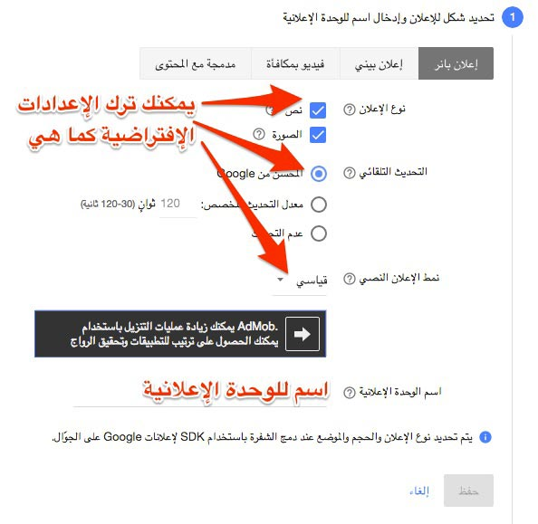
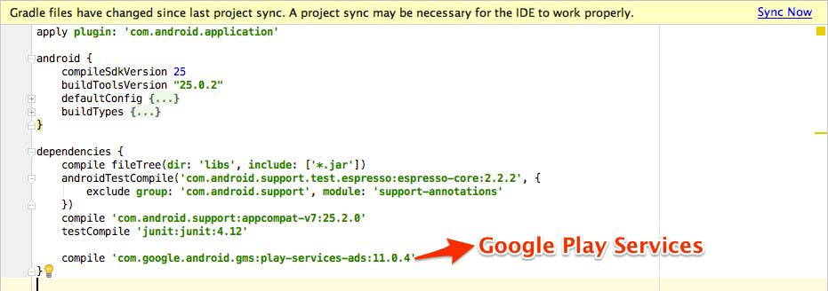

الإعلانات من أهم المصادر المدرة للدخل التي يعتمد عليها صانعو تطبيقات الهواتف المحمولة. ادموب Admob هي واحدة من أبرز الخدمات التي تقوم بعرض إعلانات في تطبيقك، ويمكن مقارنتها بخدمة غوغل آدسنس إلا أنها خاصة بالأجهزة المحمولة (Advertising on mobile).

في هذا الدرس سنقوم بإنشاء تطبيق بسيط يتكون من صفحة واحدة يتوسطها زر، عند الضغط على هذا الزر يظهر لنا إعلان من نوع **Interstitial** يملأ الشاشة بكاملها. وفي أسفل الشاشة سيكون هناك إعلان ثاني من نوع Banner.

## المتطلبات الأساسية

- أندرويد ستوديو (نسخة 1.0 أو أعلى).
- استهداف المستوى 14 أو أعلى من الواجهة البرمجية لأندرويد Android API Level.
- فتح حساب في موقع **Admob.com**.

## الخطوة الأولى : إنشاء الإعلانات في منصة ادموب

1. قم بستجيل دخولك لخدمة Admob.
2. انقر على التبويب Monetize (أو تحقيق الدخل).
3. قم **بإنشاء تطبيق داخل ادموب** مع اختيار المنصة التي تريد أن تنشر تطبيقك عليها، وهي في حالتنا **أندرويد**.
4. قم باختيار نوع الإعلان الذي تريد، هناك أربع خيارات متاحة ولكن ما يهمنا في هذا الدرس هما خياران فقط : الإعلان البيني **Interstitial** وإعلان البانر **Banner**. ولا تنسى إعطاء اسم واضح وذو دلالة للوحدة الإعلانية التي أنشأتها حتى يسهل عليك التعرف عليها فيما بعد.
5. بعد إنشاء **الوحدة الإعلانية** Ad Unit، ستلاحظ في الشاشة بأن **ادموب** قام بتوليد رمز خاص بهذه الوحدة يصطلح عليه ب **Ad unit ID،** ويشبه الرمز التالي : **ca-app-pub-3940256099942544/6300978111. **هذا الرمز هو الذي يتم استخدامه داخل تطبيق الأندرويد لاستدعاء الوحدة الإعلانية.

بهذه الخطوات الخمس يتم إنشاء العدد الذي تريد من الوحدات الإعلانية.

[](../images/create-admob-unit-ad.jpg)

لا تنسى أن تقوم بإنشاء وحدتين إعلانتين، واحد على شكل **إعلان بانر** والأخرى على شكل **إعلان بيني**.

## الخطوة الثانية : إنشاء المشروع في أندرويد ستوديو

الخطوة الثانية والمتعلقة بالنواحي البرمجية تبدأ بفتح برنامج أندرويد ستوديو وإنشاء مشروع جديد من خلال المسار **File -> New Project **فيالقائمة الرئيسية.

سيطلب منك البرنامج اختيار نوع ال Activity التي تريد أن تبدأ بها مشروعك، سنقوم نحن باختيار **Empty Activity** لهذا الدرس لأنها الأكثر بساطة وكما هو واضح من اسمها فهي فارغة ولا تحتوي على أي وظائف أخرى.


بعد الإختيار، سنقوم بالضغط على **Next** وننتظر قليلا حتى ينتهي أندرويد ستوديو من تهيئة المشروع فنقوم بفتح الملف **build.gradle** الموجود داخل المجلد **app **ونضيف له السطر التالي compile 'com.google.android.gms:play-services-ads:11.0.4' الذي يمكننا من استدعاء خدمات Google Services Ads للإتصال بمنصة Admob للإعلانات، ثم نقوم بالضغط على **Sync now**.

[](../images/android-studio-google-play-services.jpg)

ننتظر بضع ثواني حتى تنتهي **عملية المزامنة**، ثم ننتقل للخطوة الثالثة.

## الخطوة الثالثة: إعداد الملف AndroidManifest.xml

خدمات **Google Play Services Ads** تتطلب من التطبيق صلاحيات الوصول إلى الإنترنت **INTERNET** و **ACCESS_NETWORK_STATE** للإتصال بمنصة Admob. هذه الصلاحيات تضاف لملف AndroidManifest.xml على هذا النحو :

```xml
<?xml version="1.0" encoding="utf-8"?>

<manifest xmlns:android="http://schemas.android.com/apk/res/android"
    package="com.tutomena.admobproject">

 <!-- Internet Permissions -->
<uses-permission android:name="android.permission.INTERNET" />
<uses-permission android:name="android.permission.ACCESS_NETWORK_STATE" />

    <application
        android:allowBackup="true"
        android:icon="@mipmap/ic_launcher"
        android:label="@string/app_name"
        android:supportsRtl="true"
        android:theme="@style/AppTheme">
        <activity android:name=".MainActivity">
            <intent-filter>
                <action android:name="android.intent.action.MAIN" />

                <category android:name="android.intent.category.LAUNCHER" />
            </intent-filter>
        </activity>

    </application>

</manifest>
```

## الخطوة الرابعة: إظهار إعلان البانر

### إعداد ملف ال View الخاص ب MainActivity

سنقوم بفتح الملف `main_acitivity.xml` الموجود بداخل المجلد `app/src/main/res/layout`  ثم نضيف إليه المكون الخاص بإعلان البانر `com.google.android.gms.ads.AdView` :

```xml
<?xml version="1.0" encoding="utf-8"?>

<RelativeLayout xmlns:android="http://schemas.android.com/apk/res/android"
xmlns:tools="http://schemas.android.com/tools"
android:id="@+id/activity_main"
android:layout_width="match_parent"
android:layout_height="match_parent"
android:paddingBottom="@dimen/activity_vertical_margin"
android:paddingLeft="@dimen/activity_horizontal_margin"
android:paddingRight="@dimen/activity_horizontal_margin"
android:paddingTop="@dimen/activity_vertical_margin"
tools:context="com.tutomena.admobproject.MainActivity">

    <TextView
        android:layout_width="wrap_content"
        android:layout_height="wrap_content"
        android:text="Hello World!" />

    <com.google.android.gms.ads.AdView
        xmlns:ads="http://schemas.android.com/apk/res-auto"
        android:id="@+id/adView"
        android:layout_width="wrap_content"
        android:layout_height="wrap_content"
        android:layout_centerHorizontal="true"
        android:layout_alignParentBottom="true"
        ads:adSize="BANNER"
        ads:adUnitId="ca-app-pub-3940256099942544/6300978111">
    </com.google.android.gms.ads.AdView>

</RelativeLayout>
```

### تحرير ملف `MainActivity.java`

سنبدأ هذه المرحلة بفتح الملف `MainActivity.java` الموجود داخل المجلد `app/src/main/java` ثم نضيف إليه الكود البرمجي التالي داخل الدالة `onCreate`.

```java
MobileAds.initialize(this, "ca-app-pub-3940256099942544/6300978111");

mAdView = (AdView) findViewById(R.id.adView);
AdRequest adRequest = new AdRequest.Builder().build();
mAdView.loadAd(adRequest);
```

الدالة `MobileAds.initialize` تقوم بتهيئة ال SDK الخاص بإعلانات ادموب، وكما تلاحظون فإنها تقبل رمز الوحدة الإعلانية Ad unit IDكمعامل ثاني.

بعد ذلك نقوم بإضافة ثلاثة أسطر برمجية أخرى تتكفل بإظهار الوحدة الإعلانية داخل المكون `com.google.android.gms.ads.AdView` الذي أضفناه سابقا لملف `main_activity.xml`.

> رمز الوحدة الإعلانية `ca-app-pub-3940256099942544/6300978111` الذي استخدمناه في هذا الدرس تجريبي فقط، عليك تعويضه بالرمز الذي حصلت عليه من حسابك آدموب كما شرحنا ذلك في مرحلة سابقة من الدرس.

وهذا المحتوى الكامل لملف `MainActivity.java` :

```java
package com.tutomena.admobproject;

import android.support.v7.app.AppCompatActivity;
import android.os.Bundle;

import com.google.android.gms.ads.AdRequest;
import com.google.android.gms.ads.AdView;
import com.google.android.gms.ads.MobileAds;

public class MainActivity extends AppCompatActivity {

    private AdView mAdView;

    @Override
    protected void onCreate(Bundle savedInstanceState) {
        super.onCreate(savedInstanceState);
        setContentView(R.layout.activity_main);

        MobileAds.initialize(this, "ca-app-pub-3940256099942544/6300978111");

        mAdView = (AdView) findViewById(R.id.adView);
        AdRequest adRequest = new AdRequest.Builder().build();
        mAdView.loadAd(adRequest);
    }

}
```

الآن أصبح بإمكاننا تجربة التطبيق في هاتفنا أو من خلال محاكي Emulator أندرويد ستوديو، وإذا جرت الأمور كلها على ما يرام فمن المفترض أن تحصل على نتيجة مشابهة لما في هذه الصورة :

[](../images/android-admob-banner.jpg)

## الخطوة الخامسة : إظهار الإعلان البيني Interstitial

إظهار الإعلان البيني ليس أقل بساطة من إظهار إعلان البانر، كل ما علينا فعله هو إضافة زر لملف main_activity.xml وعند النقر عليه يظهر إعلان **Interstitial** ليملأ الشاشة.

```xml
<?xml version="1.0" encoding="utf-8"?>

<RelativeLayout xmlns:android="http://schemas.android.com/apk/res/android"
xmlns:tools="http://schemas.android.com/tools"
android:id="@+id/activity_main"
android:layout_width="match_parent"
android:layout_height="match_parent"
android:paddingBottom="@dimen/activity_vertical_margin"
android:paddingLeft="@dimen/activity_horizontal_margin"
android:paddingRight="@dimen/activity_horizontal_margin"
android:paddingTop="@dimen/activity_vertical_margin"
tools:context="com.tutomena.admobproject.MainActivity">

    <TextView
        android:layout_width="wrap_content"
        android:layout_height="wrap_content"
        android:text="Hello World!" />

    <Button
        android:id="@+id/show_interstitial_btn"
        android:layout_width="wrap_content"
        android:layout_height="wrap_content"
        android:text="إظهار الإعلان البيني"
        android:layout_centerHorizontal="true"
        android:layout_centerVertical="true"/>

    <com.google.android.gms.ads.AdView
        xmlns:ads="http://schemas.android.com/apk/res-auto"
        android:id="@+id/adView"
        android:layout_width="wrap_content"
        android:layout_height="wrap_content"
        android:layout_centerHorizontal="true"
        android:layout_alignParentBottom="true"
        ads:adSize="BANNER"
        ads:adUnitId="ca-app-pub-3940256099942544/6300978111">
    </com.google.android.gms.ads.AdView>

</RelativeLayout>
```

بعد ذلك سنعود لملف الجافا **MainActivitiy.java** ونضيف هذه الأسطر البرمجية داخل الدالة **onCreate** تحت الكود الذي أضفناه سابقا والخاص بإعلان البانر.

```java
mInterstitialAd = new InterstitialAd(this);
mInterstitialAd.setAdUnitId("ca-app-pub-3940256099942544/1033173712");
mInterstitialAd.loadAd(new AdRequest.Builder().build());

Button showInterstitialButton = (Button) findViewById(R.id.show_interstitial_btn);

showInterstitialButton.setOnClickListener(new View.OnClickListener() {
    @Override
    public void onClick(View v) {
        if (mInterstitialAd.isLoaded()) {
            mInterstitialAd.show();
        } else {
            Log.d("TAG", "The interstitial wasn't loaded yet.");
        }
    }
});
```

في السطر الأول قمنا بإنشاء إعلان بيني برمجيا عن طريق الكلاس **InterstitialAd** ثم مررنا له رمز الوحدة الإعلانية على شكل بارامتر عن طريق الدالة **setAdUnitId** ثم قلنا له، بواسطة الدالة **loadAd،** أن يهيئ نفسه للظهور في أي لحظة يطلب منه ذلك :)

بعد ذلك طلبنا من الزر (**showInterstitialButton**) أن يستمع لحدث النقر وعند حدوثه يقوم بعرض الإعلان البيني بعد التأكد من كونه مهيئ لذلك (isLoaded).

هذا يكفي لنحصل في النهاية على مرادنا، شاشة يتوسطها زر وعند الضغط عليه يظهر إعلان بيني تماما كما في هذه الصورة :

[](../images/android-admob-interstitial.jpg)

وهذه المحتويات النهائية لكل ملف على حدة :

#### ملف `AndroidManifest.xml`

```xml
<?xml version="1.0" encoding="utf-8"?>

<manifest xmlns:android="http://schemas.android.com/apk/res/android"
    package="com.tutomena.admobproject">

    <!-- Internet Permissions -->
    <uses-permission android:name="android.permission.INTERNET" />
    <uses-permission android:name="android.permission.ACCESS_NETWORK_STATE" />

    <application
        android:allowBackup="true"
        android:icon="@mipmap/ic_launcher"
        android:label="@string/app_name"
        android:supportsRtl="true"
        android:theme="@style/AppTheme">
        <activity android:name=".MainActivity">
            <intent-filter>
                <action android:name="android.intent.action.MAIN" />

                <category android:name="android.intent.category.LAUNCHER" />
            </intent-filter>
        </activity>

    </application>

</manifest>
```

#### ملف `MainActivity.java`

```java
package com.tutomena.admobproject;

import android.support.v7.app.AppCompatActivity;
import android.os.Bundle;
import android.util.Log;
import android.view.View;
import android.widget.Button;

import com.google.android.gms.ads.AdRequest;
import com.google.android.gms.ads.AdView;
import com.google.android.gms.ads.InterstitialAd;
import com.google.android.gms.ads.MobileAds;

public class MainActivity extends AppCompatActivity {

    private AdView mAdView;
    private InterstitialAd mInterstitialAd;

    @Override
    protected void onCreate(Bundle savedInstanceState) {
        super.onCreate(savedInstanceState);
        setContentView(R.layout.activity_main);

        MobileAds.initialize(this, "ca-app-pub-3940256099942544/6300978111");

        mAdView = (AdView) findViewById(R.id.adView);
        AdRequest adRequest = new AdRequest.Builder().build();
        mAdView.loadAd(adRequest);

        mInterstitialAd = new InterstitialAd(this);
        mInterstitialAd.setAdUnitId("ca-app-pub-3940256099942544/1033173712");
        mInterstitialAd.loadAd(new AdRequest.Builder().build());

        Button showInterstitialButton = (Button) findViewById(R.id.show_interstitial_btn);
        showInterstitialButton.setOnClickListener(new View.OnClickListener() {
            @Override
            public void onClick(View v) {
                if (mInterstitialAd.isLoaded()) {
                    mInterstitialAd.show();
                } else {
                    Log.d("TAG", "The interstitial wasn't loaded yet.");
                }
            }
        });
    }

}
```

#### ملف `main_activity.xml`

```xml
<?xml version="1.0" encoding="utf-8"?>

<RelativeLayout xmlns:android="http://schemas.android.com/apk/res/android"
xmlns:tools="http://schemas.android.com/tools"
android:id="@+id/activity_main"
android:layout_width="match_parent"
android:layout_height="match_parent"
android:paddingBottom="@dimen/activity_vertical_margin"
android:paddingLeft="@dimen/activity_horizontal_margin"
android:paddingRight="@dimen/activity_horizontal_margin"
android:paddingTop="@dimen/activity_vertical_margin"
tools:context="com.tutomena.admobproject.MainActivity">

    <TextView
        android:layout_width="wrap_content"
        android:layout_height="wrap_content"
        android:text="Hello World!" />

    <Button
        android:id="@+id/show_interstitial_btn"
        android:layout_width="wrap_content"
        android:layout_height="wrap_content"
        android:text="إظهار الإعلان البيني"
        android:layout_centerHorizontal="true"
        android:layout_centerVertical="true"/>

    <com.google.android.gms.ads.AdView
        xmlns:ads="http://schemas.android.com/apk/res-auto"
        android:id="@+id/adView"
        android:layout_width="wrap_content"
        android:layout_height="wrap_content"
        android:layout_centerHorizontal="true"
        android:layout_alignParentBottom="true"
        ads:adSize="BANNER"
        ads:adUnitId="ca-app-pub-3940256099942544/6300978111">
    </com.google.android.gms.ads.AdView>

</RelativeLayout>
```

## نهاية الدرس

هذه مجرد أمثلة بسيطة لكيفية التعامل مع إعلانات ادموب في تطبيقات أندرويد، المهم أن يتم عرض الإعلانات بكيفية لا تضر بتجربة المستخدم User Experience. يمكنكم زيارة الروابط أسفله للتعمق أكثر في كيفية العمل بال SDK الخاصة بإعلانات ادموب مع تطبيقات أندرويد.

- [https://developers.google.com/admob/android/interstitial](https://developers.google.com/admob/android/interstitial)
- [https://developers.google.com/admob/android/banner](https://developers.google.com/admob/android/banner)
