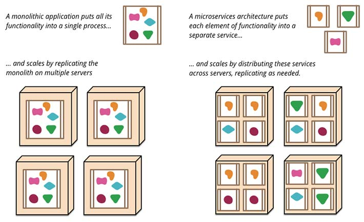

لا يخفى على أحد منكم أن لغة البرمجة جافاسكربت حققت قفزة هائلة في السنوات السبع الأخيرة، وتحديدا منذ ظهور بيئة **Node.js** التي بات من الممكن معها تشغيل أكواد الجافاسكريبت **خارج المتصفحات** كما جرت عليه العادة دائما.

في قمة Node.js لعام 2016، تحدث **أليكس غريغوريان**، وهو مدير هندسة البرمجيات في شركة **والمرت Walmart** الأكبر في العالم في مجال البيع بالتجزئة، أنه بعد ثلاثة أشهر سيتم معالجة 98% من ترافيك موقع **Walmart.com** بواسطة Node.js وستتم عملية العرض باستخدام مكتبة **React.js**.

<blockquote class="twitter-tweet" data-cards="hidden" data-lang="fr">
Feel so proud to <a href="https://twitter.com/hashtag/opensource?src=hash">#opensource</a> our <a href="https://twitter.com/hashtag/react?src=hash">#react</a> and <a href="https://twitter.com/hashtag/nodejs?src=hash">#nodejs</a> platform that powers <a href="https://t.co/KKXpgV6IAz">https://t.co/KKXpgV6IAz</a>. What a crazy ride. <a href="https://t.co/9LBatewC1n">https://t.co/9LBatewC1n</a>
— Alex Grigoryan (@lexgrigoryan) <a href="https://twitter.com/lexgrigoryan/status/782982368374108160">3 octobre 2016</a></blockquote>

وتابع أليكس أنه بعد أشهر قليلة سيصبح موقع [SamsClub.com](https://www.samsclub.com/)، المملوك لشركة والمرت أيضا، معتمدا بشكل كلي على الجافاسكربت سواء على مستوى الواجهة الأمامية أو الخلفية. وذهب **غريغوريان** أكثر من ذلك عندما أكد أنه حتى تطبيقات **أندرويد** و **iOS** الخاصة بموقع SamsClub.com سيتم تطويرها بواسطة **React Native**، وهي [كما شرحنا في موضوع سابق](https://www.tutomena.com/web-development/javascript/%d9%85%d9%82%d8%af%d9%85%d8%a9-%d8%b9%d9%86-react-native/) تقنية مبنية على جافاسكربت لتطوير تطبيقات موبايل أصلية.

## البداية كانت بسيطة

بدأت لغة البرمجة **JavaScript** صغيرة، ولم يكن يتعدى دورها القيام ببعض المهام البسيطة على متصفح نيتسكيب عام 1995. بعد ذلك ارتمت عليها معظم المتصفحات الأخرى وتم دمجها بداخلها فازدادت شهرتها وتطورت أكثر، ولكن دورها لم يتغير أبدا، فمجال نشاطها بقي حكرا على المتصفحات فقط.

## ظهور Node.js كان اللحظة الفارقة

في عام 2009، أبصر Node.js النور لأول مرة ومعه أصبحنا نستطيع رؤية جافاسكربت خارج سجنها المتمثل في المتصفحات. لقد بات بإمكان المطورين تشغيل جافاسكربت داخل الخوادم تماما كما كانوا يفعلون دائما مع لغات أخرى عريقة مثل PHP، بايثون، روبي وغيرها. هذه كانت قفزة نوعية في تاريخ الجافاسكربت بكل ما تحمل الكلمة من معنى.

[caption id="attachment_2353" align="aligncenter" width="710"] شركات عملاقة تستخدم Node.js\

## استعمالات متعددة للجافاسكربت

إلى جانب استخداماتها في الخوادم والمتصفحات، يتم الإستعانة اليوم بلغة البرمجة جافاسكربت في العديد من النواحي والمجالات، من أبرزها :

### برمجة تطبيقات الموبايل

ظهرت عدد من التقنيات في الأعوام الأخيرة لبرمجة تطبيقات لموبايل باستخدام الجافاسكربت، كان أولها **كوردوفا** (فون غاب سابقا) الذي يمكن من صناعة تطبيقات هجينة باستخدام تقنيات ولغات الويب المعروفة.

بعد ذلك ظهرت تقنيات أكثر تطورا تمكن المطورين من برمجة تطبيقات أصلية Native بلغة الجافاسكربت ولعل أكثرها شهرة إطار العمل React Native التابع لشركة فيسبوك والذي نال ثقة عدد من كبريات الشركات والمنظمات مثل **فيسبوك** نفسها، **انستاغرام**، **بلومبرغ**، **Airbnb** إلخ...

هناك كذلك تقنية **NativeScript** المشابهة ل React Native إلا أنها تابعة لشركة صغيرة تسمى Telerik وتعتمد على إطار العمل **Angular** عوض React.js.

### تطبيقات سطح المكتب

إلى جانب كون لغة البرمجة جافاسكربت تمكن المطورين من برمجة تطبيقات الموبايل عن طريق التقنيات والأدوات التي ذكرنا آنفا، فإنها كذلك تمكنهم من تطوير **تطبيقات سطح المكتب** Desktop Applications عن طريق تقنيات أشهرها على الإطلاق إطار العمل **إلكترون** **Electron** الذي استعانت به شركات معروفة مثل **Slack**، **ووردبريس.كوم** وكذلك شركة **مايكروسوفت** العملاقة التي استعانت به لتطوير محررها الشهير Visual Studio Code.

### انترنت الأشياء والروبوتات

أنا لا أتحدث عن الروبوتات البرمجية هنا، بل عن الروبوتات الإلكترونية الحقيقية! الأمر أشبه بالخيال ولكنه ليس بخيال، يمكن استخدام الجافاسكريبت لبرمجة **الهاردوير Hardware** والتحكم فيه.

هناك عدة مكتبات ومشاريع في هذا الصدد ظهرت في المدة الأخيرة ومن أبرزها : [Johnny-Five](http://johnny-five.io/) و [Tessel](https://tessel.io/).

## لماذا كل هذا الإقبال على جافاسكربت

هذه الحقائق كلها تقودنا لسؤال مهم قد يسأله كل واحد منا : لماذا كل هذا الإقبال على لغة الجافاسكربت ؟ لماذا اختارت كبريات الشركات الإعتماد بشكل شبه كلي على هذه اللغة لتطوير مشاريعها البرمجية ؟

سأحاول الإجابة على هذا السؤال من خلال عدد من النقاط والمعايير :

### 1- توحيد وتركيز الجهود على لغة برمجية واحدة

لا يجد مطورو الواجهات الأمامية لتطبيقات الويب صعوبة كبيرة للإنتقال لبرمجة تطبيقات الموبايل عن طريق الجافاسكربت بواسطة التقنيات التي سبق لنا ذكرها أعلاه، ففي النهاية هم يتعاملون مع أكواد الجافاسكربت ولن يضطروا لتعلم لغات برمجة جديدة للوصول لنفس الهدف.

هذا بالضبط أحد الأسباب التي تدفع عدد من الشركات والمنظمات للإستثمار في خبراء الجافاسكربت الذين يعملون لحسابها عوض البحث عن خبراء جدد في تقنيات ولغات برمجة جديدة.

تركيز الجهود والخبرات في عدد محدود من التقنيات واللغات قد يعطي نتائج أفضل ويوفر على الشركة مصاريف إضافية في توظيف وتكوين خبراء وموظفين جدد.

### 2- Node.js متوافق بشكل رائع مع طريقة Microservices

[البرمجة والتطوير بطريقة **MicroServices**](https://www.manshar.com/articles/%D8%A8%D9%86%D8%A7%D8%A1-%D8%A7%D9%84%D9%85%D9%88%D8%A7%D9%82%D8%B9-%D8%A8%D8%B7%D8%B1%D9%8A%D9%82%D8%A9-microservices=2y4bbOaxfqRmBMsQxbS5Jg/read/) يعني تقسيم البرنامج (موقع والمرت مثلا :) ) لمجموعة من الوحدات الوظيفية القابلة للتطوير Scalable والنشر Deploy بشكل مستقل.

هذه الوحدات مثل قطع الغيار المكونة لمحرك السيارة، تتكامل فيما بينها ليعمل المحرك في الأخير بكفاءة عالية. وعند وجود عيب أو مشكل في إحدى القطع فيمكن إصلاحها أو تغييرها **دون المساس بباقي مكونات المحرك** وهذا هو جوهر العمل بطريقة MicroServices.

[caption id="attachment_2352" align="aligncenter" width="710"] البرمجة بطريقة Microservices\

بيئة **Node.js** متوافقة بشكل ممتاز مع هذه الطريقة وتضع بين أيدي المطورين مجموعة من الأدوات والآليات الكفيلة بجعل العمل أكثر سلاسة وانسيابية، وكل هذا يتم بالسرعة الكبيرة المعروفة عن Node.js مع الحفاظ على مستوى معقول من استهلاك موارد الخادم.

### 3- Node.js تتحسن باستمرار

تستفيد بيئة Node.js من التحسينات والتطويرات التي تطرأ بشكل مستمر على لغة البرمجة جافاسكربت، آخرها كان الإصدار الجديد **ES6** الذي جعل عالم الجافاسكربت أكثر حداثة وقوة. هذا دون إغفال العمل الجبار الذي تقوم به مؤسسة Node في سبيل تطوير مشروعها واستفادتها من عدد هائل من المكتبات التي يزخر بها [مستودع Node الرسمي **NPM**](https://www.npmjs.com/) بفضل ثقافة المشاركة والمصادر المفتوحة المنتشرة في أوساط الجافاسكربت.

### 4- الكفاءة والسرعة

تشتهر بيئة Node.js باعتمادها على آلية **non-blocking I/O** ما يجعلها ليس فقط سهلة على المطورين ولكن أيضا سريعة في أداء المهام المتعددة والمعقدة مقارنة بلغات برمجة أخرى.

السبب الآخر في سرعة Node.js المهولة هو **محرك V8** الذي طورته شركة غوغل عام 2008 خصيصا لمتصفحها الشهير **غوغل كروم** والذي نقل الجافسكربت لآفاق جديدة ما جعل مؤسسي Node.js يختارونه ليكون نواة مشروعهم الواعد.

شركة **لينكد إن**، [حولت خوادم الموبايل عندها للإعتماد على Node.js عوض Rails فكانت نتائج ذلك مدهشة](http://highscalability.com/blog/2012/10/4/linkedin-moved-from-rails-to-node-27-servers-cut-and-up-to-2.html)، حيث نجحت في خفض أعداد الخوادم من 30 إلى 3 فقط، وزيادة في الكفاءة والسرعة بعشرين ضعفا في بعض الحالات.

## نهاية المقال

قبل عام تقريبا استحوذت شركة سامسونغ على شركة **Joyent،** واحد من أهم المساهمين في مشروع **Node.js،**في صفقة  تخطت المليار دولار، هذا ربما يدفعنا للتفاؤل بمستقبل مشرق لمشروع **ريان دال**. فبعدما سيطرت لغة البرمجة جافاسكربت على عالم المتصفحات والواجهات الأمامية، هاهي ترسم خطواتها الأولى في رحلة السيطرة على الخوادم وصناعة تطبيقات الموبايل. التحدي سيكون أصعب في هذه المرحلة الجديدة بكل تأكيد، فالمنافسة شرسة بين عدد كبير من اللاعبين الكبار أمثال PHP، بايثون و Rails. ميزة Node.js أنه لا يزال يمتلك هامشا كبيرا للتحسن والتطور نظرا لفتوته مقارنة بالمنافسين وهذا ما يجعلني أتابع باهتمام كبير مستقبل هذا المارد والبقاء مستعدا للتغييرات التي قد تطرأ على السوق في قادم السنين.
