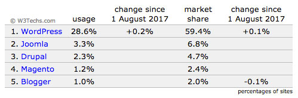
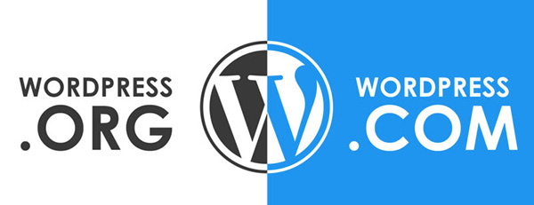

تحدثنا سابقا وفي مناسبات عديدة عن ووردبريس باعتباره **نظام إدارة المحتوى** الأشهر والأكثر استخداما. وقدمنا لكم كذلك في مقال سابق [بعض الأسباب التي تجعلكم تختارون ووردبريس لبناء مواقعكم](https://www.tutomena.com/web-development/%d9%84%d9%85%d8%a7%d8%b0%d8%a7-%d9%88%d9%88%d8%b1%d8%af%d8%a8%d8%b1%d9%8a%d8%b3/) على الإنترنت كيفما كان نوعها.

أما في هذا المقال فلن نخوض كثيرا في الأمور التقنية والبرمجية، وإنما سنسرد لكم عددا من المعلومات المهمة التي ربما يود كل مطور أو مستخدم لووردبريس معرفتها من أجل تنمية مداركه وثقافته العامة حول الموضوع.

## 1- اختيار اسم ووردبريس

**كريستين شيليك تريموليه**، مدونة معروفة وأحد أصدقاء **مات مولنويغ**، مؤسس وودبريس، قامت باقتراح اسم WordPress.

## 2- ووردبريس يدعم أزيد من ربع عدد المواقع على الإنترنت

حسب استطلاعات موقع **W3Techs.com** المختص، فإن ووردبريس يدعم زهاء 28% من مجموع المواقع على شبكة الإنترنت، ويستحوذ على حصة 60% من سوق أنظمة إدارة المحتوى.

## 3- ووردبريس مفتوح المصدر ومجاني

يتم توزيع وودبريس تحت رخصة **جنو العمومية** GNU GPL، ويحق لأي شخص أن يقوم بتحميله بالمجان. الشفرة المصدرية مفتوحة ومتاحة للجميع للإطلاع عليها والتعديل عليها دون قيود أو شروط.

## 4- ووردبريس ليس مملوكا لأي شركة

من أجل ضمان بقاء وودبريس برنامجا حرا ومفتوح المصدر قام **Matt Mullenweg** بتأسيس كيان يسمى WordPress Foundation. مهمة هذه المؤسسة الغير ربحية، التي تمتلك العلامة التجارية لووردبريس، هو الحفاظ على الحريات الممنوحة من طرف البرنامج تحت رخصة **GNU GPL**.

## 5- مليار ونصف، عدد تحميلات الإضافات

في عام 2016، تم تحميل إضافات ووردبريس من المستودع الرسمي أكثر من **1.48 مليار** مرة، ما يمثل زيادة بحوالي 50% مقارنة بالعام الذي قبله.

## 6- أزيد من 50 ألف إضافة مجانية

يزخر مستودع وودبريس للإضافات بأزيد من 50 ألف إضافة مجانية. هذه الإضافات تمكن من إضافة خصائص جديدة لمواقع ووردبريس بدءً من إضافة [فورم للمراسلة](https://www.tutomena.com/web-development/tools/wordpress-contact-form-7/) وليس انتهاءً بإنشاء متجر إلكتروني على طريقة ماجنتو وإخوانه.

## 7- ووردبريس متاح بأزيد من 68 لغة

تمت ترجمة ووردبريس بصفة كاملة لأزيد من 68 لغة، من بينها اللغة العربية. بينما شملت الترجمة الجزئية عددا آخر من اللغات الأقل استخداما، كما أن عددا كبيرا من الإضافات والقوالب متاح بلغات مختلفة.

هذا ويمكن إنشاء مواقع متعددة اللغات بواسطة ووردبريس باستخدام عدد من الإضافات الممتازة ولعل أشهرها إضافتي **WPML** و **Polylang**.

## 8- تم عقد مؤتمرات ووردبريس في أزيد من 40 بلدا

تعرف أحداث ومؤتمرات ووردبريس بوورد كامب **WordCamp.** في عام 2016، تم انعقاد 116 مؤتمرا لووردبريس في 41 بلدا، وللأسف لا يوجد من بينها أي بلد عربي  :(

## 9- ووردبريس مطور بواسطة PHP و MySql

تمت برمجة نظام إدارة المحتوى ووردبريس بواسطة لغة البرمجة **PHP** ويتم استخدام نظام **MySQL** لإدارة قاعدة البيانات.

## 10- الجافاسكربت تمثل 20% من الشفرة المصدرية

تمثل لغة البرمجة **جافاسكربت** 20% من الشفرة المصدرية لووردبريس، ومن المنتظر أن تزيد هذه النسبة في السنوات القادمة نظرا للإعتماد المتزايد على هذه اللغة في تطبيقات الويب.

## 11- ووردبريس وموسيقى الجاز Jazz

معظم إصدارات الووردبريس يكون اسمها الرمزي هو اسم عازف جاز معروف، ابتداء من الإصدار رقم 1.0 الذي أطلق عليه اسم  **مايلز ديفيس**.

## 12- Wordpress.org ليس WordPress.com

يمكن تحميل برنامج ووردبريس المجاني والمفتوح المصدر من موقع [wordpress.org](https://wordpress.org/)، وبعد ذلك سيكون عليك البحث عن مكان لاستضافة السكريبت.

أما [wordpress.com](https://wordpress.com/) فهي شركة تجارية تابعة للشركة الأم **أتوماتيك** Automattic، التي أسسها **Matt Mullenweg** نفسه، وتقدم خدمات لاستضافة مدونتك على خوادم الشركة، تماما كما هو الحال عند خدمة بلوغر لغوغل، إلا أن wordpress.com تعتمد على سكربت ووردبريس.

يمكنك الإطلاع على مقال [ما هو الفرق بين wordpress.org و wordpress.com](https://saidelbakkali.com/diferences-between-wordpress-org-and-wordpress-com/) من مدونة سعيد البقالي للمزيد من التفاصيل.

## 13- ووردبريس تجارة رائجة تقدر بملايير الدولارات

عدد كبير جدا من المدونات والمشاريع على الإنترنت تعتمد على برنامج ووردبريس وتحقق بفضله عائدات بملايين الدولارات، والمطورون كذلك يستغلون مهاراتهم في ووردبريس لتحقيق مداخيل مهمة تغنيهم عن الجري وراء البحث عن وظيفة.

فمثلا تم بيع [قالب أفادا Avada](https://themeforest.net/item/avada-responsive-multipurpose-theme/2833226?ref=aissaino) على متجر **ثيم فوريست** أزيد من 350.000 مرة، وإذا علمنا أن ثمن القالب على المتجر يساوي 60 دولارا فسيمكننا حساب عائدات هذا القالب بضرب 350.000 في 60 ونقسم الناتج على 2 (على اعتبار أن ثيم فوريست يأخد 50% من قيمة المبيعة وهذه النسبة قابلة للزيادة ل 70% ) فنحصل على حوالي 10 ملايين دولار! نعم 10 ملايين دولار **على الأقل** ومن قالب واحد حصل عليها الفريق المطور والذي يقوده شاب باكستاني بسيط عرف كيف يستغل قيمة وإمكانيات ووردبريس لتحقيق ثروة لا يحققها إلا قلة من الناس.

---

أتمنى، صديقي المطور، أن تعجبك هذه المعلومات البسيطة عن نظام إدارة المحتوى **ووردبريس** وأن تحفزك للإجتهاد في العمل وتعلم خبايا هذا البرنامج وسبر أغواره.

سأكون مسرورا جدا لسماع تجربتك، أخي المتابع، مع ووردبريس سواء كمدون أو مطور، فكل تعليق منك يمثل دفعة لنا للسير نحو الأمام وتقديم المزيد.
