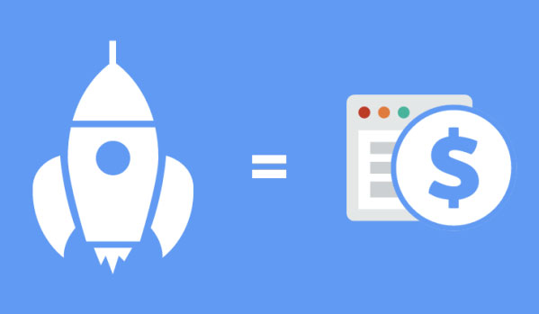
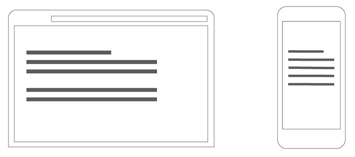

تخطى زوار [المواقع الإلكترونية](https://www.tutomena.com/web-development/%d9%84%d9%85%d8%a7%d8%b0%d8%a7-%d9%88%d9%88%d8%b1%d8%af%d8%a8%d8%b1%d9%8a%d8%b3/) من الموبايل نسبة 50 في المئة، وأضحى الباحثون من الموبايل على جوجل الأغلبية في الوقت الحالي حيث تجاوزت نسبة عمليات البحث من الهواتف الذكية والحواسيب اللوحية 57% كما أكد تقرير BrightEdge.

وحتى فيس بوك الذي يستخدمه أصحاب المواقع الإلكترونية للترويج للمحتويات التي ينشرونها بما فيها روابط المقالات والأخبار والمنتجات والخدمات يتواجد عليه غالبا المستخدمين من تطبيقات الموبايل حيث لديه أكثر من 2.01 مليار مستخدم [منهم حوالي 1.8 مليار مستخدم من الموبايل](https://thenextweb.com/facebook/2016/01/27/90-of-facebooks-daily-and-monthly-active-users-access-it-via-mobile/#.tnw_Yooey0Dg). [bctt tweet="90% من مستخدمي فيسبوك النشيطين يومياً يتصفحونه من خلال الأجهزة المحمولة" username="tutomena" prompt="غرد على تويتر"]

هذا يعني لامحالة أن أغلبية الزيارات التي يستقبلها موقعك تذهب إلى نسخة الموبايل، فهل تحققت من أن هذه النسخة مثالية للتصفح؟ هل صادفت أخطاء؟ تجربة استخدام سيئة؟ بطء في تحميل الصفحات أكثر من مواقع أخرى؟ ظهور بعض العناصر والمحتويات التي لا تهم المتصفحين عبر الموبايل؟

أعتقد أن توجه تغير ميزان التصفح على الإنترنت لصالح الموبايل سبب كاف جدا لتهتم بنسخة الموبايل، ولتعمل على تطويرها وتحسينها بالدرجة الأولى.

مخطئ تماما إذا كنت تختار القالب الذي ستعينه لموقعك على أساس توافقه مع متصفحات سطح المكتب، تعاينه كثيرا وتضع التوجيهات والملاحظات على أساس تفضيلاتك لكيف سيكون موقعك، وتكتفي فقط بالقول أنه يجب أن يكون متوافقا ومتجاوبا مع مختلف أحجام الشاشات بما فيها شاشات الهواتف الذكية والحواسيب اللوحية.

يجب أن يكون هناك توازن عند تصميم الموقع، يجب معاينة نسخة الموبايل ووضع الملاحظات الخاصة بها والعمل على تطويرها وجعلها مثالية كما هو الحال بالنسبة لنسخة متصفحات سطح المكتب.

وفي هذا المقال سنتوقف عند العديد من النصائح التي يجب أخذها بعين الإعتبار عند العمل على تصميم موقعك الإلكتروني على الموبايل.

## سرعة تحميل محتويات الصفحات مهم جدا

أغلب الهواتف الذكية المنتشرة في العالم هي هواتف متوسطة ومنخفضة التكلفة، وهي لديها في الأساس قدرات محدودة في تحميل المحتوى على المتصفحات ولا تقدم نفس السرعة التي نراها للمتصفحات على سطح المكتب أو في الهواتف الرائدة.

من جهة أخرى فإن الكثير من المتصلين بالإنترنت عبر الموبايل يستخدمون الباقات المحدودة، وجودة الإنترنت ليست جيدة لتوفر لهم الولوج إلى المواقع البطيئة.

لذا يجب العمل على جعل نسخة الموبايل من موقعك الإلكتروني خفيفة حيث لا تكون كبيرة الحجم، وذلك بضغط الصور والصفحاتوملفات الموقع نفسه، هذا يضمن تحميلا أسرع وفي أقل وقت ممكن حتى لمن يواجهون بطء إتصال الإنترنت لديهم.

وتكمن أهمية جعل الموقع سريعا في استقطاب المزيد من الزيارات وتفضيل الباحثين على جوجل لموقعك الذي يبدو أسرع في تحميل صفحاته على أجهزتهم، إضافة إلى أن عناكب محركات البحث وفي مقدمتها جوجل أصبحت في الآونة الأخيرة تعمل على أرشفة المواقع من خلال زيارات صفحات المواقع عبر نسخة الموبايل وهو ما يدعى mobile-first index.

## صفحات تتضمن العناصر الضرورية فقط

ما يعيب القوالب الحالية أنها للأسف تظهر القوالب الجانبية الغير الضرورية في نسخة المحمول ولا توفر لك إمكانية التحكم في ظهورها على الموبايل أو تعطيل ذلك.

فمثلا القائمة الجانبية بموقع إخباري على نسخة المكتب تتضمن العديد من العناصر ومنها آخر الأخبار، أحدث مقالات الرأي، أهم الأخبار السياسية، الطقس اليوم، تحويل العملات.

ظهور هذه الإضافات كلها جيد بالتأكيد على نسخة المكتب ما دامت هناك مساحة في القائمة الجانبية، لكن على نسخة المحمول ستظهر كل هذه الإضافات غالبا أسفل التعليقات في أسفل الصفحات وستجعل طول الصفحة كبيرة جدا!

في هذا الصدد من الجيد حذف أهم الأخبار السياسية، الطقس اليوم، تحويل العملات والإبقاء على آخر الأخبار، أحدث [مقالات](https://www.tutomena.com/blog/write-credible-content/) الرأي ما يقلل من حجم صفحة الموقع على الموبايل ويجعل تصفحها أفضل.

## حجم الكتابة والأزرار مهم جدا

نجحت 99 في المئة من القوالب الجديدة في أن تكون متجاوبة ومتوافقة مع مختلف أحجام الشاشات، وهي تعمل بكفاءة على الحواسيب اللوحية والهواتف الذكية.

لكن هناك نسبة جيدة منها سيء على مستوى تغيير حجم النص ليناسب مختلف أحجام الشاشات، وهو ما يجعل قراءة المقالات والأخبار والمحتوى على العديد من المواقع من خلال الهواتف الذكية متعبا للغاية.

بعض المستخدمين يلجؤون إلى تكبير النصوص من خلال متصفح الموبايل، وحتى تغيير وضع الهاتف للحصول على تجربة قراءة افضل، وهذه المشكلة يجب أن لا تكون واردة في الأصل.

حتى الأزرار التي تخفي القوائم والمميزات في نسخة الموبايل رغم أنها مفيدة وتقلص من حجم الصفحات إلا أنها يمكن أن تكون نقمة في حالة كانت لا تستجيب لضغط اصابع المستخدمين أو كان حجمها صغيرا للغاية وتحتاج إلى تكبيرها أولا قبل الضغط عليها لتستجيب.

إذن يجب أن تأخد بعين الاعتبار أن تكون النصوص والأزرار في موقعك متجاوبة مع مختلف أحجام الشاشات وليس فقط التصميم العام.

## الإعلانات مقبولة لكن بشكل احترافي

من الأكيد أن الإعلانات هي أوكسجين الإنترنت وبالنسبة للمواقع الإخبارية والمحتوى عامة هي مصدر الربح الأساسي بالنسبة لأصحابها، ومن عائداتها ينفقون المال على صيانتها وتطويرها والاستثمار في إنتاج المحتوى.

وبالطبع مع تزايد المتصفحين من الموبايل توجهت الشركات الإعلانية التي تقدم حلولا للناشرين وتمكنهم من عرض الإعلانات إلى ابتكار أنواع مختلفة من الدعايات والوحدات الإعلانية منها في الواقع وحدات إعلانية مزعجة تسيء إلى تجربة التصفح مقابل بضعة سنتات إلى دولارات!

من هذه الإعلانات نجد تلك التي تظهر على شكل رسالة عادة ما يكون من الصعب على أغلب الزوار التعامل معها، وقد تدفعهم إلى الضغط على زر الرجوع للخلف للعودة إلى نتائج البحث.

ربما بعض هذه النوعيات من الإعلانات يأتي مع زر الإغلاق بشكل واضح، لكن تجربة التصفح تتأثر سلبا ولو بنسبة بسيطة.

يجب أن تدرك جيدا أن تجربة تصفح موقعك هو رأس مالك ولا يقل أهمية عن المحتوى، فإن كان جيدا تصفح الزوار للمقال سيتوجهون إلى المزيد من المقالات وظلوا يتصفحون موقعك لفترة ليست بالقصيرة، وبالطبع سيتفاعلون مع الإعلانات وستكسبهم متابعين أوفياء ومعلقين على المحتويات التي تنشرها وعملاء إن كنت تروج لمنتجات وخدمات.

## الخلاصة

أعتقد أنه لضمان تزايد زوار موقعك وبالتالي زيادة العائدات من الإعلانات ومبيعات المنتجات والخدمات، لا يلزم فقط تطوير المحتوى وتحديثه باستمرار لكن بناء نسخة [موبايل](https://www.tutomena.com/web-development/javascript/introduction-to-ionic2/) من موقعك تعتمد الأسس الأربعة أركانا لها أصبح ضروريا وإلا فإن الأخطاء والمشكلات بتجربة التصفح ستكون دائما عائقا كبيرا أمام جهود إنتاج المحتوى وتطوير الخدمات.
