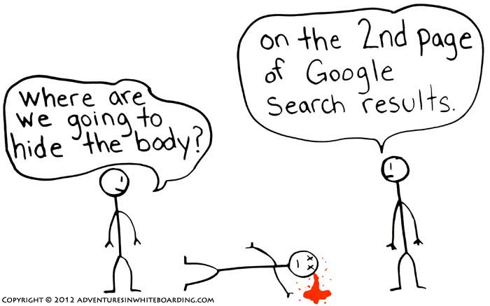

من المعلوم أن تصدر نتائج محركات البحث هي الطريقة الوحيدة للحصول على زيارات من جوجل و بينج وبقية المنصات المنافسة.

معظم الباحثين اليوم يتطرقون إلى نتائج البحث التي تظهر في الرئيسية، بينما الصفحة الثانية وبقية الصفحات الأخرى شبه ميتة.

بالطبع تهيئة الموقع وجعله متوافقا مع محركات البحث مع تقديم تجربة تصفح جيدة هي السر وراء اشتغال الأرشفة والظهور في مراتب متقدمة بنتائج البحث وهذا ما يدعى **سيو SEO**.

محرك البحث جوجل عمل منذ سنوات طويلة على تطوير خوارزميات ذكية لا تهدف فقط للوصول إلى صفحات المواقع وعرضها على نتائج البحث بل ترتيبها بشكل عادل ومنطقي.

قد تكتب محتوى جيد وقوي ورغم ذلك تفشل في تصدر نتائج البحث عن الكلمات المفتاحية التي تتنافس عليها، وتتساءل عن المعايير الأكثر أهمية لمحرك البحث جوجل ؟ هذا ما سنتطرق إليه في هذا المقال وسنتعمد فيه على نتائج استجواب موقع [JOURNAL DU NET](http://www.journaldunet.com/solutions/seo-referencement/1195455-seo-les-criteres-les-plus-importants-selon-140-referenceurs/) لعدد من خبراء السيو الفرنسيين.

## ترتيب المعايير الأكثر أهمية لترتيب نتائج بحث جوجل

في القائمة التالية سنعرض لكم كافة المعايير الأكثر اهمية والتي ينصح خبراء التسويق عبر محركات البحث بالاعتناء بها في المقام الأول وعددها 29 معيارا.

1. عدد الروابط "الباك لينكس"من المواقع الموثوقة اتجاه صفحة الموقع أو صفحة المقال.
2. الكلمات الرئيسية الملائمة في العنوان حيث من الجيد أن تتواجد الكلمة المفتاحية في عنوان الصفحة.
3. محتوى المنطقة المركزية للصفحة ذو صلة: فهو يعطي استجابة جيدة لطلب البحث.
4. عدد الروابط الخلفية "**الباك لينكس**" من المواقع المنافسة والعاملة في نفس المجال.
5. عدد الروابط الإجمالية التي تشير للصفحة نفسها.
6. الكلمات الرئيسية ذات الصلة في H1.
7. تحديث المحتوى وإضافة معلومات جديدة حول الموضوع الذي تدور حوله الصفحة.
8. تجاوب الموقع مع الموبايل حسب [أداة جوجل الخاصة بفحص توافق المواقع مع الهواتف](https://search.google.com/test/mobile-friendly).
9. سرعة تحميل صفحات الموقع على متصفحات الموبايل "اللوحيات والهواتف الذكية".
10. وجود علامة H1 في الصفحة.
11. عدد الروابط "الباك لينكس" إلى الموقع بشكل عام.
12. أقدمية الموقع ما يعني أنه كلما ازداد عمره حاز على ثقة محركات البحث.
13. المفردات المستخدمة في المحتوى متنوعة ومستدامة وخالية من الأخطاء الإملائية.
14. تنوع في أسماء نطاقات المواقع التي تمت فيها الإشارة إلى صفحات موقعك.
15. سرعة تحميل صفحات الموقع على متصفحات الحواسيب.
16. تواجد محتوى غني بالصور ومقاطع الفيديو والروابط الداخلية والاقتباسات ... الخ.
17. معدل النقر على روابط صفحات موقعك في نتائج بحث جوجل يجب أن تكون أعلى من المتوسط.
18. الكلمات الرئيسية ذات الصلة في وسوم H2.
19. وجود بيانات منظمة structured data (من schema.org) على الصفحة.
20. وجود علامة (أو علامات) H2 في الصفحة.
21. وجود الكلمات المفتاحية في بنية روابط صفحات الموقع.
22. وجود روابط داخلية في الصفحة تشير إلى مواقع أخرى موثوقة وذات مصداقية.
23. تفعيل الاتصال الآمن HTTPS وهذا ضروري للمتاجر والمنتديات ومواقع الخدمات وادخال البيانات.
24. الكلمات الرئيسية ذات الصلة في اسم النطاق.
25. روابط على الشبكات الإجتماعية تشير إلى صفحات الموقع سواء من فيس بوك أو تغريدات تويتر أو غيرهما.
26. الكلمات الرئيسية الملائمة في وصف الميتا للمقالات والصفحات.
27. حصة كبيرة من الروابط الخارجية إلى موقعك يجب ان تكون dofollow (عدد قليل جدا من الروابط nofollow).
28. تواجد مساحة الكاتب author أسفل المقالات.

كما يتبين لنا من السابق فإن الروابط الخارجية لا تزال مهمة للغاية ويجب أن تحصل عليها ليس من خلال طرق سيئة أو بالتركيز على الكم بل على الجودة بالدرجة الأولى، عندما تقدم محتوى جيد فمن الطبيعي أن يتم الاشارة إلى صفحات المقالات أو صفحات موقعك في المنتديات، في المواقع الإخبارية، على الصفحات الإجتماعية، وحتى في الموسوعات.

في المقابل فإن الانتقال إلى الاتصال الآمن HTTPS لن يعود على موقعك بنقلة نوعية على مستوى ترتيبه في نتائج البحث، لكن هذا أصبح ضروريا خصوصا للخدمات التجارية والبنوك الإلكترونية والمنتديات التي يأتي المستخدم ليسجل دخوله إليها ويقوم بمعاملات تحتاج إلى المزيد من الأمان عليها.

وبالطبع فقد لاحظت ان سرعة تحميل موقعك على متصفحات المحمول أكثر أهمية من سرعة تحميله على متصفحات المكتب، هذا لأن الباحثين من الموبايل هم الأغلبية وننصحك بقراءة "[4 أسس لبناء موقع إلكتروني مثالي على الموبايل](https://www.tutomena.com/blog/basics-for-perfect-website-on-mobile/)".

## أهم الأخطاء التي تؤدي إلى معاقبة المواقع على جوجل في نظر المسوقين المحترفين

في المقابل فإن هناك العديد من الأخطاء التي من شأنها أن تدمر مواقع الويب على نتائج بحث جوجل وهذا حسب خبراء تهيئة المواقع لمحركات البحث وعددها 16 وهي كالتالي:

1. انقطاع الموقع بسبب الاستضافة أو عملية اختراق.
2. المحتوى المقدم لمحركات البحث يختلف تماما عن المحتوى الذي يظهره الموقع للزوار الأفراد.
3. أغلب المحتوى مكرر ويتم نسخه من مواقع أخرى.
4. الروابط الخارجية من المدونات والمواقع والمنتديات المشكوك في مصداقيتها بكميات كبيرة.
5. محتوى غير كافي أو يفتقد للجوهر.
6. اعلانات تخفي المحتوى الرئيسي أو تشوش على الزائر بظهورها أكثر من المحتوى نفسه.
7. وقت تحميل صفحات الموقع طويل جدا.
8. معظم المحتوى مكرر بين صفحات الموقع الواحد، حيث تجد أن الصفحة "أ" بها نفس محتوى الصفحة "ب" وهذا بعنوان مختلف مثلا!
9. الزوار يرجعون إلى نتائج البحث سريعا وفشل صفحات الموقع في تقديم أي اجابات لهم.
10. معدل العودة إلى نتائج بحث جوجل مرتفع جدا بسبب جودة الموقع السيئة.
11. حجم الصفحة كبير ما يعيق تحميلها بسرعة.
12. نسبة كبيرة من الباك لينكس هو من مواقع لا علاقة لها بموضوع الموقع أو مجاله.
13. ارتفاع معدل الارتداد.
14. تستخدم الكلمات الرئيسية بشكل مفرط في المحتوى.
15. روابط خارجية "الباك لينكس" غير طبيعية أو تم شراؤها.

يمكن أن نضيف إلى ما سبق أن عدم تجاوب صفحات الموقع مع الموبايل عادة ما يؤدي إلى قيام جوجل باستبعادها من نتائج البحث لمستخدمي الهواتف الذكية والحواسيب اللوحية.

هذه المعايير جاءت بناءً على تجارب الخبراء الذين تم استجوابهم وليس بناء على ما يقرؤونه أو يسمعونه.

نتائج هذا المسح تعكس رؤية عامة لعدد كبير من المسوقين المحترفين (حوالي 140 خبير) وليس بالضرورة رؤية غوغل الكاملة، وقد يختلف عدد منهم على أهمية معيار أو مجموعة من هذه المعايير في الدفع بموقعك لتصدر نتائج البحث على موقع غوغل وإخوانه.
