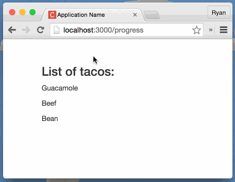

**React.js** ليس إطار عمل بالمعنى الصحيح، بل مجرد مكتبة جافاسكربت طورتها شركة فيسبوك لبناء واجهات المستخدم User Interfaces، أي أن React لا يهتم بكل ما له علاقة بالخادم وقواعد البيانات، فهو لا يأتي مع أي واجهات للإتصال بالخوادم عن طريق الأجاكس كما هو الحال مثلا في إطار عمل أنغولار. هذا الكلام يعني أنك مطالب بالإستعانة بحلول طرف ثالث مثل جيكويري أو axios للقيام بعمليات أجاكس Ajax على سبيل المثال.

يعتمد React.js على نظام **Virtual DOM** حيث يتم تحويل DOM لكائن جافاسكربت اعتيادي ومعه يتعامل React.js مباشرة، جميع التغييرات التي تتم على مستوى واجهة المستخدم يتم تنفيذها على مستوى Virtual DOM وبعد ذلك يقوم React.js بمقارنة Virtual DOM مع DOM الحقيقي لدمج التغييرات التي حصلت فقط وليس تحديث DOM بكامله كما تفعل jQuery و Angular مثلا.

[اقرأ أيضا: ما هو Virtual DOM ؟](https://www.tutomena.com/web-development/javascript/virtual-dom/)

هذا النظام هو الذي أعطى السرعة الفائقة التي يعرف بها React.js، لأن التعامل مع كائنات الجافاسكربت أسرع من التعامل مع واجهات ال DOM APIs خاصة عندما تكون لدينا واجهة مستخدم معقدة وشجرة DOM فيها متشعبة ومتفرعة بشكل كبير.

```js
import React from 'react';
import ReactDOM from 'react-dom';

const Hello = React.createClass({
  render() {
    return React.createElement('div', null, 'hello world');
  }
});

ReactDOM.render(React.createElement(Hello), document.getElementById('app'));
```

في المثال أعلاه، الدالة ReactDOM.render  تقوم بمقارنة ال Virtual DOM مع محتوى العنصر الذي عنده id يساوي app لمعرفة التغييرات التي يجب تنفيذها على DOM ثم بعد ذلك مباشرة يتم تحديث الأخير بإضافة النص hello world داخل العنصر app.

الدالة React.createElement  بدورها تقوم بإنشاء عنصر جديد بداخل ال Virtual DOM، وهي تقبل عدد غير محدود من المعاملات (بارامترات) :

- الأول عنصر HTML الذي سيتم إنشاؤه،
- الثاني عبارة عن كائن يضم مختلف السمات Attributes التي تخص هذا العنصر،
- أما المعاملات التي بعد ذلك فهي كلها محتويات HTML (في هذ المثال hello world) يتم إضافتها داخل العنصر الذي تم إنشاؤه بواسطة الدالة (div في هذه الحالة).

## مفهوم الحالة في React.js

لنتعمق أكثر في الموضوع ولنأخذ مثالا آخر نستكشف من خلاله خاصيات جديدة في مكتبة **React.js **:

```js
const Hello = React.createClass({
  getInitialState() {
    return {
      hello: 'world'
    };
  },
  handleInputChange(e) {
    this.setState({
      hello: e.target.value
    });
  },
  render() {
    return React.createElement(
      'div',
      null,
      React.createElement(
        'input',
        {
          value: this.state.hello,
          onChange: this.handleInputChange
        },
        null
      ),
      React.createElement('div', null, 'hello ' + this.state.hello)
    );
  }
});

ReactDOM.render(React.createElement(Hello), document.getElementById('app'));
```

أهم مصطلح على الإطلاق في فلسفة ReactJs والذي يتمحور عليه كل الحديث هو مفهوم **State** أو **الحالة**، كل مكون يتوفر على حالة وكلما وقع تغيير عليها يتم إعادة استدعاء الدالة **render** الخاصة بهذا المكون من أجل تحديثه على مستوى واجهة المستخدم.

الحالة عبارة عن **كائن جافاسكربت** بداخله عدد من الخاصيات التي يحتاجها هذا المكون.

في مثالنا، لدينا المكون Hello ولديه بطبيعة الحال حالته الخاصة التي يتم إعطاؤها القيمة الإفتراضية داخل الدالة getInitialState(). أما الدالة render  فهي، في هذا المثال، تقوم بإنشاء عنصر div وبداخله **عنصرين اثنين** :

- الأول من نوع input وعنده السمتين value التي تحتوي على قيمة الحقل و onChange التي تقوم باستدعاء الدالة handleInputChange()  كلما وقع تغيير على قيمة الحقل input.
- الثاني من نوع div ويظهر رسالة ترحيب hello وبجانبها قيمة الحقل input (على سبيل المثال hello Aissa).

كما تلاحظون فإن القيمة الإفتراضية للخاصية hello داخل **الحالة** يساوي "world"، ويتم **تحديث هذه الحالة** داخل الدالة handleInputChange() التي يتم استدعاؤها كلما قام المستخدم بتغيير النص داخل الحقل input بفضل الحدث **onChange **:)

## JSX

تلاحظون في المثال السابق بأن قراءة الكود والتعامل معه يصبحان أكثر صعوبة كلما زاد حجم **المكون** Component وتشعب. لحسن الحظ وجد مطورو مكتبة React حلا لهذا المشكل: **JSX**.

**JSX** هو امتداد للغة البرمجة الجافاسكربت قامت فيسبوك بتطويره بهدف تسهيل كتابة وقراءة أكواد **المكونات** داخل تطبيقات React.

طريقة كتابة الجافاسكربت بواسطة JSX تشبه كثيرا HTML ولكنهما مختلفتان كليا.

لنقم بإعادة صياغة المثال السابق باستخدام JSX هذه المرة :

```js
const Hello = React.createClass({
  getInitialState() {
    return {
      hello: "world"
    };
  },
  handleInputChange(e) {
    this.setState({
      hello: e.target.value
    });
  },
  render() {
    return (
    <div>
      <input value={this.state.hello} onChange={this.handleInputChange} >
      <div>hello {this.state.hello}</div>
    </div>
    );
  }
});

ReactDOM.render(<Hello />,document.getElementById("app"));
```

أرأيتم كيف أن تركيبة المكون الآن أصبحت واضحة وكأنها قالب HTML :) إلا أنها في النهاية مجرد **جافاسكريبت،** ولهذا ليس مسموحا على سبيل المثال استخدام السمة class داخل أكواد jsx لإضافة كلاس لعنصر ما، هذا لأن كلمة class محجوزة في لغة البرمجة جافاسكربت. عوضا عنها يتم استخدام className بهذه الطريقة :

```js
render() {
  return (
  <div className="user">
    <input value={this.state.hello} onChange={this.handleInputChange} />
    <div>hello {this.state.hello}</div>
  </div>
  );
}
```

يتم الإستعانة بالأداة **بابل** **Babel** لتحويل أكواد JSX لجافاسكربت اعتيادي.

[alert type="info" icon-size="normal"]في المشاريع الحقيقية، ينصح باستخدام الحزمة Create React App وهي الطريقة الرسمية للبدء في التطوير باستخدام React.js. هذه الطريقة تغنيك عن عديد الإعدادات على مستوى ملفات Webpack و Babel وتجعل البدء في عميلة التطوير غاية في السهولة.[/alert]

## Props

ال **props** في مكتبة React.js تشبه لحد ما الحالات States إلا أنها تستخدم للقراءة فقط **Immutable** وغير قابلة للتغيير مثلما هو الشأن عند **الحالة**. وحسب موقع React الرسمي فإن ال props تستخدم لتمرير بعض البيانات من **المكون الأب** لأحد **أبناءه**، الشيء الذي لا يمكن فعله بواسطة الحالات، هذا يعني أن ال props **تكمل** الحالات ولا يمكن أن تأخذ مكانها.

تشبه ال props كثيرا السمات Attributes التي عهدناها في HTML، إلا أنها قابلة للتخصيص بشكل كامل ويمكن تسميتها كما نريد. لنأخذ هذا المثال حتى تتضح المسألة أكثر :

```js
Parent = React.createClass({
  getInitialState() {
    return {
      tacos: ['Guacamole', 'Beef', 'Bean']
    };
  },
  handleReverse() {
    this.setState({ tacos: this.state.tacos.reverse() });
  },
  render() {
    return (
      <div className="parent-component">
        <h3 onClick={this.handleReverse}>List of tacos:</h3>
        <TacosList tacos={this.state.tacos} />
      </div>
    );
  }
});

TacosList = React.createClass({
  render() {
    return (
      <div className="tacos-list">
        {this.props.tacos.map((taco, index) => {
          return <p key={`taco-${index}`}>{taco}</p>;
        })}
      </div>
    );
  }
});
```

المكون Parent يتوفر على خاصية داخل الحالة اسمها tacos وهي عبارة عن مصفوفة تضم أسماء مجموعة من أنواع التاكوس (نوع من الساندويتش :) ). نقوم بتمرير هذه المصفوفة لمكون ابن (TacosList) عبر prop اسمها tacos ويقوم بعرض عناصرها في واجهة المستخدم باستخدام الكائن **this.props**.

طلبنا من المكون Parent أن يقوم بعكس **reverse** المصفوفة كلما قمنا بالنقر على العنوان h3 وبعد ذلك تحديث الحالة State ما يعني تحديث المكون الإبن TacosList الذي يستقبل بياناته من هذه الحالة بفضل ال props.

هذه صورة متحركة توضح هذا الكلام كله :

 الصورة من موقع themeteorchef.com

## 3 طرق لإنشاء المكونات في React.js

لاحظتم أننا استخدمنا طيلة هذا الدرس طريقة React.createClass()  لإنشاء المكونات، هذه الطريقة استخدمت في أول إصدارات React.js ومازالت صالحة إلى وقتنا هذا.

بالإضافة لهذه الطريقة هناك طريقتين أخريين للقيام بالمهمة :

### استخدام صيغة ES6

يمكننا استخدام صيغة الإصدار الجديد من جافاسكربت والذي يمكن المطورين من استعمال الكلاسات وعديد الميزات الأخرى. المثال السابق يمكن إعادة كتابة على النحو التالي باستخدام طريقة ES6 :

```js
class Parent extends React.Component {
  constructor(props) {
    super(props);
    this.state = {
      tacos: ['Guacamole', 'Beef', 'Bean']
    };
  }

  handleReverse = () => {
    this.setState({ tacos: this.state.tacos.reverse() });
  };

  render() {
    return (
      <div className="parent-component">
        <h3 onClick={this.handleReverse}>List of tacos:</h3>
        <TacosList tacos={this.state.tacos} />
      </div>
    );
  }
}

class TacosList extends React.Component {
  render() {
    return (
      <div className="tacos-list">
        {this.props.tacos.map((taco, index) => {
          return <p key={`taco-${index}`}>{taco}</p>;
        })}
      </div>
    );
  }
}
```

### الطريقة الوظيفية أو Stateless Component

الطريقة الثالثة والأخيرة يمكن من خلال لها إنشاء مكون في React.js باستخدام دالة اعتيادية :

```js
function MyComponent(props) {
  return (
    <div>
      <h1>Hello {props.name}</h1>
    </div>
  );
}
```

نرى بأنه لا وجود للدالة render في هذا المكون، كما أنه لا يملك أي **حالة State** ولهذا يسمى هذا النوع من المكونات ب Stateless.

بينما لازلنا نستطيع استخدام ال **Props** بداخله عن طريق البارامتر الذي يتم تمريره للدالة.

## النهاية

حاولنا قدر الإمكان إطلاعكم على جميع خصائص **مكتبة React.js** والتطرق لبعض التفاصيل ولكن ليس كلها، فهذه المكتبة أكبر بكثير من أن يتم شرح جميع تفاصيلها في مقال واحد. لهذا أدعوكم للإستعانة [بالتوثيق الرسمي للمكتبة](https://facebook.github.io/react/) وإذا استشكل عليكم أي موضوع أو نقطة لم تفهموها جيدا فلا تترددوا في طرحها في صندوق التعليقات أسفله، سأكون سعيدا وجاهزا للمساعدة :)

---

#### مراجع :

- [https://www.synbioz.com/blog/introduction_a_react](https://www.synbioz.com/blog/introduction_a_react)
- [https://themeteorchef.com/tutorials/understanding-props-and-state-in-react](https://themeteorchef.com/tutorials/understanding-props-and-state-in-react)
