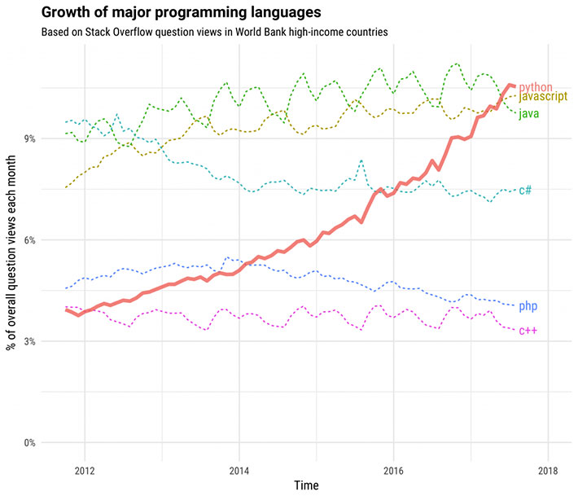
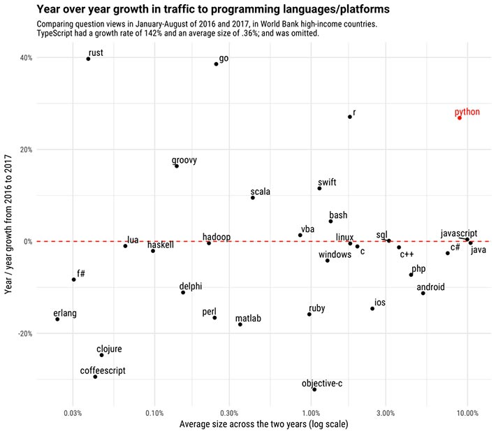
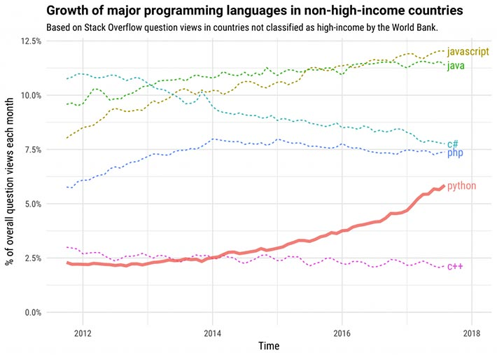

عالم لغات البرمجة يتطور بسرعة كبيرة. اللغات التي كانت مسيطرة بالأمس لم تعد بالضرورة كذلك اليوم، فالإحتياجات تطورت بدورها وتغيرت مع التقدم الحاصل في المجال التكنولوجي.

موقع [Stack Overflow](https://stackoverflow.blog/2017/09/06/incredible-growth-python/) المعروف، اهتم بالصعود الصاروخي للغة البرمجة **بايثون** في السنوات الأخيرة وبالخصوص في الدول المتقدمة بحسب تصنيف **البنك الدولي**.

في يونيو2017، استطاعت لغة بايثون، التي شهدت النور لأول مرة مطلع تسعينات القرن الماضي، اقتناص المرتبة الأولى حسب **Stack Overflow** في عدد مشاهدات صفحات الأسئلة الخاصة بها، وذلك في دول غنية مثل الولايات المتحدة وبريطانيا. بينما جاءت في المركز الثاني في دول غنية أخرى خلف الجافاسكربت أو جافا في أحيان أخرى.

[bctt tweet="حسب StackOverflow.com، بايثون هي لغة البرمجة الأسرع نموا في الدول الغنية مثل الولايات المتحدة وبريطانيا." username="tutomena" prompt="غرد على تويتر"]

## توقعات مستقبلية باستمرار نمو بايثون

المستقبل يبدو مشرقا كذلك للغة البرمجة بايثون، فلقد توقع الموقع بأن الهوة ستزداد لصالحها بينها ولغات البرمجة المنافسة بحلول عام 2020.

وحافظت كذلك **Python** على مرتبة مشرفة ضمن كوكبة لغات البرمجة الأكثر نموا **على أساس سنوي**، حيث بينت الدراسة التي قارنت فترتي (يناير ـ غشت) من عامي 2016 و2017 بأن لغات **Rust** و**Go** هي الأكثر نموا في الدول الغنية وجاء **البايثون** تقريبا في المرتبة الثالثة.

## ماذا عن بقية دول العالم ؟

الصورة ليست بنفس الوردية في الدول الأخرى مثل البرازيل، الصين وروسيا. إحصائيات Stack Overflow أظهرت بأن الجافاسكربت وجافا يوجدان في مقدمة الترتيب في هذه الدول أمام كل من سي شارب وPHP وخلفهما **بايثون** في المركز الخامس، إلا أنه يحقق تقدما سريعا ومن المتوقع أن يتجاوز PHP و #C في قادم الأشهر والسنوات.

النمو المتسارع للغة البرمجة بايثون Python في StackOverflow.com يعني بصورة منطقية ارتفاع الطلب عليه من قبل الشركات على أرض الواقع، وبالتالي فمستقبل البايثون ومستخدميها يبدو واعدا ليس فقط في الدول الغنية، وإنما في جميع دول العالم تقريبا.
