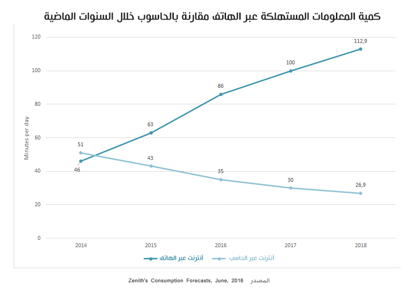

ارتأيت أن تكون أولى مقالاتي على موقع توطومينا حول الويب و كيف أتصور مستقبل تطوير تطبيقات ومواقع الويب، حتى يتعرف القارئ على فلسفتي و تصوارتي حول هذا الموضوع المعقد والمثير للجدل 😛.

في السابق كانت المواقع عبارة عن صفحات ثابتة تحتوي على كثير من النصوص وقليل من الصور😂 ثم تطورت بسرعة كبيرة بتطور وسائل التواصل فبعد الحواسيب المكتبية ظهرت الحواسيب المحمولة ثم الهواتف و اللوحات الذكية التي أدخلتنا "رسميا"، بكبيرنا وصغيرنا، في عصر التكنولوجيا و المعلومات.

وكما توضح الصورة أسفله فإن استهلاك المعلومات عبر الأنترنت تضاعف لصالح الهواتف و اللوحات الذكية بينما انخفض كثيرا باستعمال الحواسب.

كان لابد لصناعة الويب ان تُواكب هذا الزخم الهائل من المعلومات و هذه الأجهزة الحديثة فحسب [تقرير مؤسسة ComScore](https://www.google.com/url?sa=t&rct=j&q=&esrc=s&source=web&cd=1&cad=rja&uact=8&ved=0ahUKEwjL7rfW06fWAhXiC5oKHQP3D_EQFggnMAA&url=https%3A%2F%2Fwww.comscore.com%2FInsights%2FPresentations-and-Whitepapers%2F2016%2F2016-Global-Digital-Future-in-Focus&usg=AFQjCNGJgXabw60uD9FoZh-XjqRfV780RA) فإن الهواتف واللوحات الذكية هي الأكثر استعمالا خصوصا في فترات الصباح و المساء بينما تسيطر الحواسيب على فترات النهار الأمر الراجع لاستخدام معظم الناس والشركات الحواسيب أثناء العمل.

الآن وبعد ظهور تطبيقات الموبايل خصوصا بعد إطلاق نظام الأندرويد من طرف جوجل أصبح الكثير من الناشرين يتوجهون إلى هذه المنصة وإنشاء تطبيقات تستقطب قراء جدد أو للمحافظة على القراء المتحولين من الحواسيب إلى الموبايل، غير أن التكلفة الباهضة لإنشاء تطبيق أندرويد وآخر للأيفون جعلت الكثير من الشركات الصغيرة تحجم عن هذه الخطوة و البحث عن بديل أرخص يناسب ميزانيتها المحدودة فظهر توجه كبير لما يسمى بمواقع الويب المتجاوبة Responsive Websites وهي عبارة عن نسخ من الموقع تعمل على الجوال وتتجاوب مع أبعاد الشاشة عبر استعمال Media-Queries. و بتطور الويب وانطلاق النسخة الثانية Web 2.0 وظهور HTML5 و CSS3 عادت المواقع الإلكترنية إلى المنافسة واسترجعت حصة لا بأس بها كان سوء التطبيقات الذكية قد استولى عليها.

## PWA تطبيقات الويب

كانت، تطبيقات الويب Progressive Web Apps هي كل ما تحتاجه صناعة الويب لاستعادة حصتها في السوق، فبعد أن خرج سوق التطبيقات عن السيطرة وبسبب استهلاك التطبيقات لموارد الأجهزة خصوصا بطارية الهاتف كانت تطبيقات الويب الحل الأمثل حيث تمكنك من الحصول على نفس تجربة المستخدم الرائعة وسرعة التجاوب الموجودة لدى الموبايل ولكن دون ان تستنزف موارد الهاتف و استهلاك بطاريته.

وقد قام مؤخرا جوجل بالإعلان عن تجارب لإمكانية تنصيب تطبيقات PWA جنبا إلى جنب مع التطبيقات الأصلية "Native Apps" على هواتف الأندرويد لتظهر أيقونة الموقع في قائمة التطبيقات وقد كان موقع تويتر السباق لاستثمار هذه التقنية الجديدة فقام ببناء تطبيق Twitter Lite قابل للتنزيل حيث استغل جميع امكانيات PWA لصناعة تجربة فريدة تعمل بسلاسة وحتى تحت تغطيات الانترنت الضعيفة. ويمكنكم دخول الموقع [www.twitter.com](http://twitter.com) من على هواتفكم لمعاينة النسخة وسيطلب منكم الموقع عمل إضافة للموقع تلك الإضافة هي في الحقيقة تثبيت خفيف لتطبيق WPA.

[كيف صنعنا تطبيق Twitter Lite](https://blog.twitter.com/engineering/en_us/topics/open-source/2017/how-we-built-twitter-lite.html) - مقال بالإنجليزية --

## مصير مصممي ومطوري مواقع الويب

ختاما، ولأننا في موقع يهتم بالمطورين فإن نصيحتي لهم أن ينطلقوا إلى تعلم تطوير تطبيقات الويب PWA فالجلي أنها هي المستقبل وعليه فتعلم لإحدى هذه المنصات [PreactJs](https://preactjs.com/)، [ReactJS](https://facebook.github.io/react/)، [VueJS](https://vuejs.org/) أو [Angular2](https://angular.io/) سيكون في غاية الأهمية أضافة إلى كيفية التعامل مع واجهات التخاطب البرمجية أو ما يصطلح عليه بالـ API إضافة إلى إتقان oAuth2. فبدون هذه الكفاءات سيكون عليهم الإعتزال باكرا فكل الشركات أصبحت تتجه نحو تحويل أنظمتها إلى واجهات تخاطب APIs وقريبا ستظطر لاستخدامه.

إلى هنا أكون قد انتهيت من كتابة آخر الأسطر من مقالتي الأولى 😅 وقريبا سأتبعها بواحدة أخرى مالم تظطرني الظروف لغير ذلك، حتى ذلكم الحين أتمنى أن تكونوا قد استفدتم وآخر دعوانا أن الحمد لله رب العالمين.
