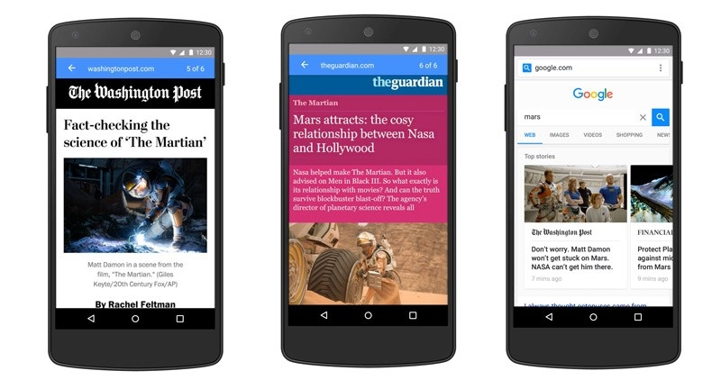
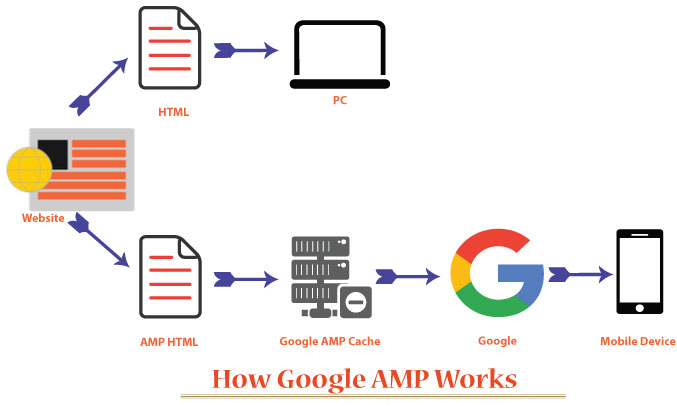
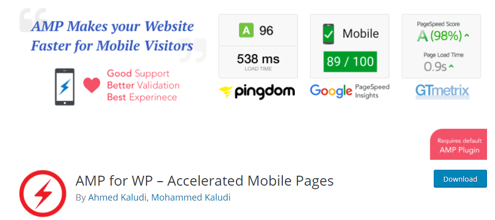

تستثمر الشركات ومواقع الويب في تطوير أداء صفحاتها على الموبايل من خلال تحميل سريع لمحتويات المواقع وصفحات الويب على الهواتف الذكية والحواسيب اللوحية لكافة المستخدمين، فقد تأكد أنه بدون حل مشكلات البطء المرتبطة بالمواقع على الأجهزة المتحركة سيتراجع الزوار بشكل كبير بينما التحويلات والمبيعات والعائدات من المشاريع على الإنترنت ستنهار في هذه الحالة.

ومن الأكيد أنك سمعت بمصطلح الصفحات المسرعة AMP، وربما لاحظت نوعية من الصفحات سريعة التحميل عند الولوج إلى صفحة موقع معين من نتائج بحث [جوجل](https://www.tutomena.com/blog/seo-most-important-criterias-according-experts/) أو حتى بينج مختلفة عن صفحات المحمول الخاصة بتلك المواقع وهي أسرع بكثير.

نحن في هذا المقال سنتعرف على هذه النوعية من الصفحات وماهيتها وأهميتها وكيف يمكنك بداية تفعيلها لموقع ووردبريس الخاص بك سواء كان مدونة أو منتدى أو متجرا إلكترونيا أو موقع إخباري.

## ما هي الصفحات المسرعة AMP ؟

مشروع يدعى بالإنجليزية **Accelerated Mobile Page** لذا اختصاره AMP، صفحات الجوال المسرعة هو مشروع أطلقته شركة جوجل عام 2015 وهو مفتوح المصدر.

والهدف من المشروع هو التخلص من مشكلة بطء صفحات الويب على الجوال وجعلها سريعة في تحميل النصوص والصور ومقاطع الفيديو والقوائم والخيارات ومختلف المحتويات التي تشكل الصفحة.

وجاءت هذه المبادرة من جوجل بعد أن اكتشفت أن معظم الباحثين على محرك بحثها من الموبايل يتضايقون جدا من بطء الصفحات التي تظهر على نتائج بحثها.

ورغم أنه قد يبدو لك أنه ليس من شأن الشركة الأمريكية التدخل في مشاكل مواقع الويب، غير أن رغبتها في تقديم أفضل نتائج البحث من حيث المحتوى والأمان وسرعة التحميل هو حقها المشروع وهي الطريقة الوحيدة التي تحافظ بها على تفوقها في مجال البحث على الإنترنت، فما أكثر محركات البحث التي تقدم نتائج بحث مكررة، وروابط تتضمن فيروسات، وصفحات بطيئة التحميل.

يمكنك الإطلاع على موقع المشروع [من هنا](https://www.ampproject.org/) وبالطبع ستلاحظ أن الموقع سريع جدا هذا لأنه ببساطة يعتمد التقنيات التي تتمتع بها تلك الصفحات.

## مميزات الصفحات المسرعة AMP

تتميز هذه الصفحات مقارنة بصفحات الجوال العادية بأنها أسرع ويتم تحميلها في أجزاء من الثانية عادة على الهواتف الذكية ولمختلف أنماط الإتصال بالإنترنت سواء من خلال الخلوي أو عبر الواي فاي.

إضافة لما سبق فإن هذه الصفحات تتميز بكونها بسيطة وهي تركز على تقديم تجربة استخدام جيدة، ولا تعرض العناصر الغير المهمة حيث نلاحظ أنها لا تعرض القوائم الجانبية في العادة والتي تظهر في صفحات الجوال خصوصا أسفل المقالات والمواضيع.

ومن مميزات هذه الصفحات أنها تعتمد على Google AMP Cache وهي ذاكرة التخزين المؤقت أو ما يعرف بالكاش، وهي التي توفر تحميل الصفحة التي قمت بزيارتها سابقا في أقل من الفترة الزمنية السابقة.

ولم يتم تجاهل الجانب الأمني من هذا المشروع حيث تحرص جوجل على اغلاق الثغرات الأمنية التي يمكن أن تعاني منها ومنع حقن الصفحات المسرعة بالبرمجيات الخبيثة.

ويمكنك تخصيص هذه الصفحات من خلال إضافة المزايا لها وهي تتيح أيضا عرض الإعلانات، وقد عملت جوجل على جعل اعلانات أدسنس أسرع تحميلا على هذه الصفحات وتواصل العمل على تحسين السرعة لتظهر الإعلانات في ذات الوقت لتحميل المحتوى وهذا كله في مدة أقل من ثانية.

وتعد الصفحات المسرعة AMP أسرع 10 مرات مقارنة بصفحات الجوال العادية، كما أنه يمكن الولوج إليها من سطح المكتب فقط بإضافة **amp/** على رابط الصفحة للمواقع التي تعتمد هذه التقنية.

## أهمية الصفحات المسرعة AMP

يعد تبني الصفحات المسرعة AMP من قبل مواقع الويب والمشاريع الإلكترونية أمرا في غاية الأهمية خصوصا وأن مواقع كبيرة وكثيرة تبنت هذه التقنية منها مواقع عربية عديدة.

وتعمل جوجل على رصد هذه الصفحات وأرشفتها وإظهارها في نتائج بحث الموبايل فقط للباحثين، حيث 99 في المئة من الزيارات المباشرة إليها تأتي من جوجل بينما 1 في المئة المتبقية هي للزيارات التي تأتي ممن يشاركون تلك الصفحات المسرعة على فيس بوك عند اعجابهم بمقال معين أو محتوى محدد على الموقع.

هذه الصفحات ليس مهمة فقط للمدونات والمجلات ومواقع الويب بل أيضا للمتاجر وحتى الخدمات المختلفة، وسنتطرق في المقال القادم إلى نتائج مبهرة حصلت عليها العديد من المواقع بعد أن تبنت هذه التقنية.

بشكل عام لاحظ أصحاب المواقع الذين يستخدمون هذه التقنية ارتفاعا في الزيارات عبر [الموبايل](https://www.tutomena.com/blog/basics-for-perfect-website-on-mobile/) إلى مواقعهم الإلكترونية، بينما يبقون على صفحات الجوال العادية والتي يتم توجيه الزوار من الشبكات الإجتماعية وعبر البريد الإلكتروني والمواقع الأخرى إليها.

## تفعيل الصفحات المسرعة AMP في مواقع ووردبريس ؟

يجب ان نتفق أولا أن الصفحات المسرعة AMP تدعم فعلا ووردبريس والعديد من أنظمة إدارة المحتوى، على امل ان تدعمها بقية المنصات.

من جهة أخرى هو ليس مشروعا حكرا على المواقع الأجنبية بل أصبح منذ أشهر يدعم المواقع العربية، وهناك إضافتين توفران تفعيل الصفحات المسرعة AMP لمواقع [ووردبريس](https://www.tutomena.com/blog/%d9%85%d8%b9%d9%84%d9%88%d9%85%d8%a7%d8%aa-%d9%85%d9%87%d9%85%d8%a9-%d8%b9%d9%86-%d9%88%d9%88%d8%b1%d8%af%d8%a8%d8%b1%d9%8a%d8%b3/) بكل سهولة.

البداية مع اضافة [**AMP**](https://wordpress.org/plugins/amp/) من **Automattic** والتي توفر تفعيل هذه الصفحات على موقعك بدون أي مشكلات، ويمكنك من اعدادات القالب أن تغير لون القالب وتضيف شعار الموقع وتتحكم في لون العناوين والنصوص.

هذه الإضافة لا توفر ميزة إضافة الإعلانات ولا تظهرها كما أيضا لا توفر دمج شفرة الإحصائيات في هذه الصفحات لتتبع الزيارات إليها، ناهيك على أنها لا تدعم طريقة اتجاه الكتابية العربية من اليمين إلى اليسار.

لذا يمكنك تنصيبها إذ هي تحتوي على أساسيات وهي الرسمية، ومن ثم تنصيب إضافة رائعة عليها وهي  [AMP for WP – Accelerated Mobile Pages](https://wordpress.org/plugins/accelerated-mobile-pages/).

أنشئت ببساطة هذه الإضافة لتمكن أصحاب لمواقع من الحصول على المزيد من الإعدادات للتحكم في صفحات الجوال المسرعة، حيث توفر إضافة تعليقات فيس بوك إلى الصفحات وكذلك تفعيل مقالات ذات صلة، إضافة الإعلانات، الربط مع Google Tag Manager وهي تدعم احصائيات جوجل، وتدعم أيضا اضافة السيو Yoast SEO.

ويمكن توجيه جميع الزوار عن طريق الهواتف الذكية إلى الصفحات المسرعة AMP بالتالي التخلص من نسخة الجوال من موقعك وهذا من خلال تفعيل ميزة Mobile Redirection بدون أكواد بل فقط من إعدادات الإضافة.
