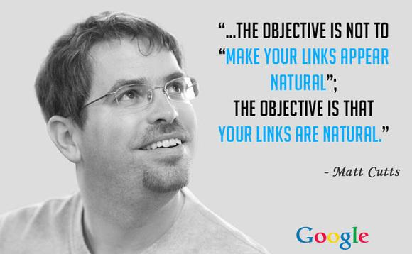
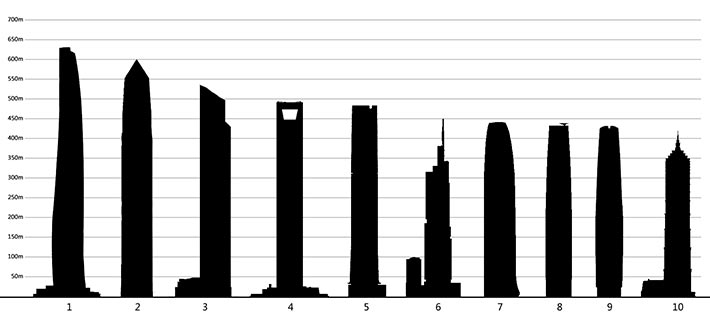

عندما تكلمنا عن [المعايير الأكثر أهمية والسلوكيات الممنوعة حسب خبراء التسويق على جوجل](https://www.tutomena.com/blog/seo-most-important-criterias-according-experts/)، وجدنا فعلا أن الروابط الخلفية للمواقع أو ما يدعى **الباك لينكس Backlinks** لا يزال ضمن المعايير المهمة التي يعمل عليها المتخصصين من أجل تحسين ترتيب مواقعهم والمواقع التي يعملون على تهيئتها لتتوافق مع جوجل.

من المعلوم أن الباك لينكس فيه نوعان:

- الأول يتم انشاؤه من طرف صاحب الموقع أو المكلف بمهمة التسويق على محرك البحث.
- وهناك الباك لينكس الطبيعي وهو الأفضل جودة ويفضله محرك البحث العالمي.

الباك لينكس الطبيعي ذات تأثير جيد على SEO وفي ذات الوقت لا يتطلب من صاحب الموقع أو المتخصص في التسويق التدخل لإنشائه، الزوار والقراء والمستفيدين من المحتوى هم من يقفون وراءه.

في الويب العربي والعالمي هذا جد ممكن، يتعين فقط أن تركز على جودة المحتوى الذي تقدمه وستتفاجأ من وقت لآخر بأن الناس يشاركون مقالاتك على المنتديات ومواقع أخرى تشير في تقاريرها إلى مقالات موقعك وتجد أيضا المقالات الغنية على موقعك تتخذ كمراجع موثوقة للموسوعات الإلكترونية والمواقع الإخبارية.

في هذا المقال سنتحدث عن 9 أنماط من المحتوى تزيد من الباك لينكس الطبيعي لمواقع الويب وتحسن SEO يجب عليك أن تركز عليها في موقعك الإلكتروني.

## 1\. مقالات أفضل 10 والقوائم المفضلة

اكتسبت خلال السنوات الأخيرة هذه النوعية من المقالات شهرة كبيرة للغاية وزخما كبيرا، ولا يخلو أي موقع إلكتروني ناجح منها.

إن كان موقعك متخصصا في الشؤون العسكرية، يمكنك مثلا عمل قائمة اقوى الدبابات لعام 2017، أقوى 20 جيشا في العالم بالوقت الحالي، وهكذا.

إلى جانب الإقبال الكبير الذي تحصده هذه النوعية من المقالات، فهي تدفع الناس إلى مشاركتها بكثرة، على الشبكات الإجتماعية، أيضا تجلب باك لينكس جيد من المنتديات ومواقع أخرى.

## 2\. انفوجرافيك

هي محتويات مرئية عبارة عن صور ذات أبعاد طويلة وتتضمن معلومات مكتوبة مفصلة في قالب جميل وبسيط، يوفر أكبر عدد ممكن من المعلومات والتفاصيل في صورة ابداعية واحدة وتسمح بإيصال المعلومات للقارئ بسهولة وسرعة.

هذه المحتويات يتم تداولها بصورة كبيرة على الشبكات الإجتماعية والمنتديات وتتناقلها العديد من المواقع التي تضيف رابط المصدر الأصلي فيما يأتي في العادة الانفوجرافيك بشعار الموقع.

## 3\. مقالات غنية تتضمن معلومات جديدة

المدونات والمواقع المتخصصة في مجالات محددة والتي تركز على تقديم محتوى ذات جودة عالية، عادة ما تشكل مصدرا جيدا بالنسبة للموسوعات الإلكترونية مثل ويكيبيديا لإضافة المزيد من الفقرات والمعلومات إلى صفحاتها.

أيضا فإن المواقع الإخبارية التي تتمتع بمصداقية جيدة عادة ما يتم مشاركة مقالاتها على المنتديات مع ارفاق رابطها الأصلي، وكذلك إضافتها كمراجع على المواضيع في الموسوعات الإلكترونية.

## 4\. كورسات مجانية ذات قيمة كبيرة

تتداول المواقع التقنية أخبارا عن الكورسات المجانية في مجالات مختلفة منها التسويق والتصميم والهندسة والبرمجة، وعادة تكتب عنها إن كانت ذات قيمة جيدة وتروج لها لقرائها مجانا.

يكفي أن يكتب موقع عن كورس محدد أو دورة مجانية حتى تجده خبرا متداولا لدى العديد من المواقع الأخرى وبصورة كبيرة.

## 5\. محاضرات مباشرة على الإنترنت

يمكنك عرض محاضرة حصرية وخاصة بموقعك حول موضوع تخصصه، وفي حالة كانت ذات قيمة جيدة ومهمة، فإن الناس سيشاركونها على المنتديات والشبكات الإجتماعية وتتداولها المواقع المتخصصة عادة في عرض المحاضرات للمهتمين لمتابعتها.

وسيكون من الجيد بعد عرض المحاضرة أن تعرضها على موقعك بشكل مسجل وتوفر مشاركتها.

## 6\. مقاطع الفيديو الأصلية

بالنسبة للمواقع التي تعرض مقاطع الفيديو لكن ليس من يوتيوب أو أي موقع خارجي بل برفعها مباشرة إلى الإستضافة فإن هذه تكسب باك لينكس طبيعي بوثيرة قوية.

وأكبر من يطبق هذه القاعدة هي المواقع الإخبارية المتخصصة والصحافة الإلكترونية مثل THE SUN والصحف البريطانية ومواقع الصحافة المتخصصة.

وعادة ما تعمل مواقع أخرى بتضمين مقاطع الفيديو الحصرية من تلك المواقع "المصدر" وهو ما يحتسب باك لينكس طبيعي وذات جودة عالية.

## 7\. خدمات إلكترونية مجانية مميزة

في عالم التسويق الإلكتروني يمكن لموقع متخصص في أخبار هذا المجال أن يقدم العديد من الخدمات المجانية والتي يمكن للزوار مشاركتها والتوصية بها.

من هذه الخدمات نجد قياس عدد باك لينكس المواقع، خدمة التحقق من مسك الكلمات المفتاحية، خدمة فحص SEO المواقع الإلكترونية، وهناك الكثير من الخدمات المفيدة والناجحة.

بالترويج لها والإعلان عنها ستجد الكثير من المهتمين يشاركونها على مدوناتهم ويعملون على الإشارة إليها في مقالاتهم ذات الصلة بالمجال، ناهيك عن تقديمها في مواضيع على المنتديات.

يمكن تقديم خدمات مجانية في مجالات مختلفة منها تحويل العملات، الأرصاد الجوية، الترجمة الفورية، البحث المتخصص والكثير.

## 8\. السبق الصحفي والأخبار الحصرية

ينجح هذا في حالة كنت تملك موقعا مثلا متخصص في أخبار مدينة معينة، وحصلت أحداث كبيرة في المنطقة، عادة ما تلجأ وسائل الإعلام الكبيرة ووكالات الأنباء إلى الإعتماد على تلك المواقع المتخصصة، وتحظى في تلك الفترات بمتابعة كبيرة بينما تحصد باك لينكس طبيعي وكثير.

ينفع هذا أيضا في حالة التغطية على أرض الواقع للمؤتمرات والأحداث المهمة بحضورك إلى أرض الحدث، أو أن يكون لك مراسلين من هناك يرسلون مقاطع الفيديو والتقارير الصحفية وتنشرها.

## 9\. عرض تخفيض مغري أو منتج حصري

طريقة ممتازة بالنسبة للمواقع التجارية والمتاجر الإلكترونية، حيث عادة ما تتداول المواقع الإخبارية والتقنية العروض المغرية التي تقدمها المتاجر الإلكترونية من وقت لآخر.

حاليا فيما طرحت المتاجر الإلكترونية هاتف جالكسي نوت 8 بسعر يصل إلى 1000 دولار فإن المتجر الذي يوفره بسعر أرخص سيحصل على اهتمام من الزوار، كما أن عدد من المواقع ستروج للعرض وتنصح به قراءها.

ويتم تداول عروض التخفيض على المنتديات والشبكات الإجتماعية والمواقع الإخبارية والمتخصصة، فيما تتطرق عادة المواقع الإخبارية إلى المتاجر التي بدأت توفر أحدث المنتجات التي تم طرحها في السوق.

**الخلاصة:**

الحصول على الباك لينكس الطبيعي لمواقع الويب وتحسين SEO ممكن من خلال التركيز على المحتوى وتقديم ما هو ذات قيمة بالنسبة للزوار والرأي العام، وبالطبع أنماط المحتوى التي تطرقنا إليها في هذه المقالات هي خيارات جيدة تناسب المواقع الإخبارية والمدونات والمنتديات وحتى المتاجر الإلكترونية.
