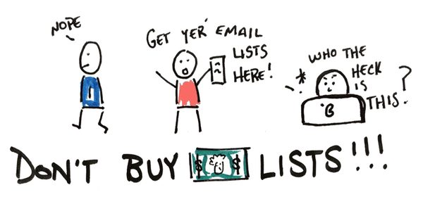
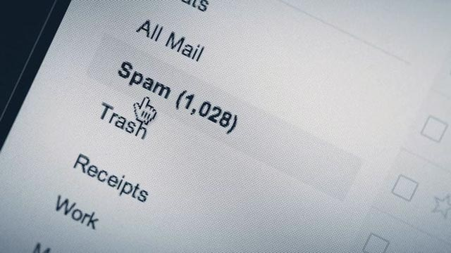

يتطلب التسويق بالبريد الإلكتروني أن يكون لدى المسوق أو الموقع أو الشركة قائمة بريدية مكونة من المشتركين قابلة للزيادة والتوسع وتتضمن في العادة المهتمين بالرسائل التي تصلهم بشكل دوري.

هذا هو الشرط الأساسي والعمود الفقري عند الإعتماد على البريد في عملية [التسويق](https://www.tutomena.com/blog/%d9%85%d9%87%d9%86-%d8%a7%d9%84%d9%88%d9%8a%d8%a8/) والترويج سواء للمحتوى الجديد أو العروض والتخفيضات.

لكن المشكلة التي لا تزال منتشرة رغم تحسن وعي المسوقين وأصحاب المشاريع الإلكترونية هي شراء القوائم البريدية والتي تنتمي إلى تجارة التسويق بالبريد الإلكتروني.

في هذه الحالة يستعجل المسوق عادة الحصول على النتائج وهو يريد أن يكون لديه قائمة بريدية كبيرة للغاية تضمن له الوصول إلى أكبر عدد ممكن من المشتركين، بالتالي جلب زيارات كثيرة وتحويلات ومبيعات أكبر.

لكن الحقيقة أن هذه الصورة الوردية التي ترافق شراء القوائم البريدية خاطئة وغير حقيقية، فحتى في حالة شراء قائمة بريدية كبيرة من موقع منافس، النتائج تكون مخيبة لأنه ببساطة يستغرب الناس من أين توصلت بعنوان بريدهم الإلكتروني وتكون هناك حالة من الحذر والأغلب القرار بالتجاهل أو إلغاء الاشتراك.

فما بالك بشراء قائمة بريدية على أساس عدد المشتركين فيها وليس على أسس الاستهداف وفئات المشتركين فيها، وهل المشتركين نشيطون أم فقط عناوين خاملة وخاطئة؟

هناك العديد من الأسباب التي تدفعك لتجنب شراء القوائم البريدية عند التسويق بالبريد الإلكتروني سنتطرق إليها في هذا المقال:

## المشتركون لم يقرروا في الاساس تلقي رسائلك!

دع عنك أن القائمة البريدية التي تنوي شرائها هي لموقع منافس وفي نفس المجال ويقدم محتويات مشابهة ومنتجات منافسة بالتالي المشتركين مهتمين بما تقدمه، هذا الكلام غير مقنع بتاتا بالنظر إلى أن المشتركين في تلك القائمة البريدية لم يختاروا تلقي رسائلك بل تلقي الرسائل من الموقع أو الشركة التي سجلوا عناوين بريدهم الإلكترونية لديها.

من جهة أخرى فإن صاحب القائمة البريدية الأصلية وعد بطريقة أو أخرى بأنه لن يبيع القائمة البريدية ولن يشارك عناوين البريد مع أطراف أخرى، هذا التعهد المطمئن للمشتركين هو ما دفعهم للاشتراك وهم لا ينتظرون رسائل مزعجة من أطراف متأكدون أنهم لم يشتركوا لديهم من قبل.

## مشاكل مع خدمات ارسال البريد الإلكترونية

عادة ما تعد خدمات ارسال البريد الإلكترونية الجماعية والقوائم البريدية عملائها بتوصيل رسائلهم إلى البريد الوارد وليس بريد الرسائل المزعجة، وهي تحرص أشد الحرص على الجودة وأن تكون خدماتها مقبولة لمزودات الخدمة مثل جوجل و ياهو و أوت لوك ليستمر نشاطها التجاري.

بناء على ذلك تعمل هذه الخدمات على التحقق من أن [القائمة البريدية](https://www.tutomena.com/blog/android-apps-for-bloggers/) التي تم ادخالها أصلية والمشتركين فيها من المهتمين فعلا، لذا عدد منها لا يسمح للمستخدمين باستيراد قوائم بريدية تم شراؤها.

بعض تلك الخدمات تقوم بإرسال رسائل للمشتركين في القائمة البريدية التي أدخلتها تطلب منهم تأكيد اشتراكهم مرة أخرى للتأكد من أنهم مهتمون بذلك أم لا.

## معدل تسليم سيء وما أكثر عناوين البريد الإلكتروني التي لا تعمل

لنفترض أنك اشتريت قائمة بريدية فعلا وتستخدم إضافة على موقعك لإرسال الرسائل دون الاستعانة بالخدمات الخارجية الإحترافية، ستكتشف أن معدل التسليم سيء وأن معدل فتح الرسائل أقل بكثير من المتوقع، ناهيك على أنك ستجد بتقرير إرسال الرسائل لهم أن قائمة كاملة من عناوين البريد الإلكتروني غير متوفرة أساسا.

إذن أنت ضيعت فقط المال على لا شيء، حاولت الحصول على نتائج أفضل في فترة زمنية أقل لكن هذا لم يحدث.

## ارتفاع معدل إلغاء الاشتراك

في الوقت الذي ستكتشف فيه أن معدل فتح الرسائل قليل جدا للقائمة البريدية التي اشتريتها وأن عدد من المشتركين في الأساس غير حقيقيين، ستجد أن المشتركين الذين يتلقون منك رسائل مباشرة وإلى بريدهم الوارد إما يتجاهلون فتح الرسالة أصلا أو يفتحونها ويعملون على الضغط على خيار إلغاء الإشتراك.

إذا فكرت في إزالة ذلك الزر لإيقاف ارتفاع معدل إلغاء الإشتراك، فإن فئة من المستخدمين سيبلغون مقدم خدمة البريد عنك من خلال الضغط على زر يعرضه جي ميل ومنافسيه وهو "تصنيف هذه الرسالة على أنها مزعجة".

مع تلقي مقدم الخدمة للعديد من التبليغات بهذا الشكل على أن رسائلك البريدية مزعجة فإنه سيصنف الرسائل منك على أنها مزعجة ومكانها الصحيح هو البريد المزعج.

المشكلة الأكبر أن هناك تعاون بين شركات البريد الإلكتروني ومنظمات تضيف إلى قوائمها الشركات والمواقع المزعجة على البريد الإلكتروني وهناك احتمال إضافة شركتك أو موقعك إليها!

## لا مبيعات ولا تحويلات حقيقية

الغرض من ارسال الرسائل عبر البريد الإلكتروني في النهاية ليس فقط فتحها بل التفاعل معها، من خلال الحصول على زيارات ومبيعات وتحويلات حقيقية وعائد على الاستثمار قابل للقياس.

عند شراء قائمة بريدية فإن أيا من هذه النتائج لا تحصل وإن كانت موجودة فهي قليلة جدا والأضرار أكبر من الفوائد في هذه الحالة.

واحدة من أهم القواعد الذهبية سواء عند التسويق بالعمولة أو البيع على الإنترنت، هي أن الناس يميلون لشراء المنتجات والخدمات من الجهات التي يعرفونها ويتابعونها وليس من الجهات المجهولة أو من خلال رسالة وصلت بشكل مفاجئ إلى بريدهم الوارد من جهة لم يسمعوا بها سابقا.

هذه القاعدة من يعرفها جيدا يدرك تماما أن شراء قائمة بريدية وإرسال الرسائل إليها ما هي إلا مضيعة للمال والوقت فقط ولن تكون حملة بريدية جيدة.

### **خلاصة**

في حالة كنت مكلفا بالتسويق عن طريق البريد الإلكتروني فقد يخبرك صاحب عملك بأن شركة فلانية أو منافس معين قام بشراء قائمة بريدية من منافس وزادت مبيعاتهم وأرباحهم بنسبة جيدة، مهما كانت هذه الأرقام رائعة لا ننصحك بأن تأخذ تلك القصة على محمل الجد.

يمكنك أن تستثمر الأموال في تكبير القائمة البريدية بالحصول على المهتمين، وأنجح طريقة هي عمل صفحة متخصصة في حصول المهتمين على كتاب إلكتروني معين او الحصول على عروض تخفيض في مجال محدد والإعلان عنها بشكل مدفوع للشريحة المهتمة فعلا.
