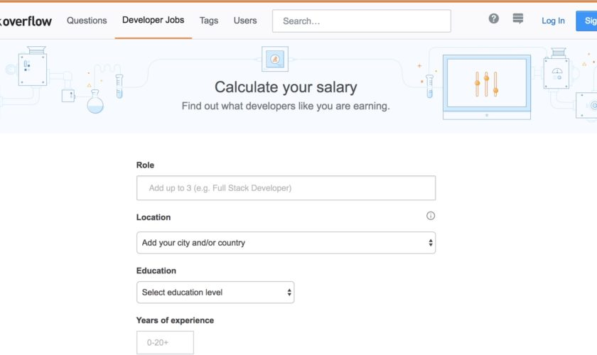

من المعلوم أن منصة **Stack Overflow** بمثابة مجتمع متكامل بالنسبة للمطورين حيث يوفر لهم تبادل الخبرات وحل المشكلات وتطوير مهاراتهم كما أنه يوفر لهم الحصول على الوظائف وفرص العمل عن بعد.

هو بمثابة شبكة إجتماعية للمطورين تتوفر على المحتوى الذي يغنيهم ويدور كل شيء فيها حول [البرمجة](https://www.tutomena.com/web-development/growth-python-programming-language/) وتطوير التطبيقات والمواقع الإلكترونية.

وضمن الخدمات التي تقدمها المنصة للشريحة التي تستهدفها ونتحدث عن المبرمجين، فقد قررت إطلاق **حاسبة رواتب للمطورين** والتي ستساعد المطور في معرفة الراتب العادل بالنسبة له حسب السوق والمنافسة والتطورات التي تحصل في هذا المجال.

هذه الحاسبة تعطي رواتب دقيقة معتمدة في ذلك على البيانات التي تجمعها المنصة من عروض فرص العمل وكذلك قيامها بعدد من الاستطلاعات التي جمعت من خلالها معلومات أدق عن الرواتب في مختلف مجالات البرمجة، وهذا ينحصر حاليا على 5 بلدان وهي الولايات المتحدة الأمريكية وكندا وكذلك بريطانيا، فرنسا وألمانيا.

استخدام الحاسبة سهل جدا، كل ما عليك فعله هو اختيار الوظيفة التي تعمل بها ضمن وظائف البرمجة، منها خبير البيانات، مطور سطح المكتب، مطور الموبايل الخ ...

بعد ذلك سيكون عليك ادخال الدولة (حاليا كما أشرنا تدعم الخدمة 5 دول فقط) بعد ذلك يمكنك أن تختار المستوى الدراسي الخاص بك، وتدخل عدد سنوات الخبرة في المجال الذي تعمل به، ثم الضغط على زر ادخال لتحصل على الراتب السنوي والعديد من البيانات الأخرى والإحصائيات التي تم جمعها.

الخدمة تقترح أيضا إلى جانب ذلك العديد من الوظائف التي لها علاقة والتي تمت إضافتها مؤخرا ويمكنك التقدم إليها.

الخدمة سهلة الاستخدام ويمكنك البدء في استخدامها [من هنا](https://stackoverflow.com/jobs/salary)
