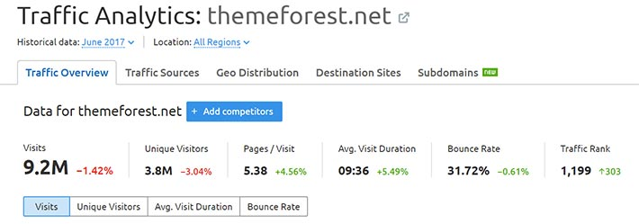
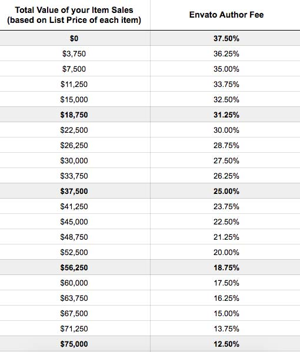
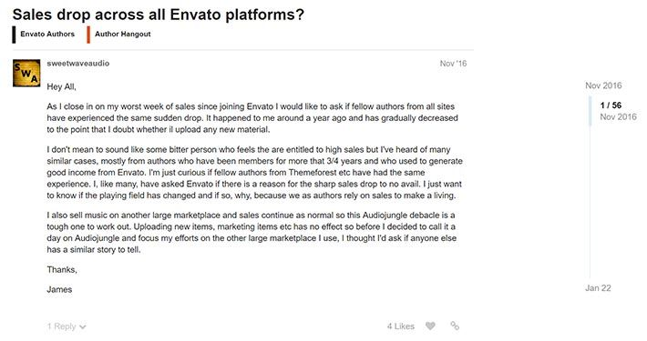

يدعم **ووردبريس** ما نسبته حوالي 28 في المائة من مجموع المواقع الإلكترونية، وهذا لا يدع مجالا للشك بأن صناعة الووردبريس مربحة ومدرة لأموال كثيرة.

العديد من المطورين في العالم، وخاصة الذين مازالوا في بداية طريقهم، يحلمون بإنشاء قوالب ووردبريس احترافية وبيعها للحصول على مداخيل قد تسمح لهم فيما بعد بإنشاء شركاتهم الخاصة وتوظيف مطورين ومصممين آخرين لتوسيع نشاطاتهم.

هؤلاء المطورون يحتارون في اختيار أفضل الطرق لبيع وتسويق قوالبهم ومنتجاتهم، هل يقومون بعرضها على مواقعهم الخاصة وبيعها هنالك ؟ أو يلجؤون لحل ثان يوفر لهم كافة الوسائل والأدوات الضرورية الواجب توفرها في أي متجر إلكتروني لبيع المنتجات الرقمية ؟ وهنا بطبيعة الحال نتكلم عن متجر **ثيم فورست** الأشهر في هذا المجال والذي مكن عددا كبيرا جدا من المطورين حول العالم من تحقيق أرباح وصلت في بعض الأحيان لملايين الدولارات.

ولكي نضعكم أمام الصورة الحقيقية، يسرنا اليوم مقابلة السيد _**هنري ريز**_، المدير التنفيذي لشركة ThemeREX الرائدة في منصة ثيم فوريست، بتحقيقها عدد مبيعات ضخم ناهز الأربعين ألفا. هذه الشركة تعتبر من **المطورين النخبة** والذين يستفيدون من برنامج معروف على ثيم فوريست باسم **Power Elite Authors**.

هذه المقابلة ستضع، ربما، نهاية لتساؤلات المطورين حول الإلتحاق بهذه المنصة، وذلك بتبيان إيجابياتها وسلبياتها.

## ووردبريس وثيم فورست

متجر ثيم فوريست مملوك لشركة **Envato**، وهو المتجر الإلكتروني الأكثر شهرة فيما يخص بيع قوالب HTML، ووردبريس وأنظمة إدارة المحتوى الأخرى.

في وقتنا الحالي، يوجد على ثيم فوريست أزيد من 10600 قالب ووردبريس. وبحسب [دراسة تحليلية لموقع Freemius](https://freemius.com/blog/themeforest-wordpress-themes-analyisis/)، فإن قوالب ووردبريس تشكل ما نسبته 28% فقط من مجموع أعداد القوالب في المنصة، إلا أن **عائداتها تمثل 80% من العائدات الإجمالية للمتجر**. هذا رقم كبير ولكنه ليس بالمفاجئ إذا علمنا أن 60% من مستخدمي برامج إدارة المحتوى حول العالم يستعملون ووردبريس!

## ما هو برنامج Power Elite Author ؟

شركة Envato لديها ما يسمى **ببرنامج النخبة** Elite Program، وهو برنامج يضم الأعضاء الذين حققوا مبيعات تفوق 75 ألف دولار. هؤلاء الأعضاء يستفيدون من امتيازات متعددة، كالإشتراك المجاني لمدة عام كامل في موقع **Tuts+** والذي يقدم دورات احترافية في مجالات عدة متعلقة بتقنيات تطوير الويب والبرمجة والتسويق بصفة عامة. هذا إضافة لمنحك فرصة الإطلاع على تحليلات غوغل **Google Analytics** الخاصة بصفحاتك على المتجر لمساعدتك على دراسة زوارك وتتبعهم فيما بعد بواسطة حملات إعلانية مدفوعة. ويُمنَح كذلك المنتسبون لبرنامج النخبة شارة Badge تظهر على كافة صفحات منتجاتهم ليراها زوار المتجر.

## إيجابيات العمل على متجر ثيم فورست

شركة **ThemeREX** عندها كما ذكرنا زهاء **الأربعين ألف مبيعة** في ثيم فوريست وأكثر من **150 قالبا لووردبريس** معروضا للبيع. إذن، لن نجد أفضل من **المدير التنفيذي** لهذه الشركة حتى يعرفنا بأبرز إيجابيات العمل على هذه المنصة :

### 1\. ترافيك هائل

يعتبر متجر ثيم فوريست، ومتاجر مجموعة إنفاتو بصفة عامة، قبلة لعدد هائل من الزوار. بحسب موقع **SEMrush.com** المتخصص في أدوات السيو وتقنياته، فإن موقع **Themeforest** يستقبل شهريا أزيد من 9 ملايين زائر، وهذا العدد من الحواسيب المكتبية فقط! وإذا احتسبنا الترافيك القادم من أجهزة الموبايل فإن العدد سيكون أكبر من ذلك بكثير.

هذا المعطى يعني بأن قوالبك ومنتجاتك الرقمية ستحصل على عدد ممتاز من الزيارات العضوية بدون مجهود منك، والأكثر من ذلك أنها كلها زيارات مستهدفة وغير عشوائية. فكل من يدخل لموقع ثيم فوريست يعلم جيدا بأنه متجر خاص ببيع القوالب، وبالتالي ما عليك إلا تقديم منتج ذات جودة مميزة حتى تحصل على ثقة وإعجاب هذا الزائر الذي قد يصبح بعد ذلك أحد عملائك.

شركتنا [ThemeREX](https://themeforest.net/user/themerex/portfolio?ref=aissaino) سبيل المثال، تحصل على عدد كبير جدا من الزيارات يصل ل **200 ألف زيارة في الشهر**. ولكن تجدر الإشارة بأن أغلب هذه الزيارات تذهب لصفحات استعراض القوالب **Demos** ولا تصل بالضرورة للصفحة الرئيسية لموقعك الرسمي. هنا يجب عليك التفكير في حل لاستغلال هذه الزيارات على أفضل نحو، كعرض منتجاتك وقوالبك الأخرى في صفحات Demos نفسها إلخ ...

### 2. الإستقرار

ثيم فورست يوفر لك **بيئة ممتازة ومستقرة** لبيع منتجاتك والإطمئنان على مستقبل عملك في تصميم وبرمجة قوالب ووردبريس وغيرها.

### 3. الحرية في اختيار السعر

**إنفاتو Envato** تترك لك حرية اختيار السعر الذي يناسبك. يمكنك اختيار أزهد الأسعار لقالبك وبعدها قد تحصل على مبيعات كثيرة ولكنك ستضحي بكل المجهودات التي قمت بها أثناء عملية التطوير مقابل الحصول على بضعة دولارات لا تعكس القيمة الحقيقية للمنتج. وتستطيع كذلك القيام بالعكس؛ اختيار ثمن باهض وغير مألوف وعندها تأكد أن لا أحد سيقوم بعملية الشراء.

الحل إذن هو دراسة القوالب والأسعار الموجودة على المتجر، واختيار سعر متناسب مع إمكانيات وجودة منتجك.

### 4. عائدات ممتازة عند البيع بشكل حصري على ثيم فورست

تضعك مجموعة إنفاتو أمام خيارين لا ثالث لهما :

- يمكنك بيع منتجك بشكل حصري على هذه المنصة فتكون بذلك حصة إنفاتو من مبيعاتك **37.5%** تنخفض بعد ذلك شيئا فشيئا كلما حققت مبيعات أكثر لتصل في النهاية لنسبة **12.5%** عند تحقيق **75 ألف دولار** في المبيعات.
  [caption id="attachment_2545" align="aligncenter" width="510"] رسوم إنفاتو المقتطعة من عملائها **الحصريين**\
- كما أنك حر في بيع منتجك في عدة أماكن وبذلك تخسر الإمتياز الذي تمنحه إنفاتو في نسبة الإقتطاع، إذن أنك ستضطر للتنازل عن **55%** من قيمة المبيعة لصالح إنفاتو معهما كانت قيمة المبيعات التي تحققها. فرق كبير بين 55% و 37.5%، أليس كذلك ؟ لك حرية الإختيار بعد دراسة السوق جيدا.

### 5. إنفاتو تريد لك النجاح

مجموعة إنفاتو تريد وتتمنى لجميع أعضائها النجاح وتحقيق أعداد هائلة من المبيعات والدخول لنادي النخبة، فكلما زادت مبيعاتك إلا وزادت معها أرباح إنفاتو أيضا. لهذا يشجعون الأعضاء المتميزين بإجراء مقابلات معهم ونشرها على المدونة الخاصة بالشركة، وتمنحهم شارات التفوق والأقدمية وكذلك عضوية في نادي المشاهير [Wall Of Fame](http://elite.envato.com/wall-of-fame/).

إنفاتو كذلك تضع القوالب والمنتجات المضافة حديثا في الصفحة الرئيسية بالموقع والتي تستبقل كما ذكرنا سابقا الملايين من الزيارات. كل هذا لتحفيزك وتمكينك من الحصول على زيارات محترمة في أيامك الأولى.

### 6\. كسب المزيد من المال عن طريق توفير الدعم

معظم البائعين على ثيم فورست يوفرون الدعم لمدة 6 أشهر، يمكنك خلالها طرح جميع المشاكل والصعوبات التي قد تواجهك مع المنتج (قالب ووردبريس مثلا) وسيتولى الدعم الفني الذي يوفره البائع (عادة يكون شركة) بالمجان. أما إذا أراد العميل تمديد فترة الدعم الفني، لعام آخر مثلا، فسيتعين عليه دفع مبلغ من المال. وهكذا يكون لدى المطورين والبائعين على هذه المنصة مصدر آخر لربح المزيد من الدولارات.

### 7. مجتمع ضخم

آخر إيجابيات العمل على منصة ثيم فورست هو توفرها على مجتمع ضخم تستطيع التفاعل مع جميع مكوناته من مطورين خبراء في المجال للإستفادة والتعلم من أعمالهم الإحترافية والتقاط بعض الأفكار الإبداعية وإعادة صياغتها. هذا سيرفع من نسبة وصولك للنجاح في صناعة قوالب ومنتجات رقمية ذات جودة وقيمة عالية.

## سلبيات العمل على متجر ثيم فورست

رأينا أن العمل على منصة ثيم فوريست يوفر إيجابيات كثيرة، ولكن هذا لا يعني أنه لا ينطوي على سلبيات كذلك، وأهمها:

### 1\. رفض المواد التي لا ترقى لمستوى تطلعات Envato

إذا كنت تنوي الدخول لعالم ثيم فوريست، فليس عليك أن تتفاجئ إذا تم رفض المادة أو المنتج الذي قمت بإرساله، مرار وتكرارا، مما قد يتسبب في احباط عزيمتك وإخماد الرغبة التي في داخلك لتحقيق النجاح. وهذا ما يجعل عددا هائلا من المطورين يفشلون في تجاربهم مع هذه المنصة قبل حتى أن يبدؤو.

السبب في هذه السياسة هو أن منصة Envato تضع معايير صارمة على المنتجات التي تباع فيها، سواء من حيث التصميم أو الوظائف. وكما شرحنا في مقال سابق حول [بعض الإرشادات للنجاح على ثيم فورست](https://www.tutomena.com/web-development/%d8%a7%d9%84%d9%86%d8%ac%d8%a7%d8%ad-%d9%85%d8%aa%d8%ac%d8%b1-%d8%ab%d9%8a%d9%85-%d9%81%d9%88%d8%b1%d9%8a%d8%b3%d8%aa/)، فالتصميم عامل غاية في الأهمية لقبول منتجك وإلا فسيتم رفضه مباشرة دون حتى النظر للمعايير الأخرى.

الإيجابي في هذا الأمر، أن مستواك سيتحسن مع مرور الوقت وجودة أعمالك ستتطور بشكل كبير، كما أنك ستتعلم أشياء عديدة كنت تجهلها وستساعدك على تفادي عدد من العوامل التي تؤدي لرفض أعمالك من طرف القائمين على مراجعتها.

## 2\. لا وجود لعلامة تجارية

من الصعب للغاية بناء علامتك التجارية على متجر ثيم فوريست، فالناس تشتري من هناك على أنه متجر ثيم فوريست وليس شركتك. فحتى قالب أفادا الذي بيعت منه أزيد من 350 ألف نسخة، بالكاد أتذكر اسم الشركة المطورة له **ThemeFusion،** فعندما تسأل صاحبك من أين اشتريت القالب سيجيبك من ثيم فوريست وقد لا يتذكر أصلا اسم ThemeFusion.

هذه ضريبة التعاون مع ثيم فوريست، وهذا ثمن الإيجابيات الكثيرة الأخرى التي توفرها هذه المنصة لأعضائها.

### 3\. لست سوى جزءًا واحدًا من سلسلة الإنتاج

إنفاتو بمثابة معمل ضخم لصناعة السيارات، وأنت لست سوى عامل بسيط في سلسلة الإنتاج بهذا المصنع.

إذا دخلت للمنتدى الخاص بمجتمع Envato، فسترى عددا كبيرا من الشكاوى والنواح من أعضاء بمراتب مختلفة، كل يعرض المشاكل والعقبات التي تعترضه وكأننا أمام احتجاجات شعبية تطالب حكومة البلد بلتبية مطالب الشعب وحل مشاكلهم، هذه الحكومة بطبيعة الحال لا تلقي بالا لهذه المظاهرات إلا إذا كانت من أطراف لها وزن اجتماعي أو اقتصادي كبير.

في الصورة أعلاه واحدة من شكاوى أحد الأعضاء ويشتكي فيها من تراجع حاد في مبيعاته، وللأسف لا وجود لرد من مشرفي المنتدى على الشكوى.

يجب على ثيم فوريست أن يعامل أعضاءه على أنهم نواته الحقيقية والمحرك الأساسي لعجلة الإنتاج عنده.

النواح والبكاء لا يجديان هنا، ولكن هذه حقيقة يجب على الجميع أخذها بعين الإعتبار قبل اتخاذ القرار.

### 4\. فوضى الأسعار

كما ذكرنا سابقا، تسمح مجموعة Envato لأعضائها باختيار أسعار منتجاتهم بكل حرية. بعض هؤلاء البائعين يضعون أسعار يمكن اعتبارها مرتفعة قليلا بغرض تحصيل ربح مادي محترم من منتجهم ذي الجودة العالية. ولكن البعض الآخر من المنافسين، يضعون أسعارا يمكن اعتبارها زهيدة مما يجعل منافستهم أمرا صعبا.

والإشكال يكمن كذلك في كون عدد معتبر من القوالب صالحة لعدة أنواع من المواقع وبالسعر ذاته، فمثلا هناك قوالب تدعم مواقع الأخبار، الرياضة، التقنية، الموضة وغيرها. كل هذا في قالب واحد وبنفس الثمن!

### 5\. مجهودات إضافية في التسويق

مع مرور الوقت سيهبط قالبك أو منتجك في قائمة أحدث المواد المضافة، وبالتالي ستقل فرص الزوار في الوصول إليه. حينذاك سيتوجب عليك القيام بمجهودات تسويقية من مالك الخاص، وذلك بحملات إعلانية على غوغل أو فيسبوك على سبيل المثال.

المنافسة محتدمة وكل يوم تضاف قوالب جديدة للمتجر، وبالتالي فقليل من المجهودات في التسويق ستبقي على فرص الوصول لمنتجك قائمة بقوة وبالتالي تحقيق مبيعات أخرى.

## نهاية المقال

كل الأعمال لها إيجابياتها وسلبياتها. وبصفة عامة وحتى نكون منصفين، فمعظم البائعين على **منصة Envato** سعداء للغاية بعملهم هناك. إذا كنت مازلت مترددا بشأن الإنضمام لهذه المنصة، فنصيحتي الوحيدة هي أن المحاولة ثم الفشل أفضل بكثير من البقاء جالسا بانتظار ضربة الحظ. على الأقل سيكون وراء تلك التجربة الفاشلة دروس وأفكار جديدة قد تنفعك بعد ذلك لو أحسنت التعامل مع الموضوع على أنه تجربة وليس نهاية العالم.

أتمنى من قلبي، أصدقائي الأعزاء، أن أرى في المستقبل القريب قصص نجاح باهرة للمطورين العرب على **متجر ثيم فورست.** ومن يدري، ربما تكون أنت بطل إحدى هذه القصص :)

> المستحيل ليس عربيا

إذا كانت لديك، صديقي، قصة أو تجربة مع هذه المنصة فسأكون أكثر السعداء بمشاركتها معنا في التعليقات أسفله.

---

ترجمة للمقال : [5 Years of Selling on ThemeForest – Pros and Cons](https://kinsta.com/blog/themeforest-pros-cons/)
