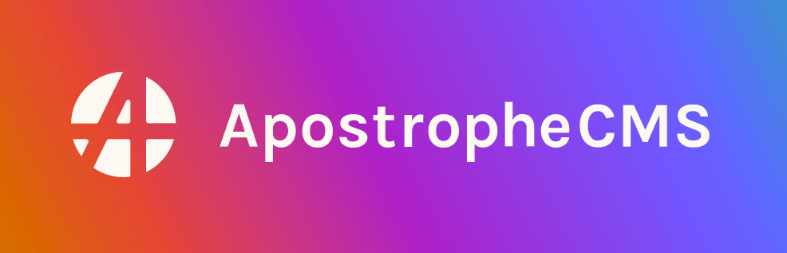
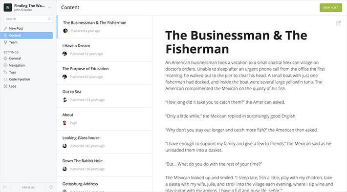

لطالما كان **دروبال** و **جوملا** المنافسين الوحيدين لبرنامج إدارة المحتوى **ووردبريس**، السوق كان مقسما لثلاثة أشطر بين هؤلاء الثلاثة بنسب متفاوتة.

ولكن منذ ظهور تقنية **Node.js** بدأنا نشهد منافسين جدد يدخلون على الخط، مستفيدين من الشعبية الكبيرة التي اكتسبها Node.js منذ ولادته عام 2009.

في هذا المقال سنعرض أبرز برامج إدارة المحتوى CMS المدعومة من Node.js والتي بدأت شيئا فشيئا في بسط نفوذها على مستوى سوق صناعة ونشر المحتوى على الويب.

## [KeystoneJS](http://keystonejs.com/)

يعد **KeystoneJS** نظام إدارة محتوى قوي جدا وذو شعبية ممتازة، حيث حظي بأزيد من 11 ألف إعجاب (نجمة) على منصة Github.

KeystoneJS مبني على [إطار العمل إكسبريس Express](https://www.tutomena.com/web-development/javascript/what-is-expressjs/) وكذلك MongoDB لإدارة قاعدة البيانات، ويضع بين أيدي المستخدمين العديد من الأدوات والإمكانيات التي نجدها في أغلب برامج إدارة المحتوى وأطر العمل مثل تعيين المسارات Routes ونظام للقوالب ونماذج البيانات Routes وطبعا نظام لإرسال الإيميلات إلخ...

يضاف إلى كل هذا توفر KeystoneJS على لوحة تحكم رائعة وقابليته للتخصيص عن طريق الإضافات Extensions كما هو معتاد عند معظم برامج إدارة المحتوى.

## [EnduroJS](https://www.endurojs.com/)

برنامج **EnduroJS** على طريقة برنامج Grav المدعوم من PHP والذي [سبق لنا شرحه في درس سابق](https://www.tutomena.com/web-development/php/grav-cms/)، أي أنه يعتمد بشكل كامل على الملفات ولا يضم أي قاعدة للبيانات.

ميزة هذا النوع من أنظمة إدارة المحتوى هي سهولة التثبيت والنشر، كما أن الإحتفاظ بنسخة للموقع سهل للغاية، يكفي تحميل ملفات الموقع وضغطها على شكل ملف Zip وليس عليك القلق بشأن خادم قاعدة البيانات لأنه غير موجود أصلا :)

EnduroJS ليس بشعبية وشهرة KeystoneJS ولكنه قد يكون خيارا جيدا على حسب حجم ونوعية الموقع الإلكتروني الخاص بك.

## [Apostrophe](http://apostrophecms.org/)

أعجبني هذا البرنامج كثيرا، تستطيع التعديل على المحتوى إنطلاقا من الواجهة الأمامية للموقع، وكذلك استخدام خاصية السحب والإفلات Drag and Drop لتغيير أماكن مكونات واجهة المستخدم.

يتمتع **ApostropheCMS** كذلك بعدد معتبر من الإضافات للمزيد من الميزات ويضم كذلك مكتبة لرفع الصور وإدارتها وإعادة استخدامها بسهولة في الموقع.

## [Ghost](https://ghost.org/)

**Ghost** هو بدون شك الأشهر في هذه اللائحة، هذا البرنامج قوي ويتمتع بكافة مقومات أنظمة إدارة المحتوى العصرية. يتميز بسهولة التثبيت ويوفر تجربة مستخدم ممتازة في الكتابة وصناعة المحتوى.

يعتمد **Ghost** على إطار العمل Ember في الواجهة الأمامية ويستخدم نظام القوالب Handlebars و Mysql لإدارة قاعدة البيانات.

يحظى Ghost بشعبية كبيرة جدا في منصة Github حيث حصل على أزيد من 24 ألف إعجاب ويتابع (Watched) من طرف أزيد من 1000 مطور.
