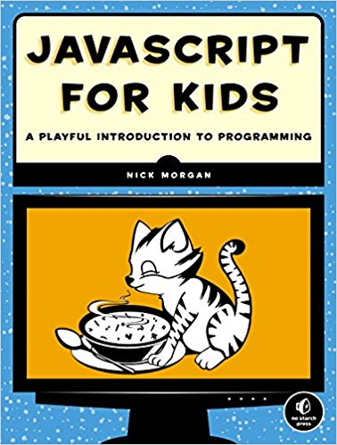
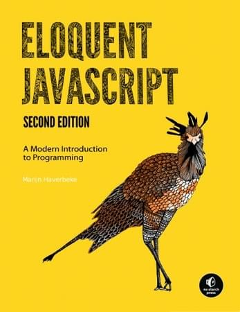
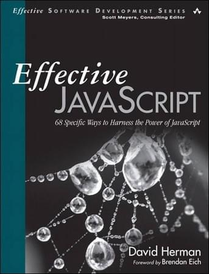
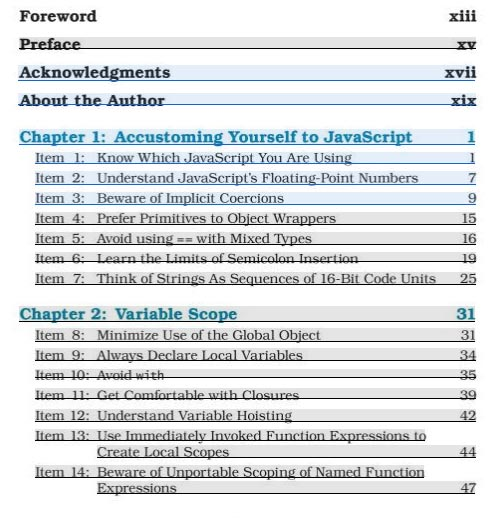
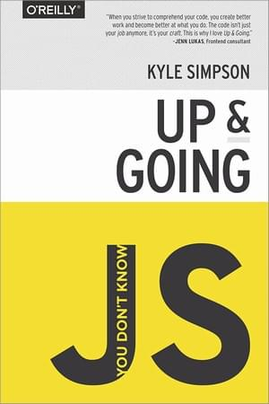

تحدثنا أكثر من مرة عن أن **لغة البرمجة جافاسكريبت** [باتت صناعة رائجة ومن بين أكثر اللغات طلبا في سوق العمل](https://www.tutomena.com/web-development/javascript/javascript-dominance/). هذه اللغة شهدت تطورا ونموا كبيرا جدا في العشرية الأخيرة وبالتحديد منذ ظهور **محرك V8** الذي طورته شركة غوغل خصيصا لمتصفح **كروم** من أجل تنفيذ أكواد الجافاسكريبت بسرعة أكبر بكثير مما كان متاحا قبل ذلك.

في ذات الوقت قام مهندس برمجيات اسمه **Ryan Dahl** باستغلال هذا المحرك المفتوح المصدر وبنى عليه مشروعا جديدا سماه **Node.js** ونقل به الجافاسكريبت لمستويات أعلى وفتح به آفاقا جديدا للمطورين لم يكونوا ليحلموا بها لولا هذه التقنية الجديدة.

ولأن هذا هو أفضل وقت لتعلم الجافسكريبت والتقنيات المرتبطة بها، سنستعرض لكم في هذا المقال أهم **كتب الجافاسكريبت** الواجب على كل مطور متخصص قراءة واحد منها أو اثنين على الأقل لاستكشاف خبايا ومميزات هذه اللغة التي لن تجدها ربما في المدونات التي تتابعها أو الدورات التي تشاهدها على اليوتيوب.

## JavaScript for Kids: A Playful Introduction to Programming

نفهم من العنوان (**الجافاسكريبت للأطفال**) أن هذا الكتاب موجه للأطفال وحسب، ولكن هذا غير صحيح فالطفل هنا هو كل شخص ما يزال في بدايات حياته مع البرمجة. مثل هذه الكتب تكون سهلة الإستيعاب وممتعة، ويتم إغناؤها بأمثلة واضحة بحيث يسهل على أشد الناس غباءً فهمها والتعلم منها. لذلك، صديقي المبرمج المبتدئ، لن تندم أبدا باقتنائك هذا الكتاب وستشكر حتما مؤلفه بعد الإنتهاء منه.

## Eloquent JavaScript: A Modern Introduction to Programming

هذا الكتاب بمثابة تحفة فنية لمؤلفه **Marijn Haverbeke**، حيث يرسم لك خريطة طريق لاستيعاب المفاهيم الأساسية في الجافاسكريبت. ويتميز كذلك الكتاب بكونه مليئا بالأمثلة والتمارين التطبيقية وبالتالي يتوازن فيه الجانبان النظري والتطبيقي.

**Eloquent JavaScript** من أشهر كتب لغة البرمجة جافاسكريبت و لاتكاد مكتبة أي مطور جافاسكريبت محترف تخلو منه.

## JavaScript: The Good [Parts](https://www.amazon.com/JavaScript-Good-Parts-Douglas-Crockford/dp/0596517742/)

قام **دوغلاس كروكفورد** بتأليف هذا الكتاب في عام 2004، وهو من أقدم كتب الجافاسكريبت المعروفة.

أُلِّف هذا الكتاب في وقت كانت فيه الجافاسكريبت مجرد لغة لإضافة بعض التأثيرات لصفحات الويب ولم تكون تقنية الأجاكس قد ظهرت بعد في ذلك الوقت، أي أن المستخدم في ذلك كان مجبرا على إعادة تحميل الصفحة لإجراء اتصال بالخادم مهما كان الغرض من هذا الإتصال بسيطا.

ولكن رغم كل هذه الإمكانيات المحدودة، آمن كروكفورد بالجافاسكريبت وعلم أن هذه اللغة تستحق سبر أغوارها وإبراز إمكانياتها الكامنة في كتاب أقل ما يقال عنه أنه مرجع في مجاله، كيف لا والمؤلف واحد من خبراء الجافاسكريبت المعروفين على مستوى العالم.

فقط تجدر الإشارة إلى أن هذا الكتاب عالي المستوى وقد لا يتناسب مع المبتدئين.

## Effective JavaScript: 68 Specific Ways to Harness the Power of JavaScript

بعد أن تكون قد وضعت نفسك على أساس متين، سيساعدك كتاب **Effective JavaScript** على الدفع بمهاراتك في الجافاسكريبت نحو الأمام.

هذا الكتاب سيمشي معك خطوة بخطوة للبقاء على بينة من أفضل الممارسات الواجب تتبعها للإرتقاء بمستوى وفعالية أكوادك البرمجية. فمثلا سيقوم الكتاب بإقناعك بضرورة تجنب استخدام == للتأكيد من تساوي بيانات من أنواع مختلطة Mixed Types إضافة لتعليمك كيفية العمل بدوال Closures وتصميم الواجهات البرمجية API Design إلخ...

الكتاب مقسم لعدة أجزاء/أبواب وفي نهاية كل جزء يذكرك الكاتب بما يجب عليك تذكره وفهمه.

النقطة الوحيدة التي يمكن اعتبارها سلبية في هذا الكتاب هي أنه يتمحور حول إصدار ES5، كما أنه لا يتطرق إطلاقا لتنقية Node.js. لكن لا يجب أن يمنعك هذا من شراء الكتاب وقراءته، فهو بمثابة كنز لك مهما كان مستواك متقدما في الجافاسكريبت.

## You Don't Know JS

هذه سلسلة من 6 كتب غاية في الروعة، وعنوان هذه السلسلة (**أنت لا تعرف الجافاسكريبت**) يعكس بقوة جودة مضمونها ومحتواها. حتى أكثر المطورين خبرة في الجافاسكريبت نصحوا بمطالعة هذه الكتب واعترفوا بأنهم اكتشفوا من خلالها أمورا وجزئيات لم يكونوا على دراية بها من قبل.

استطاع **Kyle Simpson** أن يخرج كتابا قيما لحيز الوجود وإغناء مكبتة الجافاسكريبت بهذه السلسلة التي أشاد بها الخبراء والمبتدؤون على حد سواء.

### **عناوين الكتب الستة المكونة للسلسلة:**

- Up & going.
- Types & grammar.
- This & Object Prototypes.
- Scope & Closures.
- ES6 & Beyond.
- Async & Performance.

يمكنك [قراءة كتب سلسلة You Don't Know JS بالمجان على منصة Github](https://github.com/getify/You-Dont-Know-JS/) إذا لم تستطيعوا شراء النسخ الورقية :)

### **نهاية المقال**

هناك كتب كثيرة تعنى بلغة الجافاسكريبت ولكن حاولت قدر المستطاع حصر اللائحة في أقل عدد ممكن من الكتب التي تشمل كافة جوانت هذه اللغة وموجهة لجميع المستويات.

سأكون سعيدا جدا بسماع آرائكم حول هذه الكتب في التعليقات، وإذا كنتم ترون كتبا أخرى تستحق التواجد في هذه اللائحة فلا تترددوا بمشاركتها معنا :ـ)
