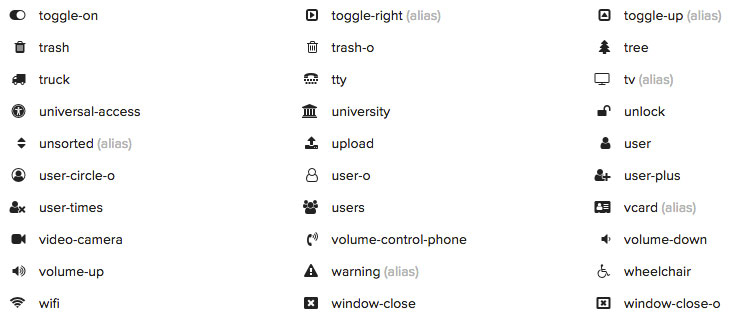
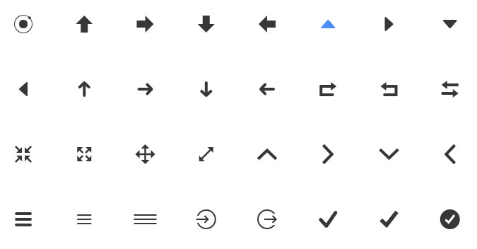
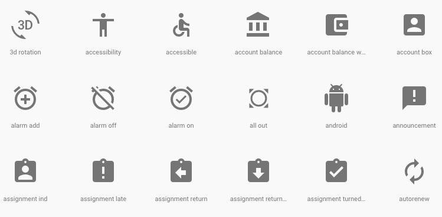
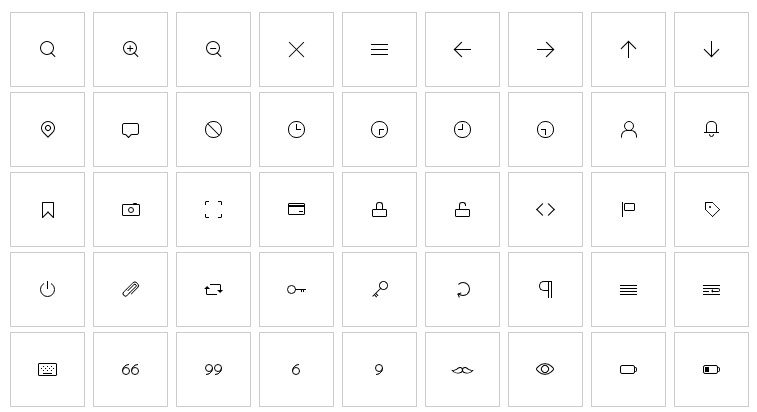

استخدام الأيقونات أصبح شائعا اليوم في تطبيقات الويب وغيرها، فالأيقونات تمكن المصمم من إضافة نوع من الجمالية للتصميم وجذب اهتمام وإعجاب المستخدم بأبسط الطرق. كما تعزز هذه الأيقونات ما يسمى **إمكانية الوصول** Accessibility داخل التطبيق وخاصة في شاشات الموبايل ذات الأبعاد الصغيرة حيث تستخدم الأيقونات بكثرة عوض النصوص لعدم توفر المساحة الكافية.

في هذا الموضوع، سنلقي الضوء على عدد من حزم الأيقونات المجانية الأكثر استخداما في مجال تصميم الويب.

## [Linea](http://www.linea.io/)

حزمة لينيا Linea توفر عدد كبير من الأيقونات ذات الجودة العالية وعلى ثلاثة أشكل مختلفة : SVG icons، Icon fonts و PNG Icons، وبشكل عام فإن :

- **Icon Fonts** : تستخدم على أنها خطوط  Fonts اعتيادية حيث يتم التحكم في أحجامها عن طريق الخاصية font-size وتعمل تقريبا على جميع المتصفحات والأجهزة.
- **SVG Icons** : جميعا نعلم جودة أيقونات SVG التي تعتمد على الرسم المتجهي، وهي بالتالي تحافظ على جودتها العالية مهما كان حجمها كبيرا أو صغيرا.
- **PNG Icons** : هذا النوع عبارة عن صور png اعتيادية.

يمكنك اختيار النوع الذي تريد استخدامه في مشروعك على حسب احتياجك ورغبتك.

## [Font Awesome](http://fontawesome.io/icons/)

ليس هناك مصمم أو مطور ويب لا يعرف مشروع Font Awesome، أشهر حزمة لأيقونات من نوع Fonts وأكثرها شعبية على منصة Github.

يضع Font Awesome بين أيدينا عددا كبيرا جدا من الأيقونات التي تغطي جميع المجالات تقريبا وتوفر توافقية مثالية مع جميع المتصفحات.

## [Ionicons](http://ionicons.com/)

مجموعة رائعة من الأيقونات من فريق [إطار العمل ايونيك](https://www.tutomena.com/web-development/javascript/introduction-to-ionic2/) الخاص ببرمجة تطبيقات الموبايل. تضم هذه الحزمة أزيد من 260 أيقونة تستطيع استخدامها في أي مشروع وليس فقط في مشاريع Ionic.

## [Material Icons](https://material.io/icons/)

هذه حزمة من مشروع **Material Design** الخاص بغوغل، تضم أزيد من 900 أيقونة تستطيع استخدامها في كافة مشاريعك البرمجية سواء منها مشاريع الموبايل أو الويب.

يمكن تحميل الأيقونة على شكل png، svg أو حتى Icon Font.

## [CSS ICONS](http://cssicon.space/#/)

هذه حزمة أخرى تتبع طريقة مختلفة عن كل سابقاتها، فأيقوناتها ليست بصور png ولا svg ولا حتى icon font، بل هي مجرد أكواد css و html، لست مضطرا لتحميل أي شيء لإضافتها لصفحتك. كل ما عليك فعله هو نسخ الكود الخاص بالأيقونة من الموقع ولصقه في ملف css الخاص بك وإضافة كود html الخاص بالأيقونة، فقط!

هذا مثال عن طريقة إضافة أيقونة CSS :

