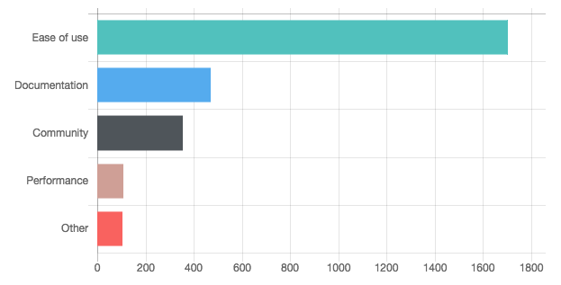
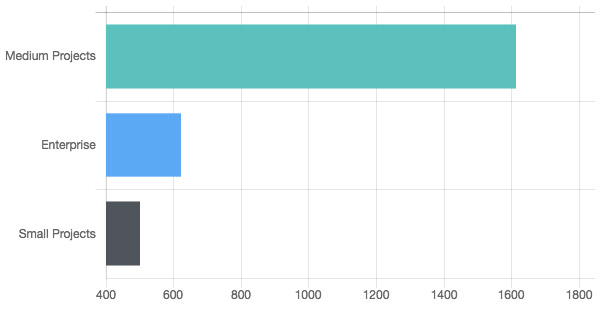
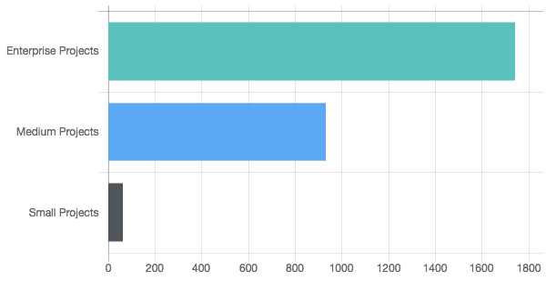
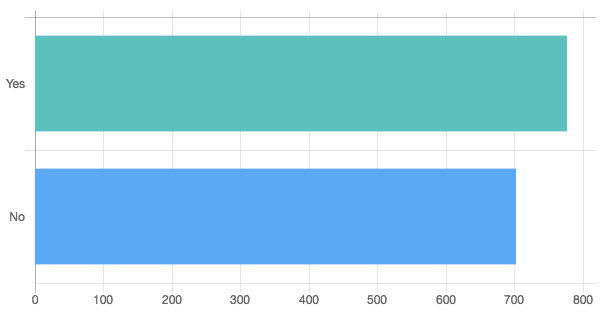
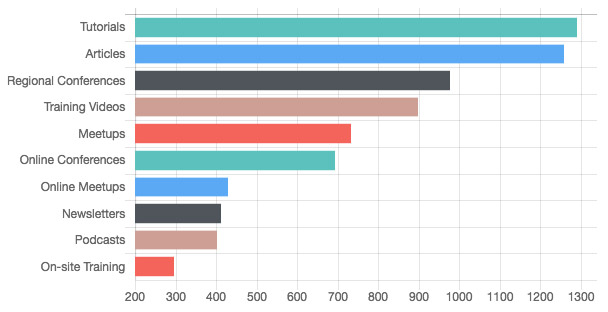
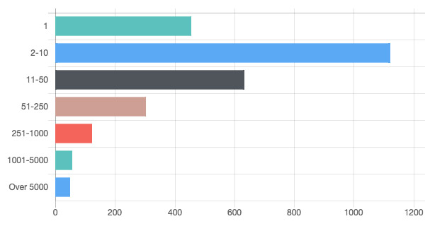

قام مؤخراً موقع [LaraJobs.com](https://larajobs.com/) بعمل استطلاع لرأي مستخدمي إطار العمل لارافيل من زوار الموقع. وبعد حوالي 2700 مشاركة قام الموقع بالإعلان عن نتائج الإستطلاع وجاءت على الشكل التالي :

## ما هو السبب الذي جعلك تختار لارافيل دون بقية إطارات العمل ؟

عزى معظم المستطلعين اختيارهم لإطار العمل لارافيل **لسهولة استخدامه** بالدرجة الأولى، ثم لجودة توثيقه Documentation وبعدهما جاء المجتمع النشيط كأحد العوامل التي جعلت المطورين يختارون هذا الإطار عوضا عن أحد منافسيه.

## ما حجم مشاريع لارافيل التي تشتغلون عليها ؟

الجزء الساحق من المستجوبين قالوا بأنهم يعملون على مشاريع لارافيل **متوسطة الحجم**، بينما قالت نسبة محترمة (حوالي 600 مطور) بأنهم يعملون على مشاريع كبيرة الحجم Enterprise.

## لارافيل إطار عمل قوي ومناسب ل :

نسبة كبيرة جدا من المشاركين، حوالي 95%، يرون بأن لارافيل ملائم للمشاريع الكبيرة والمتوسطة. بينما نسبة صغيرة جدا ترى بأنه يصلح للمشاريع الصغرى فقط.

## هل استطعت إيجاد مطوري لارافيل بالجودة التي تتمناها ؟

نتيجة هذا السؤوال مثيرة للإهتمام، فحوالي نصف عدد المستجوبين قالوا بأنهم لم يجدوا مطورين جيدين لمشاريعهم. هل هذا يعني أن كثرة مطوري Laravel مقارنة بباقي أطر عمل PHP لا تعكس جودتهم ومهارتهم ؟ لا نستطيع الجزم بإجابة محددة هنا.

## ماذا تتمنى أكثر من مجتمع لارافيل ؟

تمنى عدد كبير من المطورين وجود المزيد من الدروس التعليمية والمقالات عن لارافيل، كما تمنى بعض منهم إقامة مزيد من مؤتمرات لارافيل الجهوية للإحتكاك بالمتخصصين والمحترفين في هذا المجال.

## عدد موظفيك ؟

حوالي 40 في المائة من المشاركين في الإستطلاع قالوا بأنهم يمتلكون ما بين موظفين اثنين إلى عشرة موظفين، بينما أجابت شريحة أخرى بأنها توظف أعددا مهمة من المطورين تتراوح بين 11 و 50 مطورا. أما حوالي 15% من المستطلعين فقالوا بأنهم يشتغلون لوحدهم.
