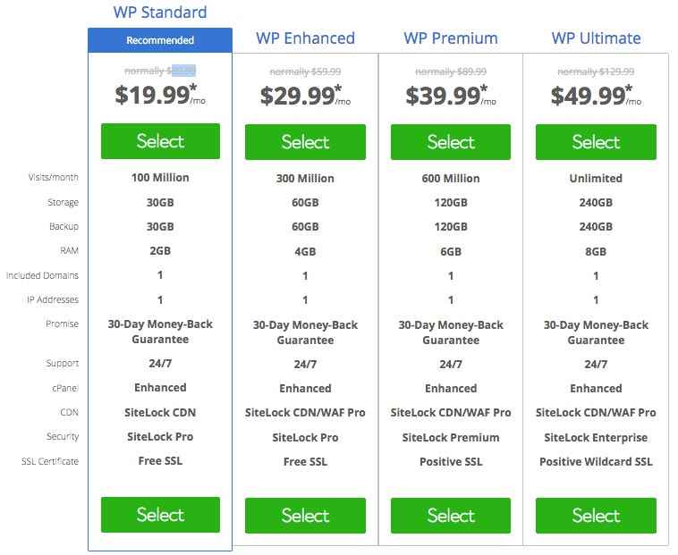

السرعة عامل غاية في الأهمية بالنسبة للمواقع الإلكترونية. سرعة تحميل صفحات موقعك تنعكس بشكل مباشر على تجربة مستخدميه وكذلك معدل الإرتداد الذي يقل تلقائيا كلما كان الموقع سريعا، هذه السرعة هي التي تشجع الزوار على تصفح المزيد من الصفحات وبالتالي البقاء طويلا في الموقع.

تجربة مستخدم جيدة ومعدل ارتداد منخفض كفيلان لوحدههما بتحسين ظهور موقعك على محرك البحث غوغل وبالتالي الحصول على زيارات عضوية كثيرة ومجانية.

هذه الحقائق تؤكد على ضرورة اتخاذ كافة الخطوات اللازمة لجعل مدونة ووردبريس الخاصة بك أسرع ما يكون.

## استضافات سريعة ومخصصة لمواقع ووردبريس

مهما حاولت برمجة قالب سريع أو شراء واحد مدفوع، فإن إمكانيات الأخير قد تصطدم بتدني قدرات خادم الإستضافة، وبالتالي فإن أول ما عليك التفكير به قبل افتتاح موقعك هو اختيار استضافة مميزة ومخصصة للووردبريس للحصول على أفضل النتائج.

في هذا الموضوع سنقترح عليك ثلاث استضافات، نعتقد أنها الأفضل على الساحة في الوقت الحالي، لمساعدتك على اتخاذ القرار الذي قد يكون صعبا على البعض في أحيان كثيرة.

### [1\. بلوهوست (BlueHost)](https://www.bluehost.com/products/wordpress-hosting)

شركة **بلوهوست** غنية عن التعريف في مجال خدمات الإستضافة على الويب، وتقدم العديد من العروض لمستخدميها، من بينها عرض خاص باستضافة مواقع ووردبريس: **Bluehost Wordpress Hosting.**

قد يكون هذا العرض أغلى من عرض الإستضافة المشتركة Shared Hosting، ولكنه يأتي مع العديد من المميزات التي تجعل موقعك سريعا كالبرق ويبدو معها المقابل المالي معقولا.

عرض BWH يضع بين يديك خادما وهميا خاصا أو ما يعرف ب VPS، وهذه التكنولوجيا تمكنك من حيازة جزء من خادم حقيقي لنفسك فقط، بينما في الإستضافات المشتركة، يتشارك المستخدمون موارد خادم واحد مما قد يجعل موقع أحدهم يتأثر بما يفعله الآخرون على نفس السيرفر.

ولكن هذا ليس كل شيء...

عرض بلوهوست لإستضافة ووردبريس يعتمد على الويب سيرفر **NGINX** عوض **Apache** الذي يستخدم في استضافات Bluehost المشتركة، ومعروف أن الأول يتفوق على الثاني في الأداء والسرعة خاصة في المواقع التي تستقبل زوارا كثيرين.

[اقرأ أيضا : (APACHE VS NGINX (PERFORMANCE COMPARISON](https://theorganicagency.com/blog/apache-vs-nginx-performance-comparison/)

#### مميزات أخرى لاستضافة بلوهوست الخاصة بووردبريس

- خدمة SiteLock مدمجة لتأمين موقعك.
- نسخ احتياطية أوتوماتيكيا مع توفير مساحة تخزينية خاصة بها Backup Storage.
- شهادة SSL مجانية.

هذا العرض يبدأ من 19.99 دولارا في الشهر وصاعدا على حسب الخطة التي تلائمك.

الصورة التالية لجميع الخطط الخاصة بعرض Bluehost Wordpress Hosting :

### [2\. Kinsta](https://kinsta.com/)

إذا كان المال لا يشكل لك مشكلا، فإن **Kinsta** هي أفضل استضافة مخصصة لووردبريس في هذه الأيام. عروض هذه الشركة ستكلفك مالا أكثر مقارنة بمعظم المنافسين، ولكنك بالمقابل ستحصل على خدمة ممتازة ستساعدك على الإرتقاء بموقعك وتطويره.

[bctt tweet="إذا كان المال لا يشكل لك مشكلا، فإن Kinsta هي أفضل استضافة مخصصة لووردبريس في هذه الأيام." username="tutomena" prompt="غرد على تويتر"]

تعتمد Kinsta في بيئتها التحتية على منصة Google Cloud Platform، هذا يعني بأن موقعك سيكون مستضافا على خوادم تابعة لشركة غوغل، وجميعنا نعرف قيمة هذه الشركة وسمعتها الممتازة في سوق الإنترنت بصفة عامة.

هذه ليست الميزة الوحيدة لخدمات Kinsta، فعروض هذه الشركة معدة خصيصا لضمان أداء فعال وعالي السرعة لموقعك، حيث تعتمد هي الأخرى على NGINX الذي قلنا عنه سابقا أنه أثبت تفوقه في السرعة والفعالية على منافسه Apache في عدد من السيناريوهات.

هذا، ويتم الإعتماد كذلك على إصدار **PHP7** المعروف بسرعته وأداءه العالي مقارنة بالإصدارات السابقة (PHP5.x). ولا ننسى كذلك الحضور القوي لخادم **MariaDB** لإدارة قواعد البيانات عوض Mysql. وذكرت عدد من دراسات الحالة أن MariaDB تتفوق على Mysql في الأداء بشكل لا يمكن تجاهله.

عندما يتم دمج كل هذه التقنيات والمميزات فإنك ستحصل على نتيجة مذهلة ستجعلك ربما تنسى المقابل الذي دفعته من أجل ذلك.

#### مميزات أخرى في استضافة Kinsta

- ـ لوحة تحكم مخصصة وسهلة الإستخدام عوض لوحة cPanel الإفتراضية.
- Staging Site: باستطاعتك إنشاء نسخة عن موقعك لإختباره قبل نشره.
- الدعم الفني ممتاز: تحدث العديد من زبناء **Kinsta** عن روعة دعمهم الفني وتفاعلهم مع رسائل وطلبات العملاء.
- نسخ احتياطية لملفات موقعك بشكل أوتوماتيكي.

### [3\. SiteGround](https://www.siteground.com/wordpress-hosting.htm)

من ناحية الأسعار، يمكن مقارنة **SiteGround** بخيار BlueHost الذي تطرقنا إليه في الأول، فكلاهما يقدمان أسعارا تلائم المبتدئين في التدوين ومشاركة المحتوى. ولكن هذا لا يمنع أن هناك اختلافا واضحا في التقنيات التي تعتمدها كلتا الشركتين.

تعمتد SiteGround على الإستضافات المشتركة Shared Hosting، ورغم أن هذه الحقيقة غير جيدة ويمكن أن يكون لها تأثيرات سلبية على جودة الأداء والسرعة إلا أن SiteGround حاولوا تدارك هذه النقطة السلبية بتوفير عدد من الميزات الأخرى التي لا نجدها في Bluehost و Kinsta. على سبيل المثال :

- الإعتماد على بروتوكول **HTTP/2** عوض إصدار HTTP القديم الذي يستخدم في غالبية الإستضافات المشتركة عند المنافسين.
- شهادة **SSL** مجانية عن طريق خدمة **Let's Encrypt**.
- الإعتماد على إصدار **PHP 7** الحديث.
- استخدام وحدات تخرين من نوع SSD ومعروف أن أقراص SSD تتفوق على أقراص HDD القديمة في معظم الخصائص مثل السرعة وطريقة معالجة البيانات.
- قامت الشركة بتطوير **نظام للكاش** يعمل على ثلاث مستويات ويعطي نتائج ممتازة في تسريع الموقع ومساعدة خادم الويب على معالجة أكبر قدر ممكن من الطلبات في أسرع وقت.

## ماهي استضافة ووردبريس التي يجب عليك اختيارها من بين هذه الخيارات ؟

جميع الخيارات التي ذكرناها أعلاه ثبتت جودتها وسرعتها بحسب آراء وشهادات عدد من مستخدميها.

خياري **Siteground** و**Bluehost** يلائمان أكثر المبتدئين الذين لا يملكون الإمكانيات اللازمة لدفع أسعار **Kinsta** الغالية نسبيا.

أما إذا كان همكم الأول ليس المال وتبحثون عن أسرع استضافة مع خطط تلائم جميع أحجام المواقع، فإن **Kinsta** هي على الأرجح الخيار الأفضل لمستخدمي ووردبريس بشهادة عدد من المدونين المعروفين.

---

صديقي، ما رأيك في هذه الإستضافات ؟ هل جربت إحداها ؟ إذا كانت لديك توصيات أخرى نرجو مشاركتها في التعليقات في الأسفل حتى تعم الفائدة :)
