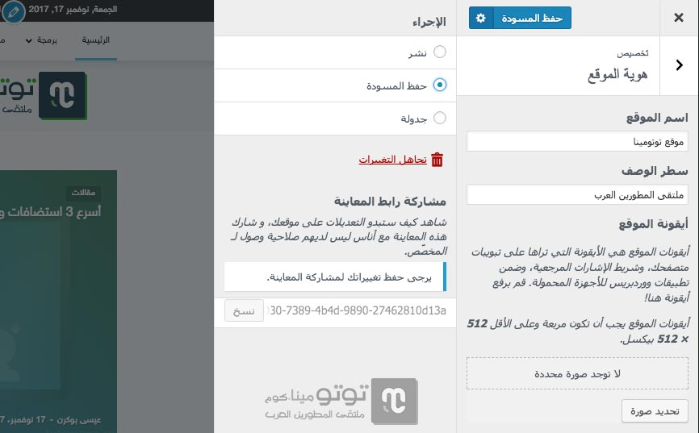
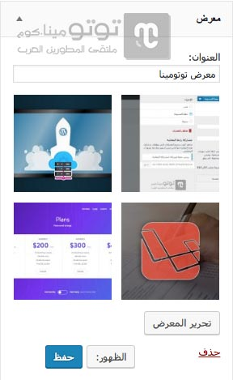
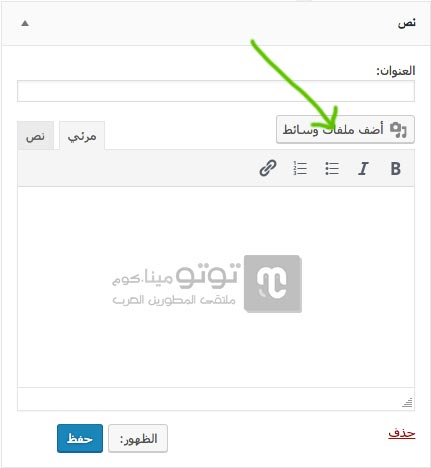
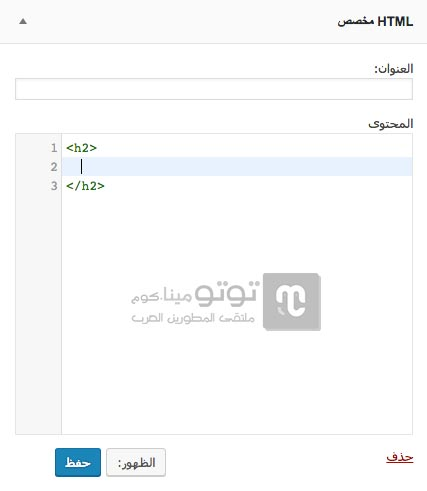

تم مؤخرا طرح إصدار **ووردبريس 4.9** الجديد. هذا الإصدار حمل معه العديد من الميزات والإضافات الجديدة لبرنامج إدارة المحتوى الأشهر على مستوى العالم.

في هذا الموضوع سنتعرف على أهم هذه الميزات التي من المؤكد بأنها ستعجب غالبية مستخدمي ووردبريس.

## مسودات وجدولة تخصيصات تصميم الموقع

نستطيع منذ وقت طويل حفظ المسودات والمراجعات للمقالات وجدولتها للنشر مباشرة بالتاريخ والتوقيت الذي نختاره. مع إصدار ووردبريس 4.9، يمكننا كذلك الآن تعديل تصميم الموقع عن طريق المخصص Customizer بسهولة وجدولة تلك التغييرات لنشرها وتفعيلها مباشرة بالوقت الذي يحلو لنا.

بعد حفظ هذه المسودة، سيتوفر لديك رابط خاص لمشاركته مع من تريد وسيكون بوسع الأخير رؤية التغييرات التي قمت بحفظها في المسودة.

## ودجت جديد لإضافة معرض للصور

منذ الإصدار السابق، ووردبريس 4.8، أصبح بالإمكان إضافة فيديوهات، صور وملفات سمعية audio للموقع عن طريق مجموعة من الودجات الجديدة.

أما الآن مع **إصدار ووردبريس 4.9**، فلقد أصبح بإمكاننا كذلك إضافة معرض للصور Gallery عن طريق ودجت جديد خاص لهذا الهدف.

## إمكانية إضافة وسائط إلى ودجت النص

في الإصدار السابق، تم إضافة محرر النصوص الغني لودجت النص، ولكن لم يكن بالإمكان إضافة صور أو أي نوع من الملفات لهذا الودجت لأنه لم هناك زر إضافة وسائط. لحسن الحظ، تدارك مطورو ووردبريس الموقف في الإصدار الجديد وقاموا بإضافة هذا الزر للودجت على غرار محرر النصوص الخاص بالمقالات. وبذلك أصبح بإمكاننا الآن إضافة صور لودجت النص دون الإضطرار للتعديل على كود html لفعل ذلك.

## تحسين تجربة كتابة الشفرات البرمجية

تم تحسين تجربة كتابة الأكواد البرمجية المتعلقة بال CSS و HTML سواء في المحرر الخاص بالقالب أو في محرر ودجت الـ HTML المخصص المضاف في ووردبريس 4.8.1.

فمثلا عندما أريد كتابة وسم `<h2>` فإن محرر ودجت HTML سيقترح علي عدد من الخيارات بمجرد كتابة الحرف h وعندما أختار h2 فإنه يقوم بغلق الوسم تلقائيا، تماما كما اعتدنا في محررات الشفرات البرمجية الإعتيادية.

ستساعدك هذه الميزات على فحص الكود بسهولة وإصلاح الأخطاء بسرعة وخفة.

---

هذه تقريبا أهم الإضافات الجديدة في ووردبريس 4.9، إذا أعجبك الموضوع لا تنسى مشاركته مع أصدقائك على فيبسوك وباقي منصات التواصل.
