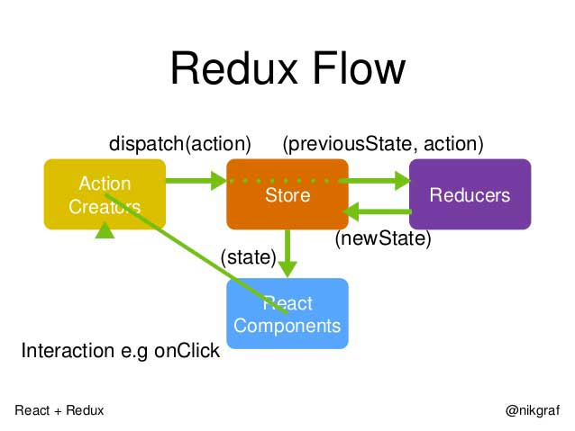

سبق وشرحنا في مقال تعليمي سابق [إطار العمل React Native لبرمجة تطبيقات أصلية للأجهزة المحمولة](https://www.tutomena.com/web-development/javascript/%d9%85%d9%82%d8%af%d9%85%d8%a9-%d8%b9%d9%86-react-native/)، ورأينا بأن هذا الإطار مطور ومدعوم من شركة فيسبوك ويعتمد على فلسفة **React.js** في كتابة الشفرة البرمجية.

استخدام **React Native** في تطوير تطبيقات الموبايل أصبح واسع الإنتشار وباتت بفضله هذه الصناعة تستقطب أعدادا كبيرة من مطوري جافاسكريبت لمزاحمة مطوري سويفت، جافا و كوتلن في هذا المجال :)

في مقال هذا اليوم، سنكتشف معا مجموعة من أهم الأدوات والتقنيات التي يستعين بها معظم المطورين في عملهم مع React Native للحصول على بيئة عمل أكثر فعالية وقوة.

## محررات الشفرة البرمجية

عندما نتكلم عن محررات النصوص البرمجية فيجب الإعتراف بأن **Visual Studio Code** حقق طفرة كبيرة في العامين الأخيرين وبات ينافس بقوة Sublime Text على هذه الكعكة.

نسبة كبيرة جدا من مطوري React Native يستخدمون محرر **فيجوال ستوديو كود** نظرا للإمكانات التي يوفرها افتراضيا كالتوافقية الممتازة مع برنامج إدرة النسخ Git، تتبع الأخطاء وتصحيحها (Debugging) وكذلك خاصية IntelliSense التي تتيح لك توفير الوقت عند إدخال الأكواد و إستكمالها إلخ ...

أما ما يجعل استخدام VS Code في برمجيات React Native أمرا رائعا وممتعا فهو الإمتداد (extension) الممتاز [React Native tools](https://marketplace.visualstudio.com/items?itemName=vsmobile.vscode-react-native). هذا الإمتداد يعطي للمحرر توافقية رائعة مع إطار العمل React Native، حيث يضيف خاصية الإكمال التلقائي للأكواد وتتبعها Debugging داخل المحرر نفسه مما يجعل الأخير أقرب لبيئة تطوير متكاملة IDE من مجرد محرر نصوص برمجية.

## أداة Expo

ما رأيك لو قلت بأنك لن تكون بحاجة لحاسب ماك ولا بيئة **XCode** أو حتى **أندرويد ستوديو** لبرمجة تطبيقات iOS وأندرويد بواسطة React Native ؟ ربما ستشك في كلامي ولن تصدقه، ولكن مع [Expo](https://expo.io/) هذه هي الحقيقة.

كل ما عليك فعله هو التالي :

- استخدام الحزمة [create-react-native-app](https://facebook.github.io/react-native/blog/2017/03/13/introducing-create-react-native-app.html) لإنشاء مشروع React Native.
- بعد ذلك ادخل لمجلد المشروع وقم بتنفيذ الأمر _npm start_.
- انتظر حتى يتم عرض **كود QR** على نافذة الأوامر السطرية.
- قم بتحميل تطبيق Expo من متجر التطبيقات على هاتفك.
- قل لتطبيق Expo أن يقرأ (Scan) ال **QR Code** الذي تم توليده في نافذة الأوامر.
- انتظر قليلا.
- مبروك :) التطبيق الذي تشتغل عليه سيفتح في هاتفك.

الأمر بهذه البساطة نعم.

الجميل كذلك أنك لن تظطر لإجراء أي تغيير على بيئة العمل الخاصة بك؛ اعمل على المحرر المفضل لديك ودع الباقي للسيد Expo.

<iframe width="560" height="315" src="https://www.youtube.com/embed/IQI9aUlouMI?rel=0" frameborder="0" allowfullscreen="allowfullscreen"></iframe>

الجانب السلبي الوحيد لهذه التقنية هي أنها لا تدعم الوصول لجميع الوظائف الأصلية Native Functionalities لهاتفك. طبعا هنالك دعم لعدد كبير جدا من المكونات الأكثر استخداما في التطبيقات مثل الوصول لجهات الإتصال Contacts، الخريطة، التسجيل بواسطة فيسبوك، الكاميرة، الإتصال بمنصة آدموب Admob للإعلانات، إرسال التنبيهات إلخ... ولكن عندما تريد شيئا غير موجود في سلسلة المكونات التي تدعمها أداة Expo فإنك تصبح مضطرا للإستغناء عنها نهائيا والقيام بعملية **_eject_** لمشروعك للإنتقال للعمل بواسطة الواجهات البرمجية APIs التي يتيحها لك React Native والبحث عما تريده باستخدام خطتك الخاصة.

## اختبار الكود

سبق وذكرنا في مقال سابق بأن [عدد كبير من الشركات والمواقع العالمية الكبرى تستخدم React.js ومشتقاتها في تطبيقاتها](https://www.tutomena.com/web-development/javascript/websites-made-with-reactjs/)، من بين هذه الشركات موقع **AirBnb.com** المعروف في مجال الإيجار والسكن المشترك.

مطورو AirBnb قاموا بإنشاء مكتبة جافاسكريبت بغرض فحص واختبار مكونات React.js في مشاريعهم الداخلية، ولكنهم بعد ذلك قرروا طرحها للعموم وأسموها [Enzyme](https://github.com/airbnb/enzyme).

هذه المكتبة أصبحت منذ ذلك الحين أهم المكتبات التي يستخدمها مطورو React.js و React Native لإختبار شفراتهم البرمجية وهي متوافقة مع معظم مكتبات جافاسكريبت الخاصة بفحص الأكواد على غرار **Mocha** و **Jasmine**.

## برنامج Reactotron

يمكن ترجمة مصطلح Debugging على أنه تنقيح للكود، تصحيح للأخطاء أو حتى تتبع الكود لمعرفة كيف تجري الأمور في الكواليس. هذه العملية ضرورية في كل مهمة برمجية ولهذا الغرض بالذات تم تصميم برنامج سطح المكتب **Reactotron**.

هذا البرنامج يمكن مطوري React و React Native من التحكم الكامل في أكوادهم البرمجية وتتبعها عبر إتاحة العديد من الميزات، أبرزها:

- معاينة حالات المكونات State في أي نقطة زمنية.
- الإطلاع على طلبات HTTP التي يقوم بها البرنامج.
- مشاهدة رسائل console.log.
- تتبع الأخطاء ومعرفة مصادرها.
- إلخ....

إذا سبق لكم العمل مع إضافة **React Developer Tools** على متصفح كروم فيمكنكم اعتبار Reactotron شبيها لها باستثناء أن الأخير برنامج مستقل ويدعم React Native كذلك.

## إدارة الحالة State Management

مفهوم الحالة جوهري في فلسفة React، وبالتالي فإن حسن إدارته والتعامل معه يعتبر غاية في الأهمية. فمع ازدياد حجم المشاريع فإن تغيير الحالة على الطريقة التقليدية بواسطة **setState** لا يكون الحل الأفضل، وعاجلا أو آجلا ستجد نفسك مسجونا في غرفة صغيرة مع تزايد أعداد مكونات التطبيق وتشابك العلاقات بينها، حينئذ قد يصبح مشاركة الحالات بين هذه المكونات جحيما لا يطاق بالنسبة لك، وستظطر للبحث عن مخرج لورطتك وتنظيم أفضل لطريقة تعاملك ما كل هذه الأشياء.

**Redux** هو واحد من أكثر الحلول استخداما في مواجهة هذه الإشكالية، بحيث يعتمد على فلسفة _Single Source Of Truth_ أي مصدر واحد للحقيقة وذلك بتخزينه كل الحالات في المشروع داخل كائن واحد يسمى Store ويتم اتصال كل مكون بحالاته الخاصة States عن طريق إطلاق Dispatch ما يسمى Actions والتي بداخلها تقوم بتحفيز كيانات تسمى Reducers التي تتولى مهمة تحديث الحالة وإرجاع قيمتها الجديدة.

يحظى Redux بشعبية كبيرة جدا في مجتمع React.js ولا تكاد تجد مقالا أو درسا عن الأخير إلا وتجد فيه إشارة عن Redux، ولو أن الأخير يمكن استخدامه بشكل مستقل في مشاريع جافاسكريبت بصفة عامة وليس مع React.js وحده.

## أدوات وتقنيات أخرى

### 1\. إرسال التنبيهات

عندما نتحدث عن التنبيهات فإنه لا يعلى على منصة فايربيز وخدمتها المعروفة Firebase Cloud Messaging هذه الخدمة تمكن من إرسال التنبيهات بكل سهولة نحو الأجهزة الذكية.

مطورو React Native يستخدمون الحزمة [react-native-fcm](https://github.com/evollu/react-native-fcm) لربط الإتصال بمنصة Firebase وإضافة ميزة إرسال التنبيهات لمشاريعهم.

### 2. مكتبة NativeBase

تعتبر مكتبة [nativebase](http://nativebase.io/) عبارة عن إطار عمل خاص بالواجهات الرسومية لمشاريع React Native، يمكن مقارنته بإطار العمل Bootstrap الذي اعتدنا استخدامه في تطبيقات الويب.

هذه المكتبة توفر عليك الوقت في إنشاء وتصميم المكونات الرسومية الخاصة بكل من مصتي أندرويد و iOS، وتجعلك تختصر وقتك الثمين لأعمال برمجية أخرى.

### 3. مكتبة React Navigation

تضع مكتبة [React Navigation](https://reactnavigation.org/) بين أيدينا نظاما سهلا للتنقل داخل التطبيق، قد يكون من صفحة لصفحة أو تبويب لتبويب إلخ... وتمرير البيانات والمعلومات بين كل منها والمزيد المزيد من المزايا الأخرى...

ليس من السهل القيام بكل هذه الأمور بيديك من الصفر، لذلك فإن هذه المكتبة كنز ثمين لكل مطور وستدرك أهميتها وقيمتها بعد أن تبدأ مشوارك مع **React Native**.

## النهاية

هكذا هي بيئة **React Native** بالنسبة لعدد كبير من المطورين، طبعا لن نتمكن من رسم الصورة الكاملة، فعالم الجافاسكريبت كما تعلمون جيدا غني ومتنوع، ولكن على الأقل استطعنا أن نطلعكم على العمود الفقري للبيئة التطويرية لمشاريع React Native.

ماذا عنك أيها المطور ؟ هل سبق لك العمل مع React Native ؟ ما هي التقنيات المهمة التي قمت باستخدامها ولم نذكرها في هذه اللائحة ؟ شارك معنا تجربتك في التعليقات :)
