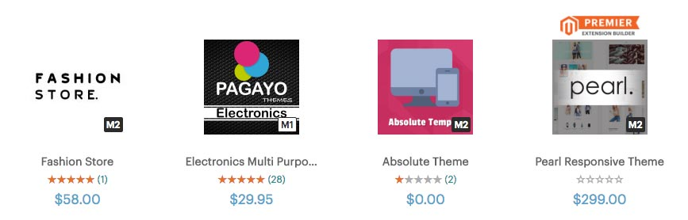

**ماجنتو** Magento هو برنامج مفتوح المصدر لإدارة المتاجر الإلكترونية. تم إطلاق النسخة الأولى منه في عام 2008، ومنذ ذلك الحين كبر وتم تطويره حتى أصبح نظام إدارة المتاجر الإلكترونية الأكثر قوة وشعبية خاصة لدى كبار التجار والفاعلين في مجال التجارة الإلكترونية على الإنترنت من قبيل **كوكاكولا**، **بورغر كينغ** وغيرهم.

ولكي نساعدكم، كمطورين، على التعرف على هذا البرنامج المطلوب بشدة في سوق العمل (بالخصوص في أمريكا)، قررنا كتابة هذا الموضوع الذي سنذكر فيه مجموعة من المعلومات والخصائص التي يتفرد بها ماجنتو، وكذلك سنستعرض أبرز الفوارق بين نسختي **ماجنتو 1** القديم و **ماجنتو 2** الأحدث.

## إنشاء متجر جديد بواسطة ماجنتو

يوفر ماجنتو نظاما غاية في المرونة لصناعة متجر إلكتروني مخصص عن طريق إتاحة عدد مهم من القوالب والوحدات التي تمكن من زيادة إمكانيات المتجر وإضافة مزايا أخرى إليه.

تستطيع كذلك الإستعانة بإضافات مدفوعة (Premium Extensions) وتعتبر في العادة أكثر جودة وتتيح كما أكبر من الميزات والإمكانيات.

وبما أنك مطور ويب، فتستطيع بطبيعة الحال إنشاء إضافات ماجنتو من الصفر في حالة لم تجد ما تبحث عنه فيما هو موجود. اطمئن، ستجد مجتمعا ضخما وكبيرا ليساعدك في إيجاد حلول للمشاكل البرمجية التي قد تواجهها.

هذا، وتجدر الإشارة بأن البرمجة من الصفر في بيئة ماجنتو تعني بطبيعة الحال إلماما جيدا بلغة البرمجة PHP التي بني عليها البرنامج بالكامل.

## الإنتقال إلى ماجنتو من نظام آخر منافس

يمكن الإنتقال إلى Magento من أي برنامج أو منصة أخرى منافسة، فمثلا يمكن نقل جميع منتجاتك، عملائك وكذلك لائحة الطلبات من **WooCommerce** أو **Shopify** إلى **ماجنتو** باستخدام الأداة [Cart2Cart](https://www.shopping-cart-migration.com/). هذه الأخيرة ليست مجانية وهذا ليس بالمستغرب إذا علمنا بأن **بيئة ماجنتو مكلفة بشكل عام من جميع النواحي** لأنها تستقطب عادة أصحاب رؤوس الأموال والمشاريع الكبيرة.

الإنتقال لا يعني فقط جلب المنتجات ولائحة العملاء، بل سنظطر كذلك لتخصيص قالب ماجنتو الخاص بنا عن طريق إضافة الوحدات والميزات التي تحتاجها، وهذا يعني احتياج صاحب المتجر لمطور متخصص لتقديم هذه الخدمات التي تتطلب معرفة تقنية لا يمكن بأي حال من الأحوال الإرتجال معها.

- [إقرأ أيضا: برامج إدارة المتاجر الإلكترونية الأكثر شيوعا](https://www.tutomena.com/blog/open-source-ecommerce-cms/)
- [إقرأ أيضا: مقارنة بين شوبفاي وماجنتو](https://www.tutomena.com/blog/shopify-vs-magento/)

## نسخة ماجنتو 1

هناك نسختين كبيرتين لبرنامج ماجنتو: Magento 1 و Magento 2 وكلاهما مدعومان بشكل رسمي.

نسخة **ماجنتو 1** هو الأقدم والأكثر استقرارا وكذلك الأكثر شعبية إلى حدود الساعة، السبب في ذلك هو خلوه شبه التام من الأخطاء والعيوب البرمجية وكذلك سهولة تنصيبه مقارنة بالنسخة الثانية.

تجدر الإشارة هنا إلى ضرورة التفكير مليا قبل اختيار **Magento 1**، هذا الأخير يعيش آخر شهور حياته ومن المنتظر انتهاء دعمه مع نهاية العام القادم. عندها سيكون من الواجب الإنتقال لنسخة Magento 2 المختلف بصفة كلية عن سلفه.

## نسخة ماجنتو 2

تم إصدار **Magento 2** لأول مرة عام 2015. صحيح أنه لم يصل بعد لمستوى شعبية Magento 1 ولكنه تطور كثيرا في العامين الأخيرين وقام مطوروه بإصلاح العديد من الأخطاء البرمجية التي عانى منها في الشهور الأولى من حياته.

ماجنتو 2 نظام أكثر تعقيدا وضخامة من سابقه، فلقد جلب معه العديد من المزايا الجديدة وباتت عملية التخصيص والتمديد أكثر تنظيما وترابطا. **ماجنتو** كذلك بات الآن يدعم نسخة **PHP 7** الجديدة وتحسن معه **نظام الكاش** Cache بشكل واضح وتجربة المستخدمين بشكل عام أصبحت أفضل مما كانت عليه.

كل هذا المزايا جعلت Magento 2 كما قلنا أكثر تعقيدا وتنصيبه أصعب على المبتدئين من عملية تنصيب النسخة الأولى، ولهذا فالمطورون من القادمين الجدد مطالبون بصفة عامة ببذل مجهودات أكبر في تعلم الواجهة البرمجية API لهذا النسخة الجديدة.

هناك مئات الإضافات المتوافقة مع Magento 2 وهي كافية إلى حد بعيد لتخصيص أي متجر إلكتروني مهما كان خاصا، وأسعار بعض الإضافات قد تكون إجمالا أعلى من أسعار إضافات Magento 1 وهذا يمكن رده لحقيقة المجهودات والمتطلبات التقنية التي بات يستوجبها تطوير هذه الإضافات مقارنة بالسابق.

## إصدارات ماجنتو

قسم ماجنتو طريقة طرح منتجه إلى إصدارين:

- الإصدار الأول اسمه Magento Open Source (سابقا Magento Community Edition).
- الإصدار الثاني معروف باسم Magento Commerce (سابقا Magento Enterprise Edition).

### Magento Open Source

إصدار **Magento Open Source** مجاني ومفتوح المصدر تماما مثل برامج إدارة المحتوى كووردبريس ودروبال. معظم الشركات الناشئة والمشاريع الصغيرة تبدأ بهذا الإصدار لأنه لا يتطلب أي مصاريف باستثناء مصاريف التطوير والإستضافة بطبيعة الحال.

### Magento Commerce

هذا الإصدار موجه بالذات للشركات الكبرى والمتوسطة التي تولد أرقام معاملات عالية لأنه إصدار مدفوع ويكلف مبالغ تعد بآلاف الدولارات في الشهر الواحد.

آلاف الدولارات التي يتم دفعها لماجنتو سيحصل صاحب المتجر مقابلها على عدة مزايا حصرية، منها:

- الدعم طيلة أيام الأسبوع وساعات اليوم.
- خدمات إضافية متعلقة بالدفع والتوصيل.
- خدمة الإستضافة.
- إمكانية الحصول على قوالب ماجنتو احترافية متوافقة بشكل جيد مع السيو **SEO**.
- ميزات حصرية ليست موجودة في إصدار ماجنتو مفتوح المصدر.
- والمزيد...

## نهاية المقال

**ماجنتو** نظام ذات شعبية قوية وتستطيع استغلال مهاراتك في لغة البرمجة **PHP** لكسب المال الوفير من وراءه. مطورو Magento الأكفاء من بين الأغلى في مجال الويب بشكل عام، أولا لأن مشاريع ماجنتو بصفة عامة تمتاز بميزانياتها الكبيرة وثانيا لأنهم ـ مطورو ماجنتو ـ عملة نادرة وليس من السهل على الإطلاق إيجاد محترف في هذا البرنامج خصوصا في المنطقة العربية.
