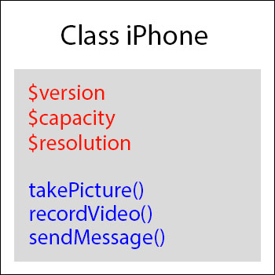

تطرقنا في هذه المدونة للعديد من التقنيات المختلفة، وكتبنا مواضيع عن **React.js **،**React Native **،**Node.js** وغيرها الكثير.

حتى أكون صادقا، فإني لم أكتب كثيرا عن **لغة البرمجة PHP** باستثناء بعض المقالات عن إطار العمل **لارافيل** و **ووردبريس** بطبيعة الحال. السبب في ذلك أنني أرى مقالات ودروس PHP كثيرة وتستحوذ على نسبة كبيرة من كعكة المحتوى العربي على الإنترنت، وبالتالي آثرت البحث عن مواضيع جديدة لم تحظى بنفس الإهتمام من المدونين والكتاب.

ولكن بعد تفكير مستفيض رأيت بأنه لا يمكن لمدونة تهتم بالبرمجة وتطوير الويب أن تخلو من دروس للغة البرمجة PHP الأكثر استخداما في تطوير وتصميم تطبيقات الويب والأكثر طلبا في سوق الشغل في العالم أجمع والمنطقة العربية بصفة خاصة.

من هذا المنطلق قررت أن أبدأ دورة مكتوبة عن **البرمجة الكائنية التوجه** (_Oriented Object Programming_) في لغة PHP، هذا النمط - OOP - الذي بات منذ زمن بعيد الأكثر اتباعا في مجال البرمجة بصفة عامة.

## ما معنى البرمجة الكائنية التوجه ؟

حتى نفهم جيدا معنى البرمجة الكائنية في لغة البرمجة PHP، يجب أن نعود بالتاريخ قليلا للوراء ونعرف طريقة **البرمجة الإجرائية** (Procedural Programming) المتبعة في البرمجة آنذاك والإشكاليات التي كانت تواجه المطورين معها.

### البرمجة الإجرائية

كلنا تقريبا بدأنا البرمجة في PHP باستخدام الطريقة التقليدية التي تعتمد على إنشاء مجموعة من الوظائف ربما في ملف واحد في بادئ الأمر، وبعد ذلك عندما تكون الشفرة البرمجية كبيرة نقوم بتقسيمها إلى عدة ملفات وتنظيم جميع وظائف البرنامج على شكل دوال نقوم باستدعائها عند الحاجة. لا يهمنا كيف نكتب الكود، المهم أنه يشتغل ويؤدي المهمة.

هذا جميل ويفي بالغرض في حالات عديدة، ولكن :

- ماذا لو أردنا تنظيم البرنامج أكثر ؟
- ماذا لو أردنا تقسيمه لمجموعة من الكيانات المستقلة والتي يمكنها في ذات الوقت أن تتفاعل مع بعضها البعض في إطار منظم وواضح ؟
- ماذا لو أردنا تشكيل البرنامج في قالب أقرب ما يكون إلى الحياة الوقعية التي نعيشها حيث كل شيء عبارة عن كائنات لها خصائص ووظائف ؟

نعم، من رحم هذه الأسئلة والتصورات ولدت البرمجة الكائنية. لسنا هنا ننتقص من قيمة البرمجة الإجرائية التي لها جمهور مازال يدافع عنها بشراسة ويراها أفضل أنماط البرمجة وأسهلها.

بالنسبة لي أرى بأن البرمجة الإجرائية قد يكون استخدامها جيدا ومقبولا في المشاريع الصغيرة والبسيطة، ولكن بالنسبة للمشاريع الكبيرة وحتى المتوسطة فالبرمجة الكائنية هي التي تعطي ضمانات أكبر وتستجيب بشكل ممتاز لمتطلبات وحالة السوق الذي لا أبالغ إن قلنا بأن جزءه الكبير يعتنق فلسفة البرمجة الكائنية، إذن لماذا نسير عكس التيار ؟

### البرمجة الكائنية التوجه

البرمجة الكائنية (تعرف أيضا **بالبرمجة الشيئية**) كما قلنا هي محاولة لمحاكاة الحياة الطبيعية الواقعية في مجال البرمجة، حيث أن حياتنا متشكلة من ملايين أنواع الكائنات التي لها خصائص ووظائف مختلفة قد تكون خاصة بها أو أنها ورثتها من أحد آبائها. هذه الكائنات تتفاعل فيما بينها ويستعين بعضها بالآخر أحيانا لإتمام وظيفته.

#### تعريف الكائن في البرمجة الكائنية

إذا نظرت من حولك ستجد مجموعة الكائنات أو الأشياء، على سبيل المثال الجهاز (موبايل مثلا) الذي تقرأ منه هذا المقال :)

هذا الجهاز لديه مجموعة من الخصائص _Properties_ لكل منها قيمة معينة، مثل:

- المساحة التخزينية (8GB - 16GB - 32GB - 64GB)
- نظام التشغيل (أندرويد، iOS، ويندوز، لينوكس ...إلخ)
- اسم الشركة المصنعة (سامسونغ، آبل، شاومي ...إلخ)
- دقة الكاميرا (4MP - 8MP - 12MP)

كل هذه تعتبر **خصائص** لهذا الجهاز ويتميز بها عن غيره.

في البرمجة الكائنية، تعتبر هذه الخواص بمثابة متغيرات داخل الكائن (*Object)* حيث يمكن تغييرها داخل البرنامج في أي وقت.

ولكن الكائن لا يقتصر فقط على امتلاك خصائص، بل أيضا له **وظائف **_Methods_ يقوم بها. بالبقاء في مثال الموبايل نجد أنه يقوم بالعديد من **المهام**، منها :

- التقاط الصور
- الإتصال
- حذف الوسائط
- إرسال رسائل

هذه الوظائف يعبر عنها في **البرمجة الشيئية** بدوال _Functions_ داخل الكلاس أو الصنف الذي يتبع له أو ينحذر منه هذا الكائن.

> مهلا يا عيسى! لقد ذكرت مصطلح الكلاس عدة مرات، نريد أن نعرف ما هو الكلاس (_Class_) وما علاقته بالكائنات ؟

#### ما هو الكلاس ؟

الكلاس ببساطة هو الصنف أو النوع الذي تنحذر منه كائنات أخرى، يمكن اعتباره كذلك القالب الذي بواسطته نقوم بتشكيل أو صناعة الكائنات أو الأشياء التي تتبع لهذا الصنف.

فمثلا جميع هواتف **آيفون 8** الموجودة في العالم هي عبارة عن أشياء أو كائنات _Objects_ تتبع للصنف أو الكلاس **_Class_** الذي اسمه آيفون 8، أي أن جميع الكائنات التي صنعت من خلال هذا الكلاس تتشابه ولها نفس الوظائف والخصائص. برمجيا، نقول بأن هاتف آيفون 8 الذي أملكه هو عبارة عن **_instance_** للكلاس آيفون 8 الذي قامت شركة Apple بتصميمه وبناءً عليه تقوم بصناعة هواتف iPhone 8 في مصانعها.

يمكننا القول كذلك بأن الكلاس آيفون 8 نفسه ينحذر من **كلاس أب** اسمه **آيفون** ويرث منه عددا من الوظائف والخصائص التي يتشاركها مع جميع أصناف آيفون الأخرى الموجودة في نفس مستواه مثل آيفون 7، آيفون 6، آيفون 5 إلخ... هنا نتحدث عن **مفهوم الوراثة** في البرمجة الكائنية والذي سنعود إليه بشيء من التفصيل في مواضيع لاحقة.

إذن، يمكن تقديم الكلاس *iPhone* على شكل المخطط في الصورة التالية :

[](../images/iphone-class.jpg)

الجزء المكتوب باللون الأحمر هي **خصائص** (_Properties_) وكما قلنا سابقا لكل خاصية قيمة معينة متغيرة وتختلف من كائن لآخر تابع لهذا الكلاس. أما الجزء المكتوب باللون الأزرق فيمثل **الوظائف** أو _Methods_ التي يتم استدعاؤها لجعل **الكائن** يقوم بوظيفة أو سلوك معين.

### تغليف الشفرة المصدرية للكلاس (**Encapsulation**)

عندما تريد أخذ صورة بواسطة هاتفك المحمول فإنك، **كمستخدم**، لست بحاجة سوى لفتح تطبيق الكاميرا والضغط على زر التصوير والباقي يتكفل به الهاتف، هذه هي **الواجهة** (_Interface_) التي أتاحتها الشركة المصنعة لمستخدمي هواتفها. لست بأي حال من الأحوال مطالبا بمعرفة ما يدور في الكواليس وكيف تعمل وظيفة التصوير وما هي أجزاء الجهاز التي تستعين بها الكاميرا للقيام بوظيفتها، هذا كله من شأن المصنع فقط؛ لا يجب على المستخدمين تفكيك الهاتف ومحاولة التعديل على وظائفه، إن استطاعوا ذلك، إلا إذا كانوا مستعدين لتحمل مسؤولية النتائج المترتبة على هذا الفعل.

هذا المبدأن نفسه متبع في البرمجة الكائنية التوجه، بعض الخصائص والوظائف لها استخدام فقط داخل الكلاس وليس على المستخدم الإطلاع عليها لأنها ليست ضمن **واجهة الكلاس** التي أتاحها المصمم للمستخدمين. تعرف هذه الوظائف بأنها خاصة **_Private_** ولا يمكن لمستخدم الكلاس الوصول إليها يدويا.

مبدأ التغليف **_Encapsulation_** هو أحد نقاط القوة الكبيرة للبرمجة الشيئية بحيث يمَكِّننا من حماية أجزاء حساسة من الشفرة المصدرية للكلاسات المكونة لتطبيقاتنا، والتأكد من أن استخدام الكلاس يقتصر فقط على الواجهات التي سمحنا نحن، **كمصممين للكلاس**، بالوصول إليها.

أظن بأننا قمنا بتجريد مفهوم **الكلاس** و**الكائنات** بشكل كافٍ لكي نمر مباشرة لكتابة أول كلاس على محرر الأكواد _Code Editor_ المفضل لدينا.

## إنشاء **كلاس** في لغة البرمجة PHP

الهدف من هذا الجزء هو محاولة ترجمة المثال السابق عن جهاز الآيفون إلى **كلاس** في لغة **PHP**.

إذن لنتعلم جميعا كيف نكتب هذا الكلاس :

```php
<?php
class Iphone // هنا الكلمة المفتاحية class متبوعة باسم الكلاس
{
  // هنا المكان الذي يتم فيه التصريح الخصائص والوظائف
}
```

هذا التركيب (_Syntax_) يجب حفظه عن ظهر قلب لأنه الطريقة الوحيدة لإنشاء الكلاس في لغة البرمجة PHP. على كل حال، لن يكون صعبا حفظه لأنه بسيط جدا :)

الآن سنقوم بصناعة الآلة أو **القالب** الذي يمكن من إنشاء هواتف **آيفون**، تماما كقالب الحلوى :) بينما في الجزء القادم سنرى كيفية إنشاء هذه الهواتف أو الكائنات انطلاقا من هذا الكلاس (القالب).

### إضافة الخصائص

دعونا الآن نبدأ في إضافة بعض الخصائص والوظائف للكلاس الذي أنشأناه.

```php
<?php
class Iphone
{
  private $version;        // إصدار الهاتف
  private $capacity; // المساحة التخزينية
  private $resolution;   // دقة الكاميرا
  private $color;       // لون الهاتف
}
```

تلاحظون هنا أننا قمنا بإضافة أربع خصائص لكلاس الآيفون متبوعة بالكلمة المفتاحية **_private_**. هذه الكلمة، كما رأينا في الجزء الذي تكلمنا فيه عن التغليف (_Encapsulation_)، تقول أنه لا يمكن الوصول لهذه الخاصية إلا من داخل الكلاس فقط، يعني نستطيع استخدامها فقط داخل الوظائف _Methods_ في الكلاس لمساعدة الأخيرة في أداء عملها كما يجب.

إلى جانب _private_ هناك طريقتين أخريين لتغليف الخصائص والوظائف في البرمجة الشيئية للغة PHP:

- **_public_** : هذه الطريقة كما يبدو من الإسم تقوم بعرض المصرح به (قد يكون خاصية أو وظيفة) للإستدعاء داخل الكلاس وخارجه، أي أن **التغليف هنا منعدم**. تستخدم public عادة للتصريح بالوظائف التي تكون جزءًا من الواجهة البرمجية للكلاس API، يعني تلك الوظائف المعروضة على المستخدم وليس تلك الخاصة بالعمل الداخلي والخاص للكلاس.
- _**protected**_ : التغليف بواسطة _protected_ يشبه كثيرا طريقة _private_، الفارق الوحيد هو أن _protected_ تمكن **الكلاسات الوارثة** من الوصول لهذا المصرح به. بعبارة أخرى : لا يمكن للمستخدم النهائي للكلاس الوصول إلى هذه الخاصية أو الوظيفة، فهي محمية ولكن يمكن الوصول إليها فقط من داخل الكلاس نفسه (كما هو الحال بالنسبة ل private) أو من داخل **الكلاسات الأبناء** لهذا الكلاس، يعني التي تنحذر منه.

[alert type="info" icon-size="normal"]ستتضح أكثر أهمية protected عندما نتكلم عن مفهوم الوراثة الذي يعتبر هو الآخر أحد الأعمدة الأساسية للبرمجة الكائنية التوجه. [/alert]

طبعا يمكن إعطاء قيم افتراضية لهذه الخصائص، هذه هي الطريقة :

```php
<?php
class Iphone
{
  private $version = '8';        // إصدار الهاتف
  private $capacity = 64; // المساحة التخزينية
  private $resolution = 12;   // دقة الكاميرا
  private $color = 'Gold';       // لون الهاتف
}
```

[alert type="info" icon-size="normal"]جميع خصائص الكلاس يجب أن تكون خاصة (Private)، ولتمكين المستخدم من الوصول إليها فإننا نقوم بذلك عن طريق وظائف تعرف ب Setters و Getters سنتعرف عليها بتفصيل في قادم الدروس.[/alert]

### إنشاء الوظائف

إنشاء **الوظائف** _Methods_ داخل الكلاس مثل إنشاء الدوال الإعتيادية في PHP، غير أنها تكون مسبوقة بإحدى الكلمات المفتاحية _protected_ ،_public_ أو _private_ التي شرحناها أعلاه.

```php
<?php
class Iphone
{
  private $version = '8';        // إصدار الهاتف
  private $capacity = 64; // المساحة التخزينية
  private $resolution = 12;   // دقة الكاميرا
  private $color = 'Gold';       // لون الهاتف

  public function takePicture() // وظيفة أخذ صورة
  {

  }

  public function recordVideo() // وظيفة تسجيل فيديو
  {

  }

  public function sendMessage() // وظيفة الرسائل القصيرة
  {

  }

}
```

هكذا تكون البنية الأساسية لأي كلاس في **لغة البرمجة PHP**. طبعا مستوى التعقيد يختلف من كلاس لآخر ومن مشروع لآخر، ولكن إذا فهمنا الأفكار والثوابت الأساسية فسيكون ذلك بداية ممتازة للذهاب بعيدا مع البرمجة بطريقة احترافية في هذه اللغة.

> هناك معايير معروفة ب PEAR Standards يستحسن احترامها عند كتابة أكواد PHP. من ضمن هذه المعايير أن إسم الكلاس يجب أن يبدأ دائما بحرف كبير UpperCase. هذه المعايير ليست إجبارية ولكنها كما قلنا متعارف عليها ومتبعة بشكل واسع من طرف مطوري PHP حول العالم.

## الخلاصة :

- **الكلاس** أو الصنف هو مجموعة من المتغيرات والدوال (**خصائص** و **وظائف**).
- الكائن هو نموذج يتم إنشاؤه بناءً على كلاس معين. (تذكر مثال هواتف آيفون).
- جميع خصائص الكلاس يجب أن تكون مغلفة بطريقة _private_، بينما الوظائف قد يكون بعض منها خاصا (private أو protected) والبعض الآخر معروضا للعموم (public).
- يتم إنشاء الكلاس باستخدام الكلمة المفتاحية _class_ متبوعة باسم الكلاس ثم أقواس معقوفة وبينهما نضع كل الكود الخاص بالكلاس.
