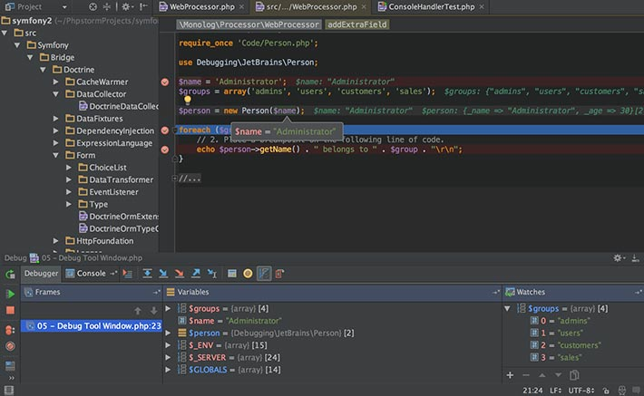

أشرنا في مقال سابق إلى كون [لغة البرمجة PHP الأكثر شعبية في مجال صناعة تطبيقات الويب](https://www.tutomena.com/web-development/php/why-php-is-so-popular/)، وقلنا أنها تدعم ما يزيد على **80 في المائة** من مجموع المواقع الإلكترونية حول العالم. هذه الحقيقية تفسر العدد الهائل من المطورين الذين يحترفون هذه اللغة ويتخذونها وسيلة لكسب عيشهم وتحقيق مداخيل مالية مهمة.

في هذا المقال سنستعرض أهم الأدوات التي يستخدمها مطورو لغة البرمجة PHP في روتينهم اليومي لتحقيق أعلى انتاجية ممكنة والتقدم بشكل أفضل في مسيرتهم الإحترافية.

## التوثيق الرسمي من موقع PHP.net

أول وأهم أداة لكل مطوري PHP وبلا نقاش هي التوثيق الرسمي من موقع PHP.net. هذا الموقع ضخم ويحتوي على جميع الجزئيات والتفاصيل التي يجب معرفتها عن هذه اللغة. سواء كنت محترفا أو في بداية الطريق، لا تستطيع بطبيعة الحال تذكر جميع ميزات ودوال PHP :) لهذا لا بد أن تفتح هذا الموقع من حين لآخر على متصفحك، فهو بمثابة محرك بحث خاص بلغة البرمجة PHP.

يمكنك الدخول لتوثيق PHP الرسمي أو تحميله من خلال [هذا الرابط](http://php.net/docs.php).

## كن جزءً من مجتمع PHP على منصة Github

لا يوجد مطور أو مبرمج لا يعرف [منصة github](https://github.com/) لمشاركة المشاريع البرمجية المفتوحة المصدر. من خلال هذا الموقع تستطيع الإطلاع على الشفرات المصدرية لمشاريع برمجية مرموقة وذات استخدام واسع في جميع لغات البرمجة تقريبا.

هذه العادة تمكن المطورين من الإطلاع على أكواد بعضهم البعض، وبالتالي الإستفادة منها وأخذ أفكار جديدة من خلال المنطق وطرق البرمجة المتبعة في أكبر المشاريع وأكثرها شهرة (لارافيل، جيكويري، أنغولار، React.js، سيمفوني، Node.js إلخ...).

ليس هذا فقط، بل يمكن لأي مطور حول العالم المشاركة في تطوير وتصحيح الأخطاء في هذه المشاريع وذلك عن طريق إرسال طلبات Git من نوع Pull (تعرف ب **Pull Requests**) إلى مستودع المشروع وبعدها يقرر القائمون عليه - المشروع - قبولها أو رفضها إذا كنت غير مجدية.

إمتلاك حساب على **Github** أمر شبه ضروري لكل مطور بصفة عامة، بل إن عددا معتبرا من الشركات أصبحت الآن تطلب من المتقدمين للوظائف عندها حسابهم على Github من أجل الإطلاع عليه ومشاهدة إسهاماتهم ونشاطهم في المجتمع البرمجي الذي ينتمون إليه.

## لا غنى عن مدير الحزم Composer

تقريبا لا يوجد الآن أي مشروع PHP لا يعتمد على مدير الحزم **Composer**، منذ عدة أعوام بات الأخير مدير الحزم المعتمد في مجتمع PHP وبدون منافس حقيقي. هو بمثابة مدير الحزم NPM بالنسبة ل Node.js وستكون بحاجة إليه في كل مراحل العمل على مشروعك. لن تضطر بعد الآن لتحميل الحزم والمكتبات التي تستخدمها بطريقة يدوية، **فالملحن** (ترجمة composer :) ) يتولى هذه المهمة عنك بل ويقوم بالتحميل التلقائي _Autoloading_ لهذه المكتبات دون أن تكتب أنت أي سطر برمجي لهذا الغرض.

[اقرأ أيضا مقال **ماهو Composer ؟** للمزيد من التفاصيل عن هذا الموضوع](https://www.tutomena.com/web-development/tools/composer-dependencies-manager/)

## PHPUnit لإختبار شفرتك المصدرية

شيئا فشيئا تشيع ثقافة اختبار الأكواد البرمجية بطريقة آلية بين المطورين، طريقة تحميل تحديث الصفحة على المتصفح للتأكد من أن عملنا يسير وفق المتوقع لم تعد تكفي! الخبراء باتوا ينصحون بضرورة كتابة اختبارات وحداتية (*Unit Testing)* عن طريق الكود نفسه وتنفيذها كلما انتهينا من برمجة وحدة معينة في مشروعنا أو قبل ذلك في حالة البرمجة بطريقة **test-driven development **(المعروف اختصارا ب TDD).

إذا كنت ترى بأنه حان الوقت لكي تبدأ أنت كذلك في اختبار أكوادك برمجيا، فلا تبحث كثيرا عن أفضل الحلول لهذه المهمة، نحن نختصر عليك الطريق: [PHPUnit](https://phpunit.de/) هو الإختيار الذي أجمعت عليه نسبة كبيرة من مطوري PHP، نعم هناك منافسين وحلول أخرى ولكن PHPUnit يبقى هو الأكثر شعبية.

## استعن ببيئة تطوير متكاملة (IDE)

عندما نتكلم عن بيئة التطوير المتكاملة في أوساط PHP فإننا لن نمر بكل تأكيد دون ذكر بيئة [PHPStorm](https://www.jetbrains.com/phpstorm/)، شخصيا لا أرى محررا أو بيئة أفضل منه.

نعم هو منتج غير مجاني ولكن عندما ترى الإمكانيات والمزايا التي يوفرها للمطورين فستدرك أن هذا أمر بديهي، فنحن نتحدث عن بيئة تطوير خاصة بلغة PHP متكاملة بأتم معنى الكلمة. **PHPStorm** يتوافق مع معظم إطارات العمل وأنظمة إدارة المحتوى المدعومة من PHP مثل ووردبريس، دروبال، لارافيل، سيمفوني وكذلك أدوات مثل Git و PHPUnit إلخ...

[caption id="attachment_2811" align="aligncenter" width="710"] خاصية Debugging في PHPStorm\

لا يمكن جرد جميع مزايا PHPStorm في مقال واحد، تلزمنا سلسلة كاملة من المقالات والدروس للمرور على كل ما يقدمه من حلول للمطورين.

تخصيص 90 دولار في العام للإستفادة من كل هذه الميزات لن يجعلك مفلسا، فكونك مطور محترف يعني أنك تكسب المال من وراء PHP ولا ضير من استثمار بعض منه في مثل هذه الأمور لتطوير نفسك وزيادة انتاجيتك.

أما إذا كنت ممن يفضلون المنتجات المجانية، فبإمكانك تجربة حلول أخرى معروفة مثل **NetBeans** أو **Eclipse PDT **ولكن لا تتوقع أن تجد فيهما كل ما هو موجود في PHPStorm.

## النهاية

ليست هناك بيئة عمل موحدة لجميع مطوري PHP حول العالم، هناك فقط بعض الأدوات والحلول التي يستخدمها عدد كبير منهم ونجد عليها توافقا شبه كلي. ما عدا ذلك فأنت حر في الإختيارات التي تراها مناسبة لك أكثر من غيرها.

---

حبذا لو تشارك معنا، صديقي المطور، أهم الأدوات والتقنيات التي تستعين بها أنت شخصيا في بيئتك التطويرية، لعلنا نستفيد من تجربتك وطريقة عملك :)
