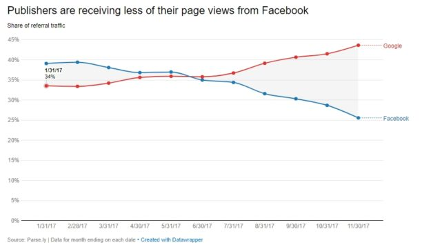
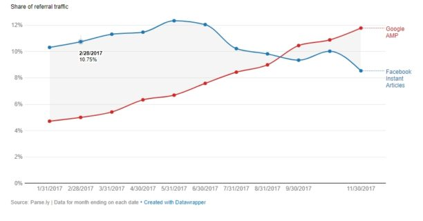

الصراع بين عملاقي الويب فيسبوك وغوغل لا ينتهي على جميع الأصعدة، فالأخير الذي كان دائما أول جالب للزيارات إلى المواقع الإلكترونية والمدونات تنازل عن هذه المكانة في الفترة الماضية لصالح فيسبوك**،** ولكن ليس لمدة طويلة. الأخبار الأخيرة من منصة **Parse.ly،** التي تتعامل مع عدد من كبار الناشرين حول العالم، أكدت بأن غوغل استطاع مرة أخرى انتزاع مكانته الأصلية من فيسبوك في الفترة الأخيرة وعاد لمركزه الأول.

الأرقام التي جاءت من ناشرين عمالقة مثل **وول ستريت جورنال**، **هافنغتون بوست** و **Mashable** أكدت بأن حصة فيسبوك من الإحالات التي تحصل عليها هذه المواقع العالمية تراجعت من 40% في بداية العام إلى 26% في أيامنا هذه، بينما نمت حصة غوغل من 34% إلى 44% في نفس الفترة.

هناك عدة فرضيات وأسباب محتملة لهذا التغيير، لعل أهمها :

- تحديثات خوارزميات فيسبوك التي أعطت وزنا أكبر لمنشورات الأصدقاء على حساب منشورات الماركات وصفحات صانعي المحتوى.
- تزايد الإهتمام بالفيديو على حساب المنشورات النصية التي تقوم بتوجيه مستخدمي فيسبوك لمواقع الناشرين.
- النمو الكبير [لصفحات غوغل المسرعة AMP](https://www.tutomena.com/marketing/accelerated-mobile-pages/) واعتمادها من طرف الناشرين لظهورها في الصفحات الأولى لنتائج البحث.
- تراجع اهتمام الشركات والمواقع بميزة _Instant Articles_ الخاصة بفيسبوك بسبب انخفاض إيراداتها من الإعلانات.

الصورة أعلاه توضح كيف أن منشورات *Facebook Instant Articles* تراجع دورها بشكل تدريجي في الإحالة لمواقع هؤلاء الناشرين الإعلاميين بينما ازداد دور صفحات غوغل المسرعة _AMP_ في هذه الناحية، والصورة ربما لن تكون مختلفة كثيرا عند باقي أنواع المنصات والمواقع الإلكترونية.

---

المصدر: [BLOG DU MODERATEUR](https://www.blogdumoderateur.com/google-facebook-trafic/)
