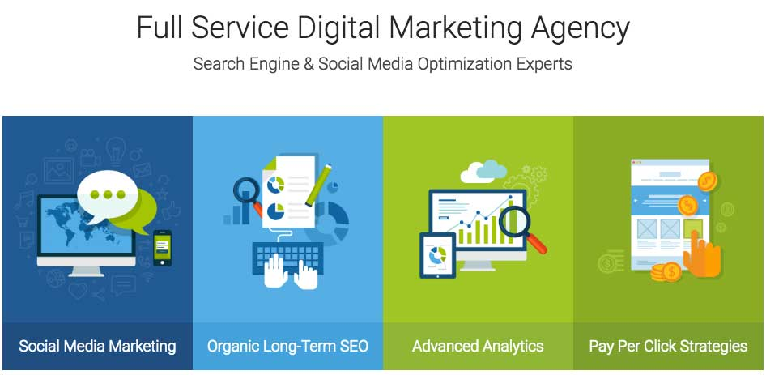
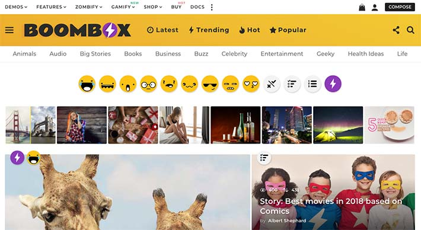

إختيار قالب ووردبريس جيد أمر في غاية الأهمية لتهيئة موقعك لمحركات البحث. السيو _SEO_ الخاص بموقعك قد يتضرر بشكل كبير إذا تم الإعتماد على قوالب ضعيفة وغير مطورة بالإعتماد على أفضل الممارسات الإحترافية المتبعة في صناعة الووردبريس، لأن المسألة كلها مرتبطة بمدى رضى المستخدم عن موقعك وجودة تجربته أثناء عملية التصفح.

لقد أكدنا في مقال سابق على وجوب الإستعانة بقوالب ووردبريس مدفوعة في حالة كنت جادا في بدء عملك على الإنترنت وبناء موقع إلكتروني أو مدونة ترقى لمرتبة الإحتراف، وشرحنا في نفس المقال الأسباب والدوافع التي جعلتنا نؤكد على هذا الكلام.

يمكن أن تقول بأنك تستطيع برمجة القالب الخاص بك واستخدام كافة التقنيات والأساليب الجديدة في صناعة الووردبريس. أو ستقول بأنك ستبحث عن أحد المطورين لتطلب منه أن يطور لك القالب مقابل مبلغ محدد. هذا جميل طبعا، ولكن مالذي يدفعك لتضييع وقتك الثمين في إنشاء قالب ووردبريس من الصفر والسوق مكتظ بالخيارات التي تلبي حاجياتك وبأثمان في متناول أي شخص يريد بدء مشواره في العمل على الإنترنت ؟ حتى لو استعنت بخدمات أحد المطورين واستلمت المشروع بنجاح، ماذا لو أردت فيما بعد تغيير شكل الموقع ؟ ماذا لو واجهك مشكل تقني في القالب ؟ ماذا لو أردت تحديث القالب ليتوافق مع المعايير الجديدة لووردبريس والويب بشكل عام ؟ نعم، سيكون عليك البحث في كل مرة عن المطور وأن تدفع لك مقابل الخدمة مهما كانت بسيطة ثم تنتظر موعد التسليم على أمل أن تحصل في النهاية على ما كنت تريد. هذا يمكن ألا يشكل عائقا للشركات الكبيرة أو حتى المتوسطة التي تستطيع توظيف مطور ووردبريس بدوام كامل، أما وأنت ما تزال في بداية الطريق فلا أعتقد بأن هذا المسار سيكون مناسبا لك.

القوالب المدفوعة توفر لك كل ما ذكرناه وبأقل مجهود منك :

- تستطيع تغيير شكل الموقع بسهولة عن طريق باني الصفحات Page Builer المدمج في أغلب القوالب المدفوعة على ثيم فوريست.
- بعد شراء للقالب، ستتوصل بجميع التحديثات التي ستطرأ على القالب وتحديث قالب موقعك باتباع خطوات بسيطة جدا.
- القوالب المدفوعة تضمن لك توافقية ممتازة مع معايير السيو _SEO_ وتقنيات الويب الحديثة (CSS3 ،HTML5).
- الدعم الفني بالمجان لمدة 6 أشهر بعد عملية الشراء قابلة للتجديد بمقابل معقول حسب البائع.
- تجاوبية ممتازة للتصميم مع شاشات الأجهزة والهواتف المحمولة، وهي كما نعرف مهمة للغاية في سلسلة معايير السيو.
- إلخ...

هدفنا من هذا الموضوع هو مساعدتكم على اختيار أفضل القوالب المهيئة لمحركات البحث في متجر ثيم فورست، لهذا الغرض سنستعرض لكم سلسلة لأفضل هذه القوالب من خلال تجارب وآراء عملاء هذه المنصة.

## SEO WP

إذا كنت تبحث عن قالب ووردبريس مرن ومعد خصيصا للشركات الرقمية التي تعتمد على السيو واستراتيجيات التسويق على منصات التواصل الإجتماعي فلا تبحث بعيدا عن **قالب SEO WP**. يوفر هذا القالب عددا لا محدودا من التصاميم لصفحات الموقع، وعدد كبير من التصاميم المتنوعة الخاصة برأس الموقع وقدمه (Header و Footer).

قالب SEO WP سهل الإستخدام، وقد تم تطويره ليكون في متناول المستخدمين بجميع مستوياتهم التقنية. يمكن تخصيص صفحات الموقع ومشاهدة التغييرات في الحين مما يوفر وقتا ثمينا على المستخدم.

الجميل كذلك مع هذا المنتج أن مطوريه في غاية النشاط، فهم يصدرون تحديثات للقالب كل شهر تقريبا. هذه التحديثات تحمل معها مميزات جديدة وتحسينات تمس جميع جوانب القالب.

عند شراءك للقالب ستحصل مجانا على 10 إضافات مدفوعة، هي كلها إضافات رائعة وتكلف مجتمعة 186 دولار، يعني أنك ستحصل على هدية بقيمة 186 دولار بعد الشراء :)

باختصار، إذا كنت تريد :

- قالب تحس بسرعته الكبيرة بعد تثبيته مباشرة، ويمنح زوارك تجربة استخدام رائعة.
- قالب تصميمه متجاوب مع مختلف أحجام الشاشات ومتوافق مع خدمة Google mobile-friendly.
- قالب يتم تحديثه كل شهر.
- قالب يمنحك خدمات PPC (الدفع مقابل النقر)، SEO، أدوات وودجات لمنصات التواصل الإجتماعي ...إلخ

فأنصحك بشراء قالب SEO WP والإنطلاق بجدية وعلى أساس متين في عملك على الإنترنت.

يمكنك تجربة وشراء القالب من خلال [هذا الرابط](https://www.tutomena.com/go/seo-wp-themeforest/ 'SEO WP Themeforest').

## BoomBox

يعتبر قالب BoomBox الأفضل بدون منازع لمواقع الفيرال، هذه المواقع التي تعتمد بشكل خاص على نشر المواضيع التي تلقى إقبالا كبيرا من الجمهور في وسائل التواصل الإجتماعي.

يمكن لزوار الموقع إرسال مشاركاتهم من خلال الواجهة الأمامية ونشرها بعد الموافقة عليها من المدير. كما يمكنهم كذلك إبداء آرائهم في المنشورات عن طريق استخدام أيقونات تعبر عن حالتهم النفسية (_Emojis_) على طريقة فيسبوك.

هناك أنواع كثيرة من المحتويات يمكن نشرها بفضل هذا القالب من مقالات، صور، فيديوهات، تصويتات، اختبارات Trivia إلخ... شخصيا أعجبت كثيرا بهذا القالب والإمكانيات المذهلة التي يوفرها.

قالب **بوم بوكس** يدعم **صفحات غوغل المسرعة** (AMP) بشكل كامل وكذلك صفحات فيسبوك المسرعة _Facebook Instant Articles_، هذا يعني تجربة استخدام متميزة للمتصفحين على الهواتف الذكية، ما ينعكس إيجابيا على السيو الخاص بموقعك كون معدل الإرتداد سينخفض بشكل كبير عندما يحصل زوار الموقع على تجربة استخدام جيدة.

لا يمكن سرد جميع ميزات هذا القالب الجميل في عدد محدود من الأسطر، يمكنك [زيارة صفحة Boombox على ثيم فورست](https://www.tutomena.com/go/boombox-themeforest/ 'BoomBox Themeforest') لتجربته واكتشاف جميع تفاصيله.

## Newspaper

شخصيا قمت بشراء هذا القالب ولم يخب ظني به. وجدته قالبا عصريا يحتوي على كل ما يريده صانع محتوى في مدونته. الإصدار الثامن جاء مع باني صفحات ممتاز من إنشاء فريق TagDiv نفسه وأسموه TagDiv Composer، معه أصبح إنشاء صفحات الهبوط والتعديل على تصاميم الصفحات متعة لا مثيل لها.

هذا القالب قام بشراءه قرابة 55 ألف شخص إلى حدود كتابة هذا الموضوع، وحصل على معدل تقييم شبه مثالي ناهز 4.85/5 بناءً على تقييمات أزيد من 4300 زبون.

[قالب Newspaper](https://www.tutomena.com/blog/newspaper-wordpress-theme-review/) مناسب للمدونات والمواقع الإخبارية وكذلك مواقع الفيرال، كما يمكن استخدامه للترويج لخدماتك أو سلعك الإلكترونية عن طريق بناء صفحات هبوط Landing Pages مميزة لجذب العملاء والمهتمين بما تقدمه.

Newspaper متوافق كذلك مع WooCommerce لإنشاء المتاجر الإلكترونية، BuddyPress لإضافة خاصية التسجيل والإلتحاق بالموقع، وكذلك bbPress Forum لإنشاء المنتديات إلخ...

<iframe width="560" height="315" src="https://www.youtube.com/embed/Jf9-fsfwrp4?rel=0&amp;showinfo=0" frameborder="0" gesture="media" allow="encrypted-media" allowfullscreen="allowfullscreen"></iframe>

الآن هو وقت التخفيضات مع حلول رأس السنة الميلادية، والسعر الآن هو 39 دولار، وأنا كنت قد اشتريته ب 59 دولار :)

إذا أردت يمكنك تجربة القالب أو شراؤه من خلال [هذا الرابط](https://www.tutomena.com/go/newspaper-themeforest/ 'Newspaper Themeforest').

## الخاتمة

اختيار القالب المناسب خطوة مهمة لكل مستخدمي ووردبريس. هذه اللائحة مجرد اقتراحات من وجهة نظري الخاصة، وليست القوالب المذكورة إلا جزء بسيط من العدد الكبير الموجود على متجر ثيم فورست، لكل منها إيجابيات وميزات خاصة.

لا يجب نسيان أن شراء القالب ليست هي الخطوة النهائية لاستراتيجية السيو SEO الخاصة بمشروعك على الإنترنت، سنكون بقمة السداجة إذا فكرنا بهذه الطريقة. السيو عالم كبير وما اختيار قالب ووردبريس إلا خطوة أولى من بين الخطوات العديدة التي ستأتي فيما بعد، والتي بجمعها كلها معا نكون قد وضعنا **خطة سيو** قوية كفيلة بدفع مشروعنا إلى الأمام في هذا الويب المزدحم.

- اقرأ أيضا: [أفضل قوالب ووردبريس الإخبارية في متجر ثيم فورست](https://www.tutomena.com/blog/best-wordpress-news-themes/)
