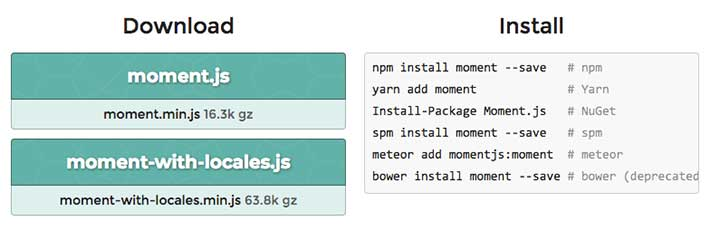
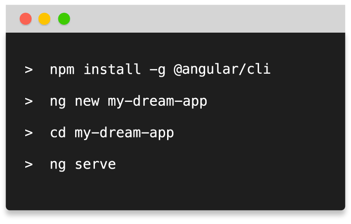

تعلم **الجافاسكربت** المعاصرة قد يكون أمرا معقدا خاصة للقادمين الجدد الذين لم يشهدوا التغييرات والتطورات المتعددة التي طرأت على النظام البيئي (_Ecosystem_) للغة البرمجة جافاسكربت في المدة الأخيرة.

في بداياتي مع تطوير المواقع، وأنا مطور واجهات أمامية، كان كل ما نحتاجه هو تعلم جافاسكربت، CSS وطبعا HTML. أما الآن فنتحدث عن Node ،Npm ،Babel ،Webpack ،Typescript إلخ....

المبتدؤون يقولون: "**نحن لا نفهم كل هذا الهراء ؟! لماذا كل هذه التعقيدات لمجرد صناعة صفحة ويب ليست بالضرورة بهذه الدرجة من التعقيد ؟**"

هدفي من هذا الموضوع هو القيام بسرد تاريخي لتطور بيئة الجافاسكريبت حتى أضحت على ما هي عليه الآن في 2018، مع اكتشاف وتبيان الإشكاليات التي جاءت كل هذه الأدوات لحلها.

سنبدأ بمثال صغير عن كيفية تطوير الواجهة الأمامية لموقع ويب بالطريقة القديمة التي بدأت بها مسيرتي المهنية. ثم سنتدرج ونصعد شيئا فشيئا في السلم ونقوم بإدراج الأدوات التي ذكرناها أعلاه، أداة بأداة. أي أنني سأقوم بمحاكاة السياق التاريخي لتطور النظام البيئي ل JavaScript. في الأخير، أما متأكد بأنك ستفهم دور كل Npm ،Webpack ،Babel وأخواتهم وستقرر بعد ذلك إن كانت فعلا تستحق الإستعانة بها أم لا.

سيكون هذا المقال طويلا جدا، أنصحك بالجلوس في مكان مريح وإعداد فنجان قهوة أو كأس شاي قبل بدء القراءة :D

## الطريقة القديمة في إضافة الجافاسكربت للصفحة

لنفترض أنه لدينا ملف `script.js` يحتوي على أكواد الجافاسكربت التي قمنا بكتابتها، ليكن محتوى هذا الملف ببساطة هو كالتالي :

<div class="filename">script.js</div>

```js
console.log('مرحبا في ملف الجافاسكربت!');
```

الطريقة القديمة في إضافة الجافاسكربت لصفحات html تتمثل في استدعاء ملف جافاسكربت `script.js` من الصفحة `index.html` باستخدام الوسم `<script>` كما يلي :

<div class="filename">index.html</div>

```html
<!DOCTYPE html>
<html lang="en">
  <head>
    <meta charset="UTF-8" />
    <title>مثال لجافاسكربت</title>
    <script src="script.js"></script>
  </head>
  <body>
    <h1>مرحبا بكم!</h1>
  </body>
</html>
```

هذا كل ما نحتاجه لإضافة أكواد جافاسكربت لموقعنا!

لنقل بأننا نريد بعد ذلك إضافة مكتبة جافاسكربت خارجية، مثلا `Moment.js` (هذه المكتبة تقوم بتحويل التواريخ البرمجية إلى تواريخ يستطيع الإنسان العادي قراءتها). على سبيل المثال يمكننا استخدامها كما يلي :

```js
moment('20111031', 'YYYYMMDD').fromNow(); // منذ ٦ أعوام
```

بطبيعة الحال لن تستطيع استخدام هذه المكتبة إلا إذا قمت باستدعائها من الصفحة. في الصفحة الرئيسية ل _moment.js_ هناك تعليمات، كما في الصورة أسفله، لمساعدتنا على إضافة هذه المكتبة لمشروعنا :



ما كل هذه الأكواد الغريبة ؟! عفوا نسيت بأننا ما نزال مع مدرسة جافاسكربت القديمة. سنعود لهذه الأكواد فيما بعد، ولكن دعونا الآن فقط نقوم بتحميل مكتبة _Moment.js_ يدويا ثم نقوم بإضافة الملف `moment.min.js` لمشروعنا واستدعاؤه في صفحة _index.html_ كما فعلنا مع الملف الأول الخاص بنا :

<div class="filename">index.html</div>

```html
<!DOCTYPE html>
<html lang="en">
  <head>
    <meta charset="UTF-8" />
    <title>مثال لجافاسكربت</title>
    <link rel="stylesheet" href="style.css" />
    <script src="moment.min.js"></script>
    <script src="script.js"></script>
  </head>
  <body>
    <h1>مرحبا بكم!</h1>
  </body>
</html>
```

لاحظوا بأننا قمنا بإضافة الملف _moment.min.js_ قبل الملف _script.js_ حتى نستطيع استخدام الدالة **moment** في شفرتنا البرمجية. هذا الترتيب ضروري وإلا سيظهر لنا الخطأ بعد التنفيذ.

<div class="filename">script.js</div>

```js
console.log('مرحبا في ملف الجافاسكربت!');
console.log(
  moment()
    .startOf('day')
    .fromNow()
);
```

هكذا كنا نستخدم مكتبات الجافاسكريبت في مشاريعنا. الجميل في هذه الطريقة أنها سهلة الفهم والإستيعاب، والسيء فيها أن كل شيء يتم بشكل يدوي. فمثلا ماذا لو أردنا تحديث المكتبات التي نقوم باستخدامها في حال توفر تحديثات جديدة لها ؟ طبعا كنا نقوم بإعادة تحميل النسخة الأحدث ونعوض بها النسخة القديمة، **يدوياًّ**!

## استخدام مدير الحزم الخاص بجافاسكريبت (npm)

بداية من عام 2010، بدأت مجموعة من ما يسمى مدراء الحزم الخاصة بلغة البرمجة جافاسكريبت بالظهور، هدفها كان واضحا : تحميل وتحديث حزم (مكتبات) الجافاسكريبت من مكان واحد. مدير الحزم **Bower** كان هو الأكثر شهرة في 2013، ولكن سرعان ما انتزع منه **npm** مكانة الريادة. أما في الأشهر الأخيرة، فقد ظهر مدير حزم جديد اسمه **yarn** (طورته شركة فيسبوك) ويبدو أنه يلقى قبولا حسنا لدى المطورين ولو أنه في الأول والأخير يعتمد على npm خلف الكواليس، حيث يقوم بتحميل الحزم من مستودع **Node Package Manager** (أو npm).

تجدر الإشارة إلى أن مدير الحزم **npm** صمم في الأول خصيصا ل **Node.js**، تقنية تمكننا من تشغيل الجافاسكريبت خارج المتصفحات (في الخوادم). ولكن بعد ذلك أصبح مديرا للحزم يهم لغة الجافاسكريبت بصفة عامة، سواءً جافاسكربت المتصفحات أو جافاسكريبت Node.js.

[اقرأ أيضا: ما هو Node.js وما هي مميزاته ؟](https://www.tutomena.com/web-development/javascript/what-is-nodejs/)

> يتم التعامل مع npm من نافذة الأوامر السطرية (command line)، وهي النافذة التي لم نكن قط نفتحها كمطوري واجهات أمامية. وهنا لا بد أن أنصح جميع المطورين المبتدئين بضرورة تعلم أساسيات التعامل مع الأوامر السطرية لأنها تستخدم بشكل كبير جدا في جميع مجالات البرمجة في وقتنا الحالي.

لنرى كيفية استخدام مدير الحزم npm لتحميل مكتبة `Moment.js` عوض تحميلها ذلك بشكل يدوي كما فعلنا سابقا. يجب تثبيت **Node.js** على حاسوبك، أتوماتيكيا سيتم تثبيت مدير الحزم **npm** كذلك. بعد ذلك سنفتح نافذة الأوامر السطرية، وانطلاقا منها ندخل للمجلد الذي يضم مشروعنا (حيث يوجد الملف `index.html`) ثم نقوم بتنفيذ الأمر التالي :

```
npm init
```

بعد التنفيذ، سيُطلَب منك الإجابة على عدد من الأسئلة (يمكنك فقط الضغط على الزر _Enter_ عند كل سؤال)، وبعدها سيتم توليد ملف اسمه **package.json** داخل نفس المجلد. هذا الملف يستخدمه مدير الحزم _npm_ للقيام بالعديد من المهام المتعلقة بهذا المشروع. المحتوى الإفتراضي لهذا الملف يكون على الشكل التالي :

```json
{
  "name": "your-project-name",
  "version": "1.0.0",
  "description": "",
  "main": "index.js",
  "scripts": {
    "test": "echo \"Error: no test specified\" && exit 1"
  },
  "author": "",
  "license": "ISC"
}
```

الآن لتنزيل المكتبة `moment.js`، نقوم باستخدام الأمر السطري التالي :

```
npm install moment --save
```

هذا الأمر يقوم بشيئين اثنين :

- أولا، يقوم بتحميل الحزمة [moment.js](https://www.npmjs.com/package/moment) داخل مجلد اسمه **node_modules** يتم إنشاؤه تلقائيا.
- ثانيا، يقوم بتحديث الملف `package.json` وذلك بإضافة اسم الحزمة `moment` في جزء **dependencies** حيث يتم تسجيل كافة الحزم التي يحتاجها هذا المشروع.

**أظنك الآن فهمت (ولو قليلا) الأكواد الموجودة في الصفحة الرئيسية لمكتبة moment.js عن كيفية تثبيتها (الصورة أعلاه) :)**

```json
{
  "name": "modern-javascript-example",
  "version": "1.0.0",
  "description": "",
  "main": "index.js",
  "scripts": {
    "test": "echo \"Error: no test specified\" && exit 1"
  },
  "author": "",
  "license": "ISC",
  "dependencies": {
    "moment": "^2.19.1"
  }
}
```

هذه الطريقة مفيدة، خاصة إذا أردنا فيما بعد مشاركة المشروع مع الآخرين، حيث نقوم بإرسال مجلد المشروع مع الملف _package.json_ من دون المجلد **node_modules** الذي قد يكون حجمه كبيرا بحسب حجم المشروع وعدد الحزم التي يستخدمها. بعد ذلك يكفي أن يقوم الآخر بتنفيذ الأمر **npm install** داخل المجلد وسيتم تحميل جميع حزم وتبعيات المشروع بشكل أوتوماتيكي.

> هذا بالضبط ما يقوم به جميع أصحاب المشاريع المشاريع على منصة Github. حيث يُطلب من مدير النسخ Git إهمال هذا المجلد عن طريق الملف ".gitignore". في النهاية الملف package.json سيمكننا من تحميل المجلد node_modules والحزم الخاصة بهذا المشروع بعد تحميله من Github.

من الآن لن نقوم مجدد بتحميل مكتبات الجافاسكريبت بشكل يدوي، مدير الحزم npm يقوم بالمهمة بشكل جيد نيابة عنا.

بالنظر في داخل المجلد `node_modules` سنجد الملف `moment.min.js` في المسار `node_modules/moment/min`. إذن سنقوم باستدعاء `moment.min.js` في ملف `index.html` كما يلي :

<div class="filename">index.html</div>

```html
<!DOCTYPE html>
<html lang="en">
  <head>
    <meta charset="UTF-8" />
    <title>مثال لجافاسكربت</title>
    <link rel="stylesheet" href="style.css" />
    <script src="node_modules/moment/min/moment.min.js"></script>
    <script src="script.js"></script>
  </head>
  <body>
    <h1>مرحبا بكم!</h1>
  </body>
</html>
```

هذا جميل، استطعنا تحميل مكتبتنا بالإستعانة بمدير الحزم npm. ولكن مازلنا مطالبين بالدخول للمجلد **node_modules** والبحث عن ملف المكتبة ثم استدعاؤه بشكل يدوي في ملف html. نريد حلا يمكننا من استدعاء المكتبة بشكل أوتوماتيكي حينما نحتاجها:)

## الإستعانة بمُجَمِّع لوحدات جافاسكريبت Module Bundler

معظم لغات البرمجة تتمتع بإمكانية استدعاء الشفرة البرمجية من ملف لملف آخر. لغة البرمجة **JavaScript** لم تكن مصممة لهذا الغرض، لأنها في البداية كان معدة لتشتغل داخل المتصفح فقط، وبالتالي لم يكن بالإمكان الوصول لملفات الحاسوب وذلك راجع بطبيعة الحال لأسباب تتعلق بالأمن والحماية.

لوقت طويل كان كل ما نفعله هو مشاركة محتوى ملفات الجافاسكربت في مشروعنا على شكل متغيرات عامة (Global Variables). هذا بالذات ما فعلناه أعلاه، حيث أن استدعاءنا لمكتبة *moment.min.js* يعني بأن جميع المكتبات والملفات الأخرى التي سيتم استدعاؤها أسفلها (كما هو الحال بالنسبة ل _script.js_) سيكون بإمكانها الوصول للدالة moment() حتى ولو كانت في غير حاجة إليها.

في عام 2009، ظهر مشروع طموح اسمه **CommonJs** هدفه إتاحة نظام بيئي لجافاسكربت خارج المتصفحات. الجانب الكبير والأهم من مشروع CommonJs كان ذلك الجزء المتعلق باستيراد وتصدير (Import & Export Modules) الشفرة البرمجية عبر الملفات، والتخلص من إشكالية المتغيرات العامة. التنفيذ والتطبيق (_Implementation_) الأشهر لمشروع وحدات CommonJs هو Node.js.

كما ذكرنا سابقا، **Node.js** هو بيئة جافاسكربت (_Javascript Runtime_) مصممة للإشتغال في الخوادم. سنرى فيما يلي كيف نعيد صياغة استدعاء مكتبة _Moment_ باستخدام طريقة الوحدات في _Node.js_. عوض استخدام الوسم `<script>` لإستدعاء المكتبة داخل ملف _index.html_، سنقوم باستدعائها مباشرة من داخل ملف الجافاسكريبت `script.js` :

<div class="filename">script.js</div>

```js
var moment = require('moment');
console.log('Hello from JavaScript!');
console.log(
  moment()
    .startOf('day')
    .fromNow()
);
```

هكذا تعمل الوحدات في _Node.js_، طبعا لأن الأخير يشتغل في الخوادم ويستطيع الوصول لنظام الملفات بالحاسوب ويعلم جيدا أين يجد الوحدة التي نقوم باستدعائها. فعوضا عن كتابة `require('./node_modules/moment/min/moment.min.js)` ، نقوم فقط بكتابة `require('moment')`.

هذا جيدا ورائع مع Node.js، ولكن ليس مع المتصفح :'( الأخير لا يستطيع، كما أسلفنا، الوصول إلى نظام الملفات بالحاسوب، وبالتالي فتحميل الوحدات أمر في غير المتناول والدالة `require` غير معرفة (_Not Defined_) أساسا في البيئة التشغيلية للمتصفح.

**هنا سيتدخل مجمع الوحدات لحل هذه المعضلة.**

مجمع وحدات الجافاسكربت (Javascript Module Bundler) هو أداة تعتمد على إمكانيات _Node.js_ (الوصول لنظام الملفات) لإنشاء مخرجات نهائية تكون متوافقة مع قدرات المتصفح (عدم الوصول لنظام الملفات). في حالتنا، نحتاج Module Bundler يكون قادرا على إيجاد جميع دوال _require_ (الغير متوافقة مع المتصفح) في شفرتنا البرمجية واستبدالها بمحتوى الملفات التي تقوم باستدعائها. النتيجة النهائية ستكون عبارة عن ملف جافاسكربت واحد خالٍ من دوال _require_ ومتوافق بشكل كامل مع بيئة المتصفح.

أول مُجَمِّع للوحدات _Module Bundler_ كان هو [Browserify](http://browserify.org/)، ظهر في عام 2011 وكان الحل الذي مكن مطوري الواجهات الأمامية من استخدام طريقة _Node.js_ في التعامل مع الوحدات. وكان له الفضل كذلك في أن يصبح مدير الحزم _npm_ خيارا قويا لدى مطوري الواجهات الأمامية بعدما كان دائما حكرا على مطوري _Node.js_. ومنذ عام 2015 تقريبا، أصبح [Webpack](https://webpack.js.org/) هو مجمع الوحدات الأكثر استخداما، مستفيدا من الشعبية الجارفة لمكتبة React.js التي اختار مطوروها _Webpack_ ليكون مجمع وحداتها الرسمي.

لنأخذ نظرة عن كيفية الإستعانة ب _Webpack_ حتى نجعل المثال أعلاه (require('moment')) يعمل في المتصفح. أولا علينا تثبيت _Webpack_ في مشروعنا. _Webpack_ نفسه عبارة عن حزمة npm، لذلك سنقوم بتحميله وإضافته للمشروع تماما كما فعلنا مع مكتبة _moment.js_ قبل قليل :

```
npm install webpack --save-dev
```

لاحظ أننا استخدمنا البارامتر _\--save-dev_ عوض _\--save_ الذي استخدمناه سابقا مع *moment.js.* السبب أننا نريد حفظ _Webpack_ كتبعية خاصة فقط بمرحلة التطوير في ملف _package.json_ وليس تبعية للمشروع في مرحلة الإنتاج (_Production stage_). ملف _package.json_ تم تحديثه تلقائيا بعد تحميل _Webpack_ وأصبح على هذا النحو :

```json
{
  "name": "modern-javascript-example",
  "version": "1.0.0",
  "description": "",
  "main": "index.js",
  "scripts": {
    "test": "echo \"Error: no test specified\" && exit 1"
  },
  "author": "",
  "license": "ISC",
  "dependencies": {
    "moment": "^2.19.1"
  },
  "devDependencies": {
    "webpack": "^3.7.1"
  }
}
```

الآن وقد قمنا بتثبيت Webpack بنجاح وتحميله على مجلد الحزم **node_modules** الخاص بمشروعنا، سيمكننا استخدامه من نافذة الأوامر السطرية بهذه الكيفية :

```
./node_modules/.bin/webpack script.js bundle.js
```

هذا الأمر يقول لأداة _Webpack_ (الموجودة داخل المجلد _node_modules_ ) : خذ الملف _script.js_ وابحث فيه عن جميع التعابير التي تحتوي على دالة الإستيراد _require_ وقم باستبدالها بالشفرة البرمجية للوحدة التي تم استيرادها، ثم احفظ المخرج الجديد(_Output_) في ملف جديد اسمه _bundle.js_. يعني هذا أننا لن نستخدم من جديد الملف *script.js* في متصفحنا، بل نقوم عوضا عن ذلك باستدعاء الملف *bundle.js* المتوافق مع إمكانيات المتصفحات، أما *script.js* فنقوم باستخدامه فقط في مرحلة البرمجة والتطوير ولا يظهر في بيئة الإنتاج النهائية.

<div class="filename">index.html</div>

```html
<!DOCTYPE html>
<html lang="en">
  <head>
    <meta charset="UTF-8" />
    <title>مثال لجافاسكربت</title>
    <script src="bundle.js"></script>
  </head>
  <body>
    <h1>مرحبا بكم!</h1>
  </body>
</html>
```

بعد إعادة تحميل الصفحة على المتصفح، سنرى بأن كل شيء يعمل جيدا كما في السابق.

يجب علينا إعادة تنفيذ الأمر السابق في كل مرة نقوم فيها بالتعديل على ملف _script.js_. هذا الأمر قد يكون مملا وغير عملي، خاصة عندما تزداد درجة تعقيد مهام Webpack في مشروعنا، فما رأيناه أعلاه يمكن اعتباره أبسط ما يمكن ل _Webpack_ القيام به. ربما يجدر بنا الآن اكتشاف الملف _webpack.config.js_ الذي يعتبر المكان الذي نقوم فيه بإضافة إعدادات _Webpack_ الخاصة بالمشروع. لنقم بإنشاء هذا الملف ونضيف إليه الإعدادات التالية :

<div class="filename">webpack.config.js</div>

```js
module.exports = {
  entry: './script.js',
  output: {
    filename: 'bundle.js'
  }
};
```

الآن يمكننا تنفيذ نفس المهمة السابقة دون تحديد أسماء الملفين (_script.js_ و _bundle.js_ ) من الأمر السطري. يكفي تنفيذ ما يلي وسيقوم _Webpack_ بمعرفة ما يجب عليه فعله بالإعتماد على التوجيهات في ملف _webpack.config.js_ :

```
./node_modules/.bin/webpack
```

تقدمنا خطوة إلى الأمام، ولكن لا يزال هذا مضجرا لأننا مازلنا مطالبين بتنفيذ الأمر في كل مرة نعدل فيها ملف _script.js._

**سنجعل هذه المهمة أكثر سلاسة وتلقائية فيما بعد، قليلا من الصبر :D**

لا بأس بما قمنا به لحد الساعدة، لم نعد نقوم باستدعاء المكتبات والسكريبتات الخارجية على شكل متغيرات ودوال عامة من خلال الوسم `<script>`. نحن الآن نعتمد على فلسفة الوحدات (_Modules_)، دون أن ننسى كذلك أننا في النهاية نحصل على **ملف جافاسكريبت واحد** وهذه نقطة إيجابية أخرى لتحسين أداء التطبيق.

سنواصل التقدم وإضافة مميزات أخرى قوية لبيئتنا التطويرية.

## استخدام الميزات الجديدة في جافاسكريبت (Babel)

مع التطور الكبير في لغة البرمجة جافاسكريبت في الأعوام الأخيرة، أصبح من الصعب على المتصفحات مواكبة هذه التطورات ودمج كل هذه الميزات الجديدة في بيئاتها التشغيلية (_Runtime_). فمثلا هناك عدد كبير جدا من ميزات إصدار الجافاسكريبت ES6 ليست مدعومة بعد من جميع المتصفحات الكبيرة، هذا يمنع المطورين من استخدامها والإستفادة من الإمكانية العظيمة التي تتيحها.

لحسن الحظ، ظهرت في الفترة الماضية أدوات تعرف باسم **Javascript Transpilers** هدفها كتابة الجافاسكريبت بطريقة أكثر حداثة وانتاجية، وعند الإنتهاء من التكويد تتم عملية **Transpiling** التي تحول الشفرة البرمجية التي كتبها المطور إلى كود جافاسكريبت اعتيادي تفهمه وتدعمه جميع المتصفحات.

**CoffeeScript** كان أول هذه الأدوات التي لقيت نجاحا كبيرا حيث يمكن من كتابة أكواد جافاسكريبت بطريقة حديثة وأكثر انتاجية. ولكن في الفترة الأخيرة خفت نجم _CoffeeScript_ وبرز في الساحة لاعبين جديدين استحوذا على أكبر نصيب من الكعكعة، نتحدث عن _Babel_ و _Typescript_.

**Typescript** طورته شركة مايكروسوفت ويعتبر بمثابة لغة جديدة استلهمت العديد من الأشياء المميزة في لغة البرمجة سي شارب #C. يعني أنه يمكن للمطورين كتابة لغة جديدة والإستفادة من بعض نقاط قوة #C وبعد الإنتهاء من كتابة الكود يتم تحويله لجافاسكريبت اعتيادي يفهمه المتصفح. يعتبر إطار العمل Angular أشهر التقنيات التي تعتمد على _Typescript_ بشكل افتراضي، وكان له الفضل الكبير في الشهرة التي حققها الأخير في الآونة الأخيرة.

أما **Babel** فلايمكن اعتباره لغة برمجة، ولكن فقط أداة تمكننا من كتابة أكواد الجافاسكريبت على الطريقة الحديثة (ES6) وبعد ذلك تحويلها لأكواد جافاسكريبت مدعومة من جميع المتصفحات الكبيرة. معظم المطورين يفضلون Babel لأنه كما قلنا ليس لغة برمجة جديدة يجب تعلمها بل فقط أداة تجعل الجافاسكريبت الحديث متوافق مع قدرات المتصفحات الحالية.

لنكتشف معا كيف يمكننا استخدام Babel في مشروعنا مع مجمع الوحدات Webpack. أولا علينا تحميل Babel من مدير الحزم npm بالطريقة التالية المعتادة (أصبحت معتادة الآن :D ) :

```
npm install babel-core babel-preset-env babel-loader --save-dev
```

لاحظ أننا قمنا بتحميل 3 حزم دفعة واحدة كتبعيات خاصة بمرحلة التطوير (_save-dev_) :

- babel-core : هذه الحزمة هي النواة الأساسية لتقنية Babel.
- babel-preset-env : الحزمة التي نحدد بها ما هي المميزات التي نريد الوصول إليها. babel-preset-env يعني أننا نريد استخدام جميع مميزات جافاسكريبت الحديثة التي يدعمها Babel. عوضا عنها يمكننا استخدام مثلا babel-preset-es2015 حتى نكون دقيقين أكثر، ولكن هذا لن يشمل مميزات es2016 و es2017. بالتالي يفضل دائما استخدام babel-preset-env لأنها تشمل الكل.
- babel-loader : أما هذه الحزمة فهي التي تجعل Babel متوافقا مع Webpack.

سنعدل على ملف الإعدادات _webpack.config.js_ حتى يمكن ل _Webpack_ استخدام Babel :

<div class="filename">webpack.config.js</div>

```js
module.exports = {
  entry: './script.js',
  output: {
    filename: 'bundle.js'
  },
  module: {
    rules: [
      {
        test: /\.js\$/,
        exclude: /node_modules/,
        use: {
          loader: 'babel-loader',
          options: {
            presets: ['env']
          }
        }
      }
    ]
  }
};
```

الشكل الجديد لهذا الملف قد يكون مربكا أو غير مفهوم بالنسبة لك، هذا طبيعي كونها المرة الأولى التي تتعامل فيها مع _Webpack_.

ببساطة قلنا لصديقنا _Webpack_ : أنظر لجميع الملفات التي امتدادها js. باستثناء الملفات الموجودة داخل المجلد _node_modules_، واستعن بالحزمتين babel-loader و babel-preset-env للتمكن من عملية تحويل (_Transpiling_) أكواد الجافاسكريبت.

الآن بتنا نستطيع البدء في كتابة أكواد الجافاسكريبت مع أحدث الميزات الجديدة في هذه اللغة. هذا مثال لكتابة كلاس جافاسكريبت على طريقة **ES2015** في ملف _script.js_ :

<div class="filename">script.js</div>

```js
var moment = require('moment');
console.log('Hello from JavaScript!');
console.log(
  moment()
    .startOf('day')
    .fromNow()
);

class User {
  constructor(name) {
    this.name = name;
  }
  sayHi() {
    alert(this.name);
  }
}

let user = new User('Aissa');
user.sayHi();
```

نستطيع كذلك استخدام طريقة _ES2015_ في استيراد الوحدات عوض معيارية CommonJs التي رأيناها في السابق. هذه الطريقة هي التي تستعمل في جل المشاريع في الوقت الحالي :

<div class="filename">script.js</div>

```js
import moment from 'moment';
console.log('Hello from JavaScript!');
console.log(
  moment()
    .startOf('day')
    .fromNow()
);

class User {
  constructor(name) {
    this.name = name;
  }
  sayHi() {
    alert(this.name);
  }
}

let user = new User('Aissa');
user.sayHi();
```

طريقة `import` الخاصة بإصدارات جافاسكريبت الحديثة لا تختلف كثيرا عن `require` التي استنبطها Node.js من مشروع CommonJs، غير أن الأولى أي `import` تعتبر أكثر مرونة وسلاسة خاصة في الحالات المتقدمة.

بما أننا قمنا بالتعديل على الملف `script.js` فعلينا من جديد أن نطلب من Webpack أن يقوم بعملية التجميع (**Bundling**) :

```
./node_modules/.bin/webpack
```

الآن يمكنك إعادة تحميل صفحة `index.html`، وسترى بأنها تعمل وفق المتوقع من دون مشاكل حتى في المتصفحات القديمة التي لا تدعم نهائيا ميزة الكلاسات في جافاسكريبت مثل انترنت إكسبلورر IE9.

وإذا كنت فضوليا أكثر (مبروك إذا كان الحال كذلك) فستذهب للملف _bundle.js_ وتبحث عن الشكل الجديد للكلاس الذي قمت بكتابته سابقا في ملف `script.js`، هكذا أصبح حاله :

<div class="filename">bundle.js</div>

```js
//...
var _createClass = (function() {
  function defineProperties(target, props) {
    for (var i = 0; i < props.length; i++) {
      var descriptor = props[i];
      descriptor.enumerable = descriptor.enumerable || false;
      descriptor.configurable = true;
      if ('value' in descriptor) descriptor.writable = true;
      Object.defineProperty(target, descriptor.key, descriptor);
    }
  }
  return function(Constructor, protoProps, staticProps) {
    if (protoProps) defineProperties(Constructor.prototype, protoProps);
    if (staticProps) defineProperties(Constructor, staticProps);
    return Constructor;
  };
})();

function _classCallCheck(instance, Constructor) {
  if (!(instance instanceof Constructor)) {
    throw new TypeError('Cannot call a class as a function');
  }
}

var User = (function() {
  function User(name) {
    _classCallCheck(this, User);

    this.name = name;
  }

  _createClass(User, [
    {
      key: 'sayHi',
      value: function sayHi() {
        alert(this.name);
      }
    }
  ]);

  return User;
})();

var user = new User('Aissa');
user.sayHi();
//...
```

نعم أعلم أن هذا الكود معقد أكثر وأقل جمالية، _Babel_ قام باستخدام الجافاسكريبت القديم (استخدام الدوال، تحويل let إلى var) حتى نحصل في الأخير على الشفرة البرمجية التي تفهمها جميع المتصفحات المعروفة.

مثال الكلاس بسيط بالمقارنة مع كل مزايا جافاسكريبت الحديثة والتي يدعمها _Babel_. الأخير تستعين به **React.js** لتحويل أكواد JSX خاصتها إلى أكواد جافاسكريبت اعتيادية، لذلك صدقني أخي العزيز إن قلت لك أنه بعد تقدمك في الجافاسكريبت ستجد **بابل** في كل مكان.

الآن تتضح الأمور أكثر ولم يتبق لنا إلا بعض اللمسات الأخيرة. أول هذه اللمسات هي ضغط  (_Minify_) الملفات المجمعة (في حالتنا _bundle.js_) حتى نقلل من حجمه قدر المستطاع. ثم بعد ذلك سنضيف إمكانية التشغيل التلقائي ل _Webpack_ كلما قمنا بالتعديل على ملف _script.js_ حتى لا نطلب منه ذلك في كل مرة من واجهة الأوامر السطرية.

## الإستعانة بمشغلات المهام (Task Runner)

الآن وقد تمكننا بنجاح من تجميع وحداتنا البرمجية بعد كتابتها بأحدث المعايير والطرق المتبعة، سيكون من المنطقي أتمتة ما نستطيع من مختلف المهام التي تشكل أجزاء مهمة من عملية التطوير، نتحدث عن مهام من قبيل ضغط ملفات الأكواد (جافاسكريبت و css)، تحسين الصور، تنفيذ إختبارات الشفرة البرمجية Unit Tests، إلخ...

في فترة من الفترات (حوالي 2013)، كان **GruntJs** هو مشغل المهام الأشهر، وبعده جاء **Gulp** بقوة وتقاسما معا الكعكة. كلاهما يعتمدان على الإضافات حيث كل إضافة تقوم بمهمة محددة.

ولكن في الآونة الأخيرة، وبالخصوص منذ انفجار شعبية **React.js**، بات المطورون يستخدمون Webpack (الذي هو في الأصل مجمع وحدات Module Bundler وليس مشغل مهام Task Runner) في تنفيذ المهام بالإعتماد على أوامر NPM نفسه. هذه الأوامر تعرف باسم **NPM Scripts** ونصرح بها في ملف _package.json_ :

```json
{
  "name": "modern-javascript-example",
  "version": "1.0.0",
  "description": "",
  "main": "index.js",
  "scripts": {
    "test": "echo \"Error: no test specified\" && exit 1",
    "build": "webpack -p",
    "watch": "webpack --watch"
  },
  "author": "",
  "license": "ISC",
  "dependencies": {
    "moment": "^2.19.1"
  },
  "devDependencies": {
    "babel-core": "^6.26.0",
    "babel-loader": "^7.1.2",
    "babel-preset-env": "^1.6.1",
    "webpack": "^3.7.1"
  }
}
```

في هذا المثال، حددنا سكريبتين : build و watch. لتنفيذ السكريبت نقوم بإدخال الأمر **npm run** متبوع باسم السكريبت. على سبيل المثال، لتنفيذ السكريبت build نقوم بإدخال الأمر التالي في Command Line :

```
npm run build
```

هذا السكريبت يقوم بتشغيل _Webpack_ بالإعتماد على إعدادات ملف _webpack.config.js_، وأضفنا البارامتر **p-** الذي يقوم ل _Webpack_ بأننا نريد تجميع الكود لمرحلة الإنتاج (_Production_)، أي ضغطه (_Minify code_).

```
npm run watch
```

أما السكريبت watch فيشغل _Webpack_ في كل مرة نقوم فيها بعملية بالتعديل. يعني لن نظطر من الآن لكتابة الأمر في واجهة الأوامر السطرية بعد كل تعديل. خطوة عملية للغاية في مرحلة التطوير :)

لاحظ بأنه في سكريبتات npm لا نقوم بتعيين المسار الكامل ./node*modules/.bin/webpack ، لأن \_Node.js* يعلم جيدا أين يجد كل حزمة بالإعتماد على اسمها فقط.

هذا رائع! يمكننا أن جعله أكثر روعة بتثبيت أداة أخرى رائعة : **Webpack-dev-server.** هذه الحزمة تعتمد كما نرى من اسمها على _Webpack_ وتضع بين يدي المطور خادم ويب مع خاصية **Live Reloading** التي تعطينا إمكانية رؤية التغييرات في المتصفح دون القيام بإعادة تحميل الصفحة كل مرة، يعني بمجرد تعديل وحفظ ملف _script.js_ سنرى النتيجة في المتصفح في ظرف أجزاء بالمئة من الثانية :)

الآن تعلمون كيف تقومون بتحميل هذه الأداة، أحسنتم، الطريقة هي :

```
npm install webpack-dev-server --save-dev
```

بعد ذلك قم بإضافة سكريبت جديد لملف _package.json_ بهذه الكيفية :

```json
{
  "name": "modern-javascript-example",
  "version": "1.0.0",
  "description": "",
  "main": "index.js",
  "scripts": {
    "test": "echo \"Error: no test specified\" && exit 1",
    "build": "webpack -p",
    "watch": "webpack --watch",
    "server": "webpack-dev-server --open"
  },
  "author": "",
  "license": "ISC",
  "dependencies": {
    "moment": "^2.19.1"
  },
  "devDependencies": {
    "babel-core": "^6.26.0",
    "babel-loader": "^7.1.2",
    "babel-preset-env": "^1.6.1",
    "webpack": "^3.7.1",
    "webpack-dev-server": "^2.7.1"
  }
}
```

الآن يمكنك بدء تشغيل خادم التطوير الخاص بمشروعك بهذه الطريقة :

```
npm run server
```

هذه الأمر يقوم بفتح الصفحة _index.html_ في متصفحك مع عنوان محلي افتراضي _localhost:8080_، وكلما عدلت على الملف _script.js_ يقوم _webpack-dev-server_ بإعادة جمع ال **Bundle** وتحديث حالة الصفحة في المتصفح بشكل تلقائي. هذا يوفر وقتا ثمينا على المطورين ما يجعلهم يركزون أكثر على عملهم في كتابة كود جيد عوض الإنتقال بين المتصفح والمحرر بعد كل تعديل.

هذه أمثلة بسيطة فقط مما يمكن القيام به مع _Webpack_ و _Webpack-dev-server_. تستطيعون استغلال سكريبتات npm لتشغيل مهام أخرى مثل تحويل أكواد Sass إلى css، ضغط الصور وغيرها ... أدعوكم لزيارة الموقع الرسمي لكل منهما لاكتشاف المزيد من مميزاتهما.

## النهاية

هكذا هي بيئة الجافاسكريبت المعاصرة. بدأنا بالطريقة القديمة لتحميل المكتبات الخارجية وإضافتها يدويا لملف HTML، ورأينا كيفية الإستعانة **بمدير الحزم NPM** لتحميل الحزم والتبعيات بشكل آلي. اكتشفنا بعد ذلك دور **مجمع الوحدات** في تجميع الوحدات في ملف واحد، مع القدرة على استخدام على أحدث صيحات الجافاسكريبت بفضل **Transpilers**. انتهينا إلى **مشغلات المهام (_Tasks Runners_)** التي مكنتنا من "**أتمتة**" المهام المتكررة خلال مرحلة التطوير لجعل حياة المطورين أكثر سهولة وجمالا.

لطالما كان مجال برمجيات الويب أفضل مكان للمبتدئين كي يستهلوا مشوارهم في ميدان البرمجة والتطوير. ولكن الأمور تغيرت في أيامنا هذه وأصبحت للوهلة الأولى أكثر صعوبة ولكن في العمق هي رائعة وتستحق ما يبدل من جهود للتعلم.

معظم مكتبات وأطر عمل الجافاسكريبت المعمول بها اليوم، تضع بين أيدي المطورين أدوات تجعلهم يبدؤون عملية التكويد مباشرة دون الدخول في صداع الإعدادات من الصفر. هناك حزمة [create-react-app](https://github.com/facebookincubator/create-react-app) لمطوري React.js، و [angular-cli](https://cli.angular.io/) لعشاق Angular، إضافة ل [vue-cli](https://github.com/vuejs/vue-cli) للمتيمين بإطار العمل Vue.js.

 Angular CLI

كل هذه الأدوات تمكن من تحميل جميع تبعيات المشروع مع كافة الإعدادات البدئية. في بعض الأحيان، قد تحتاج لإضافة بعض الإعدادات الخاصة بمشروعك، لهذا يستحسن دائما الإلمام بأساسيات التقنيات التي ذكرنا في هذا المقال الشامل حتى تستطيع تدبر أمورك في الحالات الشاذة.

عالم الجافاسكريبت مازال مشتعلا ويتغير بشكل مجنون، قد يكون هذا هو أفضل وقت لكي تبدأ عملك كمطور واجهات أمامية (_Frontend Web Developer_). كلما دخلت أسرع في المعمعة كان ذلك أفضل.

لا تترددوا، أصدقائي الأعزاء، في التفاعل مع هذا الموضوع من خلال التعليقات أسفله، سأكون سعيدا للغاية بالإجابة على تساؤلاتكم وسماع آرائكم وتجاربكم.

---

**مراجع:**

- [Modern JavaScript Explained For Dinosaurs](https://medium.com/the-node-js-collection/modern-javascript-explained-for-dinosaurs-f695e9747b70)
- [Webpack or Browserify & Gulp: Which Is Better?](https://www.toptal.com/front-end/webpack-browserify-gulp-which-is-better)
- [Webpack](https://webpack.js.org/)
