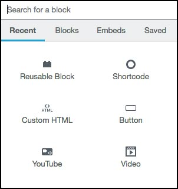
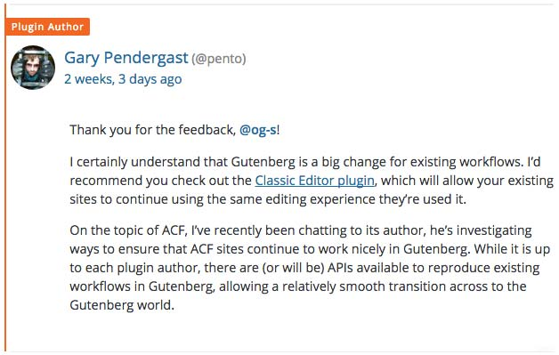

في الآونة الأخيرة، كثر الحديث عن ووردبريس غوتنبرغ في مجتمع نظام إدارة المحتوى الأشهر على مستوى العالم. مشروع غوتنبرغ تسعى من خلاله مؤسسة ووردبريس لإعادة صياغة طريقة إنشاء وصناعة المحتوى من خلال إدخال تغييرات جذرية على مستوى محرر WYSIWYG في لوحة التحكم.

في الحقيقة كان عدد كبير من المتابعين ينتظرون هذه الخطوة من ووردبريس، لا سيما بعد ملاحظة التطور الحاصل في منصات التدوين العالمية المعروفة مثل Medium، هذا الأخير أعاد تعريف محررات النصوص وجعلها أكثر مرونة وأطلق أيدي المدونين للإبداع في صناعة وتخصيص محتوياتهم.

هذه الخطوة كبيرة ومفصلية في [تاريخ ووردبريس](https://www.tutomena.com/web-development/wordpress-evolution-story/)، فمالذي إذن تعنيه بالنسبة للمستخدمين ؟ وكيف نستعد كمطورين لهذه المرحلة الجديدة ؟ هل هي مجرد تحديثات على مستوى محرر wysiwyg أم أن الأمر يتجاوز ذلك ؟ كل هذه الأسئلة سنحاول الإجابة عليها في هذا الموضوع.

## الدوافع وراء مشروع ووردبريس غوتنبرغ

في بداية العالم، أعلن مات مولنويغ بأن فريق [ووردبريس](https://www.tutomena.com/web-development/%d9%84%d9%85%d8%a7%d8%b0%d8%a7-%d9%88%d9%88%d8%b1%d8%af%d8%a8%d8%b1%d9%8a%d8%b3/) يعملون بجد لجعل محرر **Gutenberg** جزءًا من نواة ووردبريس في أقرب وقت ممكن. وأكد مولنويغ بأنه من الآن وصاعدا سيتم التركيز بشكل أكبر على تحسين تجربة المدونين في تحرير محتوياتهم. **محرر غوتنبرغ** هو الخطوة الأولى في هذه السياسية الجديدة.

يهدف القائمون على تطوير ووردبريس من وراء هذه الخطوة، لإضافة مميزات جديدة لهذا المشروع الذي يتجاوز كونه مجرد تحسين على مستوى محرر النصوص إلى طريقة جديدة للتحكم في تصميم وهيكلة الصفحات دون اللجوء للإضافات للوصول لهذا الغرض.

## ما هو الفرق الذي سيحدثه هذا المشروع ؟

المحرر الجديد يسعى لتمكين المدونين من التحكم في محتوياتهم بطرق أفضل من خلال اعتماد فلسفة **EVERYTHING AS BLOCKS** بحيث يمكن للمحرر تقسيم المحتوى لعدة أجزاء (Blocks) والتحكم بكل واحد منها على حدة.

<iframe width="100%" height="315" src="https://videopress.com/embed/pOhnP5Kd" frameborder="0" allowfullscreen="allowfullscreen"></iframe>

هذا التغيير جوهري، لأنه يضيف ميزة جديدة لمحرر ووردبريس ليست موجودة في المحرر الحالي : تطابق كبير بين ما هو موجود في المحرر وما يظهر على واجهة المستخدم للموقع.

هذه الإشكالية هي التي جاء عدد من بناة الصفات (Page Builders) مثل Visual Composer و Elementor لحلها. والآن قرر ووردبريس أن يجد حلا لهذه النقطة بنفسه من خلال **محرر غوتنبرغ،** مع سهولة الإستخدام التي بالتأكيد يعملون على توفيرها للمستخدمين.

بكل صراحة أعجبت كثيرا بهذا المحرر عندما جربته، فهو يعطيك الحرية الكاملة في تشكيل المادة المنشورة. أعجبتني فكرة إضافة الودجات للمقالة وكذلك أكواد HTML مخصصة والتضمينات (_Embed_) من يوتيوب، تويتر، فيسبوك وغيرها الكثير من المواقع العالمية.

المهم كل شيء عبارة عن أجزاء (_Blocks_) يتم تخصيص كل جزء على انفراد، مع إمكانية حفظ هذا البلوك وإعادة استعماله لاحقا (_Reusable Blocks_) :)

حاليا هناك إضافة [Gutenberg](https://wordpress.org/plugins/gutenberg/) التي تمكن المستخدمين من اكتشاف هذا المحرر الذي لا يزال في طور التطوير، ومن المرتقب أن يتم دمجه في النواة مع إصدار ووردبريس 5.

## آراء المستخدمين الأولية

يبدو أن التقييم السلبي (_2.6/5_) الذي حصلت عليه إضافة غوتنبرغ من المختبرين تقييم غير منطقي! من الوهلة الأولى يتضح لأي مستخدم بأن هذه خطوغ عظيمة إلى الأمام بالنسبة لووردبريس. فما الذي يمكن فعله بواسطة المحرر الحالي ولا يمكن فعله بمحرر غوتنبرغ ؟ ببساطة لا شيء، بل العكس هو الصحيح، هناك ميزات عديدة موجودة في غوتنبرغ لا توجد في المحرر الحالي.

من خلال قراءتي لبعض تعاليق المقيمين، اتضح لي أن آراء أغلبهم غير موضوعية وليست بالضرورة آراء وجيهة تستوجب تقييم 1 من 5!! فبعضهم قام بمؤاخذة غوتنبرع لإعتماده على مكتبة _React.js_ رغم أنه بإمكان المطورين تطوير ال Blocks الخاصة بهم بأي تقنية مهما كانت، وليس بالضرورة _React_.

منهم كذلك من قال بأن Gutenberg سيضع مواقع ووردبريس كلها في قوالب متشابهة ولن يترك مجالا للمصميم من أجلا الإبداع. واتهم ووردبريس بأنها تسعى لإرضاء المستخدمين العاديين على حساب المطورين والمصمين، وأنها تسير بهذا الشكل على خطى WIX. في الحقيقية هذا الكلام مردود عليه، فبما أن ووردبريس تطورت فبالتأكيد المطورين بدورهم سيتطورون معها وسيظهرون أساليب جديدة لإضافة لمساتهم الخاصة على هذه الصناعة.

- اقرأ أيضا: [أفضل قوالب ووردبريس الإخبارية في متجر ثيم فورست](https://www.tutomena.com/blog/best-wordpress-news-themes/)

أما البعض الآخر ممن يمكن وصفهم بالموضوعيين، فقد قدموا مبرارات وجيهة لتخوفاتهم. بعضهم قلق من عدم ملاءمة المحرر الجديد لمشاريعهم التجارية التي تعتمد بشكل كبير على محرر wysiwyg الحالي. وأظهروا كذلك تخوفهم من عدم توافق إضافة **ACF** (لإنشاء الحقول المخصصة) مع ووردبريس غوتنبرغ، غير أن أحد مطوري الأخير أكد بأنه أجرى اتصالات مع مطوري ACF وأكدوا له بأنهم سيفعلون ما بوسعهم لضمان توافقية تامة مع Gutenberg.

## النهاية

في الوقت الحالي، يبدو مشروع Gutenberg مقتصرا على محرر ووردبريس وتحسين تجربة إنشاء المحتوى فقط. هذا صحيح ولكن كمرحلة أولى فقط، بعد الإنتهاء منها سينتقل القائمون على المشروع لأبعد من ذلك لمرحلة التخصيص الكامل للصفحات، وعندما أقول الصفحات فأعني بكلامي كل جزء في الصفحة وليس فقط الجزء الذي تظهر فيه التدوينة أو المحتوى.

غوتنبرغ تغيير كبير، سيكون هناك عمل مكثف من مطوري ووردبريس لضمان أن الوظائف الموجودة (مثل Shortcode و Metaboxes) ستواصل العمل بالشكل العادي. هذا مع إعطاء المطورين الوقت الكافي للانتقال للمرحلة الجديدة على نحو سلس. في نهاية المطاف، فإنه سيتم خلق فرص جديدة لمطوري القوالب والإضافات لتقديم خدمات أفضل للمستخدمين من خلال تجربة أكثر جاذبية، مستفيدين من مجموعة الأدوات المدعومة من نواة **ووردبريس غوتنبرغ**.

---

**مراجع للإستزادة:**

- [https://wordpress.org/gutenberg/](https://wordpress.org/gutenberg/)
- [https://matiasventura.com/post/gutenberg-or-the-ship-of-theseus/](https://matiasventura.com/post/gutenberg-or-the-ship-of-theseus/)
- [https://wpengine.com/blog/gutenberg-what-you-need-to-know/](https://wpengine.com/blog/gutenberg-what-you-need-to-know/)
