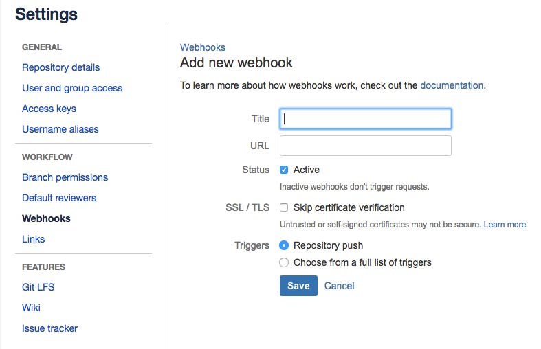

يقول المبرمج والرياضي الشهير [مالكوم دوغلاس ماكلروي](https://en.wikipedia.org/wiki/Douglas_McIlroy) :

> **كمبرمج، مهمتك هي أن تجعل نفسك دائما خارج نطاق العمل. ما تقوم به اليوم، يمكن عمله بشكل آلي غدا.**

هذا الكلام صحيح إلى حد بعيد، ليس مجال البرمجة فقط، بل في جميع مناحي الحياة. فإذا استطعت أتمتة الأشياء التي تقوم بها بشكل دوري فلا تتردد في ذلك، هذا سيعود عليك بمنافع كثيرة وتربح أوقاتا ثمينة تستطيع استثمارها في التركيز على أشياء أخرى أكثر أهمية.

في عملنا كمبرمجين، نقوم بتكرار العديد من المهام بشكل يومي أو أسبوعي. عملية **نشر** (**_Deploy_**) البرمجيات واحدة من هذه المهام التي قد يخصص لها جزء مهم من أوقات عملنا. هذا ما جعلني أفكر في كتابة موضوع حول طريقة أتبعها شخصيا لنشر برمجياتي بشكل تلقائي باستخدام منصة Bitbucket.

## فوائد أتمتة نشر البرمجية

- تسهيل عمليّة نشر البرمجية.
- زيادة الإنتاجية، بحيث يركّز المبرمج على البرمجيّة.
- أن تتم عمليّة بناء الاعتماديّات Build dependency على السيرفر، وهذا يعني أن تكون أسرع بكثير من رفع البرمجية مباشرةً، بالتالي تسريع عمليّة الرفع، وتقليل الأخطاء المحتملة من اختلاف بيئة عمل السيرفر عن الجهاز المحلي.
- تقليل الأخطاء التي قد تحدث أثناء عمليّة الرفع- أن يُرفع مثلًا ملف يحتاج إلى ملف آخر، لكن الآخر لم يُرفع بعد-. باستخدام نظام Git ، لن تُرفع جميع الملفّات من جديد، إنما سيتم رفع التغيّرات فقط، أي أن عملية الرفع ستكون أسرع، ولا تستهلك الكثير.

الآن، بعد أن عرفنا الفائدة من أتمتتة النشر، سنحتاج إلى التعرّف على المتطلبّات والأدوات التي سنستخدمها.

## المتطلبات

- حساب في [Bitbucket](http://bitbucket.com) .
- نظام Git ، يمكنك تحميله من [هنا](https://git-scm.com/downloads).
- نظام SSH للدخول إلى السيرفر (الاستضافة)، وهذا يحتاج إلى:
  - Bash على نظاميّ Linux و Macintosh وهما متوفّران بشكل افتراضي في نظام التشغيل.
  - Putty على نظام Window يمكنك تحميلها من [هنا](http://www.putty.org/) ، هذا طبعًا إن لم تقم سابقًا بتنصيب Ubuntu كـ Subsystem على Window ، حيث ستتوفر الـ Bash افتراضيًا على الويندوز، فقط افتح الـ Command Line واكتب Bash .
- PHP أو أي لغة أخرى تمكنّك من تنفيذ أوامر على السيرفر.

والآن بعد أن تعرّفنا على الأدوات التي سنستخدمها، دعنا نبدأ في مشروعنا!

## بناء المشروع

لندخل أولًا على مجلّد البرمجيّة التي نعمل عليها:

```bash
cd /path/to/project/folder
```

ثم نقوم بإنشاء مستودع محلّي عن طريق الأمر التالي:

```bash
git init
```

ثم نقوم بإضافة الملفات إلى مستودع Git :

```bash
git add .
git commit -m "init commit"
```

لنتوجه الآن إلى المتصفح!

قم بإنشاء مستودع جديد على bitbucket (سنسمّيه المستودع البعيد) ، ثم عُد إلى سطر أوامر الحاسب الشخصي، واكتب الأمر التالي لنقوم بربط المستودع البعيد، بالمستودع المحلي:

```bash
git remote add origin https://username@bitbucket.org/username/repository-name.git
```

https://username@bitbucket.org/username/repository-name.git هو المستودع الخاص بمشروعك على Bitbucket.

الآن قُم برفع الملفات إلى المستودع البعيد:

```bash
git push origin master
```

## كيف تحصل العملية

أولًا، كما رأينا، عمليّة نقل البرمجية من المستودع المحلي إلى المستودع البعيد سهلة جدًا، حيث يوفّر Git ، أمرًا خاصًا بهذا، لكن نحن لا نريد أن نرفع الملفات إلى المستودع البعيد وحسب، بل إلى السيرفر(الاستضافة نفسها) بشكل آلي، دون تدخّل بشري.

لكن كيف يُمكننا هذا؟، دَعنَا نفّكر قليلًا.. كيف نربُط ما بين المستودع البعيد والسيرفر (الاستضافة)؟.

جوابًا لهذا السؤال، قام عدد من مقدّمي خدمات Git كـ Bitbucket و Github ، بدعم ما يسمّى بـ Webhook ، إذًا ما هذه الـ Webhook ؟.

### عن الـ Webhook

مفهوم الـ Webhook ، هو بشكلٍ عام، هو طريقة تستخدم لتغيير أو زيادة سلوك موقع أو صفحةٍ ما، عن طريق ما يسمّى بـ Callback ، يمكن إنشاء وتعديل وإدارة الـ Callback من قبل طرف ثالث Third Party ، ليس بالضرورة أن يكونوا مرتطبين بالموقع الأصلي، ولا يتم تشغيل الـ Callback إلا حينما يحدث حدثٌ event ما، محدد سابقًا.

#### إذن فكيف تعمل الـ Webhook على Bitbucket ؟

في Bitbucket ، يقوم سيرفر Bitbucket بإرسال طلب HTTP Request محمّل بمعلومات Payload إلى ملف معيّن(تقوم بتعيينه، وسنرى كيف ذلك لاحقًا)، حيث يحتوي هذا الملف على الـ Callback ، بالتالي يكون الطلب HTTP Request هو من يقوم بإثارة الـ Callback الموجودة في الملف. لكن ما هي الحالات التي يتم فيها إرسال الطلب؟، يتم إرسال الطلب كلما حدث حدثٌ event معيّن في المستودع البعيد، وهناك العديد من الأحداث لكن هذه أبرزها:

- Push
- Fork
- Merged
- تستطيع الإطلاع على البقيّة [هنا](https://confluence.atlassian.com/bitbucket/event-payloads-740262817.html#EventPayloads-Repositoryevents).

كما نرى، نحنُ بحاجة إلى أنه كلما يتم رفع Push محتوى جديد إلى المستودع، يتم إرسال طلب إلى السيرفر، لنحدّث الملفات والنسخة الموجودة على السيرفر، الصورة التالية توضح طريقة سير العملية:

### [](../images/New-Mind-Map.png)ما بعد وصول الطلب HTTP Request

بعد وصول الطلب، سيتم تنفيذ الـ Callback ، لكن، كيف نقوم بجلب البيانات من المستودع البعيد عن طريق الـ Callback ؟. مفهوم الـ Webhook ، هو بشكلٍ عام، هو طريقة تستخدم لتغيير أو زيادة سلوك موقع أو صفحةٍ ما، عن طريق ما يسمّى بـ Callback %D إجابةً على السؤال أعلاه، نحنُ بحاجة إلى أن نعطي السيرفر صلاحية الوصول إلى حسابنا الشخصي في **Bitbucket** ،لكن لماذا؟ لأن Bitbucket خدمة سحابية، بالتالي فهي بحاجة إلى التأكد من أن لك حق الوصول إلى المستودع المُراد، فكي نستطيع التعامل مع المستودع الخاص بنا، لابد أن نعرّف سيرفر Bitbucket على هويّتنا، بحيث يسمح لنا بالدخول إلى المستودع الخاص بنا. وكيف يتم هذا الأمر؟، يتم هذا عن طريق **SSH Key**، وهي عبارة عن مفاتيح استيثاق (أي كاسم المستخدم وكلمة المرور) تستخدم في العمليات المؤتمتة التي لا تتطلب تدخّل بشري، هذه المفاتيح عبارة عن مفتاحين، مفتاح عام Public Key، ومفتاح خاص Private Key، يتم مشاركة المفتاح العام مع أي شخص، ويبقى المفتاح الخاص على اسمه، سريًا، والـ SSH Key موضوع آخر يحتاج إلى تفصيل، قد نقوم بشرحه في مقالات قادمة بإذن الله. الآن، وبعد أن دخلنا إلى حسابنا في Bitbucket، سنقوم بكتابة برمجيّة -يمكن كتابتها بأي لغةٍ تدعم تنفيذ الأومر على السيرفر-، تحتوي على التالي:

1. التأكد من الطلب الذي وصل إلى الملف، قادمٌ من سيرفر Bitbucket، حتى لا يتم تنفيذ السكربت من أي مخرّب.
2. التحقق من وجود الـPayload .
3. التحقق من وجود تغييرات حدثت في المستودع.
4. جلب التغيرات من المستودع البعيد.

وبالبركة عليك :)، انتهت العملية! لنتّجه الآن إلى الجزء العملي!

## تهيئة الـ Webhook

نقوم بالدخول إلى مستودع المشروع على bitbucket ، ومن ثم التوجّه إلى Settings > Webhooks ، ثم نختار Add Webhook ، نضيف العنوان، ورابط الملف الذي يحتوي الـ Callback على السيرفر، ونعلّم على الخيار active .ونختار لـ Triggers: Repository push ، ومن ثم نضغط Save . [](../images/bitbucket-add-webhook.jpg) الآن أصبح لدينا Push Webhook ، بالتالي فإنه كلما حصل Push على المستودع البعيد، يتم إرسال طلب HTTP Request إلى السيرفر(الاستضافة).

## تهيئة الاستيثاق

الآن، للسماح للسيرفر بالدخول إلى حسابنا في Bitbucket لابد أن تقوم بعمل SSH Keys ونعطي Bitbucket المفتاح العام Public Key ليتأكد من هويّتنا. نَلِج إلى السيرفر الخاص بنا عن طريق SSH ، عن طريق الأمر التالي في Bash -في Putty هُناك واجهة رسومية تسهّل الموضوع-:

```bash
ssh username@host.com -p 2222
```

استخدمنا الخيار p لتحديد المنفذ Port الذي سنتخدمه، أغلب السيرفرات تستخدم المنفذ رقم 2222 . بعد أن ولجنا إلى السيرفر، نقوم بالتوجّه إلى مجلد SSH عن طريق الأمر التالي:

```bash
cd ~/.ssh
```

ولإنشاء مفتاح SSH ، نقوم بالأمر التالي:

```bash
key-gen -t rsa
```

سيطلب منك إنشاء جملة مرور (passphrase)، اتركها خالية، ليتمكّن السيرفر من الدخول إلى الحساب، إن أضفنا جملة مرور، لن يستطيع السيرفر الدخول إلى الحساب. الآن سيكون قد أُنشئ مفتاحين، عام وخاص، وسنقوم بنسخ المفتاح العام لإضافته إلى Bitbucket ، لنقم بالأمر التالي لاستخراج المفتاح:

```bash
cat id_rsa.pub
```

الآن نتّجه إلى حسابنا في Bitbucket ونتّجه إلى [هذا الرابط](https://bitbucket.org/account/ssh-keys/)، ثم نقوم بإضافة المفتاح الذي استخرجناه من الأمر السابق. الآن نعود إلى السيرفر، ونحرر ملف

```bash
~/.ssh/config
```

لكي يتحققّ السيرفر من هويّة Bitbucket دون الحاجة إلى طلب كلمة المرور في كل مرة، نقوم بإضافة التالي إلى الملف السابق، ونضيف التالي، أنشئ الملف إن لم يكن موجودًا:

```bash
Host bitbucket.org
IdentityFile ~/.ssh/id_rsa
```

## تهيئة المشروع على السيرفر

الآن نقوم بجلب ملفات المشروع من المستودع البعيد، اتّجه إلى المكان الذي تريد فيه إضافة المشروع وأدخل الأمر التالي:

```bash
git clone --mirror git@bitbucket.org:<username>/<repo-name>.git
```

الخيار mirror ، يقوم بإنشاء مرآة من المشروع الخاص بنا، أي أن هذه النسخة، ليست نسخة للعمل والتعديل.

## تهيئة ملف الـ Callback

نقوم الآن بإنشاء الملف الذي سيُرسل إلى طلب الـ Webhook ، قُم بإنشاء الملف الذي أضفته حين إنشاء الـ Webhook ، وقم بإنشائه في المكان الذي حددّته، وسمّه بالاسم الذي أضفته سابقًا. الآن سنضيف السكربت الذي سيستقبل الـ Webhook ، نحنُ اخترنا لغة PHP ، لكن بإمكانك إنشاء السكربت بأي لغة تفضّل. قُم بفتح الملف، وأضف الشفرة التالية:

```php
if(isset($_SERVER['HTTP_USER_AGENT']) && $_SERVER['HTTP_USER_AGENT'] == "Bitbucket-Webhooks/2.0"){
 $payload = json_decode(file_get_contents('php://input'));
 if(isset($payload) && !empty($payload)){
  echo "Payload found...\n";
 if(isset($payload->push,$payload->push->changes[0]) && !empty($payload->push->changes[0])){
  echo "There is somechanges...\n";
 if(function_exists('exec')) {
  echo "lets execute script...\n";
  exec('git fetch --all',$output,$return);
 if(!$return){
  exec('git reset --hard origin/master',$output,$return);
 if(!$return){
  die('Run Success!');
 }else{
  die('Error in <code>reset</code>');
 }
 }else{
  die('Error in <code>fetch</code>');
 }
 }else{
  die('disable to excute script.');
 }
 }else{
 die('Already up-to-date.');
 }
 }else{
  die('No payload found!');
 }
}
```

هذا السكربت، يقوم بالتالي:

1. يتحقق من أن مُرسل الطلب هو Bitbucket .
2. يقوم بجلب البيانات من الطلب، وتحويلها إلى JSON .
3. يتحقق من وجود المعلومات في الطلب.
4. يتحقق من وجود تغيّرات في المستودع البعيد.
5. يتأكد من وجود وتفعيل دالّة exec التي تقوم بتنفيذ الأوامر على السيرفر، إن لم تكنّ مفعلة قُم بتفعيلها من ملف php.ini ، أو قم بمراسلة مستضيفك لتفعيلها.
6. يقوم بجلب التغيّرات من المستودع البعيد، عن طريق الأمر:

```bash
 git fetch
```

قد تتساءل لماذا استخدمنا fetch وليس pull ؟ لأن fetch تقوم بجلب التغيّرات من المستودع البعيد دون أن تقوم بتغييرات في شجرة العمل (working tree)، بينما pull تقوم بدمج (merge) الفروع (branch) وحينها تخبرك: هل تريد هذا الدمج أم لا؟ لذلك ستعيق عمل السيرفر، بينما fetch لا تعيقه لأنها لا تقوم بالدمج أصلًا.

7. يتحقق من أن الأمر fetch قد تم.
8. كون fetch لا تقوم بتغيير شجرة العمل، نحن بحاجة إلى جعلها تقوم بذلك، وكوننا نملتك التغيّرات البعيدة عن طريق الأمر السابق، نقوم الآن بإعادة التغيّرات بشكل قسري إلى الفرع origin/master.
9. إذا تم الأمر السابق، يقوم بقتل العمليّة مع طباعة أن الأمر قد تم بنجاح.

لاحظ أن هذا السكربت لن يعمل إذا كان هذا الاتصال الأول لك مع Bitbucket ، حيث أن السيرفر سيقوم بطلب Fingerprint الخاصة بـ Bitbucket ، ولتوليدها، يجب عليك أن تقوم بأي أمر يخص git -فيه اتصال بـ Bitbucket - بشكلٍ يدوي، ليتمكّن السيرفر من إضافتها.

هذا السكربت يقوم بسحب التغيّرات من المستودع البعيد وتطبيقها ولا يقوم بعملية البناء (Building)، إن أردت أن يقوم بعمليّة البناء، تستطيع تنفيذ أوامر البناء، ليقوم السيرفر ببناء الحزم المطلوبة.

## نشر البرمجية (Deploying)

الآن أنت مستعد لنشر البرمجية، متى ما قمت بتغيّرات في المستودع المحلي، قم بدفعها إلى المستودع البعيد، ولتقم من التحقق من أن العملية عملت بشكلٍ سليم، قم بالدخول إلى الرابط التالي:

```bash
https://bitbucket.org/<user>/{repo-name}/admin/addon/admin/bitbucket-webhooks/bb-webhooks-repo-admin
```

لا تنسى تعديل `{repo-name}` باسم مستودعك البعيد.

## الأخطاء المحتملة

إذا لم تعمل البرمجية كما هو متوقّع، هذه بعض الأخطاء المحتملة.

### صلاحيّة الوصول إلى الملفّات

قُم بالتأكد من أن المستخدم الذي تستخدمه لتنفيذ العملية، لديه صلاحيّة الكتابة على الملفات الموجودة في مجلد العمل.

### عدم التعرّف على أمر git

تأكد من أن ملف git الثنائي (binary)، مُضاف إلى متغيّر البيئة `$PATH` ، إن لم يكن كذلك، قم بإضافة هذا المسار إلى المتغيّر:

```bash
/usr/local/bin/git
```

إن لم يكنّ الملف في هذا المسار، قُم بالأمر التالي لمعرفة أين يوجد الملف:

```bash
which git
```

## خاتمة

بحمدِ الله تم الأمر، ونسأل الله أن ينفع بهذا المقال، وهذه بعض المصادر التي استفدنا منها:

- [Automated git deployments from Bitbucket](https://jonathannicol.com/blog/2013/11/19/automated-git-deployments-from-bitbucket/)
- [How do I force “git pull” to overwrite local files](https://stackoverflow.com/questions/1125968/how-do-i-force-git-pull-to-overwrite-local-files)
- [Manage webhooks](https://confluence.atlassian.com/bitbucket/manage-webhooks-735643732.html)
