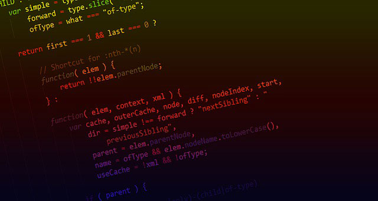
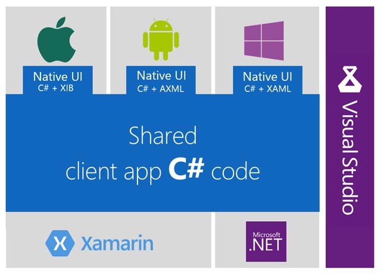

ربما دخولك لهذا الموضوع يعني أنك تخطط لبدء رحلتك في ميدان البرمجة، أو أنك ببساطة مبرمج وتسعى لتطوير مهاراتك واكتساب معارف جديدة. في كلا الحالتين قد تسأل نفسك عن أفضل لغات البرمجة التي تستحق التعلم في هذا العام الجديد، بناءً على معطيات معينة تتعلق باتجاهات السوق والمتطلبات الجديدة التي تفرضها.

فكرتُ بكتابة هذا الموضوع حتى أساعدك في تكوين فكرة عن أبرز لغات البرمجة التي لن تندم بتعلمها في هذا العام، حيث يتوقع أن يكون لها شأن كبير ومكانة مميزة في هذه الصناعة في الفترة المقبلة.

## جافاسكريبت

**الجافاسكريبت** الآن لم تعد مجرد لغة برمجة تشتغل داخل المتصفحات كما كانت من قبل، بل [صرنا نجدها في كل مكان تقريبا](https://www.tutomena.com/web-development/javascript/javascript-dominance/).

بتعلمك هذه اللغة وإتقانها، تستطيع عمل تطبيقات ويب متكاملة بفضل تقنية **Node.js** التي مكنتنا من تشغيل الجافاسكريبت في الخوادم. وسيكون بإمكانك كذلك إنجاز تطبيقات الأجهزة المحمولة بكفاءة عالية عن طريق تقنيات مثل [**Ionic**](https://www.tutomena.com/web-development/javascript/introduction-to-ionic2/) و [**React Native**](https://www.tutomena.com/web-development/javascript/%d9%85%d9%82%d8%af%d9%85%d8%a9-%d8%b9%d9%86-react-native/). كما أن مجال تطبيقات سطح المكتب لن يكون بعد ذلك مستعصيا عليك لأن تقنيات مثل **Electron** تمكن من عمل تطبيقات Desktop ذات جودة عالية وعابرة للمنصات، واسألوا Visual Studio Code ،Slack و Atom إذا لم تصدقوني.

الجميل مع هذه اللغة كذلك أنها متطورة بشكل سريع ومذهل، وبالتالي لا نستطيع تخيل جميع الإمكانيات التي قد تتيحها مستقبلا إلى جانب كل ما ذكرناه.

[bctt tweet="إذا كنت محتارا ولا تدري أي لغة برمجة ستقوم بتعلمها، فجافاسكريبت بكل تأكيد لن يكون اختيارا خاطئا." username="tutomena" prompt="غرد على تويتر"]

## بايثون

لطالما كانت لغة البرمجة بايثون من الأكثر شعبية وانتشارا. العديد من الخبراء يؤكدون بأن هذه اللغة ملائمة جدا للمبتدئين، فهي سهلة وتستطيع التقدم فيها بسلاسة لا نجدها في كثير من لغات البرمجة الأخرى. وما أضاف إليها شعبية أكبر هو كونها الخيار الأول في مجال Machine Learning أو **تعلم الآلة** الذي يشهد نموا وتطورا كبيرا في المدة الأخيرة، طبعا إلى جانب شعبيتها الجيدة في مجال الويب ممثلة بإطار العمل المعروف _Django_ وكذلك _Flask_.

[الأهمية الكبيرة لبايثون نلمسها ونلحظها جيدا في المجتمعات والدول الغربية](https://www.tutomena.com/web-development/growth-python-programming-language/)، خاصة أمريكا وكندا وألمانيا، حيث حققت هذه اللغة أعلى نسب النمو بين جميع لغات البرمجة الأخرى. بينما للأمانة، لا تحظى هذه اللغة بنفس الإقبال في الدول العربية والنامية بشكل عام، نظرا لعوامل عديدة تتعلق أساسا بالإقتصاد وحجم الصناعات التي تستخدم فيها بايثون.

## سي شارب

لغة **سي شارب** قديمة نوعا ما، إصدارها الأول يعود لبداية الألفية ولكنها شهدت تطويرات عديدة مكنتها من البقاء في ميدان التنافس الحاد في مجالات عدة. هذه المجالات تشمل الويب حيث تستفيد من كونها اللغة المعتمدة في بيئة _NET._ لمايكروسوفت، ونجد ل #C أيضا وجودا قويا في مجال تطبيقات الأجهزة الذكية بفضل منصة زامارن _Xamarin_ الذائعة الصيت.

أما إذا كنت من محبي الألعاب فلن يخيب ظنك مع #C، هذه اللغة معتمدة بشكل رسمي في بيئة Unity الأشهر في مجال صناعة الألعاب. Unity تدعم أحدث صيحات التقنية مثل تمكين المستخدمين من عيش تجربتي الواقع الإفتراضي (Virtual Reality) والواقع المعزز (Augmented Reality).

من بين النقاط التي تميز #C كذلك، كونها تتشارك في العديد من الخصائص والميزات مع لغات برمجة أخرى مثل Java. بمجرد تعلمك للأولى واستيعابها سيكون من السهل عليك الإنتقال للثانية بأقل وقت ومجهود.

## كوتلن

مقارنة باللغات التي تم ذكرها في هذا المقال، تعتبر Kotlin هي الأحدث حيث ظهرت لأول مرة عام 2011 على يد شركة _Jetbrains_ المعروفة. ولكن يمكن اعتبار 17 مايو من العام الماضي يوم الولادة الحقيقي لكوتلن حين تم الإعلانها عنها في مؤتمر غوغل السنوي للمطورين (Google I/O) كثاني لغة مدعومة رسميا لتطوير تطبيقات أندرويد إلى جانب لغة البرمجة جافا.

منذ ذلك الحين اكتسبت كوتلن شعبية كبيرة وتحدث عنها جميع المهتمين بتطبيقات أندرويد وبدأ عقد المقارنات بينها وبين جافا. ومن المرتقب أن يتواصل نمو هذه اللغة وانتشارها في العام الحالي مع لجوء عدد متزايد من المطورين لإعتمادها في مشاريعهم على حساب Java، مستفيدين من كفاءتها العالية والسرعة في الإنجاز التي تتميز بها.

[اقرأ أيضا: هل عليَّ تعلم جافا أم كوتلن لتطوير تطبيقات أندرويد ؟](https://www.tutomena.com/web-development/java-or-kotlin-android-development/)

## PHP

في الحقيقة لا يمكن تجاهل لغة البرمجة PHP في أي لائحة للغات البرمجة وخاصة في منطقتنا العربية. هذه اللغة تحظى بشعبية جارفة وهي الأكثر استخداما في المجال الإحترافي، إلى جانب جافاسكريبت.

برامج إدارة المحتوى مثل **ووردبريس** و**دروبال**، وأطر العمل مثل **لارافيل** و**سيمفوني** كلها مبنية على لغة البرمجة PHP. ولا يخفى على أحد منكم حجم الإمكانيات والفرص التي تتيحها هذه التقنيات في السوق العربي والعالمي بصفة عامة.

[اقرأ أيضا: لماذا تحظى لغة البرمجة PHP بكل هذه الشعبية ؟ ](https://www.tutomena.com/web-development/php/why-php-is-so-popular/)

## النهاية

جميع لغات البرمجة الذي ذكرناها مطلوبة ومرغوبة بشدة في سوق البرمجة، وإن اختلفت درجة الأهمية باختلاف المناطق الجغرافية بالنسبة لبعض منها. والأكيد أنك على الأغلب لن تشعر بالندم لاختيارك أي منها، مادمت تعطيها حقها من الوقت والتعلم وتطبيق ما تتعلمه في مشاريع حقيقية.

اللائحة كان يمكن أن تكون أكبر من هذه، ولكني حاولت قدر الإمكان حصرها في 5 لغات برمجة أراها شخصيا الأفضل والأكثر استحقاقا لإعطائها وقتا للتعلم، على الأقل في المدى المنظور.
