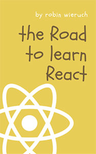
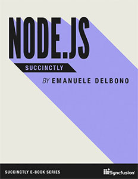
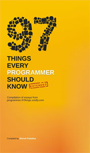
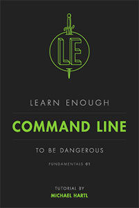
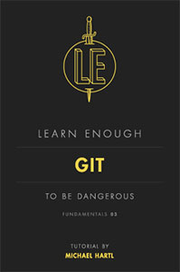
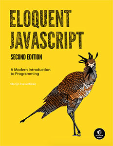

في هذا الموضوع، سأشارك معكم مجموعة من الكتب التي تشمل مجالات متنوعة من البرمجة، تحديدا ما يتعلق بتطوير الويب وتطبيقات الموبايل. بعض هذه الكتب قد يكون مناسبا للمبتدئين، بينما الجزء الآخر موجه بشكل كبير لذوي المستوى المتقدم. يمكنك اختيار الكتاب الذي يعجبك وتبدأ في قراءته، فكما لا يخفى على أحد : المعرفة التي توجد في الكتب لا نجدها في أي مكان آخر.

## الطريق من أجل تعلم React.js

كتاب **The Road To Learn React** من الكتب الجيدة التي ينصح بها للمبتدئين الذين يريدون تعلم **React.js**. هذا الكتاب يشرح أساسيات React وبعض مفاهيمها العامة، إضافة لعدد من أفضل الممارسات المستخدمة في المشاريع الإحترافية. الكتاب يشرح كذلك كيفية إنشاء تطبيق حقيقي من أجل اختبار المعلومات والمكتسبات التي حصل عليها القارئ.

## Node.js باختصار

هذا الكتاب جيد جدا للراغبين في استكتشاف تقنية Node.js والإطلاع على أهم مفاهيمها الأساسية :

- آلية non-blocking I/O
- Event Loop
- الوحدات
- بيئة تشغيل Node.js (أو Runtime)
- التعامل مع نظام الملفات Filesystem
- الإتصال بقاعدة البيانات

تعلم واستيعاب هذه الأساسيات سيمكننا من وضع قدمنا الأولى في عالم صناعة تطبيقات ويب حديثة بواسطة Node.js.

## 97 معلومة يجب أن يعرفها كل مبرمج

هذا الكتاب ممتاز بكل صراحة، وينصح به لكل مبرمج وبصفة خاصة المبتدئين. المؤلف يشارك معنا مجموعة من المفاهيم والممارسات الجيدة التي تُعتمد في البرمجة. كتاب "_Things Every Programmer Should Know 97_" سهل القراءة والفهم، ويحتوي على أمثلة جيدة لإيصال الأفكار بشكل جيد.

## Mobile Developer's Guide to The Galaxy

يركز هذا الكتاب بالأساس على موضوع تطبيقات الموبايل وعملية إنشائها. مؤلفا الكتاب لم يهملا أي خطوة من خطوات إنشاء تطبيقات الهواتف، بدءً من التخطيط والنمذجة (_Prototyping_)، مرورا بمرحلة التصميم والتقنيات المستخدمة في عملية التكويد، وصولا للمراحل النهائية في هذه العملية والمتمثلة في فحص الشفرات البرمجية والنشر (_Deployment_). الكتاب يقدم كذلك مجموعة من النصائح للقراء، تخص مواضيع متعددة مثل تجربة المستخدم، الحماية وقابلية الوصول (_Accessibility_) ...

## Learn Enough Command Line to Be Dangerous

هذا الكتاب هو ما يبحث عنه كل من يريد تعلم الأوامر السطرية لبيئة UNIX (ماك ولينوكس). الكتاب موجه للمبتدئين ومكتوب بأسلوب سهل الإستيعاب، ولا يتطلب أي معرفة أو مهارات خاصة في التعامل مع الحاسب.

فقط باتباع ما في الكتاب، ستصل لمستوى تستطيع فيه التعامل بيسر مع واجهة الأوامر السطرية،ولن تشعر بعدها بذلك الرهاب الذي يعاني منه عدد من المبرمجين المبتدئين تجاه _Command Line_ :)

## Learn Enough Git to Be Dangerous

هذا الكتاب قام بتأليفه نفس مؤلف الكتاب السابق، وهذا واضح من تشابه عنوانيهما. الكتاب دليل مميز لتعلم طريقة وكيفية التعامل مع برنامج إدارة النسخ **Git**. هذا البرنامج يستخدمه تقريبا جميع المبرمجين حول العالم، ولا عجب في ذلك إذا عرفنا الميزات والإمكانيات الهائلة والمتعددة التي يوفرها للمطورين.

لن أتحدث كثيرا عن Git، بل سأدع هذا الكتاب الرائع يفعل ذلك وأدعوك لتحميله إذا رغبت في اكتشاف خبايا هذا البرنامج.

## Eloquent JavaScript

يعتبر كتاب "_Eloquent JavaScript_" من أشهر كتب الجافاسكريبت، نظرا لما يحتويه من معلومات ومفاهيم مهمة للغاية لهذه اللغة البرمجية. الكتاب موجه للمحترفين والمبتدئين على حد السواء، ونادرا ما تجد مطور جافاسكريبت متقدم لم يسبق له الإطلاع على هذا الكتاب القيم.

## النهاية

الكتب المذكورة في هذا الموضوع كلها مجانية، ولكن هذا لا يعني أنها أقل قيمة عن الكتب المدفوعة. في كثير من الأحيان نجد أن الكتاب المجاني في موضوع معين يكون أكثر قيمة وأغنى من حيث المحتوى من الكتب المدفوعة، وبالتالي لا يجب الحكم عليه بناء على هذا المعيار فقط.

وتجدر الإشارة كذلك أن الكتب البرمجية تستفيد من ثقافة المصادر المفتوحة المنتشرة في هذا المجال، والتي شملت كذلك التأليف وصناعة الكتب التعليمية، وهذا بكل تأكيد في صالح مجتمع المبرمجين بشكل عام.
