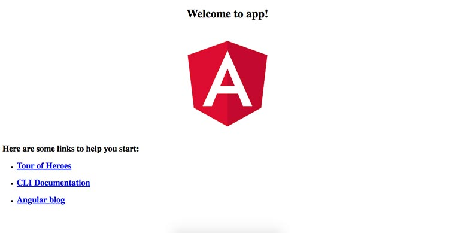
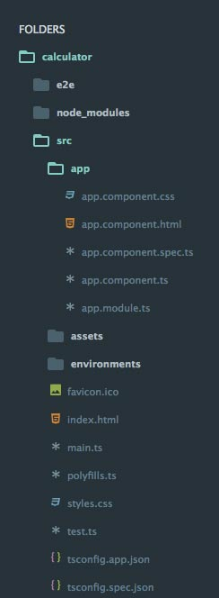
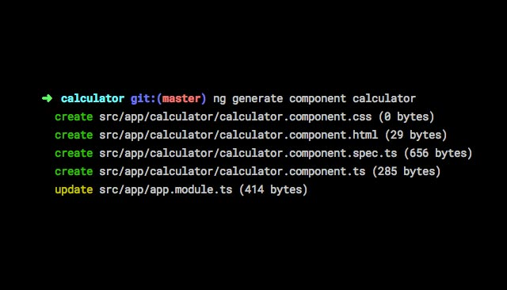
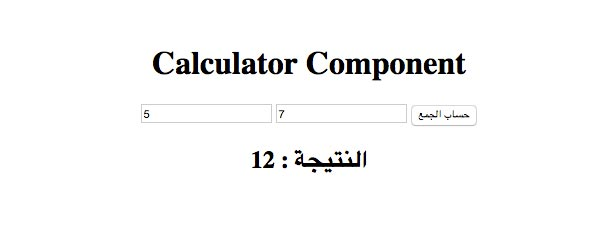

يعتبر **أنجولار** من بين أشهر إطارات عمل الجافاسكريبت في السوق حاليا. كانت بداياته في عام 2009 مع إصدار AngularJs 1.x، وبعد سنوات عديدة من النجاح والهيمنة، رأى مطورو شركة غوغل القائمين عليه بأنه قد حان الوقت للإنتقال لمستويات أخرى لضمان الحفاظ على حصة **Angular** في السوق ومنافسة عدد من اللاعبين الذي دخلوا بقوة في هذه الصناعة، نخص منهم بالذكر ReactJS التابع لشركة فيسبوك.

إحدى أهم النقاط التي جذبت اهتمام المطورين ل ReactJS هو اعتمادها منذ البداية على مفهوم **المكونات **أو **Components** في إنشاء تطبيقات ويب أحادية الصفحة، وقد بدا واضحا للجميع أن هذه هي الموضة القادمة التي ستسيطر على عالم إطارات عمل الجافاسكريبت.

هذه النقطة لم تخفى بطبيعة الحال على مطوري أنغولار الذين أدخلوا هذا المفهوم - المكونات - على إصدارهم الجديد، والذي قرروا تسميته **Angular 2** بعدما قاموا بإعادة كتابته بشكل كامل قاطعين بذلك الطريق على أي توافقية ممكنة مع الإصدار القديم.

بعد ذلك، خرجت إلى النور إصدارات عديدة، كان آخرها _Angular 5_، ولكنها لم تحمل معها أي تغييرات جذرية، بل فقط تحسينات جديدة وتصحيح للأخطاء (_Bugs_) التي ظهرت في النسخ السابقة. لهذا عندما نقرأ **Angular** فإنها تعني جميع الإصدارات منذ Angular 2 حتى الآن.

## ما هو المكون في أنجولار ؟

المكونات هي اللبنات الأساسية في واجهات المستخدم لتطبيقات أنجولار. كل تطبيق أنجولار هو عبارة عن شجرة من المكونات.

وإذا أردتم تعريفا أدق، فلن نجد أفضل من [التوثيق الرسمي لأنجولار](https://angular.io/api/core/Component) الذي يقول :

**Components are the most basic building block of an UI in an Angular application. An Angular application is a tree of Angular components. Angular components are a subset of directives. Unlike directives, components always have a template and only one component can be instantiated per an element in a template.**

**A component must belong to an NgModule in order for it to be usable by another component or application. To specify that a component is a member of an NgModule, you should list it in the `declarations` field of that NgModule.**

## فوائد الإعتماد على مقاربة المكونات في تطبيقات الويب

هناك عدد كبير من الفوائد التي نجنيها من الإعتماد على مقاربة المكونات في تصميم وتطوير تطبيقات الويب الحديثة، منها على سبيل المثال :

- **قابلية إعادة الإستخدام (_Reusability_)**: هذه تقريبا أهم فوائد المكونات في تطبيقات الجافاسكريبت. نستطيع إنشاء مكون جديد في مشروع ما وإعادة استخدامه في مشروع آخر أو مكان آخر في نفس المشروع، وإذا اقتضى الحال، نضيف إليه بعض التعديلات البسيطة وليس إعادة كتابته من الصفر. هذه الفائدة نجد أثرها كذلك في العدد الكبير من المكونات الخارجية التي نجدها في منصة _Github.com_ والتي نستطيع استخدامها بكل سهولة في مشاريعنا، مما يوفر علينا أوقاتا ثمينة في مرحلة التطوير، ويمنحنا كذلك فرصة الإستفادة من خبرات وأعمال الآخرين والمفاضلة بينها على حسب جودتها وشعبيتها لدى المطورين.
- **سهولة الفحص والإختبار برمجيا (_Testability_)**: من المعلوم أنه كلما كانت الوحدات البرمجية صغيرة ومهمامها محددة كلما كان فحصها واختبارها سهلا ومنظما. المكونات بطبيعتها وجدت من أجل تقسيم واجهة المستخدم أو البرنامج ككل لوحدات أو قطع صغيرة، لكل قطعة دور أو مهمة محددة بأكبر قدر ممكن من الدقة. هذا ما يجعل مهمة فحصها واختبارها برمجيات أمرا أكثر سهولة ولا يدع هوامش كبيرة للخطأ. وكما يعلم الجميع، فمرحلة الفحص والإختبار الآلي باتت من المراحل المهمة للغاية في دورة تطوير أي مشروع برمجي.
- **نطاقات معزولة (_Isolated Scope_): **كل مكون يعتبر غرفة مغلقة معزولة عن العالم الخارجي أو تتفاعل معه وفق ما يتاح لها من إمكانيات. في داخل كل مكون نجد البيانات والمتغيرات فقط المطلوبة واللازمة لعمله، وبالتالي فإن إمكانية التعارض والإصطدام مع أجزاء أخرى من البرنامج تكون في أدنى مستوياتها.
- **قابلية الصيانة (_Maintainability_): **عندما يكون لدينا مشكل في محرك السيارة، فإننا نقوم بمعاينة الجزء أو القطعة المسؤولة عن هذا المشكل وإصلاحها أو استبدالها إذا اقتضى الأمر ذلك. ولو كان المحرك كله كتلة واحدة وغير مقسم لقطع صغيرة، لكل واحدة منها مسؤولية محددة، لكانت مهمة الصيانة أكثر تعقيدا وصعوبة. نفس هذا المثال ينطبق على المشاريع البرمجية، فصيانة المكونات المستقلة أو حتى استبدالها بمكونات أخرى أكثر كفاءة، دون الإضطرار للمساس بالأجزاء الأخرى من البرنامج، هو ما يريده كل مبرمج، ويجعل من الصيانة والتحسين مهمة غير مرهقة.
- **سهولة القراءة (_Readability_): **عندما يكون البرنامج مقسما لعدة أجزاء ذات مسؤوليات محددة، فمن السهولة بمكان بالنسبة للمطورين (حتى الجدد منهم) أن يفهموا منطق البرنامج وبنيته.

## أفضل وسيلة للفهم هي التطبيق :)

لكي نفهم جيدا ما هي المكونات في إطار العمل أنجولار، سنقوم بإنشاء تطبيق بسيط يقوم بحساب مجموع عددين.

أولا يجب تثبيت حزمة [Angular CLI](https://cli.angular.io/) على جهازك، وهي الحزمة الرسمية من أنجولار غرضها تسهيل عدد من المهام على المطورين، مثل إنشاء المشروع، إعداد خادم محلي، فحص الكود إلخ...

```bash
npm install -g @angular/cli
```

بعد تثبيت حزمة الأوامر السطرية لأنجولار، سنقوم باستخدامها من أجل إنشاء مشروع جديد على هذا النحو :

```bash
ng new calculator
```

calculator هو اسم المجلد الرئيسي للمشروع، وسنقوم بالدخول إليه، بعد انتهاء عملية الإعداد التي بدأناها بواسطة _ng new_، ثم نقوم بتنفيذ الأمر _ng serve_ من أجل بدء تشغيل التطبيق على الخادم المحلي :

```bash
cd calculator
ng serve
```

قم بفتح الرابط *http://localhost:4200/* على المتصفح، وستجد نفسك أمام الصفحة الرئسية للتطبيق الإفتراضي الذي تم إنشاؤه بواسطة _ng new_.

[](../images/angular-app-default-homepage.jpg)

## بنية تطبيق أنجولار

لنقم بفتح المشروع (المجلد calculator) على المحرر، ونلاحظ بنية المجلدات المكونة لمشروعنا الذي قمنا بتوليده:

[](../images/angular-app-structure.jpg)

كل تطبيق أنغولار يتكون من وحدة (_Module_) واحدة على الأقل، وما يهمنا في البنية في الصورة أعلاه هو الملف *app.module.ts.* هذا الملف هو المكان الذي نقوم فيه بالتصريح بالوحدة الخاصة بتطبيقنا مع كافة الملحقات اللازمة لها، ومنها على سبيل المثال المكون *AppComponent* الذي يتم التصريح به على أنه المكون الإفتراضي لهذه الوحدة عن طريق الخاصية _bootstrap_ وهو الذي يتم عرضه أولا على صفحة _index.html_ الرئيسية للتطبيق*.* أما الخاصية _declarations_ فتمثل المصفوفة التي تضم كافة المكونات التي تتبع لهذه الوحدة.

في الوقت الحالي، لدينا في التطبيق مكون واحد فقط وهو _AppComponent_ المعرف داخل الملف _app.component.ts._ ستلاحظون عند فتح هذا الملف أنه يتم تعريف المكون باستخدام ما يعرف في الجافاسكريبت الحديثة بالمصمم أو decorator. اسم المصمم الذي يستخدم في هذه الحالة هو **_Component@،_** بداخله توجد العديد من المعلومات الخاصة بهذا المكون مثل :

- selector : المحدد الذي يتم استخدامه من أجل طلب وإظهار المكون في قوالب HTML.
- templateUrl: مسار القالب الخاص بالمكون.
- styleUrls: مصفوفة لمسارات ملفات ال CSS الخاصة بهذا المكون.

[alert type="info" icon-size="normal"]ميزة المصممات (**Decorators**) مازالت قيد التجربة في لغة البرمجة جافاسكريبت وليست مدعومة بعد في الوقت الحالي. وإنما يتم استخدامها في أنجولار لأن الأخير يعتمد على لغة **TypeScript** في كتابة أكواد جافاسكريبت متقدمة وتحويلها بعد ذلك في مرحلة Transpiling لأكواد جافاسكريبت اعتيادية تفهمها المتصفحات. لذلك نرى أن امتداد الملفات في المشروع هو **ts.** وليس **js.** كما جرت العادة في كتابة أكواد جافاسكريبت. [/alert]

## إنشاء مكوننا الخاص لحساب جمع عددين

يمكننا التعديل على المكون الإفتراضي AppComponent وجعله يقوم بحساب مجموع العددين، ولكن من أجل الغرض التعليمي لهذا الدرس سنقوم بإنشاء مكون جديد نسميه Calculator.

أولا، لننشئ مجلد جديد اسمه _calculator_ في المسار _src/app_ وندخل إليه انطلاقا من نافذة الأوامر السطرية، ثم نقوم بتنفيذ الأمر التالي من أجل توليد المكون الجديد :

```bash
ng generate component calculator
```

بعد إنتهاء العملية، سنلاحظ أنه تم توليد أربع ملفات داخل المجلد _src/app/calculator_ مع تحديث الملف _app.module.ts_ الذي تكلمنا عليه في السابق.

[](../images/angular-app-generate-component.jpg)

- **calculator.component.css**: الملف الذي سنضع بداخله كافة أكواد CSS الخاصة بهذا المكون.
- **calculator.component.html**: ملف قالب HTML الخاص بالمكون.
- **calculator.component.spec.ts**: هنا سيتم وضع كافة الإختبارات والفحوصات البرمجية التي نريد إجراءها للمكون. هذا الملف لا يهمنا في هذا الدرس لأن موضوع اختبار وفحص الأكواد يحتاج درسا لوحده.
- **calculator.component.ts**: إلى جانب ملف قالب HTML، هذا هو الملف الأهم بالنسبة للمكون، ويعتبر المركز الذي تتم فيه كافة العمليات المنطقية الخاصة به (_Controller_).
- **app.module.ts**: تم تحديث هذا الملف من أجل استيراد المكون _Calculator_ وإضافته للخاصية _declarations_ التي أشرنا إليها في إحدى الفقرات أعلاه.

```ts
import { BrowserModule } from '@angular/platform-browser';
import { NgModule } from '@angular/core';

import { AppComponent } from './app.component';
import { CalculatorComponent } from './calculator/calculator.component';

@NgModule({
  declarations: [AppComponent, CalculatorComponent],
  imports: [BrowserModule],
  providers: [],
  bootstrap: [AppComponent]
})
export class AppModule {}
```

محتوى ملف **calculator.component.ts** هو على الشكل الآتي:

```ts
import { Component, OnInit } from '@angular/core';

@Component({
  selector: 'app-calculator',
  templateUrl: './calculator.component.html',
  styleUrls: ['./calculator.component.css']
})
export class CalculatorComponent implements OnInit {
  constructor() {}

  ngOnInit() {}
}
```

لاحظوا الخاصيات (تعرف ب *Metadatas*) بداخل المصمم _Component@_ التي تكلمنا عليها في السابق، وتحديدا **selector** الذي نستخدمه من أجل استدعاء المكون في القوالب الخارجية. وبما أن المكون الرئيسي لتطبيقنا هو AppComponent، فإننا سنقوم بفتح القالب الخاص به app.component.html ونضيف إليه المكون _CalculatorComponent_ بهذا الطريقة :

```html
<div style="text-align:center">
  <app-calculator></app-calculator>
</div>
```

> يمكننا بطبيعة الحال تغيير اسم المحدد app-calculator ونضع الإسم الذي يناسبنا.

والآن بالعودة إلى المتصفح سنرى في الصفحة الرئيسية هذه الرسالة :

```terminal
Calculator Works!
```

وهي الرسالة التي نجدها في القالب _calculator.component.html_ الخاص بالمكون _CalculatorComponent_.

> حتى لا تضطر لإعادة تنفيذ الأمر `ng serve` بعد كل عملية تعديل على الملفات، استخدم بدلا عنه `ng serve --watch` الذي يقوم بإعادة جمع الأكواد البرمجية (Bundling) بعد كل عملية حفظ وبعدها إعادة تحميل المتصفح آليا.

إذن ما يجب علينا فعله الآن، هو التعديل على هذا القالب وتعويضه بما يمكننا من حساب مجموع عددين. سنضع قالبا بسيطا لهذا الغرض، عبارة عن حقلين من نوع *number* لإدخال قيمة العددين وزر يقوم بحساب المجموع عند النقر عليه.

```html
<h1>Calculator Component</h1>
<input [(ngModel)]="number1" type="number" name="" placeholder="العدد الأول" />
<input [(ngModel)]="number2" type="number" name="" placeholder="العدد الثاني" />
<button>حساب الجمع</button>
```

يمكنكم تحسين الشكل والتصميم بإضافة بعض من CSS في ملف *calculator.component.css.*

الخاصية **[(ngModel)]** تمكننا من ربط الحقلين بالمنطق الموجود داخل الملف _calculator.component.ts_ والعكس صحيح، هذا ما يعرف ب **Two-way data binding** وقد [تطرقنا إليه في مقال سابق](https://www.tutomena.com/web-development/javascript/one-way-vs-two-way-data-binding/). بغير هذه الخاصية لن نتمكن من الوصول لقيمة الحقلين انطلاقا من الكلاس _CalculatorComponent._

حتى نقوم باستخدام **[(ngModel)]** يجب استيراد وحدة خاصة اسمها **FormsModule** في ملف _app.mdoule.ts_ وإضافتها للخاصية _imports_ داخل المصمم **NgModule@** :

```ts
import { BrowserModule } from '@angular/platform-browser';
import { NgModule } from '@angular/core';
import { FormsModule } from '@angular/forms';

import { AppComponent } from './app.component';
import { CalculatorComponent } from './calculator/calculator.component';

@NgModule({
  declarations: [AppComponent, CalculatorComponent],
  imports: [BrowserModule, FormsModule],
  providers: [],
  bootstrap: [AppComponent]
})
export class AppModule {}
```

الخطوة القادمة هي أن نقوم بتعريف المتغيرين _number1_ و _number2_ في الكلاس _CalculatorComponent_ حتى يتم استقبال قيمة الحقلين فيهما. وإضافة إليهما، نقوم بالتصريح كذلك بمتغير ثالث اسمه *result *لاستخدامه لاحقا في عرض النتيجة.

```ts
import { Component, OnInit } from '@angular/core';

@Component({
  selector: 'app-calculator',
  templateUrl: './calculator.component.html',
  styleUrls: ['./calculator.component.css']
})
export class CalculatorComponent implements OnInit {
  public number1: number;
  public number2: number;
  public result: number;
  constructor() {}

  ngOnInit() {}
}
```

من مزايا **TypeScript** أنه يمكننا من تحديد نوع المتغيرات، وهي **number** في هذه الحالة بالنسبة للثلاثة.

الآن سنضيف إلى الكلاس دالة جديدة اسمها add()  على سبيل المثال، بداخلها سنقوم بحساب المجموع وإعطائه للمتغير result.

```ts
import { Component, OnInit } from '@angular/core';

@Component({
  selector: 'app-calculator',
  templateUrl: './calculator.component.html',
  styleUrls: ['./calculator.component.css']
})
export class CalculatorComponent implements OnInit {
  public number1: number;
  public number2: number;
  public result: number;

  constructor() {}

  ngOnInit() {}

  public add() {
    this.result = this.number1 + this.number2;
  }
}
```

لم يتبقى لنا الآن سوى استدعاء هذه الدالة عند النقر على الزر button في قالب HTML الخاص بالمكون.

لنفتح ملف _calculator.component.html_ ونقوم بذلك :

```html
<h1>Calculator Component</h1>
<input [(ngModel)]="number1" type="number" name="" placeholder="العدد الأول" />
<input [(ngModel)]="number2" type="number" name="" placeholder="العدد الثاني" />

<button (click)="add()">حساب الجمع</button>

<h2>
  النتيجة : {{result}}
</h2>
```

لاحظوا بأننا استخدمنا الخاصية `(click)` للإستماع لحدث النقر على الزر `button` وعند وقوع الحدث نقوم بتنفيذ الدالة `add()`.

وكما ترون، أضفنا كذلك العنصر `<h2>` لعرض المجموع باستخدام التعبير `{{result}}` ، وهو ما يعني قيمة المتغير _result_ الذي عرفناه بداخل الكلاس _CalculatorComponent_.

[](../images/angular-app-result.jpg)

## النهاية

رغم أن الدرس طويل نوعا ما، إلا أن هذا ليس بسبب صعوبة الموضوع أو تعقيده، وإنما أطلت لكي أقوم بشرح كل التفاصيل الصغيرة حتى يكون الدرس في متناول الجميع، بمن فيهم المبتدئين الذين لم يسبق لهم السماع بإطار العمل أنجولار.

هذا وسأسعد كثيرا بالرد على جميع استفساراتكم حول الدرس في صندوق التعليقات.

أوقاتا ممتعة مع أنجولار :)
