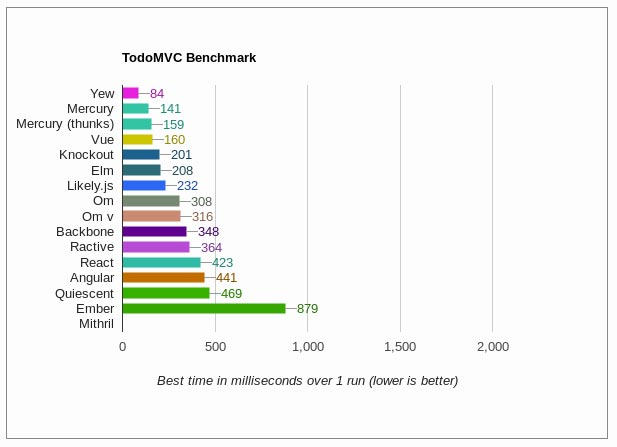

وأنا أبحث قليلا في قوقل عن بعض المعلومات حول **Evan You** ـ مؤسس إطار العمل **Vue.js** ـ وقصته مع البرمجة و تطوير تطبيقات الجافاسكريبت، استرعى انتباهي [مقال على مدونته الخاصة](http://blog.evanyou.me/2014/02/11/first-week-of-launching-an-oss-project/)، يحكي فيه عن حال الأسبوع الأول من بعد إطلاقه لمشروعه الذي بات الآن واحدا من أشهر 3 أُطُر عمل لجافاسكريبت. بعدها مباشرة قررت ترجمة المقال ومشاركته معكم، لنستفيد معا من كمِّ الأفكار والخطوات المهمة التي جاءت فيه، والتي تهم بالأساس جميع المطورين الذين يفكرون أو يطمحون لتأسيس وإطلاق مشروع برمجي مفتوح المصدر.

## نص المقال

قمت لتوي بإطلاق مشروعي البرمجي المفتوح المصدر والذي عملت عليه طيلة الفترة الماضية: Vue.js. إنه عبارة عن مكتبة جافاسكريبت لبناء واجهات ويب تعتمد نموذج MVVM في ربط البيانات مع واجهة برمجية في غاية البساطة. طبعا إذا كان الموضوع يهمكم، يمكنكم إلقاء نظرة على المشروع والإطلاع على المزيد من تفاصيله على [Vue.org](https://vuejs.org/) أو المستودع على منصة [Github](https://github.com/vuejs/vue).

لن أتحدث في هذا المقال عن منطق المكتبة ولن أخوض في تفاصيل آليات عملها، فهذا موضوع آخر يمكن أن نفرد له مقالا خاصا. ما يهمني اليوم بالأساس، هو أن أشارككم تجربتي الخاصة مع أولى محاولاتي الجادة في بناء، إطلاق، تسويق وصيانة مشروع مفتوح المصدر.

## استعدادات ما قبل إطلاق المشروع

### خطة التسويق

قبل عامين تقريبا، قمت بمحاولة لاستنساخ تطبيق [Clear Todos](https://itunes.apple.com/us/app/clear-todos/id493136154)، المعروف عند مستخدمي iOS، معتمدا على تقنيات **HTML5**. حدث ذلك من دون تخطيط: قمت باستنساخ هذا التطبيق في يومين، نشرت النتيجة في [فيديو على فيميو](https://vimeo.com/37182785)، ثم قمت بمشاركة محاولتي على تويتر مع مؤسسي التطبيق الأصلي. لم يكن بالأساس مشروعا جادا، إنما أردت فقط اختبار حدودي القصوى في صنع شيء ملموس بواسطة HTML5. في اليوم التالي ظهر مشروعي على الصفحة الرئيسية لموقع _HackerNews_، بعدها انهالت على بريدي الإلكتروني مجموعة كبيرة من الرسائل.

الآن وقد فكرت في الأمر مليا، وجدت أن السبب ربما في نجاح هذه المحاولة هو كون موضة واجهات HTML5 الشبيهة بالواجهات الأصلية للهواتف الذكية في ذلك الوقت (2012) ماتزال في بداياتها، ولذلك لاقى عملي استحسانا كبيرا. ولكن في وقتنا الحالي يبدو الأمر مختلفا كليا بالنسبة لعالم *MV في جافاسكريبت، الذي يمكن اعتباره مشبعا بالعديد من اللاعبين الأساسيين والمعروفين (أنجولار، باكبون، Ember.js ...إلخ).

رغم ذلك، آمنت بشدة أن Vue.js مازال لديه ما يضيفه لهذا المشهد المزدحم، وقد كان تحديا كبيرا بالنسبة لي أن أقنع الناس بتجربة مشروعي الناشئ. لمواجهة هذا التحدي، كان علي القيام بترويج المشروع عوضا عن انتظار هدايا من هنا وهناك. لم يكن علي التفكير طويلا لأستقر على عدد من القنوات الأساسية للقيام بهذه المهمة :

- HackerNews
- Reddit /r/javascript
- EchoJS
- The DailyJS blog
- JavaScript Weekly
- إنشاء حساب للمشروع على تويتر

سأتحدث لاحقا في هذا المقال عن تفاصيل وكيفية استغلالي لهذه القنوات والتأثير الذي أحدثته.

### الموقع والتوثيق

الموقع الرسمي **لإطار العمل Vue.js** مبني على [Hexo](https://hexo.io/)، مولد مواقع ساكنة (_Static Site Generator_) رائع وهو في بيئة _Node.js_ مثل _Jekyll_ بالنسبة لبيئة **روبي**. قمت بكتابة توثيق المشروع بالإعتماد على صيغة Markdown التي يدعمها Hexo، هذا مكنني من الإحتفاظ بتحكم كامل بالموقع، بما في ذلك تضمين الصور والأمثلة. الموقع مستضاف في Github Pages وهو مفتوح المصدر من أجل تمكين المستخدمين من المساهمة في محتواه.

[اقرأ أيضا : 4 بدائل Node.js لبرنامج إدارة المحتوى ووردبريس](https://www.tutomena.com/web-development/nodejs-cms/)

بعد يوم واحد من إطلاق المشروع، تلقيت طلب _Pull Request_ من أجل [تصحيح البريد الإلكتروني لبروس لي](https://github.com/vuejs/vuejs.org/pull/3/files) والذي كان مضمنا في أحد الأمثلة.

**أرأيتم كيف أن المصادر المفتوحة رائعة :)**

### الإختبارات

لا يمكن على أي حال أن يقوم الناس بقبول واستخدام مكتبة جافاسكريبت لم تخضع لأي اختبارات وحداتية (_Unit Tests_)، وبالتالي كان لا بد من إخضاع Vue.js لسلسلة فحوصات وتجارب شاملة.

كانت أيامي الأولى مع المشروع مثيرة وممتعة، ولكن بعد أن وصلت البنية الداخلية للمكتبة لحالة من الإستقرار علمت أنه قد حان الوقت للبدء في كتابة الإختبارات (_Writing tests_).

بدأت بالإستعانة ب **Mocha** مع **PhantomJS** باستخدام grunt-mocha وبعدما نمت المكتبة وتطورت واجهتها البرمجية أكثر، قررت الإستعانة كذلك ب **CasperJS** على أن أنتقل بعد ذلك لإستخدام **Karma** من أجل إجراء الإختبارات في متصفحات حقيقية. الشفرة المصدرية في الوقت الحالي مختبرة بنسبة 96%.

قبل ميعاد الإطلاق بقليل، قررت ضبط الإختبارات ليتم إجراؤها كذلك في منصة *SauceLabs* واستهداف مجموعة من المتصفحات لضمان أعلى قدر من التوافقية.

كان علي الحصول على شارة  build: passing  في ملف README على Github :)

## الأسبوع الأول بعد إطلاق إطار العمل Vue.js

### اليوم الأول

#### إحصائيات

- بلغ عدد الزيارات الفريدة لموقع **Vuejs.or**g حوالي **10245**.
- حصل المشروع على **212** إعجابا في **Github** (بزيادة 181 إعجابا).
- وصل عدد الزيارات الفريدة لصفحة المشروع على **Github** إلى حوالي **1880** زيارة.
- معدل الإعجاب : **%9.6**.

#### قنوات العرض

- الصفحة الرئيسية لموقع HackerNews.
- Reddit /r/javascript (متصدر).
- EchoJS (متصدر).

قمت بإرسال رابط الموقع لكل من **هاكر نيوز**، **EchoJS** و **Reddit */r/javascript*** وذلك يوم الأحد ثاني فبراير، في وقت متأخر من المساء لأنني كنت قد أنهيت لتوي كتابة التوثيق. عندما بحثت قليلا، **وجدت أن هذا التوقيت هو ربما واحد من أسوء الأوقات لنشر الروابط**. لحسن الحظ، بقي الرابط المرسل لموقع هاكر نيوز عدة ساعات على الصفحة الرئيسية، كما أن _EchoJS_ و _Reddit_ بدورهما أظهرا علامات جيدة بعدما استطاع موضوعي أن يتصدر فيهما المشهد لوقت جيد.

وصل عدد زيارات الموقع لذروته على الساعة التاسعة صباحا من يوم الإثنين، وبناءً على معطيات **Google Analytics**، اعتبارا من اليوم (11 فبراير)، فإن **%41** من الزيارات تم اعتبارها زيارات مباشرة، من بينها نسبة كبيرة جاءت من موقع هاكر نيوز. بينما جاءت نسبة **%10** من موقع _ريديت_ ولم تتجاوز نسبة القادمين من *EchoJS* حاجز **%1.81**.

على الرغم من أن الموقع جذب أزيد من 10 آلاف زيارات في اليوم الأول، إلا أن عدد الزيارات للمستودع على Github لم يتجاز 1880. بالمقارنة مع الأيام التالية، كان هذا معدل تحويل منخفض. السبب ربما في هذا المشكل كان هو وجود 3 روابط نصية فقط في صفحة الأمثلة تقوم بتحويل الزوار للمستودع، والأسوء من هذا أن الصفحة الرئيسية لم تحتوي على أية أمثلة بصفة مطلقة! دائما حسب _غوغل أناليتيكس_، %50 من الزوار الذي يبقون في الموقع بعد الهبوط على الصفحة الرئيسية، توجهوا بعد ذلك مباشرة لصفحة الأمثلة (_Examples page_). أعتقد بأن الإستعانة بأمثلة تفاعلية مثل [المثالي التالي على jsfiddle](https://vuejs.org/v2/examples/) سيساعد الزوار على فهم أفضل لجوهر المكتبة وفكرتها.

### اليوم الثاني

#### إحصائيات

- الزيارات الفريدة ل Vuejs.org : حوالي **2892**.
- وصلت الإعجابات على Github إلى **382** (+170).
- الزيارات الفريدة للمستودع : **1266**.
- معدل الإعجاب : **%13.4**.

#### قنوات العرض

- البروز على مدونة DailyJS.

قمت بإرسال Vue.js إلى مدونة **DailyJS** في اليوم الأول ولكنه لم يبرز إلا في اليوم الموالي. وقد شكلت الزيارات القادمة من هذه المدونة حوالي **%4.77** من مجموع زيارات الموقع. وكان مثيرا للإهتمام كذلك أن الزوار القادمين من هذه القناة كان لديهم أعلى معدل صفحات/زيارة (**4.64**) وأقل معدل ارتداد (**%17.01**) من بين جميع القنوات الأخرى. DailyJS كذلك قامت بتوليد حوالي 500 زيارة فريدة للمستودع، وهو عدد الإحالات الأعلى كذلك من بين جميع هذه القنوات. وشهد هذا اليوم أيضا أعلى معدل زيارة/إعجاب في هذا الأسبوع.

### اليوم الثالث

#### إحصائيات

- الزيارات الفريدة ل Vuejs.org : حوالي **1257**.
- وصلت الإعجابات على Github إلى **420** (+38).
- الزيارات الفريدة للمستودع : **455**.
- معدل الإعجاب : **%8.3**.

#### قنوات العرض

لم يكن هناك أي شيء مثير للإنتباه في هذا اليوم. حاولت الإتصال بعدد أكبر من القنوات مثل **Changelog**، **Smashing Magazine** و _Peter Cooper_ (القيم على نشرة **JavaScript Weekly** الأسبوعية). _Changelog_ قبلوا في البداية مراجعة المكتبة ولكن فيما بعد لم يحدث أي شيء. لم أحصل على أي رد من _Smashing magazine_، بينما أخبرني Peter بأنهم قد وضعوا طلبي في قائمة الإنتظار لذلك الأسبوع.

[اقرأ أيضا : مدخل إلى مكتبة React.js لتطوير واجهات الويب](https://www.tutomena.com/web-development/javascript/react-javascript-library/)

### اليوم الرابع

#### إحصائيات

- الزيارات الفريدة ل Vuejs.org : حوالي **1512**.
- وصلت الإعجابات على Github إلى **459** (+39).
- الزيارات الفريدة للمستودع : **330**.
- معدل الإعجاب : **%11.8**.

#### قنوات العرض

- تغريدة من طرف [JavaScriptDailly@](https://twitter.com/JavaScriptDaily).

في هذا اليوم قام حساب **JavaScriptDailly@** بنشر تغريدة عن Vue.js، وقد ساعدت هذه الخطوة Vue.js على الحصول على قدر معقول من إعادات التغريد (_Retweets_). بالنظر إلى الإحصائيات الشاملة للموقع في كل الأوقات، فإن الزيارات القادمة من تويتر تشكل **%10.69** من مجموع زيارات الموقع. هذه الزيارات لم تكن بالجودة الكبيرة، حيث كان معدل ارتداد تلك الزيارات **%55.28** وهو معدل عالي نوعا ما، يضاف إليه معدل صفحات/زيارة لم يتجاوز **%2.72** هو الأدنى من بين أفضل 10 قنوات إحالة.

### اليوم الخامس

#### إحصائيات

- الزيارات الفريدة ل Vuejs.org : حوالي** 2825**.
- وصلت الإعجابات على Github إلى **518** (+59).
- الزيارات الفريدة للمستودع : **495**.
- معدل الإعجاب : **%11.9**.

#### قنوات العرض

- الظهور في نشرة _JavaScript Weekly_ البريدية.
- الإشارة ل **_Vue.js TodoMVC benchmark_** على صفحة _Reddit /r/javasctipt_ الأولى.

نشرة **JavaScript Weekly** البريدية كان لديها قاعدة مشتركين كبيرة (أزيد من 65 ألف مشترك). هذا ما جعلها المحيل (_Referrer_) الأول إلى الموقع بنسبة **%10.42** من مجموع الزيارات، كما أن عدد الإعجابات المسجلة على مستودع Github شهدت تحسنا ملحوظا في هذا اليوم الخامس.

أما **TodoMVC benchmark**، وكما كان متوقعا، فقد أثار بعض الجدل. هناك من يشجع على هذا النوع من المقارنات بين المشاريع البرمجية وهناك من يقف ضدها بحجة أنها لا تعكس بالضرورة الحقيقية الكاملة لهذا المنتج. المسألة برمتها ربما متعلقة بما إذا كانت نتيجة المقارنة (_Benchmark_) متوافقة مع تطلعات أو توقعات المستخدم.

---

الـ [Benchmarking](https://en.wikipedia.org/wiki/Benchmarking) هو عملية مقارنة شركة ما و أعمالها و مؤشرات الأداء الخاصة بها بشركة منافسة أخرى تعد الأفضل بنفس الصناعة أو بالمؤشرات والممارسات الأفضل في الصناعة.

عادة ما تكون المؤشرات الرئيسية الثلاثة هي الجودة و الوقت و التكلفة، وفي عملية الـ Benchmarking تعرف الشركة ما هو الأفضل في الصناعة أو في صناعة أخرى تقوم على نفس العمليات وتقارن النتائج والعمليات مع الأهداف.

[مدونة ناسداك](http://www.mhabash.com/2012/09/13/%D9%85%D8%A7-%D9%87%D9%88-%D8%A7%D9%84%D9%80-benchmarking/)

---

### اليوم السادس

#### إحصائيات

- الزيارات الفريدة ل Vuejs.org : حوالي** 1826**.
- وصلت الإعجابات على Github إلى **581** (+63).
- الزيارات الفريدة للمستودع : **552**.
- معدل الإعجاب : **%11.4**.

#### قنوات العرض

أضيف لموقع [TodoMVC](http://todomvc.com/) والإشارة إليه في تغريدة ل **tastjs@**.

كان اليوم السادس رائعا حقا، فقد ظهر _Vue.js_ على موقع _TodoMVC_. لقد قمت بإرسال طلب السحب (_Pull Request_) لمستودع فريق [TodoMVC](https://github.com/tastejs/todomvc) في اليوم الأول، ولكن مر أسبوع كامل تقريبا حتى يتم دمج (_Merge_) طلبي.

كما ذكرت لكم في السابق، قمت بإجراء اختبارات شاملة للكود باستخدام _CasperJS_، هذا الأمر ساعدني كثيرا على اجتياز كافة اختبارات فريق _TodoMVC_ بنجاح وقبول إضافة مكتبة _Vue.js_ لمشروعهم، وقد كان هذا القبول شهادة ودليلا على قيمة وجودة _Vue.js_.

### اليوم السابع

#### إحصائيات

- الزيارات الفريدة ل Vuejs.org : حوالي** 1529**.
- وصلت الإعجابات على Github إلى **615** (+34).
- الزيارات الفريدة للمستودع : **399**.
- معدل الإعجاب : **%8.5**.

تراجعت الأرقام في يوم الأحد وتباطأ كل شيء، وهذا أمر طبيعي نلحظه كل أسبوع. المثير في هذا اليوم أننا قمنا بدمج أول Pull Request في Vue.js. في الحقيقة قمنا بدمج 3 طلبات PR في اليوم السابع، الذي شهد كذلك زخما مهما على مستوى Github تجلى في بدء الناس بمناقشة بعض المسائل والإشكاليات وطرح الأسئلة. هذا الزخم يمثل قوة دفع كبيرة لهذا النوع من المشاريع.

## إحصائية الزيارات المكتسبة في هذا الأسبوع

## الآن

منذ إطلاقي لمشروع Vue.js وأنا أتلقى رسائل وكلمات رائعة وكذلك اقتراحات جديدة من المتابعين والأصدقاء. وقد كان كل ما تحقق في هذه المدة القصيرة أكبر من توقعاتي. أشكر كل من نال إعجابه مشروعي هذا، وفي النهاية أشكركم على قراءتكم لهذا المقال.

---

## تعليقي

بكل صراحة، أنا معجب بقصة **Evan You** هذا! مطور واحد قام بكل هذا العمل لوحده دون أن يكل أو تضعف عزيمته. ولا شك بأنكم لا حظتم أن إيمان **إيفان** بمشروعه هو الذي جعله يصمد ويعقد العزم على إنجاحه بغض النظر عن التكاليف.

الآن، **Vue.js** يحتل المرتبة السادسة في Github كأكثر المشاريع شعبية والثاني في تصنيف الجافاسكريبت بعد _React.js_، وذلك بعدد إعجابات (_Stars_) فاق 84 ألف، وازداد عدد المساهمين فيه ليصل إلى 167 في وقت كتابة هذه الأحرف بعدما كان **واحدا فقط**.

---

ما رأيكم بهذه القصة إخواني ؟ أليست مثيرة للإعجاب حقا ؟ شاركوني آراءكم من فضلكم.
