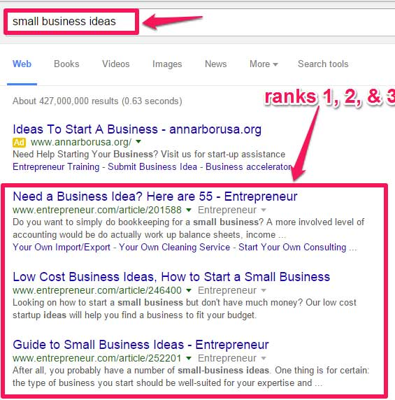
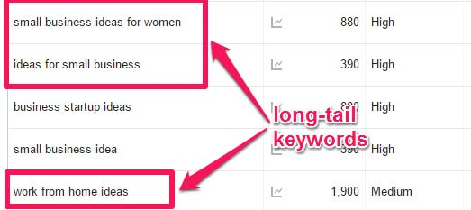
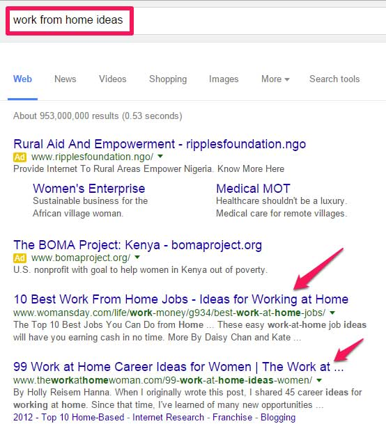
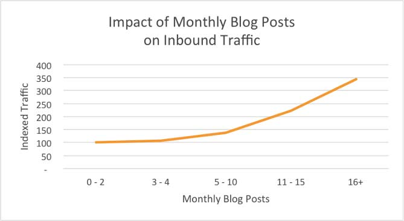
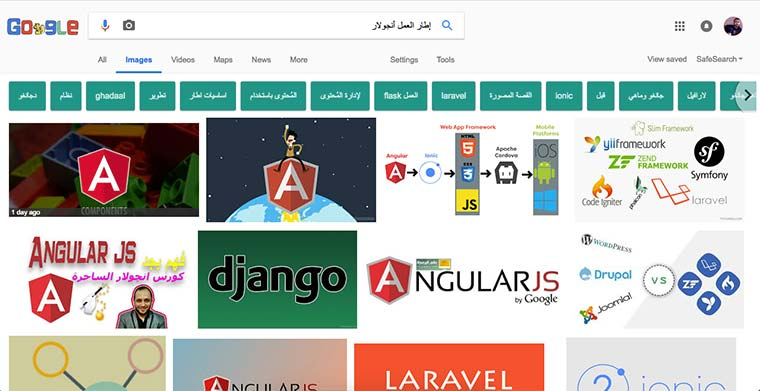

بدون **ظهور جيد** على محركات البحث ـ وخاصة منها قوقل ـ لن يصل أحد إلى موقعك أو مدونتك (باستثناء من ترسل إليهم روابط تدويناتك :D )، وبدون **محتوى جيد** كذلك سيكون من الصعب على موقعك تحقيق هذا الظهور الجيد وكسب ثقة محرك البحث، بالخصوص إذا كان المجال أو النيتش الذي تعمل فيه عالي المنافسة.

سبق وأن قدمنا إليكم [بعض النصائح والخطوات لتحسين ظهور مواقعكم على محركات البحث](https://www.tutomena.com/blog/12-tips-improve-seo/)، ولكن في هذا الموضوع سأحدثكم عن بعض الأخطاء الشائعة التي يرتكبها عدد مهم من المدونين وأصحاب المواقع والتي قد تضرب بعرض الحائط كل **استراتيجيات السيو** SEO التي يتبعونها.

## 1\. التركيز على كلمات مفتاحية عالية التنافس وإغفال "الذيل الطويل"

يبدو من الشائع، لدى صناع المحتوى، التركيز على كلمات مفتاحية قصيرة وذات علاقة مباشرة بموضوع المادة المنشورة. نعم، يمكن أن تكون هذه من القواعد الأساسية التي يبني عليها المدونون أو المسوقون بالمحتوى استراتيجيات السيو الخاصة بمشاريعهم، ولكنها ليست بالضروة الحل الوحيد أو الأمثل في حالات كثيرة، خاصة عندما تكون المنافسة محتدمة على هذا النوع من الكلمات.

في بعض الأحيان يضمن لنا استهداف الكلمات المفتاحية الطويلة (من 4 إلى 6 كلمات) ظهورا أسرع وأفضل على محركات البحث، رغم أن الإقبال عليها يكون أقل من الكلمات المفتاحية الرئيسية الفضفاضة، وهذا هو مربط الفرس. ففي كثير من الحالات يكون من الصعب جدا منافسة ناشرين على كلمات مفتاحية بعينها، ولا يمكن الظهور أمامهم في محركات البحث لأن سمعتهم ونفوذهم لدى عناكب هذه المحركات أقوى وإمكانياتهم المادية والبشرية أكبر. لذلك كان الحل هو البحث عن كلمات مفتاحية مركزة أكثر ولا تحظى بنفس المستوى من المنافسة. هذه الكلمات المفتاحية تعرف **بكلمات الذيل الطويل** أو _Long tail keywords_.

أشار **_نيل باتل_**، في [تدوينة مميزة له](https://neilpatel.com/blog/7-brilliant-examples-of-brands-driving-long-tail-organic-traffic/)، أن الزوار الذين يستخدمون كلمات الذيل الطويل يكونون أكثر قابلية للشراء والتحويل من غيرهم. السبب ربما واضح؛ هو كونهم يبحثون عن شيء محدد وبالتالي فاهتمامهم مركز على هذا الشيء و**كلما زاد الإهتمام بموضوع أو منتج معين يصبح الزائر أو الباحث عن هذا الموضوع أكثر قيمة لدى الناشر**.

على سبيل المثال (دائما من مدونة نيل باتل)، عند البحث عن الكلمة المفتاحية "_small business ideas_" نجد أن موقع _entrepreneur.com_ يسيطر بقوة على نتائج البحث عنها، وبطبيعة الحال سيكون مضيعة للوقع أن نحاول منافسته في هذه الكلمة بالنظر إلى فارق الإسم والإمكانيات.

ولكن لو تمكننا من إيجاد كلمات مفتاحية طويلة لها علاقة بالموضوع والعمل عليه، سنتمكن من حجز مكان لنا رفقة _entrepreneur.com_ والحصول على قطعتنا من الكعكة :D

لاحظوا أن الكلمات المفتاحية "_small business ideas for women"_ و "_work from home ideas_" عليها نسبة جيدة من البحث ولكنها تظل مقبولة والمنافسة عليها أسهل. إليكم نتيجة البحث عن الثانية:

نرى الآن أنه يمكننا أن نظهر بشكل جيد على محرك البحث بشرط ألا ندخل في منافسة مباشرة وضيقة مع الفاعلين الكبار في مجالنا، ولكن عوضا عن ذلك نحاول توسيع دائرة المنافسة والإبتعاد عن مركز الدائرة قدر الإمكان لأن المركز دائما ما يكون شديد الحرارة :D

## 2\. عدم إنتاج قدر كافي من المحتوى

أكدت [دراسة قام بها موقع HubSpot](https://blog.hubspot.com/marketing/blogging-frequency-benchmarks)، بأن المواقع التي تقوم بنشر أزيد من 16 تدوينة في الشهر تحصل على 3 إلى 5 أضعاف الترافيك الذي تحصل عليه تلك التي تنشر أقل من 4 تدوينات في اليوم.

يمكن إرجاع نتيجة هذه الدراسة لعدة عوامل، منها :

- كلما قمنا بصناعة ونشر كمية محتوى أكبر، بشرط الحفاظ على الجودة، كلما زاد عدد **الزوار العائدين** (_Returning visitors_) لموقعنا للإطلاع على جديده.
- كلما نشرنا تدوينات أكثر، ازداد عدد روابطنا المؤرشفة لدى محركات البحث، ما يعني أيضا نمو وتنوع الكلمات المفتاحية التي نستهدفها ونظهر من خلالها على محركات البحث.

## 3\. الإصرار على المواضيع الطويلة فقط

كلنا نعرف أن المقالات والمنشورات الطويلة لها حظوظ أقوى في الأرشفة والظهور الجيد على محركات البحث. هذه تعتبر من القواعد الذهبية في SEO ويعلمها كما قلنا جميع صناع المحتوى تقريبا.

ولكن الملاحظة تثبت لنا عكس هذه القاعدة في بعض الحالات، حينما نجد مقالات قصيرة (300 كلمة أو يزيد بقليل) تحتل مراتب عليا في نتائج البحث. إذن لا توجد هنا قاعدة ثابتة تربط طول المحتوى بكيفية ظهوره على محركات البحث.

المسألة ببساطة تتعلق بموضوع المحتوى، إذا كان موضوعا معقدا يستدعي عملا وبحثا عميقا فليس هناك حرج من صناعة مواضيع طويلة لشرح أو تقديم هذا الموضوع مع الزوار. أما إذا كان الموضوع سطحيا ويجيب على أسئلة سريعة فمن الأفضل أن يكون مقتضبا ومتوافقا مع أهمية وحجم الموضوع. **الهدف من أي محتوى هو خدمة الزائر وتقديم الأجوبة للأسئلة التي يطرحها**، وليس الغرض إرضاء أو التفكير في عناكب _Google_ أو غيره. على كل حال الأخيرة أصبحت ذكية بما يكفي لتعرف أن عدد كلمات لا يعكس بالضرورة قيمة المحتوى وأهميته.

## 4\. إهمال الروابط الداخلية

**الروابط الخلفية** أو ما يعرف ب _Backlinks_ مهمة للغاية في خطة السيو الخاصة بمدونتك أو موقعك، فهي من العوامل الذي ثبت بالملموس أثرها الكبير في تحسين الظهور على محركات البحث.

إلى جانب الروابط الخلفية، هناك أيضا **الروابط الداخلية** التي تقوم أنت بنفسك بوضعها داخل محتويات موقعك لربطها معا. هذه الروابط الداخلية ليست بنفس وزن الروابط الخلفية في [معايير SEO](https://www.tutomena.com/blog/seo-most-important-criterias-according-experts/) ولكن لها وزنها الذي لا يمكن إغفاله لدى عناكب المحركات، وكذلك نجد لها دورا فعالا في تحسين تجربة المستخدم الذي يجد بفضلها سهولة في التنقل بين صفحات الموقع وفق اهتماماته. ومعلوم دائما أن تجربة مستخدم جيدة تعني معدل ارتداد منخفض، ومعدل الإرتداد المنخفض علامة على أهمية المحتوى وقيمته لدى الزائر، وبالتالي تحسين سمعة الموقع لدى محركات البحث.

## 5\. إهمال الصور

تلعب الصور دورا أساسيا في إغناء المحتوى وإضفاء الرونق والجمالية عليه، كما لها أيضا دور مهم في تحسين ظهور محتوياتنا على محركات البحث إذا أحسنا استخدامها.

أشرت سابقا في مقال "[إجعل صور موقعك متوافقة مع محركات البحث (SEO)](https://www.tutomena.com/web-development/optimizing-images-for-seo/)" إلى مجموعة من الممارسات والخطوات التي تجعل صور موقعنا متوافقة مع محركات البحث، وتكون بالتالي سببا في حصولنا على أعداد مهمة من الزيارات العضوية. لا بأس في ذكر بعض من أهم تلك الخطوات :

- تسميات الصور يجب أن تحمل كلمات مفتاحية معبرة عن محتواها، مثلا : _angular-framework.jpg._
- تغيير أحجام الصور الكبيرة وتصغيرها قدر الإمكان حتى لا تكون سببا في تأخير تحميل الصفحة، مما ينعكس سلبا على حالة السيو الخاصة بالصفحة.
- إضافة جملة للخاصية **Alt** لمساعدة محركات البحث على معرفة محتوى الصورة والظهور بشكل أفضل في نتائج البحث عن الصور.

## النهاية

السيو خطة متكاملة ومتواصلة، ولا يوجد استراتيجية سيو صالحة لكل الأزمان.

في بداية عهد محركات البحث كان يكفي حشو المحتوى بالكلمات المفتاحية ليتم إيهام العناكب بأن هذا هو المحتوى المناسب لذلك البحث :D ولكن مع مرور السنوات تم تطوير هذه العناكب وأصبحت أكثر ذكاءً، ومعها أصبح السيو عملا في حد ذاته تستثمر فيه الشركات أموالا كبيرة لجني ثماره.
