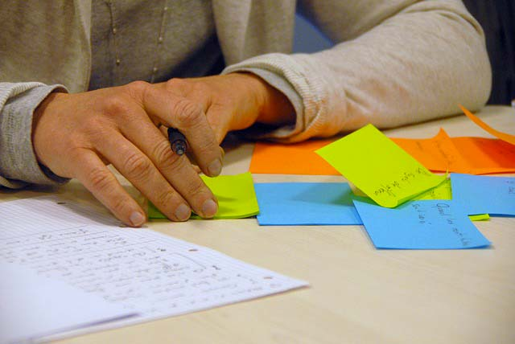

في كل المهن والتخصصات، هناك عدد من النصائح والأفكار التي تسدى إلى ممارسيها من أجل تسلق مراتب النجاح فيها. وفيما يلي، بعض النصائح التي أراها مهمة وأساسية لأي شخص يحلم بتحقيق مستقبل مشرق كمطور.

## 1\. التخصص

عندما أقول بأنه عليك أن تتخصص في موضوع أو تقنية معينة، فهذا لا يعني بأن تتعلم فقط هذه التقنية وتنسى ما دونها. إنما قصدي هو أن تختار تقنية محددة وتعطيها اهتمامك الأكبر وتتقنها بقدر ما تستطيع، ولا ضير بعد ذلك من الإطلاع ومعرفة القليل عن التقنيات الأخرى. ما يجب معرفته هو أن **الشركات تبحث عن الأشخاص الذي يتقنون بشكل ممتاز تقنية معينة**. على سبيل المثال، إذا كنت مطور PHP فأنت مطالب باختيار إطار عمل معروفه لتتعلمه (**لارافيل** مثلا) وتتقنه جيدا حتى يكون لك موطئ قدم في سوق الشغل، ومن ثم فلن يكون هناك مشكل إذا كانت لديك بعض المعارف في إطارات عمل أخرى (_CodeIgniter_، _Symfony_) وكذلك _HTML_ ،_CSS_ و _جافاسكريبت_، بل على العكس، سيكون ذلك كله في صالحك.

## 2\. الممارسة والتطبيق

من الجيد قراءة كتب البرمجة والدروس التعليمية على المدونات الإلكترونية، أو مشاهدة الدورات المرئية على يوتيوب أو يوديمي، ولكن مع الأسف هذا لا يكفي في ميدان البرمجة لأن الأخير يعتمد بشكل شبه كامل على الممارسة.

يمكن أن نشبه المبرمج الذي يقتصر فقط على الجانب النظري بشخص في مقتبل العمر، يقرأ كتبا عن النجاح في الحياة وتحقيق السعادة ويظن أنه بمجرد قراءة تلك الكتب ستُفتح له الحياة على مصراعيها، ولكن المسكين يصدم عندما يجد الواقع أعقد بكثير مما كان يتخيل.

## 3\. تابع الناجحين في مجالك

متابعة المطورين الناجحين عبر مدوناتهم أمر في غاية الأهمية، فإذا كنت مثلا مهتما بتقنيات _**CSS3**_ فإنك مدعو لمتابعة مدونة _css-tricks.com_ المعروفة أو الإشتراك في [الوسم _css3_](https://medium.com/tag/css3) على منصة _Medium_ الرائعة. وهذا ينطبق على جميع التقنيات الأخرى. وحتى يسهل عليك متابعة كافة المدونات المفضلة لديك، استعن بخدمة _Feedly_ التي من خلالها أتابع شخصيا كل مدوناتي المفضلة.

## 4. التحليل قبل كتابة الكود

يقول المبرمج الداهية لينوس تورفالدس :

**المبرمج السيء يهتم بالكود أولا، بينما المبرمج الجيد يقلق أولا بشأن بنية البيانات والعلاقات بينها**

عندما يأتي هذا الكلام من مطور نواة لينوكس، وكذلك برنامج إدارة النسخ Git فمن الأفضل لنا أن نأخذه على محمل الجد.

المبرمجون والمطورون المحترفون لا يتوانون عن استخدام الأوراق والسبورة الحائطية قبل كتابة أي سطر برمجي، لأن هذه العادة تدفع إلى التفكير جيدا في المشكل قبل الشروع في الكتابة.

[bctt tweet="المبرمج السيء يهتم بالكود أولا، بينما المبرمج الجيد يقلق أولا بشأن بنية البيانات والعلاقات بينها." username="tutomena" prompt="غرد عبر تويتر"]

## 5. إعادة هيكلة الكود

يوصى بشدة بإعادة هيكلة وتحسين الشفرة البرمجية أو ما يصطلح عليه **Code Refactoring** بغرض الحصول في النهاية على كود منظم، واضح ومقروء من طرف كافة المتدخلين في المشروع. **فنحن كمطورين نمضي في العادة ما لا يزيد عن %25 من أوقاتنا في كتابة الكود، بينما نمضي النسبة المتبقية في قراءته**، بالتالي كلما كان الكود بسيطا وواضحا كلما وفرنا من وقتنا الثمين.

## 6\. شارك معرفتك

عندما تشارك معارفك ومكتسباتك مع الآخرين فأنت في الوقت نفسه تتعلم وتكتسب مهارات جديدة. صدقني، التدوين سيعود عليك بمنافع كثيرة لو خصصت له فقط ساعة أو ساعتين كل يوم، أو حتى كل ثلاثة أيام. وحتى من الناحية الأخلاقية، من المحمود مساعدة الآخرين واختصار الطريق عليهم في الوصول إلى المعلومة. تستطيع إنشاء مدونة، قناة على اليوتيوب أو حتى دورة مدفوعة على يوديمي، المهم لا تبقى منغلقا على نفسك ولا تستسلم للأنانية :D

## 7. عش حياتك طبيعيا

لست مضطرا للبقاء 24 ساعة أمام شاشة الحاسب حتى تكون مبرمجا ناجحا. عش حياتك طبيعيا، خصص وقتا للعمل واستفد من الفترة الصباحية جيدا، لأن النوم حتى وقت متأخر من النهار سيجبرك على العمل إلى وقت متأخر من الليل وبالتالي فعلاقاتك الإجتماعية ستتأثر، وهذا غير صحي بالنسبة لك. في النهاية **البرمجة وسيلة لتحقيق النجاح في حياتك العملية والشخصية وليست غاية في حد ذاتها**.

## 8. استمتع بالبرمجة

يستطيع كل الشخص أن يبرمج ويكتب الأكواد، ولكن هل كل شخص في استطاعته أن يكون مبرمجا ناجحا ؟ بالنبسة لي، لا أظن ذلك.

حتى تكون مبرمجا ناجحا عليك أن تتحلى بالمتعة والشغف اللازمين للتعلم باستمرار ومواكبة كل مستجد. عالم التقنية يتطور بسرعة جنونية، وإذا لم تكن مستعدا لمواكبة هذا التطور وتكييف نفسك معه فستصبح خارج المنافسة. لذلك **من الأفضل لكل مبرمج أن يستمتع بعمله وألا يمارس البرمجة فقط من أجل المال**، هذا الكلام ينطبق على جميع المجالات في الحياة.

---

ترجمة بتصرف للمقال : [10 Tips for developers](https://hackernoon.com/10-tips-for-developers-b6053a3cc450)
