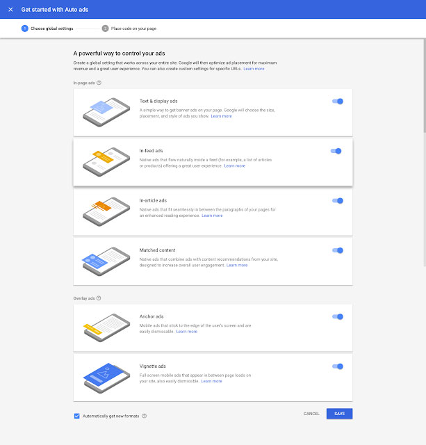

أعلنت شركة قوقل قبل أيام عن شكل جديد من إعلانات أدسنس أطلق عليه اسم **AdSense Auto ads.** هذا الشكل يعتمد على مبدأ **تعلم الآلة** من أجل تحسين ظهور الإعلانات على الصفحات بشكل آلي دون تدخل من صاحب الموقع.

وتهدف قوقل من خلال هذا الشكل الإعلاني الجديد إلى مساعدة الناشرين الذين لا يملكون الوقت أو الإمكانيات لتحسين ظهور الإعلانات على مواقعهم بأنفسهم، وبالتالي زيادة وتحسين عوائدهم منها.

إضافة إعلانات *AdSense Auto ads* تتم بطريقة بسيطة للغاية عن طريق وضع سطر واحد من الكود في جميع الصفحات التي نريد أن تظهر فيها الإعلانات (مثلا في ملف _footer.php_ بالنسبة لمواقع ووردبريس). وتتولى خوارزميات قوقل نيابة عنك المهام التالية :

- **تجربة استخدام جيدة** : لن تظهر الإعلانات إلا في الأماكن التي ستؤدي فيها جيدا، محافظة في نفس الوقت على تجربة جيدة للمستخدم.
- **المساعدة على تحقيق أكبر عائد ممكن** : ستتمكن خوارزميات *AdSense Auto ads* من إيجاد الأماكن الموجودة في الصفحة واختيار أفضلها لعرض الإعلان.
- **سهولة الإستخدام** : ليس عليك، كمدير موقع، سوى إضافة كود الجافاسكريبت ـ الذي سيتم توليده من لوحة تحكم أدسنس خاصتك ـ إلى صفحات موقعك وقوقل سيتولى الباقي.

يمكنك كذلك اختيار أنواع الإعلانات التي تريد إظهارها بضغطة زر واحدة أو تعطيلها بعد ذلك بنفس الطريقة. وتستطيع تعطيل أنواع محددة من الإعلانات في صفحات معينة (مثلا تعطيل *In-article ads* في الصفحة الرئسية).

وإذا كنت تستخدم حاليا إعلانات أدسنس بالطريقة التقليدية فاطمئن، سيتم أخذ هذا بعين الإعتبار ولن يحدث أي تعارض بين الطريقتين.

للمزيد من المعلومات حول هذا الموضوع يمكنكم زيارة [هذا الرابط من قوقل](https://adsense.googleblog.com/2018/02/introducing-adsense-auto-ads.html). ووجب الذكر هنا أنه لا توجد في الوقت الحالي إحصائيات أو معطيات حول جودة أداء **Google AdSense Auto ads** بالنظر إلى كونها حديثة العهد، ولم يتم بعد مقارنتها مع طريقة إعلانات أدسنس التقليدية.
