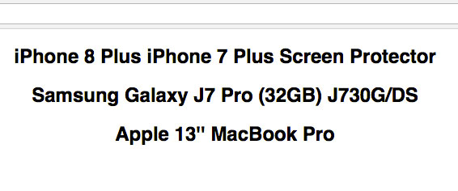

يسهل قراءة وفهم الشفرة البرمجية عندما تكون قصيرة وغير متشعبة، لهذا يتم اللجوء في المشاريع الكبرى إلى **تقسيم البرنامج لعدة وحدات صغيرة متكاملة فيما بينها**. هذه الوحدات تكون عادة في ملفات مستقلة ويتم **استيرادها** عند الحاجة، وإلا فإن تضمينها كلها في ملف واحد سيكون بمثابة جحيم لا يطاق على كل من يحاول فهم ذلك الكود أو التعامل معه بأي شكل من الأشكال.

لحسن حظنا كمطوري جافاسكريبت، باتت هذه اللغة الآن تدعم خاصة استيراد وتصدير الوحدات البرمجية (_Modules_)، ما يعني أننا نستطيع تقسيم أكوادنا لعدة ملفات واستدعاء ملف داخل آخر عند الحاجة إليه.

في هذا الدرس، سنلقي الضوء سريعا على هذا الموضوع بأمثلة بسيطة من مشروع React.js. سنرى كيفية الإستعانة بالوحدات على طريقة **ES5** التي يستخدمها **Node.js**، على أن نرى بعد ذلك الطريقة الأحدث التي ظهرت مع إصدار الجافاسكريبت الجديد **ES6**.

## استيراد وتصدير الوحدات على طريقة ES5

تعرف كذلك بطريقة **CommonJS**، وفيها يتم استيراد الوحدات عن طريق الدالة `()require` وتصديرها بواسطة التعبير **module.exports**.

هذا مثال بسيط على استيراد الوحدات في **React.js** على طريقة **ES5.**

```jsx
//App.js
const React = require('react');
const Product = require('./Product');
require('./App.css');

class App extends React.Component {
  render() {
    return (
      <div className="App">
        <div className="products">
          <Product title="iPhone 8 Plus iPhone 7 Plus Screen Protector" />
          <Product title="Samsung Galaxy J7 Pro (32GB) J730G/DS" />
          <Product title="Apple 13'' MacBook Pro" />
        </div>
      </div>
    );
  }
}
```

نلاحظ بأننا قمنا باستيراد مكتبة **react** في أول سطر، وهي تكون موجودة عادة في مجلد _/node_modules_ و **Node.js** يعرف جيدا أين وكيف يجد كل هذه التبعيات داخل هذا المجلد.

أما السطر الثاني ففيه نقوم باستيراد المكون **Product** الذي خصصنا له ملفا اسمه _Product.js._

أما الإستيراد الثالث فهو لملف App.css، وهنا يجب معرفة أنه لا يمكن استيراد ملفات CSS باستخدام طريقة وحدات الجافاسكريبت، وإنما تمكننا من فعل ذلك هنا لأننا نقوم باستخدام **Webpack** (نسيت أن أخبركم في البداية أنني قمت بإنشاء المشروع بواسطة الأداة _create-react-app_ التي بدورها تستعين ب _Webpack_ ك **Module Bundler**). هذا الأخير من ضمن مميزاته الكثيرة، أنه يمكننا من **استيراد ملفات CSS داخل أكواد جافاسكريبت**.. هكذا ببساطة :D

أما ما تبقى فهو مجرد تعريف لمكون جديد في React سميته App وبداخله أقوم بإظهار ثلاث مكونات من نوع Product الذي قمنا سابقا باستيراده من الملف _Product.js_.

**ليس من الضروري تعيين الإمتداد js. عند استيراد الملفات في جافاسكريبت، فقط require('Product')  عوض require('Product.js') .**

الملف `Product.js` بسيط :

```js
const React = require('react');

const Product = props => <h2>{props.title}</h2>;

module.exports = Product;
```

السطر الأول كما رأينا سابقا هو استيراد ل React، وأسفله الدالة أو المكون `Product` الذي يقوم بعرض عنوان المنتج داخل وسم `<h2>`.

[](../images/require-es5-react.jpg)

ما يهمنا بالدرجة الأولى في هذا الملف هو السطر الأخير. بدون `module.exports` لن نتمكن من من تصدير واستيراد هذه الوحدة من أي مكان وبالتالي تصبح بلا جدوى!

عندما نطلب من **Node.js** أن يستورد وحدة من ملف معين، فإنه يذهب ويقرأ ذلك الملف ويبحث عن التعبير **module.exports** للتأكد من توفر هذه الوحدة للإستيراد أم لا.

### استيراد أكثر من وحدة

في المثال السابق قمنا باستيراد وحدة واحدة فقط من الملف _Product.js،_ وهي المكون *Product.* ماذا لو كان علينا أن نجمع عدة وحدات في ملف واحد ونقوم بتصديرها كلها ؟ هذا ممكن بطبيعة الحال والطريقة سهلة :

```js
module.exports = {
  Product: Product,
  Other: Other
};
```

وتكون طريقة الإستدعاء كالتالي :

```js
var { Product } = require('./Product');
var { Other } = require('./Product');
```

## استخدام طريقة ES6 الحديثة

فكرة الوحدات بطريقة **ES6** هي نفسها مقارنه مع طريقة **ES5**، ولكن هناك اختلاف بسيط في التركيب أو _Syntax_. عوض استخدام require نستخدم الكلمة **import**، وعندما نريد تصدير وحدة واحدة فقط من ملف جافاسكريبت (_نعتبرها افتراضية في هذه الحالة_) فإننا نستعمل التعبير export default :

```jsx
//Product.js
import React from 'react';

const Product = props => <h2>{props.title}</h2>;

export default Product;
```

```jsx
//App.js
import React from 'react';
import Product from './Product';

import './App.css';

...
```

لسنا على مجبرين على استخدام _default_ هنا، ولكن بدون استخدامها سيكون علينا استخدام المعقوفتين { } عند استدعاء الوحدة.

```js
import { Product } from './Product';
```

أما إذا أردنا أن نعرض عدة وحدات للتصدير، فنقوم بما يلي :

```js
//Product.js
import React from 'react';

export const Product = props => <h2>{props.title}</h2>;

export const Other = props => <h2>Just an other component!</h2>;
```

```js
//App.js
import React from 'react';
import {Product, Other} from './Product';

import './App.css';

...
```

نقوم فقط بوضع كلمة **export** قبل الدالة أو الكلاس أو أي كائن نريد تصديره.

---

هذا تقريبا أهم ما يمكن قوله عن نظام تصدير واستيراد الملفات في بيئة جافاسكريبت. توجد بعض التفاصيل الذي تحتاج معرفتها عند مستوى معين من الممارسة، ولكن كبداية، هذه المقدمة تكفي لفهم الفكرة جيدا.

يمكنك استخدام الطريقة التي تفضلها، ولكن تذكر أنه لا يمكن خلطهما معا، مثلا لا يمكنك التصدير ب _module.exports_ والإستيراد بواسطة _import_، لا علاقة بينهما :D . الأمر الثاني الذي أريد ذكره، هو أن **طريقة ES6** هي المستقبل، كونها جزء أصلي من الإصدار الجديد للجافاسكريبت وليس خاصة ب _Node.js_ فقط، وبالتالي يستحسن استخدامها منذ الآن. يمكنك الإستعانة بمجمع الوحدات _Webpack_ من أجل تجاوز مشكل الدعم المحدود من المتصفحات الكبيرة، إلى حين وصول الدعم والتوافقية الكاملين.
