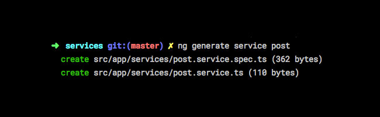
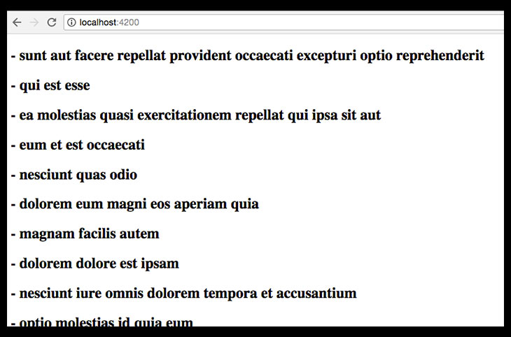

رأينا في [درس سابق أن إطار العمل أنجولار يعتمد على مفهوم المكونات](https://www.tutomena.com/web-development/javascript/components-angular-framework/) (Components) بشكل كامل، وشرحنا معنى المكونات وطريقة إنشائها وإضافتها في تطبيقات Angular. في درس اليوم، سنكتشف معا مفهوما آخرا له أهمية قصوى في إطار العمل أنجولار : **الخدمات** أو **Services**.

## لماذا الخدمات في أنجولار ؟

[التوثيق الرسمي لأنجولار](https://angular.io/tutorial/toh-pt4) يقول بأنه لا يجب على المكونات (_Components_) جلب البيانات أو حفظها بشكل مباشر، بل من المفترض أن يتم تفويض هذه المهمة للخدمات (_Services_) لكي نركز في المكونات فقط على تقديم وعرض هذه البيانات للمستخدم.

**_Components shouldn't fetch or save data directly and they certainly shouldn't knowingly present fake data. They should focus on presenting data and delegate data access to a service._**

في هذا الدرس سنقوم بتطبيق هذه الفكرة عن طريق جلب بيانات وهمية (_fake data_) من خادم بعيد (_Remote server_) وإظهارها في الصفحة الرئيسية لتطبيقنا.

سنقوم باستخدام واجهة [JSONPlaceholder](https://jsonplaceholder.typicode.com/) لهذا الغرض. من خلال النقطة `/posts` نستطيع جلب عدد من المقالات الوهمية، كل مقال يكون على الشكل التالي :

```json
{
  "userId": 1,
  "id": 1,
  "title": "Sunt aut facere repellat",
  "body": "Lorem ipsum dolor sit amet, consectetur adipiscing elit, sed do eiusmod tempor incididunt ut labore et dolore magna aliqua. Ut enim ad minim veniam."
}
```

نحن سنعرض فقط العنون **title**، ففي النهاية غرضنا الوحيد هو أن نتعلم كيف نقوم باستخدام _Services_ لجلب البيانات وتقديمها للمكونات.

## إنشاء مشروع جديد

لنقم أولا بإنشاء مشروع جديد بواسطة _Angular CLI_ من خلال تنفيذ هذا الأمر على _Terminal_ :

```bash
ng new angular-services
```

*angular-services* هو اسم المشروع ويمكنك طبعا اختيار الإسم الذي تريده.

بعد إنتهاء إعداد المشروع، سنقوم بالدخول إلى المجلد _angular-services_ عن طريق الأمر :

```bash
cd angular-services
```

بعد ذلك نقوم بتنفيذ الأمر `ng serve --watch` حتى يمكننا فتح المشروع على المتصفح من خلال الرابط : `http://localhost:4200`.

ستظهر الصفحة الرئيسية الإفتراضية، وسنقوم فيما بعد بالتعديل عليها.

## إنشاء الخدمة PostService

سنقوم بإنشاء الخدمة `PostService` عن طريق نافذة الأوامر السطرية :

```bash
ng generate service post
```

هذا الأمر سيقوم بإنشاء ملفين :

[](../images/ng-generate-post-service.jpg)

- `post.service.ts` : وهو الملف الذي يحتوي على الكلاس **PostService**.
- `post.service.spec.ts` : الملف الذي نضع فيه الإختبارات التي نريد إجراءها للخدمة PostService. هذا الملف لن نركز عليه في هذا الدرس.

محتوى الملف `post.service.ts` سيكون شئيا من هذا القبيل :

```ts
import { Injectable } from '@angular/core';

@Injectable()
export class PostService {
  constructor() {}
}
```

نلاحظ أن الكلاس `PostService` مسبوقة بالمصمم `@injectable`، هذا ضروري في تطبيقات أنجولار.

### جلب البيانات بواسطة Ajax

#### 1. إعداد الملف app.module.ts

لجلب البيانات باستخدام تقنية Ajax يلزمنا اضافة وحدة جديدة للمشروع إسمها `HttpClientModule` وذلك من الملف *app.module.ts. *بعد استيراد الوحدة `HttpClientModule` لا يجب أن ننسى إضافتها إلى المصفوفة `imports` في المصمم `@NgModule` :

```ts
import { BrowserModule } from '@angular/platform-browser';
import { NgModule } from '@angular/core';
import { HttpClientModule } from '@angular/common/http';

import { AppComponent } from './app.component';

@NgModule({
  declarations: [AppComponent],
  imports: [BrowserModule, HttpClientModule],
  providers: [],
  bootstrap: [AppComponent]
})
export class AppModule {}
```

#### 2. إعداد الملف post.service.ts

بعد ذلك سنعود إلى **PostService** ونقوم باستيراد الكائن _HttpClient_. هذا الأخير هو الذي يستخدم للقيام بطلبات أجاكس في إطار العمل أنجولار. أولا سنقوم بحقنه (_Inject_) داخل _Constructor_ الخاص بالكلاس PostService، ثم نقوم باستخدامه داخل الدالة _fetchPosts_ التي سنقوم بإنشائها، بحيث تكون مهمتها الوحيدة هي جلب المقالات من الواجهة البرمجية _REST API_.

```ts
import { Injectable } from '@angular/core';
import { HttpClient } from '@angular/common/http';

@Injectable()
export class PostService {
  constructor(private HttpClient: HttpClient) {}

  fetchPosts() {
    return this.HttpClient.get('https://jsonplaceholder.typicode.com/posts');
  }
}
```

#### 2. إعداد الملف app.component.ts

الملف _app.component.ts_ سبق إنشاؤه من قبل _Angular CLI_ عندما قمنا بتوليد المشروع، وفيه يوجد الكلاس _AppComponent_ المسؤول عن المكون الرئيسي للتطبيق.

1. **أولا** لكي يتمكن هذا المكون من الإستعانة بالخدمة PostService يجب أن نضيف هذه الأخيرة إلى المصفوفة **providers** الموجودة بداخل المصمم _component@_ الخاص بالكلاس *AppComponent،* هذا طبعا بعد استيراد (_import_) الكلاس PostService.
2. **ثانيا** سنقوم بحقن الخدمة في بَنَّاءِ (Constructor) الكلاس AppComponent.
3. **ثالثا** سننشئ خاصية بداخل _AppComponent_ اسمها posts. هذه الخاصية سنستخدمها لإستقبال مصفوفة المقالات القادمة من الواجهة البرمجية.
4. **رابعا** سنقوم بإنشاء دالة جديدة اسمها _getPosts_ وبداخلها سنطلب من الخدمة PostService أن تقوم بجلب البيانات من الواجهة البرمجية _REST API._ سننتظر وصول البيانات بداخل الدالة _subscribe_ لنقوم باستقبالها في المصفوفة _this.posts._
5. **خامسا**، يجب أن نقوم باستدعاء الدالة _getPosts_ حالما يتم عرض المكون _AppComponent_ على المتصفح. أفضل مكان لفعل ذلك هو في الدالة **ngOnInit**. هذه الأخيرة لا تتوفر لتطبيق أنجولار إلا بعد استيراد الواجهة **OnInit** وجعل المكون يستخدمها بواسطة التعبير _implements OnInit._

```ts
export class AppComponent implements OnInit {
...
}
```

_ngOnInit_ هي جزء مما يسمى [دورة حياة المكونات في أنجولار](https://angular.io/guide/lifecycle-hooks). والكود الذي نضعه بداخلها يتم تنفيذه بمجرد إنشاء وإعداد المكون. _ngOnInit_ هي المكان الأفضل للقيام بطلبات الأجاكس التي يحتجاها المكون في بداية حياته، ولا ينصح أبدا بالقيام بمثل هذه الأمور في _Constructor_.

بعد إتمام كل هذه الخطوات، يفترض أن يكون شكل الملف `app.component.ts` على هذا النحو :

```ts
import { Component, OnInit } from '@angular/core';
import { PostService } from './post.service';

@Component({
  selector: 'app-root',
  templateUrl: './app.component.html',
  styleUrls: ['./app.component.css'],
  providers: [PostService]
})
export class AppComponent implements OnInit {
  public posts: any;

  constructor(private postService: PostService) {}

  ngOnInit() {
    this.getPosts();
  }

  getPosts() {
    this.postService.fetchPosts().subscribe(data => {
      this.posts = data;
    });
  }
}
```

#### 4. عرض البيانات في واجهة المستخدم

الآن لم يبقى لنا سوى عرض البيانات التي حصلنا عليها في واجهة المستخدم UI. وسيلتنا لذلك هي القالب `app.component.html` الخاص بالمكون `AppComponent`.

سنمسح كل الأكواد الإفتراضية الموجدة في هذا الملف ولنجعله فارغا. كل ما سنقوم بعرضه هو عناوين المقالات التي حصلنا عليها من الواجهة البرمجية، والتي كما تتذكرون استقبلناها في الخاصية `posts`.

```html
<h2 *ngFor="let post of posts">
  - {{post.title}}
</h2>
```

ترون بأننا استخدمنا الحلقة `*ngFor` التي يتيحها أنجولار من أجل قراءة المصفوفة _posts_ وعرض العناوين داخل وسوم `<h2>`.

بعد تحديث المتصفح سنرى بأن عناوين المقالات معروضة وفق المتوقع.

[](../images/result-angular-services.jpg)

---

تعلمنا معا من خلال هذا الدرس كيف نقوم بإنشاء الخدمات في **إطار العمل Angular**، ورأينا كيف نقوم بحقنها للمكونات لجلب البيانات التي تحتاجاها. هذه الخدمات تكرس مبدأ مهما في البرمجة، وهو **مبدأ المسؤولية الواحدة** _Single Responsibility Principle_، بحيث أن كل جزء من التطبيق مسؤول عن مهام محددة بدقة، **وكلما تم توزيع المهام بشكل أفضل كلما كان الكود أكثر تنظيما وقابلية للفهم والقراءة والصيانة**.
