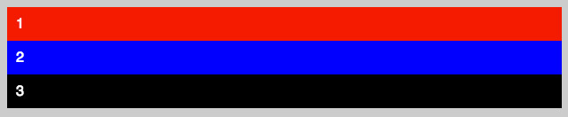
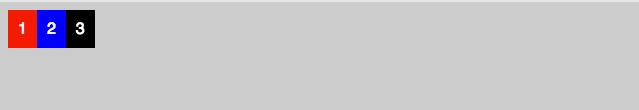
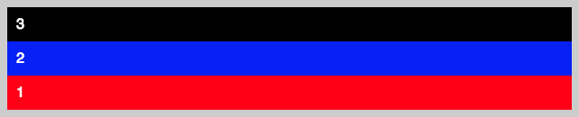
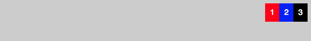
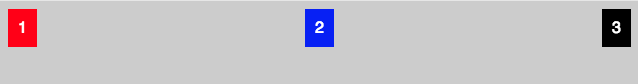
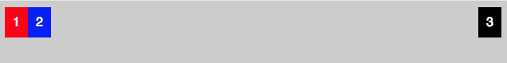
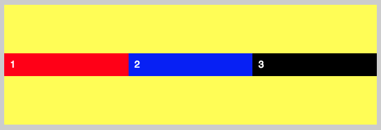
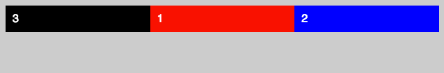

أصبح نظام **CSS FLEXBOX** جزءً لا يتجزأ من تصاميم الويب الحديثة، وبات من المهارات الأساسية التي يجب على مصممي الواجهات الأمامية لتطبيقات الويب اكتسابها وإتقانها جيدا.

في هذا الدرس سنشرح أهم أساسيات هذا النظام وطريقة إنشاء التصاميم بواسطته.

## أول تصميم باستخدام CSS FLEXBOX

نظام FLEXBOX حديث وجاء لتلبية حاجيات تصاميم وتطبيقات الويب التي عرفت قفزة نوعية في السنين الأخيرة مع الطفرة التقنية. الإعتماد على _Floating_ لم يعد الحل المثالي لإنشاء تصاميم حديثة ومتجاوبة، وليس غريبا بأن جل أطر العمل الخاصة بالواجهات الأمامية مثل [بوتستراب 4](https://www.tutomena.com/web-development/html-css/what-is-new-in-bootstrap-4/) انتقلت للإعتماد على نظام _Flexbox_ وتخلت عن نظام _Float_ الذي طالما شكل في الماضي العمود الفقري لنظام الشبكات (_Grids_) الخاص بها.

يتكون تصميم FlexBox من جزئين رئيسين : الحاوي (_Container_) والأبناء.

لنأخذ مثال يضم ثلاثة عناصر من نوع `<div>`.

الحالة البدئية لكل هذه العناصر هي كما نعرف **Block** وبالتالي فإنها ستظهر عموديا واحدة فوق الأخرى.

```html
<div class="container">
  <div class="item">1</div>
  <div class="item">2</div>
  <div class="item">3</div>
</div>
```

[](../images/flex-1.jpg)

من أجل تحويل هذا التصميم إلى تصميم **فليكس بوكس** يجب أن نضيف الخاصية display: flex إلى العنصر الحاوي _Container_.

بمجرد إضافة هذه الخاصية سنلاحظ أن **الأبناء المباشرين** للعنصر الأب سيصطفون **بشكل أفقي** وكل واحد منهم يأخذ أبعاده الإفتراضية.

[](../images/flex-2.jpg)

يمكننا أن نطلب من هذا الأب أن يقوم بوضع أبناء بشكل عمودي عن طريق الخاصية flex-direction :

```css
.container {
  display: flex;
  flex-direction: column;
}
```

ويمكن كذلك عرض العناصر عموديا بشكل معكوس باستخدام الخاصية flex-direction مع إعطائها القيمة column-reverse  :

```css
.container {
  display: flex;
  flex-direction: column-reverse;
}
```

[](../images/flex-column-reverse.png)

هذا ويمكن استخدام القيمتين row  و row-reverse  لعرض العناصر بشكل أفقي. وإذا لم نقم بإعطاء باستخدام الخاصية flex-direction  فإن الأب _Container_ سيقوم بعرض الأبناء **افتراضيا بشكل أفقي** كما رأينا في المثال الأول أعلاه.

[](../images/flex-2.jpg)

أما إذا أردنا عرض العناصر الأبناء في الطرف الآخر فنستعين بالخاصية justify-content  للأب، ونعطيها القيمة flex-end :

```css
.container {
  display: flex;
  justify-content: flex-end;
}
```

[](../images/flex-end-property.png)

ويمكننا استخدام القيمة center  لعرض العناصر في الوسط، أو القيمة space-between  لتوزيعها على المساحة المتوفرة.

[](../images/flex-space-between.png)

أما إذا أردنا مثلا عرض العنصر الأخير فقط في الجهة الأخرى، فنستخدم في هذه الحالة الخاصية margin-left: auto التي تعطى لهذا الإبن :

```css
.item:last-child {
  background: #000000;
  margin-left: auto;
}
```

## [](../images/flex-margin-auto.png)الخاصية flex

الخاصية flex تستخدم بشكل كبير في تصاميم FLEXBOX، هذه الخاصية تخبر العنصر الإبن بالمساحة أو الحيز الذي سيشغله داخل العنصر الأب.

فمثلا لو أعطينا القيمة flex: 1  للعناصر الثلاثة فإنهم سيقتسمون بالتساوي عرض (_Width_) الأب.

[](../images/flex-3.png)

أما إذا قمنت بإعطاء العنصر الثاني مثلا القيمة flex: 2  والعنصرين الآخرين flex: 1  فهذا يعني بأن العنصر الثاني سيأخذ حيزا يمثل ضعف الحيز الذي سيشغله الآخرين.

[](../images/flex-4.png)

[alert type="info" icon-size="normal"]جميع الخاصيات التي تحدثنا عنها تصلح كذلك في العرض العمودي للعناصر الأبناء.[/alert]

## الخاصية align-items

تستخدم القيمة **align-items** من أجل التحكم في كيفية العرض على المحور العمودي.

```css
.container {
  display: flex;
  height: 200px;
  align-items: center;
  background: yellow;
}
.item {
  padding: 10px;
  color: #ffffff;
  flex: 1;
}
```

[](../images/flex-align-items.png)

وهناك عدة قيم أخرى ممكنة لهذه الخاصية :

- flex-start
- flex-end
- streatch (الإفتراضية)
- baseline

## الخاصية order

استخدام الخاصية order يكون عمليا في حالات متعددة خاصة في **تجاوبية التصاميم**. هذه الخاصية تمكننا من التحكم في ترتيب عرض العناصر الأبناء.

مثلا نستطيع عرض العنصر الثالث قبل العنصر الأول والثاني فقط بإعطائه order: 1 و إعطاء العنصرين الآخرين قيمتين أكبر من 1.

```css
.item:first-child {
  order: 2;
}
.item:nth-child(2) {
  order: 3;
}
.item:last-child {
  order: 1;
}
```

[](../images/flex-order.png)

يظهر من النتيجة وكأن العنصر 3 يظهر في كود HTML قبل العناصر الأخرى، ولكن في الحقيقة هو الأخير في شجرة HTML وإنما ظهر أولا بفضل الخاصية order: 1.

هذه الخاصية تستخدم بكثرة في التصاميم المتجاوبة _Responsive Design_، بحيث نحتاج في بعض الأحيان عكس الترتيب الذي تظهر به بعض عناصر HTML في شاشات الهواتف الذكية.

---

موضوع **الفليكس بوكس** FLEXBOX كبير نوعا ما، وفيه تفاصيل متعددة قد تجعل هذا الموضوع طويلا جدا إن تطرقنا إليها كلها. وددت فقط أن أعرفكم على هذا النظام الجديد في **CSS3** لكي تبدؤوا في الإعتماد عليه في تصاميمكم ومشاريعكم المقبلة، ومع الممارسة ستتعرفون على جوانب أخرى من روعته.
