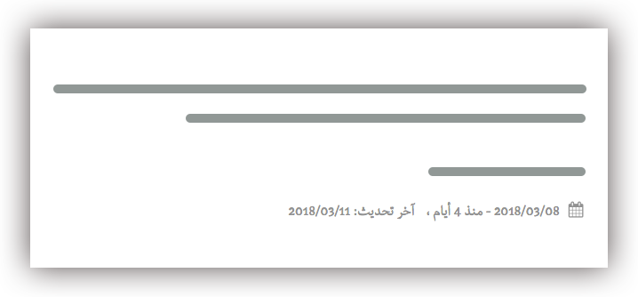

إذا كنت تملك مدونة إلكترونية فمن المؤكد بأنك تعود من حين لآخر إلى مقالاتك القديمة وتقوم بتحديثها، إما بإضافة معلومات جديدة إليها، تغيير الصور أو ربما لتصحيح وجبر بعض الروابط المكسورة التي تحتويها. عندها تود ربما إخبار زوار موقعك بطريقة ما بأن المقال تم تحديثه في تاريخ معين، وليس ذاته المقال الذي نشر قبل عدة أعوام :)

الطريقة الفعالة التي نراها في عدد كبير من المدونات هو عرض تاريخ آخر تحديث للصفحة أو المقال أسفل تاريخ النشر الأولي، وبما أنه، مع الأسف، معظم قوالب ووردبريس الموجودة لا تدعم هذه الخاصية افتراضيا فإننا نكون مضطرين لإضافتها بشكل يدوي إلى القالب الذي نقوم باستخدامه، وهدفي من خلال هذا الدرس هو مشاركتكم كيفية فعل ذلك.

[](../images/wordpress-last-updated-1.png)

## إضافة ميزة آخر تحديث لمقالات ووردبريس

طريقتي المفضلة لإنجاز المهمة هي عن طريق ملف القالب الخاص بالصفحة، مثلا _single.php_ بالنسبة للمقالات و _page.php_ بالنسبة للصفحات الساكنة.

لهذا الغرض سنقوم بإضافة الكود التالي لملف **_functions.php_** الخاص بقالب ووردبريس الذي نقوم باستخدامه :

```php
if ( ! function_exists( 'get_updated_on_date' ) ) :

    function get_updated_on_date() {
    	$u_time = get_the_time('U');
    	$u_modified_time = get_the_modified_time('U');
    	$updated_date = "";
    	if ( $u_time !== $u_modified_time ) {
    		$updated_date = "<div>آخر تحديث : ".
    		 				get_the_modified_time('j F، Y') .
    		 				"</div>";
    	}

    	return $updated_date;
    }

endif;
```

الدالة *()get_updated_on_date* تقوم بمقارنة تاريخ نشر التدوينة (_()_get_the_time__) مع تاريخ تحديثها (_()get_the_modified_time_)، إذا كان التاريخان مختلفان فهذا يعني بأن الناشر قام بتحديث المقال، وبالتالي يمكن عرض تاريخ التحديث إلى جانب تاريخ النشر الأصلي.

[alert type="info" icon-size="normal"]عند نشر المقال لأول مرة، يكون تاريخ التحديث _get_the_modified_time_ مساويا لتاريخ النشر الأولي _get_the_time_.[/alert]

بعد أن فهمنا جيدا منطق الدالة، سنفتح ملف _single.php_ الخاص بالتدوينات ونقوم بعرض الدالة *()get_updated_on_date* في المكان الذي يناسبنا.

<?php echo get_updated_on_date(); ?>

[](../images/last_update_wordpress_example.jpg)

هكذا قمنا بالمهمة بخطوتين بسيطتين وبدون مجهود يذكر. وأُذَكِّر دائما بضرورة الإستعانة بقالب ابن (_Child theme_) عند القيام بأي عملية تخصيص وذلك لتفادي مشكل فقدان كافة التخصيصات عند تحديث القالب الأب.
