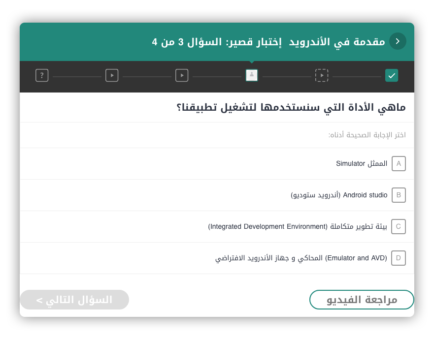

لاشك في أن البرمجة هي من أهم المجالات التي يمكن أن يتخصص فيها المرء في عصرنا هذا، هذا العصر الذي تسيدت فيه الآلات والحواسيب وبات ضروريا حوسبة جميع الأنظمة التي تعتمد عليها الشركات، بل وحتى الدول، في تسيير شؤونها.

مهنة المبرمج أصبحت في ظل هذه المتغيرات واحدة من أهم المهن المطلوبة على مستوى العالم، وتتفرد بميزة فريدة للغاية مقارنة بمعظم المهن الأخرى، وهي أنها لا ترتبط بأرض ولا بدولة، فلو كنت مبرمجا كفءً سيمكنك العمل في أي مكان في العالم لأن البرمجة بحد ذاتها أصبحت لغة عالمية وعابرة للقارات.

المبتدؤون العرب يواجهون إكراهات بالجملة تمنعهم أو تصعب عليهم تعلم البرمجة، أول هذه الإكراهات هو أن معظم الموارد والمواد التعليمية الموجودة على الإنترنت هي باللغة الإنجليزية ولا نجد أثرا يذكر للغة العربية في هذا المضمار، ولو أنه في السنوات الأخيرة بدأنا نشهد ظهور محاولات من هنا وهناك لتحسين الوضع، في الغالب هي محاولات فردية على اليوتيوب (قناة الزيرو، قناة بغداد الجديدة). هذه المحاولات كلها مشكورة وفيها البركة، ولكن المحتوى العربي في أقصى درجات الجوع والنقص، وكل محاولة جديدة هي مطلوبة ولها فائدتها ومفعولها الفوري.

آخر هذه المجهودات التي اكتشفتها هي [منصة برمج دوت كوم الكويتية](https://www.barmej.com/) التي أراها نقلة نوعية وغاية في الأهمية لإغناء المحتوى العربي وتقديم مواد تعليمية عربية متكاملة وموجهة لجميع المستويات.

## لماذا برمج دوت كوم هو مشروع نوعي ومهم

هناك عدة أسباب تجعلني أرى بأن **Barmej.com** هو مشروع ليس كغيره من المشاريع العربية لتعليم البرمجة.

- أول هذه الأسباب هو التفاعلية التي يتميز بها، بحيث أن المتدرب لا يكتفي فقط بمشاهدة دروس الفيديو وانتظار نهاية الدورة، بل إن المنصة وضعت في متناوله مجموعة من الإختبارات السريعة التي يقوم بإجرائها عند نهاية كل جزء من أجزاء الدورة حتى يتم التأكد من أنه فهم جيدا كل ما جاء فيه. كما يمكن للمتدرب أيضا طرح الأسئلة والإستفسار عن التفاصيل الغير مفهومة في أي فيديو من الدورة، وبدء موضوع جديد في المنتدى لمناقشة السؤال مع مستخدمي المنصة والمدربين.
- السبب الثاني هو جودة الدروس التعليمية التي تقدمها منصة برمج دوت كوم، هذه الدروس يتم تصويرها بكاميرات ذات جودة عالية وإخراج ممتاز يجعل المتعلم يستمتع بكل دقيقة من عمر الدورة.
- السبب الثالث والمهم جدا بالنسبة لي، هو أن الدروس تكون باللغة العربية الفصحى وليس باللهجات المحلية للمعلمين، هذا يضمن أن جميع المتدربين سيفهمون الدروس على نحو جيد، ويجعلنا نحس كذلك بقوة اللغة العربية كعامل مهم وأساسي من عوامل الوحدة بين شعوب المنطقة.

## المسارات المتاحة حاليا على المنصة

في الوقت الحالي هناك 5 مسارات فقط على المنصة وهي :

- مقدمة في عالم البرمجة. (8 ساعات، 22 دقيقة)
- برمجة تطبيقات الأندرويد مع جافا. (15 ساعة، 17 دقيقة)
- برمجة تطبيقات الآيفون مع سويفت. (8 ساعات، 34 دقيقة)
- برمجة المواقع مع جانغو. (13 ساعة، 10 دقائق)
- البرمجة باستخدام جافا. (4 ساعات، 37 دقيقة)

ولكن العمل جاري على إعداد المزيد من الدورات القيمة تشمل لغات برمجة متعددة مثل PHP ،C، سي شارب و Asp.NET.

بعد انتهائك من المسار الذي قمت باختياره، ستنال شهادة اعتراف من الموقع. وكل شهادة مهما كانت بسيطة يمكن أن تكون نقطة في صالح CV الخاص بك.

## ربح المال مقابل تعليم البرمجة

الميزة الأخرى التي أراها رائعة وممتازة في منصة برمج دوت كوم هي سماحها لكل المبرمجين العرب بأن يقوموا بتقديم طلبات ليكونوا مدربين في المنصة، ومقابل خدماتهم سيتلقون مكفاءات بقيمة 500 دولار، على أن تكون هناك مبالغ إضافية حسب أداء المدرب وخبرته.

## النهاية

في الوقت الحالي الدروس والدورات على منصة برمج دوت كوم كلها مجانية بالرغم من قيمتها وجودتها العالية. أتمنى أن نرى منصات عربية أخرى من هذا النوع في المستقبل القريب، فالمنافسة دائما ما تجبر المتنافسين على تقديم أفضل ما لديهم، والمستفيد النهائي والأكبر بطبيعة الحال هو المبرمج العربي والمحتوى العربي على الإنترنت.
