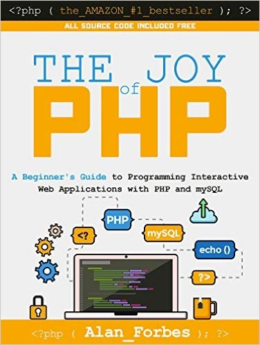
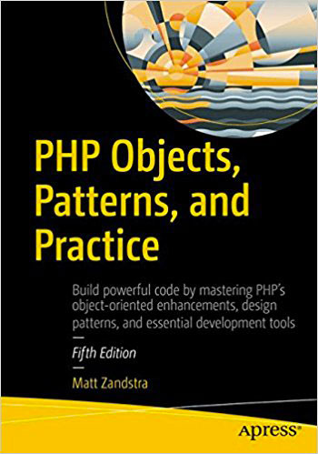

معظمنا يعرف بأنه لا يعلى على **لغة البرمجة PHP** في سوق ومجال تطوير الويب، خاصة في المنطقة العربية حيث لا نرى منافسة حقيقية ل PHP من طرف لغات البرمجة الأخرى مثل _بايثون_ و _روبي_.

PHP تدعم برنامج إدارة المحتوى **ووردبريس** الذي [يدعم بدوره ما يزيد على 30% تقريبا من مجموع المواقع الإلكترونية](https://www.tutomena.com/news/wordpress-top-cms-2018/)، دون أن ننسى **دروبال** وكذلك إطارات عمل شهيرة على رأسها **لارافيل** و **سيمفوني**.

بالمجمل، تشكل لغة PHP نواة %80 من مجموع المواقع على شبكة الإنترنت بحسب موقع _W3Techs_ المتخصص. هذا ما يجعل هذه اللغة جذابة لكل مطور يرغب في الولوج لسوق الشغل من أوسع ( وأسهل ) أبوابه.

في هذا المقال، سأشارك معكم لائحة لعدد من الكتب التي ستساعد كل واحد على تعلم لغة البرمجة PHP، لأنه مهما تطورت التكنولوجيا ومعها طرق التعليم، فسيظل الكتاب رافدا أساسيا من روافد العلم والمعرفة العميقة.

## 1\. The Joy of PHP Programming

يمكن اعتبار كتاب **The Joy Of PHP** لمؤلفه **آلان فوربس**، خيارا جيدا جدا للمبتدئين الراغبين في القيام بأولى خطواتهم مع تطوير الويب باستخدام **PHP** و **MySQL**.

بعد قراءتك للكتاب وتطبيق كل ما جاء فيه من أمثلة، ستصبح قادرا على قراءة وفهم أكواد PHP وبناء مواقع ديناميكية من الصفر. الكتاب سياعدك كذلك على تعلم أساسيات لغة **HTML** وكذلك لغة **SQL** للتعامل مع قواعد البيانات **MySQL**. ويختتم الكتاب بالتطرق لبعض النقاط التي يجب أخذها بعين الإعتبار لجعل مواقعنا آمنة ومحمية من هجمات المخربين.

الكتاب كما قلت موجه للمبتدئين، ولا يجعل منك خبيرا في لغة البرمجة PHP، ولكن المؤكد أنه سيكون خطوة هامة وأساسية في مشوارك لبلوغ ذلك الهدف.

- [رابط لشراء الكتاب](https://www.amazon.com/Joy-PHP-Programming-Interactive-Applications-ebook/dp/B00BALXN70)

## 2\. Laravel: Code Smart

إذا كنت تريد تعلم إطار العمل لارافيل وفهم كافة جوانبه والأفكار التي بني عليها، فلا أظن بأنك ستجد كتابا أفضل من **Laravel: Code smart**.

المؤلف، **دايلي رييس**، عمد إلى استخدام أسلوب سلس وواضح لإيصال الأفكار إلى القارئ. هذا الأسلوب السلس لا يعني بأن المحتوى سطحي، بل على العكس، الكتاب موجه للمبتدئين وكذلك المحترفين، لأنه يبدأ من الصفر (التحميل والتركيب) ويصل بالقارئ إلى مراحل متقدمة حيث يشرح كل جزء من الأجزاء التي تكون نواة Laravel والفلسفة التي بني عليها، على سبيل الذكر *Façades *،_Service Providers_ و _Dependency Injection إلخ ..._

- [رابط لشراء الكتاب](https://leanpub.com/codesmart)

## 3\. Survive the Deep End: PHP Security

هذا الكتاب يهتم بجانب في غاية الأهمية في مجال تطوير الويب بصفة عامة، ألا وهو الجانب الأمني والحماية. مواقع وتطبيقات الويب عرضة لأنواع عديدة من الهجمات التي تستغل عددا من الثغرات الموجودة في الشفرة المصدرية للموقع، ومن أشهر هذه الهجمات نجد :

- XSS Attacks
- SQL Injection
- CSRF Attacks

هذا الكتاب يعلمنا كيف نقوم بتحصين مشاريعنا من هذه الأخطار بتقديم العديد من الأمثلة والنصائح التي يستطيع كل مطور مبتدئ فهمها واستيعابها.

- [رابط لقراءة وتحميل الكتاب](http://phpsecurity.readthedocs.io/en/latest/index.html)

## PHP Objects, Patterns, and Practice .4

هذا الكتاب ضخم، حيث يتألف من زهاء 600 صفحة وهو الأكثر شمولية في هذه اللائحة. يتطرق لعدد كبير من الجوانب المهمة والمفاهيم المتقدمة في بيئة PHP.

يمكن تقسيم هذا الكتاب إلى 3 أقسام رئيسية :

- **البرمجة الكائنية** : في هذا القسم الأول يتعرض المؤلف لمفهوم [البرمجة الكائنية في لغة البرمجة PHP](https://www.tutomena.com/web-development/php/introduction-php-oriented-object-programming/)، ويغوص في تفاصيل ومفاهيم هذا النموذج (OOP) الذائع الصيت في البرمجة عموما.
- **الأنماط** : في هذا الجزء المهم من الكتاب يتم شرح ما يعرف في البرمجة بأنماط التصميم أو _Design Patterns_، حيث يقدم الكتاب عددا من أكثر هذه الأنماط شيوعا في بيئة PHP.
- **الممارسات الجيدة **: في هذا القسم الأخير والمهم كذلك، يتحدث الكتاب عن عدد من الممارسات الجيدة ( _Best Practices_ ) والعادات الإحترافية في المشاريع الحقيقية. في هذا القسم سنقرأ عن أهمية إدارة نسخ المشروع بواسطة Git، اختبار الأكواد برمجيا بواسطة PHPUnit، الإستعانة بمدير الحزم Composer والكثير الكثير من التقنيات الأخرى.

كتاب **PHP Objects, Patterns, and Practice** موجه للمطورين الذي يريدون دفع أنفسهم لمستوى متقدم، وقد لا يكون مناسبا للمبتدئين. وتجذر الإشارة إلى أن الإصدار الأخير، الخامس، متوافق مع **PHP 7** ما يعني بأن محتوى الكتاب مواكب لأحدث التحسينات والتغييرات التي طرأت على هذه اللغة.

- [رابط لشراء الكتاب](https://www.amazon.com/Objects-Patterns-Practice-MATT-ZANDSTRA/dp/1484219953/)
